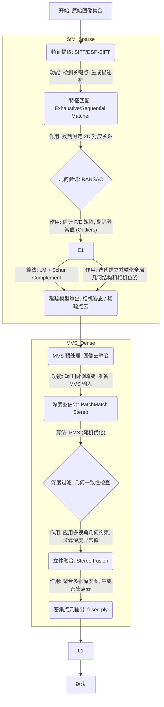

```mermaid
graph TD
    A[开始: 原始图像集合] --> B1
    
    subgraph SfM_Sparse
        B1(特征提取: SIFT/DSP-SIFT)
        B1 -- 功能: 检测关键点, 生成描述符 --> C1
        
        C1(特征匹配: Exhaustive/Sequential Matcher)
        C1 -- 作用: 找到假定 2D 对应关系 --> D1
        
        D1{几何验证: RANSAC}
        D1 -- 作用: 估计 F/E 矩阵, 剔除异常值 (Outliers) --> E1
        
        E1
        E1 -- 算法: LM + Schur Complement --> F1
        E1 -- 作用: 迭代建立并精化全局几何结构和相机位姿 --> F1
    end

    F1(稀疏模型输出: 相机姿态 / 稀疏点云) --> G1
    
    subgraph MVS_Dense
        G1(MVS 预处理: 图像去畸变)
        G1 -- 功能: 矫正图像畸变, 准备 MVS 输入 --> H1
        
        H1(深度图估计: PatchMatch Stereo)
        H1 -- 算法: PMS (随机优化) --> I1
        
        I1{深度过滤: 几何一致性检查}
        I1 -- 作用: 应用多视角几何约束, 过滤深度异常值 --> J1
        
        J1(立体融合: Stereo Fusion)
        J1 -- 作用: 聚合多张深度图, 生成密集点云 --> K1
    end

    K1(密集点云输出: fused.ply) --> L1

    L1 --> Z[结束]
```