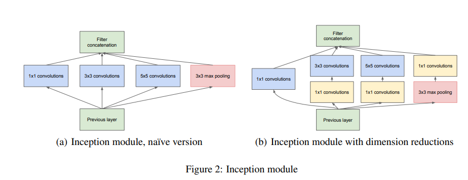

# 论文信息
- 时间：2015
- 期刊：CVPR
- 网络名称： GoogLeNet
- 意义：使用并行架构构造更深的网络
- 作者：Christian Szegedy, Wei Liu, Yangqing Jia, Pierre Sermanet, Scott Reed, Dragomir Anguelov, Dumitru Erhan, Vincent Vanhoucke, Andrew Rabinovich
- 实验环境：
- 数据集：ILSVRC14 competition
- [返回上一层 README](../README.md)
- 
# 一、解决的问题
1. 比AlexNet更准
2. 证明想法、算法和新的算法结构使得模型更有效
3. 认为改善神经网络的最直接方法就是增加它的大小
4. 但是深度和宽度增加，会带来参数量的上升，因此提出Inception
5. 
# 二、做出的创新
1. 借用Network-in-Network，演化成 1×1 convolutional layers，用于缩减网络大小
2. 稀疏矩阵转换成稠密矩阵效果更好
3. 用小的卷积核更多的是方便，而不是必要的
4. 提出“初始架构思想”（Inception），用于寻找稀疏结构中的稠密部分
5. 我们的结果似乎提供了一个坚实的证据，即通过现成的密集构建块来近似预期的最佳稀疏结构是改进计算机视觉神经网络的可行方法
6. 
# 三、设计的模型

1. >The network is 22 layers deep when counting only layers with parameters (or 27 layers if we also count pooling)
2. > It was found that a move from fully connected layers to average pooling improved the top-1 accuracy by about 0.6%, however the use of dropout remained essential even after removing the fully connected layers.

- Inception最初提出的版本主要思想是利用不同大小的卷积核实现不同尺度的感知

- GoogLeNet采用了模块化的结构（Inception结构），方便增添和修改；

- 网络最后采用了average pooling（平均池化）来代替全连接层，该想法来自NIN（Network in Network），事实证明这样可以将准确率提高0.6%。

- 虽然移除了全连接，但是网络中依然使用了Dropout ;

- 为了避免梯度消失，网络额外增加了2个辅助的softmax用于向前传导梯度（辅助分类器）

- 对于前三点都很好理解，下面我们重点看一下第4点。这里的辅助分类器只是在训练时使用，在正常预测时会被去掉。辅助分类器促进了更稳定的学习和更好的收敛，往往在接近训练结束时，辅助分支网络开始超越没有任何分支的网络的准确性，达到了更高的水平。

# 四、实验结果

## 1、比之前模型的优势
1. 模型更准
## 2、有优势的原因
1. 模型更深，剪裁的次数更多
2. 并行的思想，对图片特征的提取更细节
## 3、改进空间
1. 所有卷积层直接和前一层输入的数据对接，所以卷积层中的计算量会很大
2. 在这个单元中使用的最大池化层保留了输入数据的特征图的深度，所以在最后进行合并时，总的输出的特征图的深度只会增加，这样增加了该单元之后的网络结构的计算量

# 五、结论

## 1、模型是否解决了目标问题

## 2、模型是否遗留了问题
1. >a rough estimate suggests that the GoogLeNet network could be trained to convergence using few high-end GPUs within a week, the main limitation being the memory usage
## 3、模型是否引入了新的问题
1. 增加模型的大小，在有限的数据集上更容易过拟合
# 六、代码

# 读者角度（挖掘文章中没有提到的）：
1. 总结文章发现问题的思路
2. 总结文章改进的思想
3. 总结文章还存在或者可以改进的问题
4. 提出对模型参数和细节的一些思考和讨论
