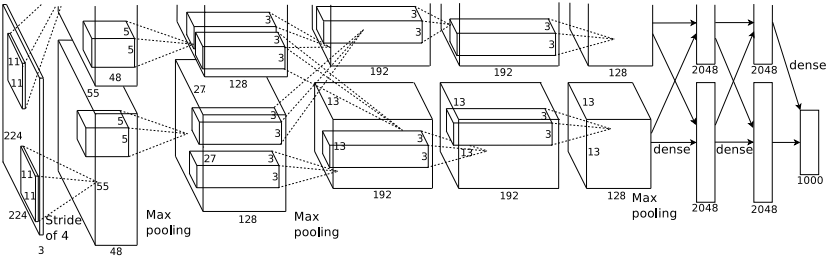

# 论文信息
- 时间：2012 
- 期刊：NeurIPS
- 网络名称：AlexNet 5卷积层 + 3全连接层
- 意义：深度学习热潮的奠基作
- 作者：多伦多大学：Alex Krizhevsky, Ilya Sutskever, Geoffrey E. Hinton
- 实验环境：两个 GTX 580 3GB GPU 就能跑
- 数据集：ImageNet LSVRC-2010 contest
>In all, there are roughly 1.2 million training images 50,000 validation images, and 150,000 testing images
- [返回上一层 README](../README.md)
# 一、解决的问题
1. 目标检测小任务做的已经很好了，现在应该面向大任务去做
2. 学习大任务需要大的数据集和更强的模型
3. 模型需要有先验知识
# 二、做出的创新
1. 训练了一个巨大的卷积神经网络
2. 开源了GPU的高度优化部署代码，***开创了把神经网络拆分到两个GPU上运行，Parallel training***
3. 采用了一系列新的且不寻常的特征来提高效果并减少训练时间
4. 对过拟合采取了措施
5. 已经将5个卷积层和3个全连接层的神经网络优化至最小最精简了
6. 没有做预处理，仅仅是对图片裁剪成256·256
7. 首先用了end to end（原始图片或文本进去，神经网络做出来，不需要进行单独的特征提取）

# 三、设计的模型
> We trained a large, deep convolutional neural network to classify the 1.2 million high-resolution images in the ImageNet LSVRC-2010 contest into the 1000 different classes.
>The neural network, which has 60 million parameters and 650,000 neurons, consists of five convolutional layers, some of which are followed by max-pooling layers, and three fully-connected layers with a final 1000-way softmax.

实现了一个参数量6000万、65万个神经元的5卷积层 + 3全连接层深度卷积神经网络，实现了120万张高清图片的上千种分类

1. 采用ReLU作为激活函数，比tanh快，且和tanh近似一样准
2. 采用Local Response Normalization此方案有助于泛化，CNN在未归一化的情况下，测试错误率为13%;在归一化的情况下，测试错误率为11%
3. 采用Overlapping Pooling（重叠Pooling）的方式可以有效削弱过拟合的可能
4. >The kernels of the second, fourth, and fifth convolutional layers are connected only to those kernel maps in the previous layer which reside on the same GPU (see Figure 2). The kernels of the third convolutional layer are connected to all kernel maps in the second 
- 卷积层的连接状态不同

计算卷积层输出图像尺寸的公式：

$$W_{output} = \lfloor \frac{W_{input} - W_{filter} + 2P}{S} \rfloor + 1$$

$$H_{output} = \lfloor \frac{H_{input} - H_{filter} + 2P}{S} \rfloor + 1$$

计算池化层输出图像尺寸的公式：

$$W_{output} = \lfloor \frac{W_{input} - W_{filter}}{S} \rfloor + 1$$

$$H_{output} = \lfloor \frac{H_{input} - H_{filter}}{S} \rfloor + 1$$

5. 减少过拟合的方法：
- > 数据增强，把部分图片人工进行调整，通过随机扣取原来图片的一部分或者调整RGB颜色
- 采用Dropout的方法

6. Back Propergation
- 采用SGD方式

# 四、实验结果
## 1、比之前模型的优势
- > On the test data, we achieved top-1 and top-5 error rates of 37.5% and 17.0% which is considerably better than the previous state-of-the-art
打败了之前的SOTA
-  ILSVRC2010 competition top-1 & top-5 error rates: 37.5% & 17.0% | previous: 47.1% & 28.2%
- 网络能识别不在图片中心的目标

## 2、有优势的原因
1. 选用CNN，有先验知识且可以通过深度和广度控制，对图像做出强有力的、基本正确的假设，连接和参数更少，因此更容易被训练
2. 又大又深的网络，且已经被优化到体积最小

## 3、改进空间
- 在现在看来，正则不一定是解决过拟合的最好方法，模型设计更关键

# 五、结论

## 1、模型是否解决了目标问题
- 确实提高了识别的准确率，但是还有提升空间
## 2、模型是否遗留了问题
- 准确率仍不够高，对类似事物的识别不够准确
- 需要更大的数据集
## 3、模型是否引入了新的问题
- dropout的超参数
# 六、代码

# 读者角度（挖掘文章中没有提到的）：
1. 总结文章发现问题的思路
2. 总结文章改进的思想
3. 总结文章还存在或者可以改进的问题
4. 提出对模型参数和细节的一些思考和讨论
