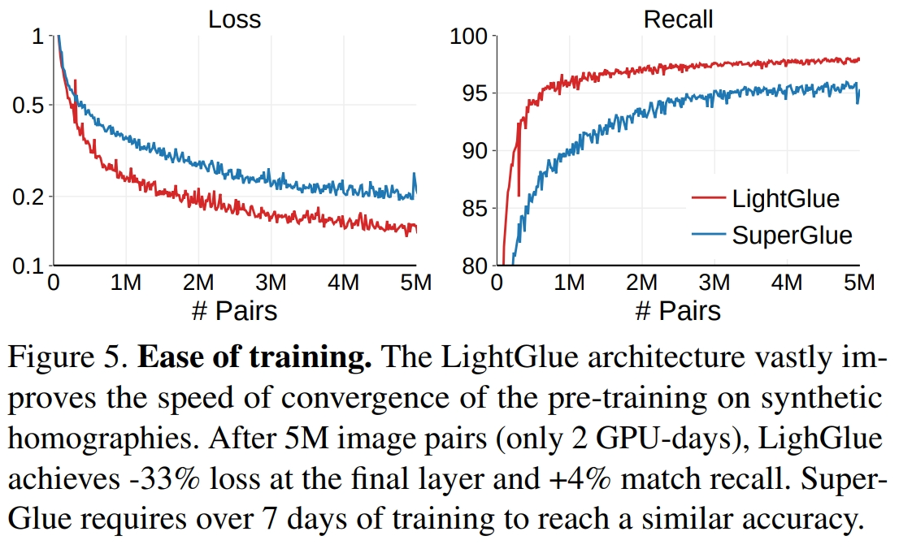

# LightGlue Local Feature Matching at Light Speed

## 目录
- [优势和特征](#优势和特征)
- [改进的方面](#改进的方面)
- [返回上一层 README](../README.md)

## 优势和特征
1. 优势（相较于SuperGlue）
    1. 内存和计算方面更高效
    1. 结果更准确
    1. 更容易训练
1. 特性
    - LightGlue能够适应网络的难度

## 改进的方面
1. Comparison with SuperGlue
    - LightGlue的灵感来源于SuperGlue，但在准确性、效率和易于训练方面有所不同。
    1. Positional encoding
        - SuperGlue使用MLP对绝对点位置进行编码，并在早期将其与描述符融合。我们观察到，模型往往会忘记整个层的位置信息。LightGlue依赖于一种相对编码，这种编码在图像之间更具可比性，并添加到每个自我关注单元中。这样可以更容易地利用位置，并提高更深层次的精度。
    1. Prediction head
        - SuperGlue通过使用Sinkhorn算法求解可微最优传输问题来预测分配。它包括行和列规范化的多次迭代，这在计算和内存方面都很昂贵。SuperGlue添加了一个垃圾箱来拒绝无法匹配的点数。我们发现垃圾箱将所有点的相似性分数纠缠在一起，从而产生次优的训练动态。LightGlue将相似性和可匹配性解开，这两个问题的预测效率要高得多。这也产生了更清洁的梯度。
    1. Deep supervision
        - 由于Sinkhorn的成本很高，SuperGlue无法在每一层之后进行预测，只能在最后一层进行监督。LightGlue较轻的头部可以预测每一层的任务并对其进行监督。这加快了收敛速度，并允许在任何层之后退出推理，这是LightGlue提高效率的关键
1. 重要的细节
    1. Recipe
        - LightGlue遵循SuperGlue的监督训练设置。我们首先用从1M幅图像中采样的合成单应性对模型进行预训练。这样的增强提供了完全且无噪声的监督，但是需要仔细的调谐。然后，LightGlue使用MegaDepth数据集进行微调，该数据集包括描绘196个旅游地标的1M众包图像，通过SfM恢复相机校准和姿势，并通过多视图立体恢复密集深度。由于大型模型很容易过度适应这种独特的场景，因此预训练对模型的泛化至关重要，但在最近的随访中被省略了。

    1. Training tricks
        
        - 虽然LightGlue体系结构提高了训练速度、稳定性和准确性，但我们发现一些细节也有很大的影响。图5显示，与SuperGlue相比，这减少了训练模型所需的资源。这降低了训练成本，并使更广泛的社区更容易接触到深度匹配者
        - 由于MegaDepth的深度图通常是不完整的，我们还将具有大核误差的点标记为不可匹配。仔细调整和退火学习率可以提高准确性。多点训练也可以：我们使用每张图像2k，而不是1k。批量大小很重要：我们使用梯度检查点和混合精度在具有24GB VRAM的单个GPU上拟合32个图像对
    1. Implementation details
        - LighGlue有L=9层。每个注意力单元有4个头。所有表示都具有维度d=256。在整篇论文中，标记为优化的运行时数字使用了自我关注的有效实现。更多细节见附录。
        - 我们使用SuperPoint和SIFT局部特征训练LightGlue，但它与任何其他类型都兼容。在MegaDepth上微调模型时，我们使用Sun等人的数据分割来避免对图像匹配挑战中包含的场景进行训练。
