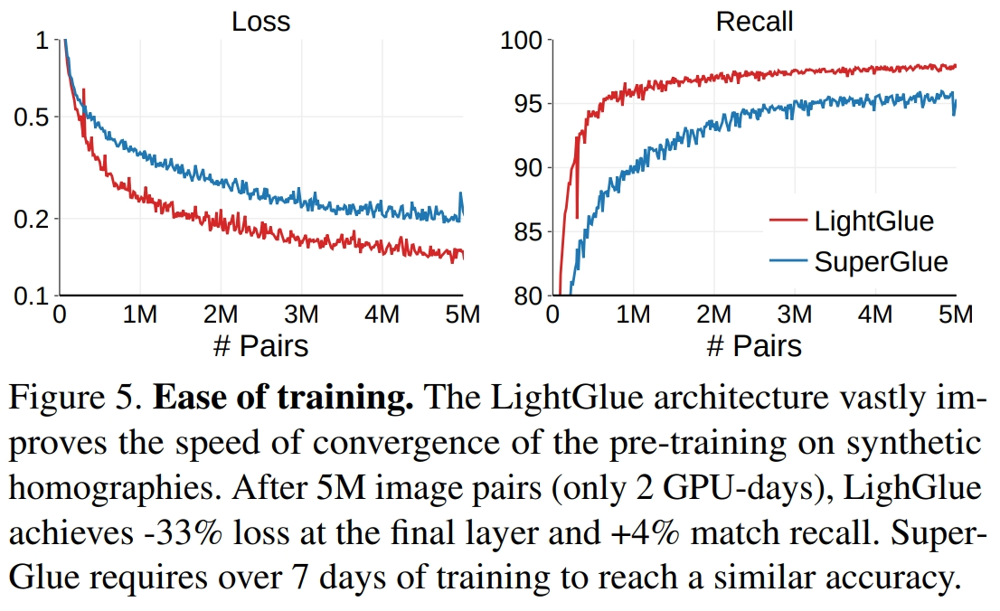

# 论文信息
- 时间：2023
- 期刊：arXiv
- 网络/算法名称：LightGlue
- 意义：更容易训练的 SuperGlue
- 作者：Philipp Lindenberger 1, Paul-Edouard Sarlin 1, Marc Pollefeys 1,2; 1 ETH Zurich; 2 Microsoft Mixed Reality & AI Lab
- 实验环境：训练 2 * RTX3090，每台 GPU 24G 显存；实验 1 * RTX3080，每台 GPU 10G 显存
- 数据集： HPatches dataset
- [返回上一层 README](../README.md)

- [内容整理](./LightGlue%20Local%20Feature%20Matching%20at%20Light%20Speed-TidyUp.md)

# 一、解决的问题
1. 特征匹配的健壮性和唯一性
    - 寻找两幅图像之间的对应关系是许多计算机视觉应用（如相机跟踪和3D映射）的基本组成部分。最常见的图像匹配方法依赖于稀疏的兴趣点，这些兴趣点使用对其局部视觉外观进行编码的高维表示进行匹配。在呈现对称性、弱纹理或由于视点和照明变化而导致外观变化的条件下，可靠地描述每个点是具有挑战性的。为了拒绝由遮挡和缺失点引起的异常值，这种表示也应该是有区别的。这产生了两个相互冲突的目标，健壮性和唯一性，这两个目标很难满足
    - 为了解决这些限制，SuperGlue引入了一种新的范式——一种深度网络，它同时考虑两个图像，以联合匹配稀疏点并拒绝异常值。它利用强大的Transformer模型来学习匹配来自大型数据集的具有挑战性的图像对。这在室内和室外环境中都产生了鲁棒的图像匹配。SuperGlue在具有挑战性的条件下非常有效地进行视觉定位，并很好地推广到其他任务，如空中匹配、物体姿态估计，甚至鱼类重新识别
1. 计算资源太高
    - 然而，这些改进在计算上是昂贵的，而图像匹配的效率对于需要低延迟（如跟踪）或高处理量（如大规模映射）的任务至关重要。此外，SuperGlue和其他基于Transformer的模型一样，是出了名的难以训练，需要许多从业者无法访问的计算资源。后续工作因此未能达到最初SuperGlue模型的性能。然而，自Transformer模型首次出版以来，它已经得到了广泛的研究、改进，并应用于许多语言和视觉任务
# 二、做出的创新
1. 研究的切入点
    1. Matching images 
        - 描绘相同场景或对象的匹配图像通常依赖于局部特征，局部特征是稀疏的关键点，每个关键点与其局部外观的描述符相关联。虽然经典算法依赖于手工制作的标准和梯度统计，但最近的许多研究都集中在设计卷积神经网络（CNNs），用于检测和描述。通过使用具有挑战性的数据进行训练，卷积神经网络在很大程度上提高了匹配的准确性和稳健性。局部特征现在有很多种风格：有些具有更好的本地化、高度可重复性、存储和匹配成本低廉、对特定变化不变或忽略不可靠的对象。
        - 然后将局部特征与描述符空间中的最近邻居搜索进行匹配。由于不匹配的关键点和不完美的描述符，一些对应关系是不正确的。这些是通过启发式方法过滤掉的，如Lowe比率检验或相互检验，内部分类器，以及通过稳健拟合几何模型。这一过程需要广泛的领域专业知识和调整，当条件太具有挑战性时，很容易失败。这些限制在很大程度上由深度匹配器解决。
    1. Deep matchers
        - 深度匹配器是经过训练的深度网络，用于在给定输入图像对的情况下联合匹配局部特征并拒绝异常值。SuperGlue是同类中的第一个，它将Transformers的表达表示与最优传输相结合，以解决部分分配问题。它学习关于场景几何和相机运动的强大先验，因此对极端变化具有鲁棒性，并能很好地在数据域中推广。继承了早期Transformers的局限性，SuperGlue很难训练，其复杂性随着关键点的数量呈二次方增长。
        - 随后的工作通过减少注意力机制的大小使其更加高效。他们将其限制在一小组种子匹配或类似关键点的簇内。这在很大程度上减少了大量关键点的运行时间，但对于较小的标准输入大小没有任何收益。这也削弱了在最具挑战性的条件下的稳健性，无法达到原始SuperGlue模型的性能。LightGlue在不影响任何难度级别的性能的情况下，为SLAM等典型操作条件带来了巨大的改进。这是通过动态调整网络大小而不是减少其总容量来实现的
        - 相反，像LoFTR和后续这样的密集匹配器匹配分布在密集网格上的点，而不是稀疏位置。这将健壮性提高到了令人印象深刻的水平，但通常要慢得多，因为它处理的元素要多得多。这限制了输入图像的分辨率，进而限制了对应关系的空间精度。虽然LightGlue对稀疏输入进行操作，但我们表明，公平的调整和评估使其在很短的运行时间内与密集匹配器竞争
    1. Making Transformers efficient
        - Transformer在语言处理方面取得成功后，使其高效化受到了极大的关注。由于注意力的记忆足迹是处理长序列的主要限制，许多工作使用线性公式或瓶颈潜在标记来减少它。这启用了长程上下文，但可能会影响小输入大小的性能。选择性检查点设置减少了注意力的内存占用，优化内存访问也大大加快了速度
        - 相反，正交工作通过预测给定层的令牌预测是最终的还是需要进一步计算来自适应地调制网络深度。这主要受到视觉社区为卷积神经网络开发的自适应方案的启发。在Transformers中，位置编码的类型对准确性有很大影响。虽然绝对正弦或学习编码最初很普遍，但最近的工作已经研究了相对编码，以稳定训练并更好地捕获长程依赖性
        - LightGlue将其中一些创新应用于2D特征匹配，并在效率和准确性方面都有所提高
1. 根据SuperGlue的缺点，设计LightGLue
    - 在本文中，我们利用这些见解来设计LightGlue，这是一种比SuperGlue更准确、更高效、更容易训练的深度网络。我们重新审视了它的设计决策，并结合了许多简单但有效的架构修改。我们提取了一个配方，用有限的资源训练高性能的深度匹配器，在短短几天内达到最先进的精度。如图1所示，与现有的稀疏和密集匹配器相比，LightGlue在效率-精度权衡方面是Pareto最优的。
    

    - 与以前的方法不同，LightGlue适用于每个图像对的难度，这取决于视觉重叠量、外观变化或判别信息。图2显示，因此，在直观上容易匹配的配对上，推理比在具有挑战性的配对上要快得多，这种行为让人想起了人类如何处理视觉信息。这是通过 **1)** 在每个计算块之后预测一组对应关系，以及 **2)** 使模型能够内省它们并预测是否需要进一步计算来实现的。LigthGlue也会在早期阶段丢弃不可匹配的点，从而将注意力集中在可视区域
    

    - 实验表明，LightGlue是SuperGlue的即插即用替代品：它预测两组局部特征的强匹配，只需运行时间的一小部分。这为在SLAM等延迟敏感应用程序中部署深度匹配器或从多数据重建更大场景开辟了令人兴奋的前景。LightGlue模型及其训练代码将在获得许可的情况下[公开发布](https://github.com/cvg/LightGlue)
# 三、设计的模型——更快的特征匹配

- Problem formulation
    - LightGlue预测在SuperGlue之后从图像A和B中提取的两组局部特征之间的部分分配。每个局部特征 $i$ 由二维点位置 $\mathbf{p}_ {i} := (x,y)_ {i} \in [0,1]^{2}$ ，该点位置由图像大小归一化和视觉描述符 $\mathbf{d}_ {i} \in \mathbb{R}^{d}$ 组成。图像A和B具有M个和N个局部特征，分别由 $\mathcal{A} := \lbrace 1,...,M \rbrace$ 和 $\mathcal{B} := \lbrace 1,...,N \rbrace$ 索引
    - 设计LightGlue来输出一组对应关系 $\mathcal{M} = \lbrace (i,j)\rbrace \subset \mathcal{A} \times \mathcal{B}$ 。每个点至少可匹配一次，因为它源于一个唯一的3D点，并且由于遮挡或不可重复性，一些关键点是不可匹配的。因此，与以前的工作一样，我们在A和B中的局部特征之间寻求一个软局部指派矩阵 $\mathbf{P} \in [0,1]^{M \times N}$ ，从中可以提取对应关系。
- Overview – Figure 3
    - LightGlue由一堆 $L$ 个相同的层组成，这些层共同处理这两组。每一层都由自我关注单元和交叉关注单元组成，它们更新每个点的表示。然后，分类器在每一层决定是否停止推理，从而避免不必要的计算。轻量级头最终根据表示集计算部分赋值

1. Transformer backbone
    - 将图像 $I \in \lbrace A,B \rbrace$ 中的每个局部特征 $i$ 与状态 $\mathbf{x}^{I}_ {i} \in \mathbb{R}^{d}$ 相关联。该状态用相应的视觉描述符 $\mathbf{x}^{I}_ {i} \leftarrow \mathbf{d}^{I}_ {i}$ 初始化，并且随后由每一层更新。将一层定义为一个自我注意和一个交叉注意单元的连续
    1. Attention unit
        - 在每个单元中，多层感知器（MLP）更新给定消息 $\mathbf{m}^{I \leftarrow S}_ {i}$ 的状态从源图像 $S \in \lbrace A,B \rbrace$ : $$\mathbf{x}^{I}_ {i} \leftarrow \mathbf{x}^{I}_ {i} + MLP([\mathbf{x}^{I}_ {i} | \mathbf{m}^{I \leftarrow S}_ {i}])$$ 聚合，其中 $[ \cdot | \cdot ]$ 叠加两个向量。这是为两个图像中的所有点并行计算的。在自注意单元中，每个图像 $I$ 从同一图像的点提取信息，因此 $S=I$ 。在交叉关注单元中，每个图像从另一个图像提取信息，并且 $S＝\lbrace A,B \rbrace \backslash I$ 。
        - 该消息由注意力机制计算为图像 $S$ 的所有状态 $j$ 的加权平均值: $$\mathbf{m}^{I \leftarrow S}_ {i} = \sum_ {j \in S} \underset{k \in S}{Softmax} (a^{IS}_ {ik})_ {j} \mathbf{W}\mathbf{x}^{S}_ {j}$$ 其中 $\mathbf{W}$ 是投影矩阵，$a^{IS}_ {ik}$ 是图像 $I$ 和 $S$ 的点 $i$ 和 $j$ 之间的注意力得分。如何计算该得分对于自身注意力单元和交叉注意力单元不同。
    1. Self-attention
        - 每个点都涉及同一图像的所有点。我们对每个图像 $I$ 执行相同的以下步骤，因此为了清晰起见，去掉上标 $I$ 。对于每个点 $i$ ，首先通过不同的线性变换将当前状态 $x_ {i}$ 分解为关键字和查询向量 $\mathbf{k}_ {i}$ 和 $\mathbf{q}_ {i}$ 。然后，我们将点 $i$ 和 $j$ 之间的注意力得分定义为 $$a_ {ij} = \mathbf{q}^{\mathsf{⊤}}_ {i} \mathbf{R}(\mathbf{p}_ {j} − \mathbf{p}_ {i})\mathbf{k}_ {j}$$ 其中 $\mathbf{R}(\cdot) \in \mathbb{R}^{d \times d}$ 是点之间相对位置的旋转编码。我们将空间划分为 $d / 2$ 个2D子空间，并根据傅立叶特征将每个子空间旋转一个角度，该角度对应于在学习基 $\mathbf{b}_ {k} \in \mathbb{R}^{2}$ 上的投影
        $$
        \begin{pmatrix}
        \hat{\mathbf{R}}(\mathbf{b}^{\mathsf{⊤}}_ {1} \mathbf{p})&\cdots&0\\
        \vdots&\ddots&\vdots\\
        0&\cdots&\hat{\mathbf{R}}(\mathbf{b}^{\mathsf{⊤}}_ {d/2} \mathbf{p})\\
        \end{pmatrix} , 
        \hat{\mathbf{R}}(\theta) = 
        \begin{pmatrix}
        \cos{\theta} & -\sin{\theta} \\
        \sin{\theta} & \cos{\theta}  \\ 
        \end{pmatrix}
        $$
        - 位置编码是注意力的关键部分，因为它允许根据不同元素的位置对其进行寻址。我们注意到，在投影相机几何中，视觉观察的位置与相机在图像平面内的平移是等变的：源于同一正面到平行平面上的3D点的2D点以相同的方式平移，并且它们的相对距离保持不变。这需要一种只捕捉点的相对位置而不捕捉点的绝对位置的编码。
        - 旋转编码使模型能够检索位于从 $i$ 学习的相对位置的点 $j$。位置编码不应用于值 $\mathbf{v}_ {j}$ ，因此不会溢出到状态 $\mathbf{x}_ {i}$ 中。所有层的编码都是相同的，因此只计算一次并缓存。
    1. Cross-attention
        - $I$  中的每个点都关注另一个图像 $S$ 的所有点。我们为每个元素计算一个关键字 $\mathbf{k}_ {i}$ ，但没有查询。这允许将分数表示为 $$a^{IS}_ {ij} = \mathbf{k}^{I \mathsf{T}}_ {i} \mathbf{k}^{S}_ {j} \overset{!}{=} a^{SI}_ {ji}$$ 因此，我们只需要为两个 $I \leftarrow S$ 和 $S \leftarrow I$ 信息计算一次相似性。这种技巧以前被称为双向注意力。由于这一步骤成本高昂，复杂性为 $O(NMd)$，因此节省了二分之一。我们不添加任何位置信息，因为相对位置在图像中没有意义。
1. Correspondence prediction
    - 我们设计了一个轻量级的头，它可以在任何层的更新状态下预测分配。
    1. Assignment scores
        - 我们首先计算两个图像的点之间的成对得分矩阵 $\mathbf{S} \in \mathbb{R}^{M \times N}$ :  $\mathbf{S}_ {ij} = Linear(\mathbf{x^{A}_ {i}})^{\mathsf{T}} Linear(\mathbf{x^{B}_ {j}}) \quad \forall (i,j) \in \mathcal{A} \times \mathcal{B}$ 其中 $Linear(\cdot)$ 是一个学习的有偏线性变换。该分数将每对点的亲和性编码为对应的，即同一3D点的2D投影。我们还为每个点计算匹配性得分， $\sigma_ {i} = Sigmoid(Linear(\mathbf{x}_ {i})) \in [0，1]$ 该分数对 $i$ 具有对应点的可能性进行编码。在其他图像中未检测到的点（例如，当被遮挡时）是不可匹配的，因此具有 $\sigma_ {i} \rightarrow 0$
    1. Correspondences
        - 我们将相似性和可匹配性得分合并到软部分分配矩阵 $\mathbf{P}$ 中，$\mathbf{P}_ {ij} = \sigma^{A}_ {i} \sigma^{B}_ {j} \underset{k \in \mathcal{A}}{Softmax}(\mathbf{S}_ {kj})_ {i} \underset{k \in \mathcal{B}}{Softmax}(\mathbf{S}_ {ik})_ {j}$ 当两个点都被预测为可匹配并且当它们的相似性高于两个图像中的任何其他点时，一对点 $(i,j)$ 产生对应关系。我们选择 $\mathbf{P}_ {ij}$ 大于阈值 $\tau$ 并且在行和列上都大于任何其他元素的对。

1. Adaptive depth and width
    - 我们添加了两种机制来避免不必要的计算并节省推理时间：i）我们根据输入图像对的难度来减少层数；ii）我们删除了早期被自信地拒绝的点。
    1. Confidence classifier
        - LightGlue的主干通过上下文增强了输入视觉描述符。如果图像对很容易，即具有高的视觉重叠和很少的外观变化，则这些通常是可靠的。在这种情况下，早期层的预测是有信心的，与晚期层的预测完全相同。然后我们可以输出这些预测并停止推理。
        - 在每一层的末尾，LightGlue推断出每个点的预测分配的置信度: $$c_ {i}=Sigmoid(MLP(\mathbf{x}_ {i})) \in [0,1]$$ 更高的值表示 $i$ 的表示是可靠的和最终的——它自信地匹配或不匹配。这是受多部作品的启发，这些作品成功地将这一策略应用于语言和视觉任务。紧凑型MLP在最坏的情况下只增加了2%的推理时间，但通常会节省更多
    1. Exit criterion
        - 对于给定层 $\ell$ ，如果 $c_ {i} > \lambda_ {\ell}$，则认为一点是有信心的。如果所有点的充分比率 $\alpha$ 是可信的，我们停止推理: $$exit=\left(\frac{1}{N+M}\sum_ {I \in \lbrace A,B \rbrace} \sum_ {i \in \mathcal{I}} [c^{I}_ {i}>\lambda_ {\ell}]\right) > \alpha$$ 我们在中观察到，分类器本身在早期层中不那么自信。因此我们衰减 $\lambda_ {\ell}$ 基于每个分类器的验证准确性，在整个层中。退出阈值 $\alpha$ 直接控制准确性和推理时间之间的权衡。
    1. Point pruning
        - 当不满足退出标准时，被预测为可信和不可匹配的点不太可能有助于后续层中其他点的匹配。例如，这些点位于图像中明显不可见的区域。因此，我们在每一层都丢弃它们，只将剩余的点馈送到下一层。考虑到注意力的二次复杂性，这显著减少了计算量，并且不会影响准确性。
1. Supervision
    - 我们分两个阶段训练LightGlue：我们首先训练它来预测对应关系，然后才训练置信分类器。因此，后者不影响最终层的精度或训练的收敛性。
    1. Correspondences
        - 我们监督具有从两个视图变换估计的基本真值标签的分配矩阵 $\mathbf{P}$。给定单应性或像素深度和相对姿态，我们将点从A包裹到B，反之亦然。真值匹配 $\mathcal{M}$ 是在两个图像中具有低重投影误差和一致深度的点对。当一些点 $\bar{\mathcal{A}} \subseteq \mathcal{A}$ 和 $\bar{\mathcal{B}} \subseteq \mathcal{B}$ 的重投影或深度误差与所有其他点足够大时，它们被标记为不可匹配。然后，我们最小化在每一层预测的分配的对数似然性 $\ell$ ，推动LightGlue尽早预测正确的对应关系 $$loss = - \frac{1}{L} \sum_ {\ell}\left(\frac{1}{|\mathcal{M}|} \sum_ {(i,j) \in \mathcal{M}} log^{\ell} \mathbf{P}_ {ij} + \frac{1}{2|\bar{\mathcal{A}}|}\sum_ {i \in \bar{\mathcal{A}}}log(1 -^{\ell}\sigma^{A}_ {i}) + \frac{1}{2|\bar{\mathcal{B}}|}\sum_ {j \in \bar{\mathcal{B}}}log(1 -^{\ell}\sigma^{B}_ {j})\right)$$ 损失在正负标签之间是平衡的

    1. Confidence classifier
        - 然后，我们训练等式的MLP $c_ {i}=Sigmoid(MLP(\mathbf{x}_ {i})) \in [0,1]$ 预测每一层的预测是否与最后一层相同。允许 $^{\ell}m^{A}_ {i} \in \mathcal{B} \cup \{ \bullet \}$ 是 $B$ 中与 $i$ 在层上匹配的点的索引 $\ell$, 具有 $^{\ell}m^{A}_ {i} = \bullet$ 如果 $i$ 不匹配。每个点的地面实况二进制标签是 $[^{\ell}m^{A}_ {i}=^{L}m^{A}_ {i}]$ 并且对于 $B$ 相同。然后我们最小化层分类器的二进制交叉熵 $\ell \in \{1,...,L−1\}$。
1. Comparison with SuperGlue
    - LightGlue的灵感来源于SuperGlue，但在准确性、效率和易于训练方面有所不同。
    1. Positional encoding
        - SuperGlue使用MLP对绝对点位置进行编码，并在早期将其与描述符融合。我们观察到，模型往往会忘记整个层的位置信息。LightGlue依赖于一种相对编码，这种编码在图像之间更具可比性，并添加到每个自我关注单元中。这样可以更容易地利用位置，并提高更深层次的精度。
    1. Prediction head
        - SuperGlue通过使用Sinkhorn算法求解可微最优传输问题来预测分配。它包括行和列规范化的多次迭代，这在计算和内存方面都很昂贵。SuperGlue添加了一个垃圾箱来拒绝无法匹配的点数。我们发现垃圾箱将所有点的相似性分数纠缠在一起，从而产生次优的训练动态。LightGlue将相似性和可匹配性解开，这两个问题的预测效率要高得多。这也产生了更清洁的梯度。
    1. Deep supervision
        - 由于Sinkhorn的成本很高，SuperGlue无法在每一层之后进行预测，只能在最后一层进行监督。LightGlue较轻的头部可以预测每一层的任务并对其进行监督。这加快了收敛速度，并允许在任何层之后退出推理，这是LightGlue提高效率的关键
1. 重要的细节
    1. Recipe
        - LightGlue遵循SuperGlue的监督训练设置。我们首先用从1M幅图像中采样的合成单应性对模型进行预训练。这样的增强提供了完全且无噪声的监督，但是需要仔细的调谐。然后，LightGlue使用MegaDepth数据集进行微调，该数据集包括描绘196个旅游地标的1M众包图像，通过SfM恢复相机校准和姿势，并通过多视图立体恢复密集深度。由于大型模型很容易过度适应这种独特的场景，因此预训练对模型的泛化至关重要，但在最近的随访中被省略了。

    1. Training tricks
        
        - 虽然LightGlue体系结构提高了训练速度、稳定性和准确性，但我们发现一些细节也有很大的影响。图5显示，与SuperGlue相比，这减少了训练模型所需的资源。这降低了训练成本，并使更广泛的社区更容易接触到深度匹配者
        - 由于MegaDepth的深度图通常是不完整的，我们还将具有大核误差的点标记为不可匹配。仔细调整和退火学习率可以提高准确性。多点训练也可以：我们使用每张图像2k，而不是1k。批量大小很重要：我们使用梯度检查点和混合精度在具有24GB VRAM的单个GPU上拟合32个图像对
    1. Implementation details
        - LighGlue有L=9层。每个注意力单元有4个头。所有表示都具有维度d=256。在整篇论文中，标记为优化的运行时数字使用了自我关注的有效实现。更多细节见附录。
        - 我们使用SuperPoint和SIFT局部特征训练LightGlue，但它与任何其他类型都兼容。在MegaDepth上微调模型时，我们使用Sun等人的数据分割来避免对图像匹配挑战中包含的场景进行训练。

# 四、实验结果

## 1、比之前模型的优势
1. 总览
    1. 节省内存和计算资源
    1. 效率更高
    1. 更加准确
    1. 更容易训练
1. 消融实验
    
    - 我们通过评估LightGlue在具有极端光度增强的具有挑战性的合成单应性数据集上进行预训练后的设计决策来验证我们的设计决策。我们使用SuperPoint功能和5M样本训练不同的变体，所有这些都在4 GPU天内完成。我们从应用于训练过程中看不见的图像的相同增强中创建了一个测试集。我们从每个关键点中提取512个关键点。我们还与SuperGlue进行了比较，SuperGlue是我们使用相同设置进行训练的。附录中提供了更多详细信息。
    - 我们在表4中报告了消融结果。与SuperGlue相比，LightGlue的收敛速度明显更快，召回率达到+4%，准确率达到+12%。请注意，SuperGlue可以通过足够长的训练达到与LightGlue类似的精度，但改进的收敛性使在新数据上训练更加实用。
    1. matchability classifier
        
        - 如果没有匹配性分类器，网络将失去区分好匹配和坏匹配的能力，如图6所示。直观地，相似性矩阵提出了许多可能的匹配，而匹配性过滤了不正确的提议。因此，我们的部分分配可以被视为相互最近邻居搜索和学习的内部分类器的优雅融合。这比解决SuperGlue的最佳运输问题要快得多。
    1. absolute positions
        - 用旋转嵌入取代学习的绝对位置编码可以提高准确性，在每个自关注层旋转查询和键会对运行时间造成较小的损失。使用相对位置，LightGlue学习在图像之间匹配几何图案。提醒网络每层的位置可以提高网络的鲁棒性，从而达到+2%的精度。
    1. full cross-attention
        - 双向交叉注意力与标准交叉注意力一样准确，但只计算一次相似矩阵就节省了20%的运行时间。目前，瓶颈是沿着两个维度计算softmax。使用专用的双向softmax内核，可以避免大量冗余计算
    1. early layer
        - 使用深度监督，中间层也会产生有意义的结果。在5层之后，网络就可以预测稳健的匹配，实现>90%的召回率。在最后几层，网络专注于拒绝异常值，从而提高匹配精度
## 2、有优势的原因
1. LightGLue能够适应问题的难度
    
    - 适应性：通过预测匹配性得分和置信度，我们可以根据具体情况自适应地减少前向传球过程中的计算。表5研究了两种修剪机制——自适应深度和宽度——对不同视觉重叠范围的MegaDepth图像对的有效性。对于简单的样本，例如视频的连续帧，网络在几层后快速收敛并退出，从而实现1.86倍的加速。在低视觉重叠的情况下，例如环路闭合，网络需要更多的层来收敛。然而，它会提前拒绝有信心和不匹配的点，并将它们排除在后续层的输入之外，从而避免不必要的计算。
1. 效率
    
    - 图7显示了不同数量的输入关键点的运行时间。对于每张图像最多2K个关键点（这是视觉定位的常见设置），LightGlue比SuperGlue和SGMNet都快。自适应修剪进一步减少了任何输入大小的运行时间。
## 3、改进空间
1. full cross-attention
    - 双向交叉注意力与标准交叉注意力一样准确，但只计算一次相似矩阵就节省了20%的运行时间。目前，瓶颈是沿着两个维度计算softmax。使用专用的双向softmax内核，可以避免大量冗余计算

# 五、结论
本文介绍了LightGlue，这是一种经过训练的深度神经网络，用于匹配图像中的稀疏局部特征。在SuperGlue成功的基础上，我们将注意力机制的力量与对匹配问题的见解以及Transformer最近的创新相结合。我们让这个模型能够反思自己预测的可信度。这产生了一个优雅的方案，使计算量适应每个图像对的难度。它的深度和宽度都是自适应的：1）如果所有预测都准备好了，推理可以在早期层停止，2）被认为不匹配的点会从进一步的步骤中提前丢弃。最终得到的LightGlue模型比长期以来无与伦比的SuperGlue更快、更准确、更容易训练。总之，LightGlue是一种替代品，只有好处。
## 1、模型是否解决了目标问题

## 2、模型是否遗留了问题

## 3、模型是否引入了新的问题

# 六、代码

# 读者角度（挖掘文章中没有提到的）：
1. 总结文章发现问题的思路
2. 总结文章改进的思想
3. 总结文章还存在或者可以改进的问题
4. 提出对模型参数和细节的一些思考和讨论