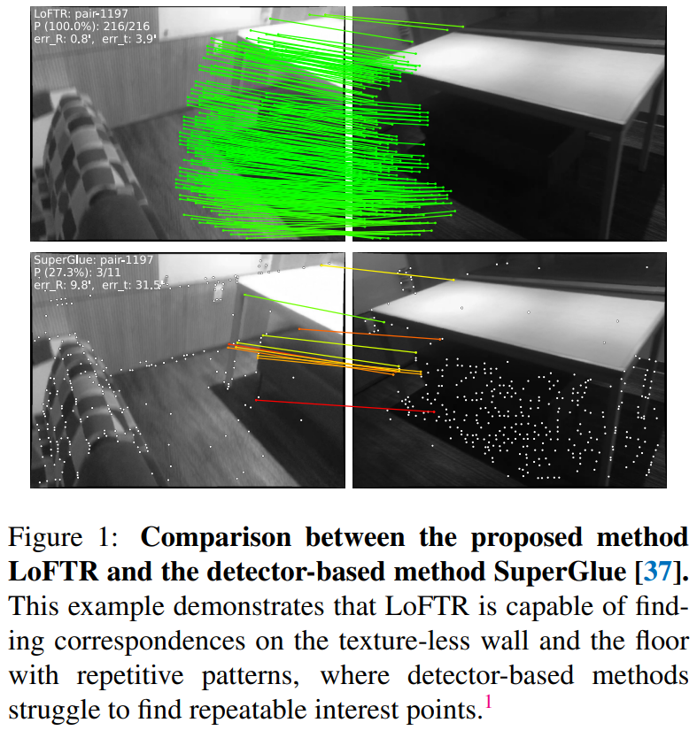
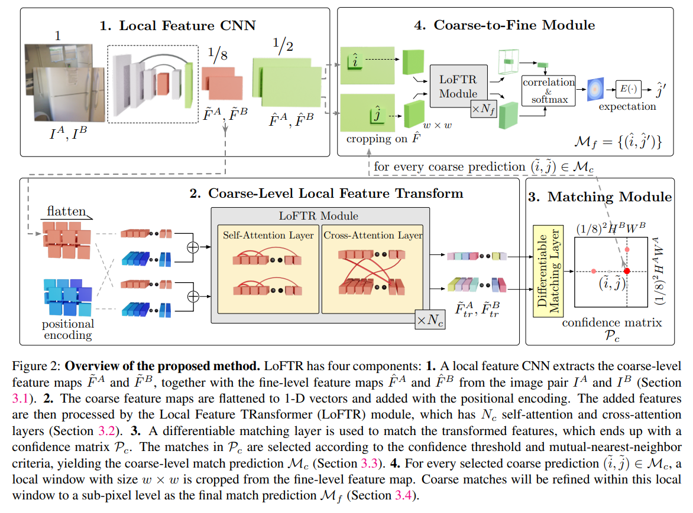
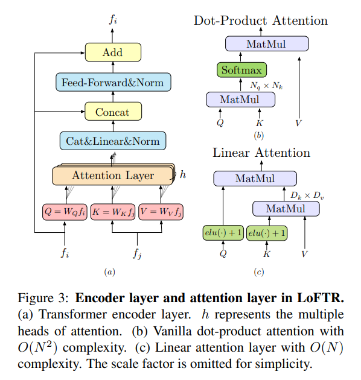
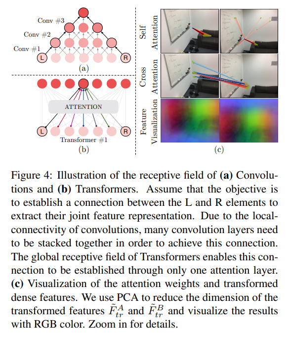
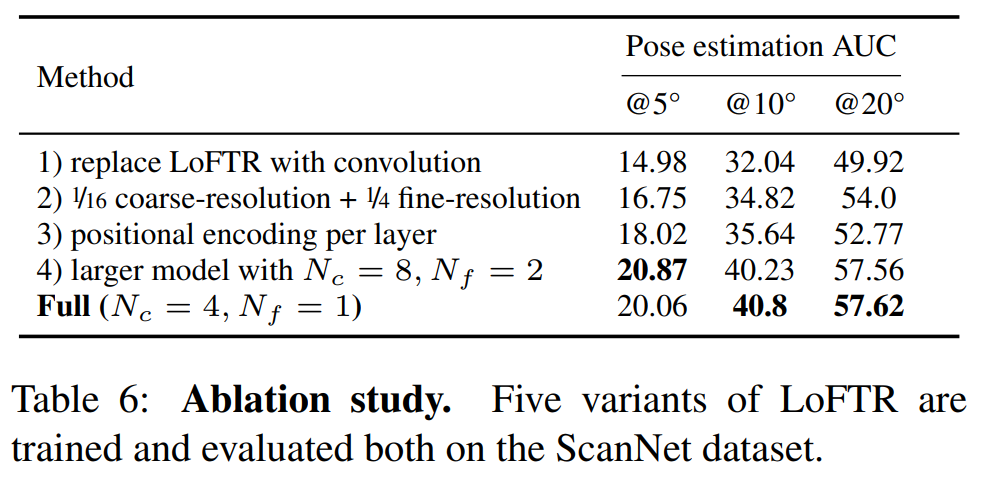

# 论文信息
- 时间：2021
- 期刊：CVPR
- 网络/算法名称：LoFTR
- 意义：局部图像特征匹配
- 作者：Jiaming Sun1,2∗, Zehong Shen1∗, Yuang Wang1∗, Hujun Bao1, Xiaowei Zhou1y; 1Zhejiang University, 2SenseTime Research
- 实验环境：64 * 1080Ti
- 数据集：HPatches, ScanNet, MegaDepth,  InLoc benchmark, Aachen Day-Night benchmark v1.1
- [返回上一层 README](../README.md)

# 一、解决的问题
1. 摘要
    - 提出了一种新的图像局部特征匹配方法。我们不是按顺序进行图像特征检测、描述和匹配，而是建议首先在粗水平上建立逐像素的密集匹配，然后在细水平上细化好的匹配。与使用代价量来搜索对应的密集方法相反，我们在Transformer中使用自关注层和交叉关注层来获得基于两个图像的特征描述符。Transformer提供的全局接受场使我们的方法能够在低纹理区域产生密集匹配，而特征检测器通常难以产生可重复的兴趣点。在室内和室外数据集上的实验表明，LoFTR在很大程度上优于最先进的方法。在已发表的方法中，LoFTR在视觉定位的两个公开基准上也排名第一
1. 图像之间的局部特征匹配
    - 图像之间的局部特征匹配是许多3D计算机视觉任务的基础，包括运动结构(SfM)、同时定位和映射(SLAM)、视觉定位等。对于两幅待匹配的图像，大多数现有的匹配方法包括三个独立的阶段:特征检测、特征描述和特征匹配。在检测阶段，首先从每个图像中检测出角点等显著点作为兴趣点。然后在这些兴趣点的邻近区域周围提取局部描述符。特征检测和描述阶段产生两组具有描述符的兴趣点，它们的点对点对应关系随后通过最近邻搜索或更复杂的匹配算法找到。
    - 特征检测器的使用减少了匹配的搜索空间，并且得到的稀疏对应足以用于大多数任务，例如相机姿态估计。然而，由于诸如较差的纹理、重复的图案、视点变化、照明变化和运动模糊等各种因素，特征检测器可能无法提取足够的在图像之间可重复的兴趣点。这个问题在室内环境中尤为突出，在室内环境下，低纹理区域或重复图案有时会占据视野中的大部分区域。图1显示了一个示例。如果没有可重复的兴趣点，即使使用完美的描述符也不可能找到正确的对应关系
    
    

    - 最近的一些研究[34,33,19]试图通过建立像素级密集匹配来解决这个问题。可以从密集匹配中选择置信度高的匹配，从而避免特征检测。然而，在这些工作中，卷积神经网络(cnn)提取的密集特征具有有限的接受野，可能无法区分无特征区域。相反，人类不仅在当前区域，而且在更大的全图背景下，在这些没有区别的地区找到了对应关系。例如，图1中的低纹理区域可以根据它们与边缘的相对位置来区分。这一观察结果告诉我们，特征提取网络中的 ***大感受野*** 是至关重要的。
    - 基于以上观察结果，我们提出了一种新的 ***无检测器*** 的局部特征匹配方法——Local Feature TRansformer (LoFTR)。受开创性工作SuperGlue的启发，我们使用Transformer与自关注层和交叉关注层一起处理(变换)从卷积主干提取的密集局部特征。首先以低特征分辨率(图像维数的1=8)在两组变换后的特征之间提取密集匹配。从这些密集匹配中选择高置信度的匹配，然后使用基于相关性的方法将其细化到亚像素级。Transformer的全局接受域和位置编码使转换后的特征表示与上下文位置相关。通过将自我和交叉注意层多次交错，LoFTR学习到在ground-truth匹配中显示的密集排列的全局同意匹配先验。还采用了线性Transformer，将计算复杂度降低到可管理的水平
    - 我们对室内和室外数据集的图像匹配和相机姿态估计任务进行了评估。实验表明，LoFTR比基于检测器和不含检测器的特征匹配基线有更大的优势。LoFTR也达到了最先进的性能，在两个公开的视觉定位基准中排名第一。与基于检测器的基线方法相比，LoFTR即使在低纹理、运动模糊或重复模式的无特征区域也能产生高质量的匹配。

# 二、做出的创新
1. Detector-based Local Feature Matching
    - 基于检测器的方法一直是局部特征匹配的主流方法。在深度学习时代之前，许多以传统手工制作为特色的著名作品都取得了不错的成绩。SIFT和ORB可以说是最成功的手工制作的局部特征，在许多3D计算机视觉任务中被广泛采用。基于学习的方法可以显著提高对大视点和局部特征光照变化的处理性能。值得注意的是，LIFT和MagicPoint是第一批成功的基于学习的局部特征。它们采用基于探测器的手工设计方法，取得了良好的性能。SuperPoint建立在MagicPoint的基础上，通过同形适应提出了一种自我监督的训练方法。沿着这条路线，许多基于学习的局部特征也采用了基于检测器的设计。
    - 上述局部特征使用最近邻搜索来查找提取的兴趣点之间的匹配。最近，SuperGlue 提出了一种基于学习的局部特征匹配方法。SuperGlue接受两组兴趣点及其描述符作为输入，并使用图神经网络(GNN)学习它们的匹配，这是Transformer的一般形式。由于可以通过数据驱动的方法学习特征匹配中的先验，SuperGlue实现了令人印象深刻的性能，并在局部特征匹配中设置了新的状态。然而，作为一种依赖于检测器的方法，它有一个根本的缺点，即无法在不明显的区域中检测到可重复的兴趣点。SuperGlue的注意力范围也仅限于检测到的兴趣点。我们的工作受到SuperGlue的启发，在GNN中使用自我和交叉注意在两组描述符之间传递消息，但我们提出了一个无检测器的设计来避免特征检测器的缺点。我们还在Transformer中使用了一种有效的注意力层变体来减少计算成本。
1. Detector-free Local Feature Matching
    - ***无检测器方法省去了特征检测阶段，直接生成密集描述符或密集特征匹配*** 。密集特征匹配的思想可以追溯到SIFT Flow。[6,39]是第一个基于学习的方法来学习具有对比损失的像素特征描述符。与基于检测器的方法类似，最近邻搜索通常被用作匹配密集描述符的后处理步骤。NCNet提出了一种不同的方法，以端对端方式直接学习密集对应。它构建四维代价体积来枚举图像之间所有可能的匹配，并使用四维卷积来正则化代价体积并强制所有匹配之间的邻域一致性。稀疏NCNet在NCNet的基础上进行了改进，使其在使用稀疏卷积时效率更高。与我们的工作同时，DRC-Net也遵循了这一思路，提出了一种从粗到精的方法，以更高的精度产生密集匹配。虽然在四维代价体积中考虑了所有可能的匹配，但四维卷积的接受域仍然局限于每个匹配的邻域。除了邻域共识之外，我们的工作重点是通过Transformer中的全局接受场来实现匹配之间的全局共识，这在NCNet及其后续作品中没有被利用。[24]提出了一种基于内窥镜视频的SfM密集匹配管道。最近的一项研究[46,45,44,15]也与我们的工作有关，该研究的重点是弥合局部特征匹配和光流估计的任务。
1. Transformers in Vision Related Tasks
    - Transformer由于其简单性和计算效率，已成为自然语言处理（NLP）中序列建模的事实标准。最近，Transformers在计算机视觉任务中也越来越受到关注，如图像分类、对象检测和语义分割。与我们的工作同时，提出使用Transformer进行视差估计。由于查询向量和关键向量之间的乘法运算，vanilla Transformer的计算成本随着输入序列的长度呈二次增长。最近在处理长语言序列的背景下提出了许多有效的变体[42，18，17，5]。由于在这些作品中没有对输入数据进行假设，因此它们也非常适合处理图像。
# 三、设计的模型
- 给定图像对 $I^{A}$ 和 $I^{B}$ ，现有的局部特征匹配方法使用特征检测器来提取兴趣点。我们建议用无检测器设计来解决特征检测器的可重复性问题。所提出的方法LoFTR的概述如图2所示

1. Local Feature Extraction
    - 我们使用FPN的标准卷积架构（表示为局部特征CNN）从两幅图像中提取多层次特征。我们使用 $\tilde{F}^{A}$ 和 $\tilde{F}^{B}$ 来表示原始图像维度 $\frac{1}{8}$ 处的粗略级别特征，并且 $\hat{F}^{A}$ 和 $\hat{F}^{B}$ 表示原始图像维数 $\frac{1}{2}$ 处的精细级别特征。
    - 卷积神经网络(cnn)具有翻译等方差和局部性的归纳偏差，非常适合局部特征提取。CNN引入的下采样也减少了LoFTR模块的输入长度，这对于确保可管理的计算成本至关重要。
1. Local Feature Transformer (LoFTR) Module
    - 局部特征提取完成后，将 $\tilde{F}^{A}$ 和 $\tilde{F}^{B}$ 通过LoFTR模块提取与位置和上下文相关的局部特征。直观地，LoFTR模块将特征转换为易于匹配的特征表示。我们将变换后的特征表示为 $\tilde{F}^{A}_ {tr}$ 和 $\tilde{F}^{B}_ {tr}$ 
    1. Preliminaries: Transformer 
        - 我们首先简要介绍Transformer作为背景。Transformer编码器由顺序连接的编码器层组成。图3(a)显示了编码器层的架构。

        

        - 编码器层中的关键元素是注意力层。注意层的输入向量通常命名为查询、键和值。与信息检索类似，查询向量Q根据每个值V对应的Q与键向量K的点积计算得到的关注权值，从值向量V中检索信息。注意层计算图如图3(b)所示。形式上，注意层表示为: $$Attention(Q,K,V)=softmax(QK^{T})V$$ 直观上，关注操作通过度量查询元素与每个关键元素的相似度来选择相关信息。输出向量是由相似性分数加权的值向量的和。因此，如果相似度高，则从值向量中提取相关信息。这个过程在图神经网络中也称为“消息传递”。
    1. Linear Transformer
        - 将Q和K的长度记为N，特征维数记为D，变压器中Q和K的点积引入计算代价，计算代价随着输入序列的长度呈二次增长( $O(N^{2})$ )。即使局部特征CNN减少了输入长度，在局部特征匹配的情况下，直接应用Transformer的vanilla版本也是不切实际的。为了解决这个问题，我们建议在Transformer中使用一种有效的注意层变体。Linear Transformer提出将原始注意层中使用的指数核函数替换为替代核函数 $sim(Q,K) = \phi(Q) \cdot \phi(K)^{T}, \quad where \quad \phi(\cdot) = elu(\cdot)+ 1$ 。该操作的计算图如图3(c)所示。利用矩阵乘积的结合性，可以首先进行 $\phi(K)^{T}$ 与 $V$ 的乘积。由于 $D \ll N$ ，计算成本降低到 $O(N)$。
    1. Positional Encoding
        - 我们在Transformer中使用标准位置编码的二维扩展，遵循DETR。与DETR不同的是，我们只将它们添加到骨干输出一次。我们将位置编码的正式定义留在补充材料中。直观地说，位置编码以正弦格式为每个元素提供唯一的位置信息。通过在 $\tilde{F}^{A}$ 和 $\tilde{F}^{B}$ 中加入位置编码，变换后的特征将变得与位置相关，这对LoFTR在无区分区域产生匹配的能力至关重要。如图4(c)下一行所示，虽然输入的RGB颜色在白墙上是均匀的，但变换后的特征 $\tilde{F}^{A}_ {tr}$ 和 $\tilde{F}^{B}_ {tr}$ 在每个位置上都是唯一的，这可以通过平滑的颜色梯度来证明。图6提供了更多的可视化

        
        

    1. Self-attention and Cross-attention Layers
        - 对于自注意层，输入特征 $f_ {i}$ 和 $f_ {j}$ (如图3所示)是相同的( $\tilde{F}^{A}$ 或 $\tilde{F}^{B}$ )。对于交叉注意层，根据交叉注意的方向，输入特征 $f_ {i}$ 和 $f_ {j}$ 可以是( $\tilde{F}^{A}$ 和 $\tilde{F}^{B}$ )或( $\tilde{F}^{B}$ 和 $\tilde{F}^{A}$ )。接下来[37]，我们将LoFTR模块中的自我和交叉注意层交错 $N_ {c}$ 次。LoFTR中自注意层和交叉注意层的注意权重如图4(c)的前两行所示
1. Establishing Coarse-level Matches
    - 在LoFTR中可以应用两种类型的可微匹配层，一种是[37]中的最优传输(OT)层，另一种是[34,47]中的 dual-softmax operator。变换后的特征之间的分数矩阵 $\mathcal{S}$ 首先由 $\mathcal{S}(i,j) = \frac{1}{\tau} \cdot \langle \tilde{F}^{A}_ {tr}(i), \tilde{F}^{B}_ {tr}(j) \rangle$ 。当与OT匹配时， $-\mathcal{S}$ 可作为部分分配问题的代价矩阵，如[37]所示。我们也可以对 $\mathcal{S}$ 的两个维度(以下称为dual-softmax)应用softmax，得到软相互最近邻匹配的概率。形式上，当使用dual-softmax时，匹配概率 $\mathcal{P}_ {c}$ 由 $$\mathcal{P}_ {c}(i,j)=softmax(\mathcal{S}(i,\cdot))_ {j} \cdot softmax(\mathcal{S}(\cdot,j))_ {i}$$
    1. Match Selection
        - 基于置信度矩阵 $\mathcal{P}_ {c}$ ，我们选择置信度高于阈值 $\theta_ {c}$ 的匹配，并进一步执行相互近邻(MNN)标准，过滤可能的异常粗匹配。我们将粗级匹配预测表示为: $$\mathcal{M}_ {c}=\lbrace (\tilde{i},\tilde{j}) | \forall (\tilde{i},\tilde{j}) \in MNN(\mathcal{P}_ {c}), \mathcal{P}_ {c}(\tilde{i},\tilde{j}) \ge \theta_ {c} \rbrace$$
1. Coarse-to-Fine Module
    - 在建立粗匹配后，使用粗到精模块将这些匹配细化到原始图像分辨率。受[50]的启发，我们使用基于相关性的方法来实现这一目的。对于每一个粗匹配 $(\tilde{i},\tilde{j})$ ，我们首先定位它的位置 $(\hat{i},\hat{j})$ 在精细级特征映射 $\hat{F}^{A}$ 和 $\hat{F}^{B}$ 上，然后裁剪两组大小为 $w \times w$ 的局部窗口。一个较小的LoFTR模块然后将每个窗口内裁剪的特征进行 $N_ {f}$ 次变换，产生两个转换的局部特征映射 $\hat{F}^{A}_ {tr}(\hat{i})$ 和 $\hat{F}^{B}_ {tr}(\hat{j})$ ，分别以 $\hat{i}$ 和 $\hat{j}$ 为中心。然后，我们将 $\hat{F}^{A}_ {tr}(\hat{i})$ 的中心向量与 $\hat{F}^{B}_ {tr}(\hat{j})$ 中的所有向量关联起来，从而生成一个热图，该热图表示 $\hat{j}$ 邻域中每个像素与 $\hat{i}$ 的匹配概率。通过计算期望对概率分布的影响，我们得到最终位置 $\hat{j^{'}}$ 在 $I^{B}$ 上具有亚像素精度。$\lbrace (\hat{i}, \hat{j^{'}}) \rbrace$ 产生最终的精细匹配 $\mathcal{M}_ {f}$ 。
1. Supervision
    - 最终损失包括粗级和细级损失: $\mathcal{L} = \mathcal{L}_ {c} + \mathcal{L}_ {f}$
    1. Coarse-level Supervision
        - 粗层的损失函数是由最优传输层或 dual-softmax operator 返回的置信矩阵 $\mathcal{P}_ {c}$ 上的负对数似然损失。我们遵循SuperGlue，在训练过程中使用相机姿势和深度图来计算置信度矩阵的地基真值标签。我们将基本实况粗匹配 $\mathcal{M}^{gt}_ {c}$ 定义为两组 $\frac{1}{8}$ 分辨率网格的相互最近邻居。两个网格之间的距离是通过其中心位置的重投影距离来测量的。更多细节见补充文件。对于最优传输层，我们使用与[37]相同的损失公式。当使用dual-softmax进行匹配时，我们最小化了 $\mathcal{M}^{gt}_ {c}$ 中网格上的负对数似然损失: $$\mathcal{L}_ {c}=-\frac{1}{|\mathcal{M}^{gt}_ {c}|} \sum_ {(\tilde{i},\tilde{j}) \in \mathcal{M}^{gt}_ {c}} log \mathcal{P}_ {c} (\tilde{i},\tilde{j})$$
    1. Fine-level Supervision
        - 我们使用 $\mathcal{l}_ {2}$ 损失进行精细的细化。接下来[50]，对于每个查询点 $\hat{i}$ ，我们也通过计算相应热图的总方差 $\sigma^{2}(\hat{i})$ 来测量其不确定性。目标是优化不确定性较低的精细化位置，得到最终的加权损失函数: $$\mathcal{L}_ {f}=\frac{1}{|\mathcal{M}_ {f}|} \sum_ {(\tilde{i},\tilde{j^{'}}) \in \mathcal{M}_ {f}} \frac{1}{\sigma^{2}(\hat{i})} ||\tilde{j^{'}} - \tilde{j^{'}}_ {gt}||_ {2}$$ 其中的 $\tilde{j^{'}}_ {gt}$ 是通过将每个 $\hat{i}$ 从 $\hat{F}^{A}_ {tr}(\hat{i})$ 扭曲到 $\hat{F}^{B}_ {tr}(\hat{j})$ 来计算的，这些 $\hat{i}$ 是用真实的相机姿势和深度计算的。在计算 $\mathcal{L}_ {f}$ 时，如果 $\hat{i}$ 的扭曲位置落在 $\hat{F}^{B}_ {tr}(\hat{j})$ 的局部窗口之外，我们忽略 $(\hat{i}, \hat{j^{'}})$ 。在训练过程中，梯度不会反向传播到 $\sigma^{2}(\hat{i})$ 。
1. Implementation Details
    - 我们在ScanNet数据集上训练LoFTR的室内模型，在MegaDepth上训练室外模型。在ScanNet上，使用Adam对模型进行训练，初始学习率为 $1 \times 10^{-3}$ ，批大小为64。在64 GTX 1080Ti gpu上训练24小时后，它会收敛。local feature CNN使用ResNet-18的修改版本作为主干。整个模型是用随机初始化的权重端到端训练的。$N_ {c}$ 设为4，$N_ {f}$ 设为1。$\theta_ {c}$ 取为0.2。窗口大小 $w$ 等于5。在实现中，$\tilde{F}^{A}_ {tr}$ 和 $\tilde{F}^{B}_ {tr}$ 被上采样并与 $\tilde{F}^{A}$ 和 $\tilde{F}^{B}$ 连接，然后通过精细级LoFTR。在RTX 2080Ti上，对于640×480图像对，具有dualsoftmax匹配的完整模型运行时间为116毫秒。在最优传输设置下，我们使用三次sinkhorn iterations，模型运行速度为130 ms。关于训练和时间分析的更多细节，我们建议读者参阅补充材料
# 四、实验结果

## 1、比之前模型的优势

## 2、有优势的原因
1. Ablation Study
    - 为了充分理解LoFTR中的不同模块，我们评估了五种不同的变体，其结果如表6所示:
        1. 用具有相当数量参数的卷积替换LoFTR模块，结果如预期的那样显著降低了AUC。
        1. 使用较小版本的LoFTR，分别在粗和细级别上使用1/16和1/4分辨率的特征图，导致运行时间为104 ms，姿态估计精度下降。
        1. 使用DERT风格的Transformer架构，在每层都有位置编码，导致结果明显下降。
        1. 通过将LoFTR层数加倍至 $N_ {c} = 8$ 和 $N_ {f} = 2$ 来增加模型容量几乎不会改变结果。我们使用与ScanNet上的室内姿态估计相同的训练和评估协议进行这些实验，并使用最佳传输层进行匹配。

    

1. Visualizing Attention
    - 我们在图6中可视化了注意力权重

## 3、改进空间

# 五、结论
- 本文提出了一种新的无检测器匹配方法，即LoFTR，它能以粗到精的方式与变压器建立精确的半密集匹配。提出的LoFTR模块利用Transformers中的自注意层和交叉注意层将局部特征转换为上下文和位置相关的特征，这对于LoFTR在具有低纹理或重复图案的无特征区域上获得高质量的匹配至关重要。我们的实验表明，在多数据集上，LoFTR在相对姿态估计和视觉定位方面取得了最先进的性能。我们认为，LoFTR为局部图像特征匹配中的无检测器方法提供了新的方向，可以扩展到更具挑战性的场景，例如具有严重季节变化的图像匹配。
## 1、模型是否解决了目标问题

## 2、模型是否遗留了问题

## 3、模型是否引入了新的问题

# 六、代码

# 读者角度（挖掘文章中没有提到的）：
1. 总结文章发现问题的思路
2. 总结文章改进的思想
3. 总结文章还存在或者可以改进的问题
4. 提出对模型参数和细节的一些思考和讨论