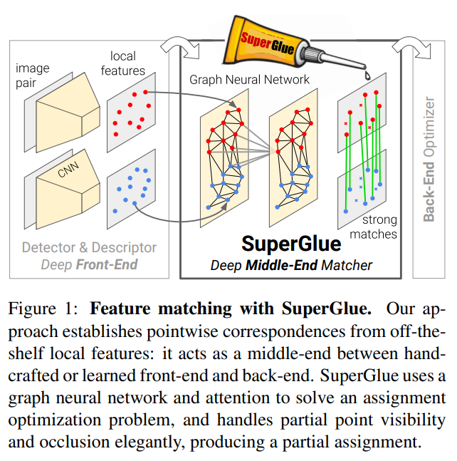

# 论文信息
- 时间：2020
- 期刊：CVPR
- 网络/算法名称：SuperGlue
- 意义：端到端的特征匹配网络
- 作者：Paul-Edouard Sarlin1, Daniel DeTone2, Tomasz Malisiewicz2, Andrew Rabinovich2; 1 ETH Zurich, 2 Magic Leap, Inc.
- 实验环境：
- 数据集：
- [返回上一层 README](../README.md)

[Claude2 翻译](./SuperGlue%20Learning%20Feature%20Matching%20with%20Graph%20Neural%20Networks-by%20claude2.md)

# 一、解决的问题
1. 摘要
    - 本文介绍了SuperGlue神经网络，该神经网络通过联合查找对应点和拒绝不匹配点来匹配两组局部特征。通过求解一个可微最优运输问题来估计分配，并利用图神经网络预测运输成本。我们引入了一种基于注意力的灵活的上下文聚合机制，使SuperGlue能够共同推理底层3D场景和特征分配。与传统的手工设计的启发式算法相比，我们的技术通过对图像对的端到端训练来学习3D世界的几何变换和规律的先验。SuperGlue优于其他学习方法，并在具有挑战性的现实世界室内和室外环境中实现了最先进的姿态估计任务。该方法可以在现代GPU上实时匹配，并且可以很容易地集成到现代SfM或SLAM系统中
1. 单应性估计
    - 在同步定位和映射(SLAM)和运动结构(SfM)等几何计算机视觉任务中，图像中点之间的对应关系对于估计三维结构和相机姿态至关重要。这种对应关系通常是通过匹配局部特征来估计的，这个过程被称为数据关联。大视点和光照变化、遮挡、模糊和缺乏纹理是使2d到2d数据关联特别具有挑战性的因素。
    - 本文提出了一种新的特征匹配问题的思路。我们建议使用一种名为SuperGlue的新型神经结构，从已有的局部特征中学习匹配过程，而不是通过简单的匹配启发式和技巧来学习更好的任务无关的局部特征。在SLAM的背景下，通常将问题分解为视觉特征提取前端和束调整或姿态估计后端，我们的网络直接位于中间——SuperGlue是一个可学习的中间端(见图1)。
    

    - 在这项工作中，学习特征匹配被视为寻找两组局部特征之间的部分分配。通过求解一个线性分配问题，我们重新审视了经典的基于图的匹配策略，当线性分配问题松弛为最优运输问题时，该问题可以微分求解。该优化的代价函数由图神经网络(GNN)预测。受Transformer成功的启发，它使用自我(图像内)和交叉(图像间)注意力来利用关键点的空间关系及其视觉外观。这个公式加强了预测的分配结构，同时使学习复杂先验的成本，优雅地处理遮挡和不可重复的关键点。我们的方法是从图像对端到端进行训练的——我们从一个大型带注释的数据集中学习姿态估计的先验，使SuperGlue能够推断3D场景和分配。我们的工作可以应用于各种需要高质量特征对应的多视图几何问题(参见图2)。
    

    - 我们展示了SuperGlue相对于手工匹配器和学习的内层分类器的优越性。当与深度前端SuperPoint结合使用时，SuperGlue在室内和室外姿态估计任务上取得了最新进展，并为端到端深度SLAM铺平了道路

# 二、做出的创新
1. Local feature matching
    - 局部特征匹配通常通过
        1. 检测兴趣点
        1. 计算视觉描述符
        1. 用最近邻(NN)搜索匹配这些特征
        1. 过滤不正确的匹配
        1. 估计几何变换来执行

        2000年代发展起来的经典管道通常基于SIFT，滤波器匹配与Lowe’s ratio检验，相互检查以及邻域共识等启发式方法[59,10,6,49]，并使用RANSAC等鲁棒求解器寻找变换[21,43]。
    - 最近关于深度学习匹配的工作通常集中在使用卷积神经网络(cnn)从数据中学习更好的稀疏检测器和局部描述符[18,19,37,45,69]。为了提高它们的区别性，一些研究明确地使用区域特征[32]或对数极补丁[20]来研究更广泛的背景。其他方法通过将匹配分类为内线和离群值来学习过滤匹配[33,44,7,71]。这些操作仍然由神经网络搜索估计的匹配集，因此忽略了分配结构并丢弃了视觉信息。迄今为止，学习执行匹配的工作主要集中在密集匹配[46]或3D点云[65]上，并且仍然表现出同样的局限性。相反，我们的可学习的中间端在一个单一的端到端架构中同时执行上下文聚合、匹配和过滤。
1. Graph matching
    - 图匹配问题通常被表述为二次分配问题，这是np困难的，需要昂贵、复杂、因此不切实际的求解器[30]。对于局部特征，2000年代的计算机视觉文献[5,27,57]使用带有许多启发式的手工成本，使其变得复杂和脆弱。Caetano等人[9]学习了一个更简单的线性分配的优化成本，但只使用了一个浅模型，而我们的SuperGlue使用深度神经网络学习了一个灵活的成本。与图匹配相关的是最优运输问题[63]——它是一种广义线性分配，具有有效而简单的近似解，即Sinkhorn算法[55,12,39]。
1. Deep learning for sets 
    - 点云等集合的深度学习旨在通过聚合元素间的信息来设计排列等或不变函数。一些作品通过全局池化[70,40,15]或实例归一化[60,33,32]平等地对待所有元素，而另一些作品则关注坐标或特征空间中的局部邻域[41,66]。注意力[61,64,62,26]可以通过关注特定的元素和属性来进行全局聚合和数据依赖的局部聚合，因此更加灵活。通过观察自注意可以被看作是完全图上的消息传递图神经网络[23,4]的一个实例，我们将注意应用于具有多种边缘类型的图，类似于[28,72]，并使SuperGlue能够学习关于两组局部特征的复杂推理
# 三、设计的模型
- Motivation
    - 在图像匹配问题中，可以利用世界的一些规律:3D世界在很大程度上是光滑的，有时是平面的，如果场景是静态的，那么给定图像对的所有对应都来自单个极面变换，并且某些姿势比其他姿势更可能出现。此外，2D关键点通常是突出的3D点的投影，如角或斑点，因此图像之间的对应关系必须遵守一定的物理约束:
        1. 一个关键点在另一个图像中最多只能有一个对应关系;
        1. 由于检测器的遮挡和失效，一些关键点将无法匹配。
        
        一个有效的特征匹配模型应该以找出相同3D点的重投影之间的所有对应关系和识别没有匹配的关键点为目标。我们将SuperGlue(见图3)表述为解决一个优化问题，其成本由深度神经网络预测。这减少了对领域专业知识和启发式的需求-我们直接从数据中学习相关的先验
    
    
- Formulation
    - 考虑两个图像A和B，每个图像都有一组关键点位置 $\mathbf{p}$ 和相关的视觉描述符 $\mathbf{d}$ -我们将它们联合引用 $(\mathbf{p},\mathbf{d})$ 作为局部特征。位置由x和y图像坐标以及检测置信度 $c,\mathbf{p}_ {i}:= (x,y,c)_ {i}$ 组成，视觉描述符 $\mathbf{d}_ {i} \in \mathbb{R}^{D}$ 可以是像SuperPoint这样的CNN提取的描述符，也可以是像SIFT这样的传统描述符。图像A和B分别有M和N个局部特征，索引分别为 $\mathcal{A}:= \lbrace 1, \cdots ,M \rbrace$ 和 $\mathcal{B}:= \lbrace 1, \cdots ,N \rbrace$ 。

- Partial Assignment
    - 约束1和2意味着对应关系来源于两个关键点集合之间的部分赋值。为了集成到下游任务和更好的可解释性，每个可能的对应都应该有一个置信度值。因此，我们定义了一个部分软赋值矩阵 $\mathbf{P} \in [0,1]^{M \times N}$ : $$\begin{equation} \mathbf{P1}_ {N} \le \mathbf{1}_ {M} \quad and \quad \mathbf{P}^{T}\mathbf{1}_ {M} \le \mathbf{1}_ {N} \end{equation}$$ 我们的目标是设计一个神经网络，从两组局部特征中预测分配 $\mathbf{P}$。
1. Attentional Graph Neural Network
    - 除了关键点的位置和视觉外观外，整合其他上下文线索可以直观地增加其独特性。例如，我们可以考虑其与其他共可见关键点的空间和视觉关系，例如salient [32], self-similar [54], statistically co-occurring [73], or adjacent [58]。另一方面，第二幅图像中关键点的知识可以通过比较候选匹配或从全局和无歧义线索估计相对光度或几何变换来帮助解决歧义
    - 当被要求匹配给定的模糊关键点时，人类会来回查看两幅图像:他们筛选试探性匹配关键点，检查每个关键点，并寻找上下文线索，帮助消除与其他自相似性的真正匹配[11]。这暗示了一个迭代过程，可以将注意力集中在特定的位置。
    - 因此，我们将SuperGlue的第一个主要块设计为一个注意力图神经网络(见图3)。给定初始的局部特征，它通过让特征相互通信来计算匹配描述符 $\mathbf{f}_ {i} \in \mathbb{R}^{D}$ 。正如我们将展示的那样，图像内部和图像之间的远程特征聚合对于鲁棒匹配至关重要。
    1. Keypoint Encoder
        - 每个关键点 $i$ 的初始表示 ${}^{(0)}\!\mathbf{x}_ {i}$ 结合了其视觉外观和位置。我们使用多层感知器(MLP)将关键点位置嵌入到高维向量中，如下所示: $$\begin{equation} {}^{(0)}\!\mathbf{x}_ {i} = \mathbf{d}_ {i} + \mathrm{MLP_ {enc}}(\mathbf{p}_ {i}) \end{equation}$$ 这种编码器使图网络能够在之后同时对外观和位置进行推理，特别是当与注意力相结合时，它是语言处理中流行的“位置编码器”的一个实例[22,61]。
    1. Multiplex Graph Neural Network
        - 我们考虑一个单一的完全图，它的节点是两个图像的关键点。图有两种类型的无向边-它是一个多路图[34,36]。图像内部边缘，或自边缘， $\mathcal{E}_ {self}$ ，将关键点 $i$ 连接到同一图像中的所有其他关键点。图像间边缘，或交叉边缘， $\mathcal{E}_ {cross}$ ，连接关键点 $i$ 到其他图像中的所有关键点。我们使用消息传递公式[23,4]沿两种类型的边传播信息。由此产生的多路图神经网络从每个节点的高维状态开始，并通过同时聚合所有节点的所有给定边缘上的消息，在每一层计算更新的表示
        - 设 ${}^{(\mathcal{l})}\!\mathbf{x}^{A}_ {i}$ 是图像A在层 $\mathcal{l}$ 中元素 $i$ 的中间表示。消息 $\mathbf{m}_ {\mathcal{E} \to i}$ 是所有关键点 $\lbrace j : (i,j) \in \mathcal{E} \rbrace$ 的聚合结果，其中 $\mathcal{E} \in \lbrace \mathcal{E}_ {self}, \mathcal{E}_ {cross} \rbrace$。A中所有 $i$ 传递更新的剩余消息为: $$\begin{equation} {}^{(\mathcal{l}+1)}\!\mathbf{x}^{A}_ {i}={}^{(\mathcal{l})}\!\mathbf{x}^{A}_ {i}+\mathrm{MLP}([{}^{(\mathcal{l})}\!\mathbf{x}^{A}_ {i}||\mathbf{m}_ {\mathcal{E} \to i}]) \end{equation}$$ 其中 $[\cdot || \cdot]$ 表示串联。可以同时对图像 $B$ 中的所有关键点执行类似的更新。具有不同参数的固定数量的层 $L$ 被链接起来，并沿着自边和交叉边交替聚集。因此，从 $\mathcal{l}= 1$ 开始，如果 $\mathcal{l}$ 为奇数，则 $\mathcal{E}=\mathcal{E}_ {self}$ ，如果 $\mathcal{l}$ 为偶数，则 $\mathcal{E}=\mathcal{E}_ {cross}$ 。
    1. Attentional Aggregation
        - 注意机制执行聚合并计算消息 $\mathbf{m}_ {\mathcal{E} \to i}$ 。自边基于自注意[61]，交叉边基于交叉注意。与数据库检索类似，$i$ 的表示(查询 $\mathbf{q}_ {i}$ )根据某些元素的属性，键 $\mathbf{k}_ {j}$，检索它们的值 $\mathbf{v}_ {j}$。消息被计算为这些值的加权平均值: $$\begin{equation} \mathbf{m}_ {\mathcal{E} \to i} = \sum_ {j:(i,j) \in \mathcal{E}} \alpha_ {ij} \mathbf{v}_ {j} \end{equation}$$ 其中，关注权重 $\alpha_ {ij}$ 是键查询相似度上的Softmax: $\alpha_ {ij} = \mathrm{Softmax}_ {j}(\mathbf{q}^{T} \mathbf{k}_ {j})$
        - 键、查询和值作为图神经网络深度特征的线性投影计算。考虑查询关键点 $i$ 在图像 $Q$ 中，所有源关键点都在图像 $S,(Q,S) \in \lbrace A,B \rbrace^{2}$ 中，我们可以写 $$\begin{equation} \begin{aligned} \mathbf{q}_ {i} & = \mathbf{W}_ {1} {}^{(\mathcal{l})}\!\mathbf{x}^{Q}_ {i} + \mathbf{b}_ {1} \\ \begin{bmatrix} \mathbf{k}_ {j} \\ \mathbf{v}_ {j} \end{bmatrix} & = \begin{bmatrix} \mathbf{W}_ {2} \\ \mathbf{W}_ {3} \end{bmatrix} {}^{(\mathcal{l})}\!\mathbf{x}^{S}_ {j} + \begin{bmatrix} \mathbf{b}_ {2} \\ \mathbf{b}_ {3} \end{bmatrix} \end{aligned} \end{equation}$$ 每一层 $\mathcal{l}$ 都有自己的投影参数，学习和共享两个图像的所有关键点。在实践中，我们通过多头注意提高了表达能力[61]。
        - 这包括关注附近的关键点和检索相似或突出关键点的相对位置。这样可以表示几何变换和赋值。最终匹配描述符是线性投影: $$\begin{equation} \mathbf{f}^{A}_ {i} = \mathbf{W} \cdot {}^{(L)}\!\mathbf{x}^{A}_ {i}+\mathbf{b}, \quad \forall i \in \mathcal{A} \end{equation}$$ B中的关键点也是如此。
2. Optimal matching layer
    - SuperGlue的第二个主要块(见图3)是最优匹配层，它产生部分分配矩阵。与标准图匹配公式一样，在式1的约束下，对所有可能的匹配计算一个分数矩阵 $\mathbf{S} \in \mathbb{R}^{M \times N}$ ，使总分 $\sum_ {i,j}\mathbf{S}_ {i,j}\mathbf{P}_ {i,j}$ 最大化，即可得到分配 $\mathbf{P}$。这相当于解决一个线性分配问题。
    1. Score Prediction
        - 为所有 $M \times N$ 个潜在匹配构建单独的表示将是令人望而却步的。我们将两两得分表示为匹配描述符的相似性: $$\begin{equation} \mathbf{S}_ {i,j} = <\mathbf{f}^{A}_ {i}, \mathbf{f}^{B}_ {j}>, \forall(i,j) \in \mathcal{A} \times \mathcal{B} \end{equation}$$ 其中，$<\cdot, \cdot>$ 为内积。与学习到的视觉描述符相反，匹配描述符不是标准化的，它们的大小可以根据每个特征和在训练期间改变，以反映预测置信度
    1. Occlusion and Visibility
        - 为了让网络抑制一些关键点，我们将每个集合增加一个垃圾箱，以便显式地将不匹配的关键点分配给它。这种技术在图匹配中很常见，SuperPoint[18]也使用了垃圾箱来解释可能没有检测的图像单元。我们通过添加一个新的行和列，即点到箱和箱到箱的分数，将分数 $\mathbf{S}$ 扩展到 $\bar{\mathbf{S}}$ ，并填充一个可学习的参数: $$\begin{equation} \bar{\mathbf{S}}_ {i,N+1} = \bar{\mathbf{S}}_ {M+1,j} = \bar{\mathbf{S}}_ {M+1,N+1} = z \in \mathbb{R} \end{equation}$$ 虽然A中的关键点将被分配给B中的单个关键点或垃圾箱，但每个垃圾箱的匹配数量与另一个集合中的关键点数量相同:A, B中的垃圾箱分别为N, M。我们用 $\mathbf{a} = [\mathbf{1}^{T}_ {M} \quad N]^{T}$ 和 $\mathbf{b} = [\mathbf{1}^{T}_ {N} \quad M]^{T}$ 表示A和B中每个关键点和垃圾箱的期望匹配数。增广赋值 $\bar{\mathbf{P}}$ 现在有约束: $$\begin{equation} \bar{\mathbf{P}}\mathbf{1}_ {N+1} = \mathbf{a} \quad \mathrm{and} \quad \bar{\mathbf{P}}^{T}\mathbf{1}_ {M+1} = \mathbf{b} \end{equation}$$
    1. Sinkhorn Algorithm
        - 上述优化问题的解对应于分数为 $\bar{\mathbf{S}}$ 的离散分布 $\mathbf{a}$ 和 $\mathbf{b}$ 之间的最优传输[39]。其熵正则化公式自然会产生所需的软分配，并且可以在GPU上使用Sinkhorn算法高效求解[55，12]。它是Hungarian algorithm的可微版本[35]，经典地用于Hungarian algorithm，它包括沿行和列迭代规范化 $exp(\bar{\mathbf{S}})$ ，类似于行和列Softmax。经过 $T$ 次迭代后，丢弃垃圾桶，恢复 $\mathbf{P} = \bar{\mathbf{P}}_ {1:M;1:N}$ 。
1. Loss
    - 通过设计，图神经网络和最优匹配层都是可微的——这使得从匹配到视觉描述符的反向传播成为可能。SuperGlue以监督的方式从基础真值匹配 $\mathcal{M}=\{(i,j)\}\subset\mathcal{A}\times\mathcal{B}$ 这些是根据真值相对变换估计出来的——使用位姿和深度图或同形图。这也让我们可以将一些关键点 $\mathcal{I}\subseteq\mathcal{A}$ 和 $\mathcal{J}\subseteq\mathcal{B}$ 在其周边没有再投射的情况下，标注为不匹配。给定这些标签，我们最小化分配 $\bar{\mathbf{P}}$ 的负对数似然: $$\begin{equation} \begin{split}\text{Loss}=&-\sum_{(i,j)\in\mathcal{M }}\log\bar{\mathbf{P}}_{i,j}\\ &-\sum_{i\in\mathcal{I}}\log\bar{\mathbf{P}}_{i,N+1}-\sum_{j\in \mathcal{J}}\log\bar{\mathbf{P}}_{M+1,j} \end{split} \end{equation}$$ 这种监督的目的是同时最大化匹配的准确率和召回率
1. Comparisons to related work
    - SuperGlue架构与图像中关键点的排列是等价的。与其他手工制作或学习的方法不同，它对图像的排列也是等价的，这更好地反映了问题的对称性，并提供了有益的归纳偏差。此外，最优传输公式强制匹配的互惠性，就像相互检查一样，但以一种软的方式，类似于[46]，从而将其嵌入到训练过程中。
    1. SuperGlue vs. Instance Normalization [60]:
        - SuperGlue使用的注意力是一种比实例规范化更灵活、更强大的上下文聚合机制，它平等地对待所有关键点，就像以前在特征匹配上使用的那样[33,71,32,44,7]。
    1. SuperGlue vs. ContextDesc [32]: 
        - SuperGlue可以联合推理外观和位置，而ContextDesc分别处理它们。此外，ContextDesc是一个前端，它还需要一个更大的区域提取器，并且损失了关键点评分。强力胶只需要本地特性，学习或手工制作，因此可以简单地替代现有的匹配器。
    1. SuperGlue vs. Transformer [61]: 
        - SuperGlue借用了Transformer的自注意力，但将其嵌入到一个图形神经网络中，并额外引入了对称的交叉注意力。这简化了体系结构，并在各层之间实现了更好的特性重用。

# 四、实验结果
- SuperGlue可以与任何局部特征检测器和描述符结合使用，但与SuperPoint结合使用效果特别好[18]，SuperPoint可以产生可重复的稀疏关键点，从而实现非常有效的匹配。视觉描述符从半密集特征映射中双线性采样。为了与其他匹配器进行公平的比较，除非明确提到，否则我们在训练SuperGlue时不会训练视觉描述符网络。在测试时，可以使用置信度阈值(我们选择0.2)从软分配中保留一些匹配，或者在后续步骤中使用所有匹配及其置信度，例如加权姿态估计
1. Architecture details
    - 所有中间表示(键、查询值、描述符)都具有与SuperPoint描述符相同的维度D = 256。我们使用L = 9层交替的多头自注意和交叉注意，每层4个头，并进行T = 100次Sinkhorn迭代。该模型在PyTorch中实现[38]，包含12M个参数，并在NVIDIA GTX 1080 GPU上实时运行:对于室内图像对，前向传递平均需要69 ms (15 FPS)(参见附录C)。
1. Training details
    - 为了允许数据增强，SuperPoint检测和描述步骤在训练期间分批执行。为了有效的批处理和增强的鲁棒性，进一步添加了许多随机关键点。详情见附录E。

## 1、比之前模型的优势

## 2、有优势的原因
1. Ablation study
    - 为了评估我们的设计决策，我们重复了SuperPoint特性的室内实验，但这次关注的是不同的SuperPoint变体。表4所示的消融研究表明，所有SuperGlue块都是有用的，并带来了实质性的性能提升。
    
    - 当我们在训练SuperGlue时通过SuperPoint描述符网络进行反向传播时，我们观察到AUC@20◦从51.84到53.38的改进。这证实了SuperGlue适用于超越匹配的端到端学习。
1. Visualizing Attention
    - 自我和交叉注意模式的广泛多样性如图7所示，反映了习得行为的复杂性。附录D对趋势和内部工作进行了详细分析。
    
## 3、改进空间

# 五、结论
- 本文展示了基于注意力的图神经网络在局部特征匹配中的强大功能。SuperGlue的架构使用两种注意力:(i)自我注意，它可以增强局部描述符的接受域;(ii)交叉注意，它可以实现跨图像通信，其灵感来自于人类在匹配图像时来回看的方式。我们的方法通过解决最优运输问题，优雅地处理了部分分配和闭塞点。我们的实验表明，与现有方法相比，SuperGlue实现了显著的改进，可以在极宽基线的室内和室外图像对上实现高精度的相对姿态估计。此外，SuperGlue是实时运行的，在经典和学习功能上都能很好地工作。
- 总之，我们的可学习的中间端用一个强大的神经模型取代了手工制作的启发式，该模型在一个统一的架构中同时执行上下文聚合、匹配和过滤。我们相信，当与深度前端相结合时，SuperGlue是端到端深度SLAM的一个重要里程碑。
## 1、模型是否解决了目标问题

## 2、模型是否遗留了问题

## 3、模型是否引入了新的问题

# 六、代码

# 读者角度（挖掘文章中没有提到的）：
1. 总结文章发现问题的思路
2. 总结文章改进的思想
3. 总结文章还存在或者可以改进的问题
4. 提出对模型参数和细节的一些思考和讨论