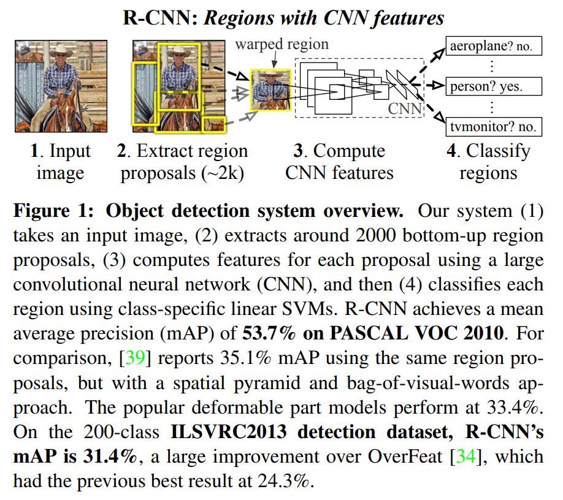

# 论文信息
- 时间：2014
- 期刊：CVPR
- 网络/算法名称：RCNN
- 意义：R-CNN是首个将 CNN 引入目标检测领域的算法模型，是two stage模型
- 作者：Ross Girshick, Jeff Donahue, Trevor Darrell, Jitendra Malik; UC Berkeley
- 实验环境：
- 数据集：PASCAL VOC
- [返回上一层 README](../README.md)

# 一些知识
1. “CNN 在 1990 年代被⼤量使⽤，但随后随着⽀持向量机的兴起⽽过时了”：说明CNN比SVM早
2. 图像分类和目标检测的区别：图像分类仅需要分类，目标检测不仅需要分类，还需要在图像中定位（可能很多）对象

# 一、解决的问题
1. 将 region proposals 与 CNN 相结合，称为 R-CNN：Regions with CNN features：提出了⼀种简单且可扩展的检测算法。结合了两个关键⻅解：
    1. 可以将⼤容量卷积神经⽹络 (CNN) 应⽤于⾃下⽽上的区域提案，以便定位和分割对象；
    1. 当标记的训练数据稀缺时，有监督的预训练对辅助任务进⾏训练，然后进⾏特定领域的微调，可以显着提⾼性能。

2. ImageNet 上的 CNN 分类结果在多⼤程度上泛化到 PASCAL VOC 挑战赛上的⽬标检测结果？通过弥合图像分类和⽬标检测之间的差距来回答这个问题。与基于更简单的类 HOG 特征的系统相⽐，CNN 可以在 PASCAL VOC 上显着提⾼⽬标检测性能。

# 二、做出的创新
1. R-CNN⽹络中较⾼的单元具有五个卷积层，在输⼊图像中具有⾮常⼤的感受野（195 × 195 像素）和步⻓（32 × 32 像素），这使得滑动窗⼝范式内的精确定位成为可能。 ***为什么感受野大，更容易精确定位呢*** 

1. 使⽤深度⽹络定位对象和训练仅使⽤少量注释检测数据的⾼容量模型。
    1. 第一个贡献：通过在“使⽤区域识别”范例内操作来解决 CNN 定位问题，这在对象检测和语义分割⽅⾯都取得了成功。在测试时， **R-CNN为输⼊图像⽣成⼤约 2000 个与类别⽆关的区域建议** ，使⽤ CNN 从每个建议中提取 **固定⻓度的特征向量** ，然后使⽤类别特定的线性 SVM 对每个区域进⾏分类。我们使⽤⼀种简单的技术（仿射图像变形）从每个区域提案中计算⼀个固定⼤⼩的 CNN 输⼊，⽽不考虑区域的形状。图1概述了该⽅法并突出显⽰了⼀些结果。由于我们的系统将区域提议与 CNN 相结合，我们将⽅法称为 R-CNN：具有 CNN 特征的区域。

        

    1. 传统解决⽅案是使⽤⽆监督预训练，然后进⾏监督微调。而R-CNN表明在⼤型辅助数据集 (ILSVRC) 上进⾏监督预训练，然后在⼩型数据集 (PASCAL) 上进⾏域特定微调，是学习⾼容量 CNN 的有效范例数据稀缺。

# 三、设计的模型
1. 由3个模块组成
    1. 第⼀个⽣成与类别⽆关的区域提案，这些提议定义了我们的检测器可⽤的候选检测集
    1. 第⼆个模块是⼀个⼤型卷积神经⽹络，它从每个区域中提取⼀个固定⻓度的特征向量
    1. 第三个模块是⼀组特定于类别的线性 SVM

1. 模块设计
    1. 区域提案。最近的各种论⽂提供了⽣成类别⽆关区域建议的⽅法。

    1. 特征提取。我们使⽤Krizhevsky 等⼈描述的 CNN 的Caffe实现从每个区域提议中提取⼀个 4096 维特征向量。通过五个卷积层和两个全连接层前向传播⼀个减去均值的 227×227 RGB 图像来计算特征。具体网络结构实现：[caffe](http://caffe.berkeleyvision.org/)，[AlexNet](https://dl.acm.org/doi/pdf/10.1145/3065386)

    1. 为了计算区域提案的特征，我们必须⾸先将该区域中的图像数据转换为与 CNN 兼容的形式（其架构需要固定 227 × 227 像素⼤⼩的输⼊）。在我们的任意形状区域的许多可能变换中，我们选择最简单的。⽆论候选区域的⼤⼩或纵横⽐如何，我们都会将其周围的紧密边界框中的所有像素扭曲到所需的⼤⼩。在变形之前，我们扩张紧密边界框，以便在变形⼤⼩下，原始框周围有恰好 p 个像素的变形图像上下⽂（我们使⽤ p = 16）。图2显⽰了扭曲训练区域的随机抽样。[附录A](#附录a)中讨论了翘曲的替代⽅法。
        

1. 测试时间检测
    1. 在测试时，我们对测试图像运⾏选择性搜索以提取⼤约 2000 个区域建议（我们在所有实验中使⽤选择性搜索的“快速模式”）。我们扭曲每个提议并通过 CNN 前向传播它以计算特征。然后，对于每个类别，我们使⽤为该类别训练的 SVM 对每个提取的特征向量进⾏评分。给定图像中的所有得分区域，我们应⽤贪婪的 **⾮最⼤抑制** （对于每个类别独⽴），如果该区域具有交叉并集（IoU）与⼤于学习阈值的更⾼得分的所选区域重叠，则拒绝该区域。

    2. 运⾏时分析。两个属性使检测变得⾼效。
        1. 所有 CNN 参数在所有类别中共享
        2. CNN计算的特征向量与其他常⻅⽅法（例如具有视觉词袋编码的空间⾦字塔）相⽐，它们是低维的。例如， UVA 检测系统中使⽤的特征⽐我们的特征⼤两个数量级（360k 与 4k 维）
            - 这种共享的结果是计算区域建议和特征所花费的时间（在 GPU 上 13 秒/图像或在 CPU 上 53 秒/图像）被分摊到所有类别。唯⼀特定于类的计算是特征与 SVM 权重和⾮最⼤抑制之间的点积。
            - 实际上，⼀个图像的所有点积都被批处理成⼀个矩阵-矩阵积。特征矩阵通常为 2000×4096，SVM 权重矩阵为 4096×N，其中 N 是类数。
            - 该分析表明，R-CNN 可以扩展到数千个对象类，⽽⽆需求助于近似技术，例如散列。即使有 100k 个类，在现代多核 CPU 上⽣成的矩阵乘法也只需要 10 秒。这种效率不仅仅是使⽤区域建议和共享特征的结果。 UVA 系统由于其⾼维特征，会慢两个数量级，同时需要 134GB 内存来存储 100k 线性预测变量，⽽我们的低维特征仅需要 1.5GB。

1. 训练
    1. 有监督的预训练。
        - 我们仅使⽤图像级注释（边界框标签不适⽤于此数据）在⼤型辅助数据集（ILSVRC2012 分类）上有区别地预训练 CNN。使⽤开源 [Caffe CNN](http://caffe.berkeleyvision.org/) 库进⾏预训练。简⽽⾔之，我们的 CNN ⼏乎与 Krizhevsky 等⼈的表现相当。[AlexNet](https://dl.acm.org/doi/pdf/10.1145/3065386)在 ILSVRC2012 分类验证集上获得 top-1 错误率⾼出 2.2 个百分点。这种差异是由于培训过程的简化。

    2. 特定领域的微调。为了使我们的 CNN 适应新任务（检测）和新领域（变形建议窗⼝），我们继续仅使⽤变形区域建议对 CNN 参数进⾏随机梯度下降 (SGD) 训练。除了将 CNN 的 ImageNet 特定 1000 路分类层替换为随机初始化的 (N + 1) 路分类层（其中 N 是对象类的数量，加 1 表⽰背景），CNN 架构没有改变。对于 VOC，N = 20，对于 ILSVRC2013，N = 200。我们⽤ ≥ 0.5 IoU 与真实框重叠作为该框类的正例，其余为负例。我们以 0.001 的学习率（初始预训练率的 1/10）开始 SGD，这允许在不破坏初始化的情况下进⾏微调以取得进展。在每次 SGD 迭代中，我们统⼀采样 32 个正窗⼝（在所有类别中）和 96 个背景窗⼝以构建⼤⼩为 128 的⼩批量。我们将采样偏向正窗⼝，因为它们与背景相⽐极为罕⻅。

    3. 对象类别分类器。考虑训练⼆元分类器来检测汽⻋。很明显，紧紧包围汽⻋的图像区域应该是⼀个积极的例⼦。同样，很明显，与汽⻋⽆关的背景区域应该是⼀个反例。不太清楚的是如何标记与汽⻋部分重叠的区域。我们通过 IoU 重叠阈值解决了这个问题，低于该阈值的区域被定义为负数。重叠阈值 0.3 是通过对 {0, 0.1, . . . , 0.5} 在验证集上。我们发现充分选择此阈值护理很重要。将其设置为 0.5，如[Selective Search for Object Recognition](http://www.huppelen.nl/publications/selectiveSearchDraft.pdf)中所述，将 mAP 降低了 5 个点。同样，将其设置为 0 会使 mAP 降低 4 个点。正⾯⽰例被简单地定义为每个类的真实边界框。

    4. ⼀旦提取了特征并应⽤了训练标签，我们就为每个类优化⼀个线性 SVM。由于训练数据太⼤⽽⽆法放⼊内存，我们采⽤标准的 hard negative 挖掘⽅法[Example-Based Learning for View-Based Human Face Detection](https://www.cse.unr.edu/~bebis/MathMethods/BayesianInference/sung_poggio.pdf), [Object Detection with Discriminatively Trained Part-Based Models](https://ieeexplore.ieee.org/stamp/stamp.jsp?tp=&arnumber=5255236)。 Hard negative mining 收敛很快，在实践中 mAP 在对所有图像进⾏⼀次遍历后停⽌增加。

    5. 在[附录B](#附录b)中，我们讨论了为什么正例和负例在微调和 SVM 训练中的定义不同。我们还讨论了训练检测 SVM 所涉及的权衡，⽽不是简单地使⽤微调 CNN 的最终 softmax 层的输出。

# 四、实验结果
1. R-CNN BB[Bounding-box regression (BB)]在PASCAL VOC 2010-12数据集和ILSVRC2013数据集上与DPM v5、UVA、Regionlets、SegDPM相比，都是占绝对优势的

## 1、比之前模型的优势

## 2、有优势的原因

## 3、改进空间

# 五、结论

## 1、模型是否解决了目标问题

## 2、模型是否遗留了问题

## 3、模型是否引入了新的问题

# 六、代码

# 附录A
- 这项⼯作中使⽤的卷积神经⽹络需要 227 × 227 像素的固定⼤⼩输⼊。为了检测，我们考虑了任意图像矩形的⽬标建议。我们评估了两种将对象建议转换为有效 CNN 输⼊的⽅法。

- 第⼀种⽅法（“带上下⽂的最紧密正⽅形”）关闭最紧密正⽅形内的每个对象提议，并且将该正⽅形中包含的图像（各向同性）缩放到 CNN 输⼊⼤⼩。图7列 (B) 显⽰了此转换。此⽅法的⼀个变体（“⽆上下⽂的最紧密正⽅形”）排除了原始对象建议周围的图像内容。图7列 (C) 显⽰了此转换。第⼆种⽅法（“warp”）各向异性地将每个对象提议缩放到 CNN 的放置⼤⼩。图7列 (D) 显⽰了扭曲变换。

    

- 对于这些转换中的每⼀个，我们还考虑在原始对象提议周围包含额外的图像上下⽂。上下⽂填充量 (p) 定义为变换后的输⼊坐标系中原始对象建议周围的边界⼤⼩。图7在每个⽰例的顶⾏显⽰ p = 0 像素，在底⾏显⽰ p = 16 像素。在所有⽅法中，如果源矩形 ex 超出图像，则丢失的数据将替换为图像均值（然后在将图像输⼊ CNN 之前减去）。⼀组试点实验表明，使⽤上下⽂填充（p = 16 像素）的变形在很⼤程度上优于替代⽅案（3-5 个 mAP 点）。

- 显然有更多的选择是可能的，包括使⽤复制⽽不是均值填充。对这些备选⽅案的详尽评估留作未来的⼯作。

# 附录B
- 两个设计选择值得进⼀步讨论。
    1. 第⼀个是：为什么在微调 CNN 和训练对象检测 SVM 时定义了不同的正例和负例？简要回顾⼀下定义，为了微调，我们将每个对象提议映射到具有最⼤ IoU 重叠（如果有）的真实情况，如果 IoU 为⾄少 0.5。所有其他提案都被标记为“背景”（即所有类别的反例）。相反，对于训练 SVM，我们仅将真实框作为其各⾃类别的正样本，并将与⼀个类别的所有实例重叠⼩于 0.3 IoU 的标签建议作为该类别的负样本。落⼊灰⾊区域的建议（超过 0.3 IoU 重叠，但不是基本事实）将被忽略。

        - 从历史上看，我们之所以得出这些定义，是因为我们⾸先在 ImageNet 预训练 CNN 计算的特征上训练 SVM，因此当时不考虑微调。在该设置中，我们发现我们⽤于训练 SVM 的特定标签定义在我们评估的选项集中是最佳的（其中包括我们现在⽤于微调的设置）。当我们开始使⽤微调时，我们最初使⽤与 SVM 训练相同的正例和负例定义。然⽽，我们发现结果⽐使⽤我们当前的阳性和阴性定义获得的结果差得多。

        - 我们的假设是，正⾯和负⾯定义⽅式的这种差异从根本上来说并不重要，⽽是由于微调数据有限这⼀事实引起的。

        - 我们⽬前的⽅案引⼊了许多“抖动”的例⼦（那些重叠在 0.5 到 1 之间的建议，但不是基本事实），这将正⾯例⼦的数量扩⼤了⼤约 30 倍。我们推测在微调整个⽹络以避免过度拟合时需要这个⼤集合。然⽽，我们也注意到使⽤这些抖动的例⼦可能不是最优的，因为⽹络没有针对精确定位进⾏微调。

    2. 这就引出了第⼆个问题：为什么在微调之后还要训练 SVM？简单地应⽤微调⽹络的最后⼀层（21 路软最⼤回归分类器）作为对象检测器会更清晰。我们对此进⾏了尝试，发现 VOC 2007 的性能从 54.2% 下降到 50.9% mAP。这种性能下降可能是由多种因素共同引起的，包括微调中使⽤的正例的定义不强调精确定位，以及 softmax 分类器是在随机采样的负例⽽不是“硬负例”的⼦集上训练的⽤于SVM训练。

        - 这一结果表明，在微调后无需训练SVM，就可以获得接近相同水平的性能。我们推测，通过一些额外的微调，剩余的性能差距可能会被弥补。如果是真的，这将简化并加快R-CNN训练，而不会损失检测性能

# 附录C
- 我们使⽤简单的边界框回归阶段来提⾼定位性能。在使⽤类特定检测 SVM 对每个选择性搜索提议进⾏评分后，我们使⽤类特定边界框回归器预测⽤于检测的新边界框。这在本质上类似于可变形零件模型中使⽤的边界框回归。这两种⽅法之间的主要区别在于，这⾥我们从 CNN 计算的特征中回归，⽽不是从推断的 DPM 零件位置上计算的⼏何特征中回归。

- 我们的训练算法的输⼊是⼀组 N 个训练对 $\lbrace (P^ {i}, G^{i}) \rbrace _{i=1,...,N}$ 其中 $P^ {i} = (P^ {i}_ {x},P^ {i}_ {y},P^ {i}_ {w},P^ {i}_ {h})$ 与 $P^ {i}$ ⼀起指定建议 $P^ {i}$ 边界框中⼼的像素坐标的宽度和⾼度（以像素为单位）。此后，除⾮需要，否则我们删除上标 $i$ 。每个真实边界框 $G$ 以相同的⽅式指定： $G = (G_ {x}, G_ {y}, G_ {w}, G_ {h})$ 。我们的⽬标是学习⼀种将提议框 $P$ 映射到真实框 $G$ 的变换。

- 我们根据四个函数 $d_ {x} (P), d_ {y} (P), d_ {w} (P)和d_ {h} (P)$ 对转换进⾏参数化。前两个指定 $P$ 边界框中⼼的尺度不变平移，⽽后两个指定 $P$ 边界框宽度和⾼度的对数空间平移。在学习了这些函数之后，我们可以通过应⽤转换将输⼊提议 $P$ 转换为预测的真实框 $\hat{G}$：
    $$ \begin{align} 
    \hat{G}_ {x} = &P_ {w}d_ {x}(P) + P_ {x} \\
    \hat{G}_ {y} = &P_ {h}d_ {y}(P) + P_ {y} \\
    \hat{G}_ {w} = &P_ {w} exp(d_ {w}(P))    \\
    \hat{G}_ {h} = &P_ {h} exp(d_ {h}(P))
    \end{align}$$

- 每个函数 $d_ {*}(P)$（其中 $*$ 是 $x,y,h,w$ 之⼀）被建模为提案 $P$ 的 $pool_ {5}$ 特征的线性函数，⽤ $\phi _{5}(P)$ 表⽰。（隐式假设了 $\phi _{5}(P)$ 对图像数据的依赖性。）因此我们有 $d_ {*}(P) = \mathbf{w}^ {T}_ {*} \phi _{5}(P)$ ，其中 $\mathbf{w}_ {*}$ 是可学习模型参数的向量。我们通过优化正则化最⼩⼆乘⽬标（岭回归）来学习 $\mathbf{w}_ {*}$ ：
    $$\begin{align}
    \mathbf{w}_ {*} = \underset{\hat{\mathbf{w}}_ {*}}{argmin} \sum^ {N}_ {i}(t^{i}_ {*} - \hat{\mathbf{w}}^{T}_ {*} \phi _{5}(P^{i}))^{2} + \lambda||\hat{\mathbf{w}}_ {*}||^{2}
    \end{align}$$

- 训练对 $(P, G)$ 的回归⽬标 $t_ {*}$ 定义为
    $$ \begin{align} 
    t_ {x} = &(G_ {x} - P_ {x}) / P_ {w} \\
    t_ {y} = &(G_ {y} - P_ {y}) / P_ {h} \\
    t_ {w} = &log(G_ {w} / P_ {w})    \\
    t_ {h} = &log(G_ {h} / P_ {h})
    \end{align}$$
    作为⼀个标准的正则化最⼩⼆乘问题，这可以⽤封闭形式有效地解决。

- 我们在实施边界框回归时发现了两个微妙的问题。⾸先是正则化很重要：我们根据验证集设置 λ = 1000。

- 第⼆个问题是在选择要使⽤的训练对 $(P, G)$ 时必须⼩⼼。直观上，如果 $P$ 远离所有真实框，那么将 $P$ 转换为真实框 $G$ 的任务就没有意义。使⽤像 $P$ 这样的例⼦会导致⽆望的学习问题。

- 因此，我们仅从⾄少在⼀个真实框附近的提案 $P$ 中学习。我们通过将 $P$ 分配给具有最⼤ IoU 重叠（如果它重叠超过⼀个）的真实框 $G$ 来实现“接近度”，当且仅当重叠⼤于阈值（我们将其设置为 0.6 使⽤验证集）。所有未分配的提案都将被丢弃。我们为每个对象类执⾏⼀次此操作，以便学习⼀组特定于类的边界框回归器。

- 在测试时，我们对每个提议进⾏评分并仅预测其新的检测窗⼝⼀次。原则上，我们可以迭代这个过程（即，对新预测的边界框重新打分，然后从中预测⼀个新的边界框，等等）。然⽽，我们发现迭代并不能改善结果。

# 附录D
- 图12显⽰了 20 个 $pool_ {5}$ 单元的额外可视化。对于每个单元，我们展⽰了在所有 VOC 2007 测试中从全套⼤约 1000 万个区域中最⼤限度地激活该单元的 24 个区域建议。
    

- 我们通过其在 $6×6×256$ 维 $pool_ {5}$ 特征图中的 $(y, x, channel)$ 位置来标记每个单元。在每个通道内，CNN 计算与输⼊区域完全相同的函数，$(y, x)$ 位置仅改变感受野。

# 附录E
- 在表7中，我们显⽰了除了[O2P⽅法](https://link.springer.com/content/pdf/10.1007/978-3-642-33786-4_32.pdf?pdf=inline%20link)之外，我们的六种分割⽅法中的每⼀种在 VOC 2011 val 上的每类分割精度。这些结果显⽰了在 20 个 PASCAL 类中的每⼀个以及背景类中哪种⽅法最强。
    

# 附录F
- 在辅助数据集上训练时的⼀个问题是它与测试集之间可能存在冗余。尽管对象检测和整幅图像分类的任务⼤不相同，使得这种交叉集冗余变得不那么令⼈担忧，但我们仍然进⾏了彻底的调查，以量化 ILSVRC 2012 中包含 PAS CAL 测试图像的程度训练和验证集。我们的发现可能对有兴趣使⽤ ILSVRC 2012 作为 PASCAL 图像分类任务的训练数据的研究⼈员有⽤。

- 我们对重复（和接近重复）的图像进⾏了两次检查。第⼀个测试基于 flickr 图像 ID 的精确匹配，这些 ID 包含在 VOC 2007 测试注释中（这些 ID 有意为后续的 PASCAL 测试集保密）。所有 PASCAL 图像和⼤约⼀半的 ILSVRC 都是从 flickr.com 收集的。该检查在 4952 个匹配项中找到了 31 个匹配项 (0.63%)。

- 第⼆个检查使⽤ [GIST](http://people.eecs.berkeley.edu/~efros/courses/AP06/Papers/oliva-ijcv-01.pdf) 描述符匹配，在[Evaluation of GIST descriptors for web-scale image search](https://hal.inria.fr/file/index/docid/394212/filename/paper.pdf)中显⽰它在⼤型（> 100 万）图像集合中的近似重复图像检测中具有出⾊的性能。在[Evaluation of GIST descriptors for web-scale image search](https://hal.inria.fr/file/index/docid/394212/filename/paper.pdf)之后，我们计算了所有 ILSVRC 2012 trainval 和 PASCAL 2007 测试图像的扭曲 32 × 32 像素版本的 GIST 描述符。

- GIST 描述符的欧⽒距离最近邻匹配揭⽰了 38 个近似重复的图像（包括通过 flickr ID 匹配找到的所有 31 个）。匹配往往在 JPEG 压缩级别和分辨率上略有不同，并且在较⼩程度上裁剪。这些发现表明重叠很⼩，不到 1%。对于VOC 2012，由于flickr ID 不可⽤，我们只使⽤了GIST 匹配⽅法。

- 基于 GIST 匹配，1.5% 的 VOC 2012 测试图像在 ILSVRC 2012 trainval 中。 VOC 2012 的⽐率略⾼可能是因为这两个数据集的收集时间⽐ VOC 2007 和 ILSVRC 2012 更近。

# 附录G
- 本⽂档跟踪了 R-CNN 的进展。为了帮助读者了解它是如何随着时间发⽣变化的，这⾥有⼀个简短的更新⽇志来描述这些修订。

- v1初始版本。

- v2 CVPR 2014 相机就绪修订版。包括通过 (1) 从更⾼的学习率（0.001 ⽽不是 0.0001）开始微调，(2) 在准备 CNN 输⼊时使⽤上下⽂填充，以及 (3) 边界框回归到修复本地化错误。

- v3 ILSVRC2013 检测数据集的结果以及与 OverFeat 的⽐较被整合到⼏个部分（主要是第2节和第4节）。

- v4附录B中的 softmax 与 SVM 结果包含⼀个错误，该错误已得到修复。我们感谢 Sergio Guadar rama 帮助确定这个问题。

- v5添加了使⽤来⾃ Simonyan 和 Zisserman [VGG](https://arxiv.org/pdf/1409.1556.pdf)的新 16 层⽹络架构的结果到第3.3节和表3。

# 读者角度（挖掘文章中没有提到的）：
1. 总结文章发现问题的思路
2. 总结文章改进的思想
3. 总结文章还存在或者可以改进的问题
4. 提出对模型参数和细节的一些思考和讨论