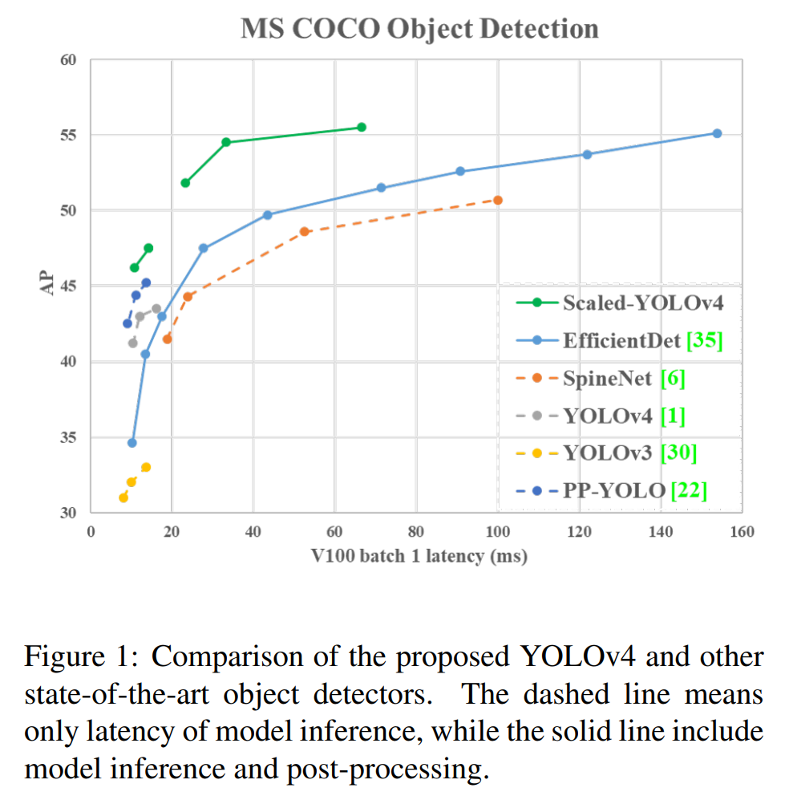
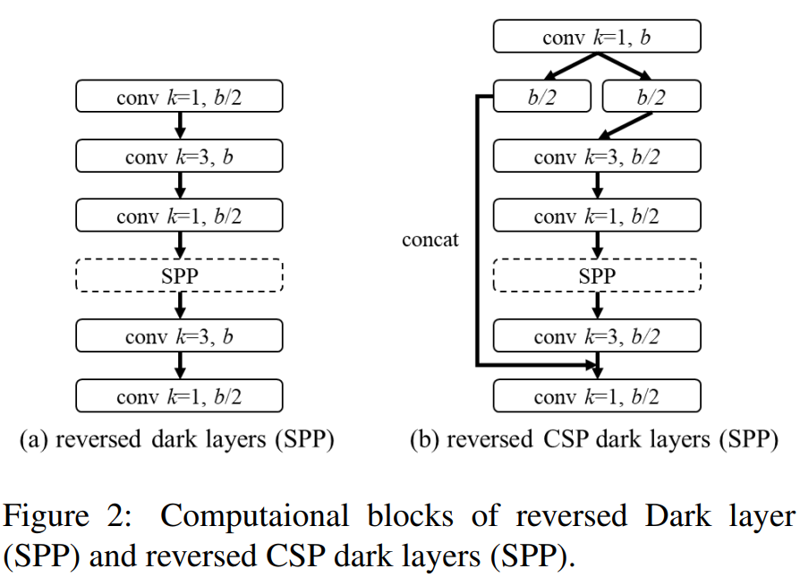
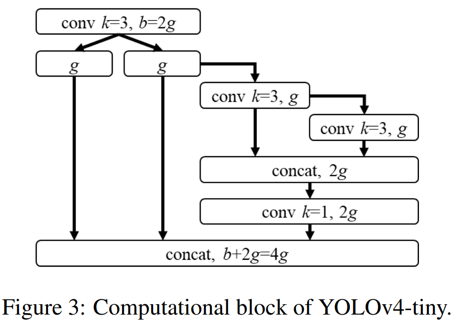
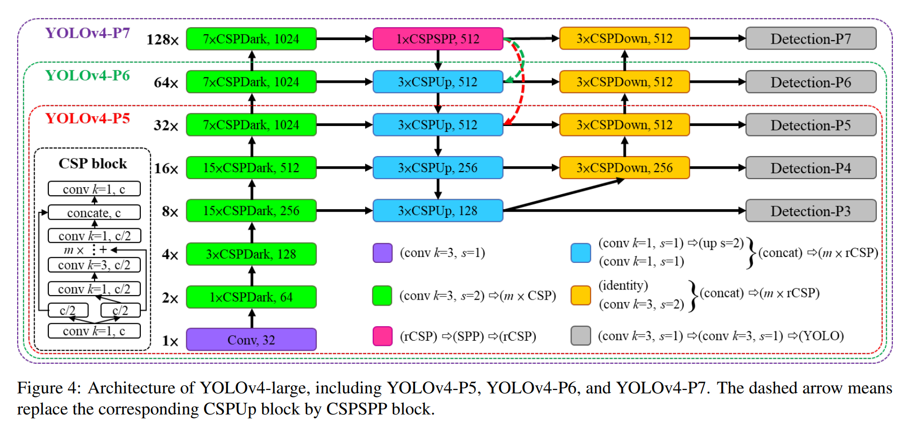

# 论文信息
- 时间：2021
- 期刊：CVPR
- 网络/算法名称：
- 意义：Scaled-YOLOv4
- 作者：Chien-Yao Wang, Alexey Bochkovskiy, Hong-Yuan Mark Liao
- 实验环境：
- 数据集：
- [返回上一层 README](../README.md)
# 一、解决的问题
1. 摘要
    - 我们展⽰了基于 CSP ⽅法的 YOLOv4 对象检测神经⽹络⼯作，可以向上和向下扩展，适⽤于⼩型和⼤型⽹络，同时保持最佳速度和准确性。我们提出了⼀种⽹络缩放⽅法，它不仅可以修改深度、宽度、分辨率，还可以修改⽹络的结构。 YOLOv4-large 模型获得了最先进的结果： MS COCO 数据集在 Tesla V100 上以 ~16 FPS 的速度获得了55.5% AP（73.4% $AP_ {50}$ ） ，同时随着测试时间的增加，YOLOv4-large 实现了56.0% AP (73.3 $AP_ {50}$ )。据我们所知，这是⽬前所有已发表作品中 COCO 数据集的最⾼准确度。YOLOv4-tiny 模型在 RTX 2080Ti 上以约 443 FPS 的速度达到 22.0% AP（42.0% $AP_ {50}$ ） ，⽽通过使⽤ TensorRT、batch size = 4 和 FP16-precision，YOLOv4-tiny 达到 1774 FPS。

2. Introduction 问题
    - 基于深度学习的⽬标检测技术在我们的⽇常⽣活中有很多应⽤。例如，医学图像分析、⾃动驾驶汽⻋、业务分析和⼈脸识别都依赖于对象检测。上述应⽤所需的计算设施可能是云计算设施、通⽤GPU、物联⽹集群或单个嵌⼊式设备。为了设计有效的⽬标检测器，模型缩放技术⾮常重要，因为它可以使⽬标检测器在各种类型的设备上实现⾼精度和实时推理。

    - 最常见的模型缩放技术是改变主干的深度（CNN中卷积层的数量）和宽度（卷积层中卷积滤波器的数量），然后训练适合不同设备的CNN。例如，在ResNet[11]系列中，ResNet-152和ResNet-101经常用于云服务器GPU，ResNet-50和ResNet-34经常用于个人计算机GPU，ResNet-18和ResNet-10可以用于低端嵌入式系统。在[2]中，Cai等人试图开发只需训练一次即可应用于各种设备网络架构的技术。他们使用解耦训练、搜索和知识提取等技术对几个子网进行解耦和训练，使整个网络和子网能够处理目标任务。Tan等人[34]提出使用NAS技术进行复合缩放，包括在EfficientNet-B0上处理宽度、深度和分辨率。他们使用这个初始网络来搜索给定计算量的最佳CNN架构，并将其设置为EfficientNet-B1，然后使用线性放大技术来获得诸如EfficientNet-B2到EfficientNet-B7之类的架构。Radosavovic等人[27]总结并添加了来自庞大参数搜索空间AnyNet的约束，然后设计了RegNet。在RegNet中，他们发现CNN的最佳深度约为60。他们还发现，当瓶颈比设置为1，交叉阶段的宽度增加率设置为2.5时，将获得最佳性能。此外，最近有专门为对象检测提出的NAS和模式缩放方法，如SpineNet[6]和EfficientDet[35]。

3. 结论
    - 我们展⽰了基于 CSP ⽅法的 YOLOv4 对象检测神经⽹络⼯作，可以向上和向下扩展，适⽤于⼩型和⼤型⽹络。因此，我们通过使⽤ TensorRT-FP16 在 RTX 2080Ti 上针对 YOLOv4-large 模型在 test-dev COCO 数据集上实现了最⾼准确度 56.0% AP，在 RTX 2080Ti 上针对⼩型模型 YOLOv4-tiny 实现了极⾼的速度 1774 FPS，并为其他模型实现了最佳速度和准确度YOLOv4 模型。

# 二、做出的创新
1. Introduction 创新
    - 通过分析最先进的⽬标检测器[ 1、3、6、26、35、40、44 ] ，我们发现作为 YOLOv4 [1] ⻣⼲的 CSPDarknet53⼏乎匹配所有最佳架构特征通过⽹络架构搜索技术获得。 CSPDarknet53的深度、瓶颈⽐、阶段间宽度增⻓⽐分别为65、1、2。因此，我们开发了基于 YOLOv4 的模型缩放技术，并提出了 scaled-YOLOv4。如图 1 所⽰，所提出的 scaled-YOLOv4 结果具有出⾊的性能。scaled-YOLOv4 的设计过程如下。⾸先，我们重新设计了YOLOv4并提出了YOLOv4-CSP，然后基于YOLOv4-CSP我们开发了scaled-YOLOv4。在提出的scaled-YOLOv4中，我们讨论了linear scaling up/down模型的上限和下限，分别分析了⼩模型和⼤模型在模型缩放时需要注意的问题。因此，我们能够系统地开发 YOLOv4-large 和 YOLOv4-tiny 模型。 Scaled-YOLOv4 可以在速度和精度之间取得最佳平衡，能够对 16 FPS、30 FPS 和 60 FPS 电影以及嵌⼊式系统进⾏实时物体检测。
        

    - 我们总结了本⽂的贡献：
        1. 为⼩模型设计了⼀种强⼤的模型缩放⽅法，可以系统地平衡浅层 CNN 的计算成本和内存带宽；

        2. 设计⼀个简单⽽有效的缩放⼤型物体检测器的策略；

        3. 分析所有模型缩放因⼦之间的关系，然后基于最有利的组划分进⾏模型缩放；

        4. 实验证实FPN结构本质上是⼀个once-for-all结构；

        5. 我们利⽤上述⽅法开发了 YOLOv4-tiny 和 YOLO4v4-large。

2. Related work
    1. Real-time object detection
        - ⽬标检测器主要分为⼀级⽬标检测器[28,29,30,21,18,24]和⼆级⽬标检测器[10,9,31] 。只需⼀次 CNN 操作即可获得⼀级⽬标检测器的输出。对于双阶段⽬标检测器，它通常将从第⼀阶段 CNN 获得的⾼分区域提议提供给第⼆阶段 CNN 进⾏最终预测。⼀级⽬标检测器和两级⽬标检测器的推理时间可以表⽰为 $T_ {one} = T_ {1^{st}}$ 和 $T_ {two} = T_ {1^{st}} + mT_ {2^{nd}}$ ，其中 $m$ 是置信度⾼于阈值的区域建议的数量。换句话说，⼀级⽬标检测器所需的推理时间是恒定的，⽽⼆级⽬标检测器所需的推理时间是不固定的。所以如果我们需要实时对象检测器，它们⼏乎必然是单级⽬标检测器。当今流⾏的单阶段⽬标检测器主要有两种：anchor-based [30,18] 和 anchor-free [7,13,14,36]。在所有⽆锚⽅法中，CenterNet [46]⾮常受欢迎，因为它不需要复杂的后处理，例如⾮最⼤抑制（NMS）。⽬前，更准确的实时⼀级⽬标检测器是基于锚点的 EfficientDet [35]、 YOLOv4 [1] 和 PP-YOLO [22]。在本⽂中，我们开发了基于 YOLOv4 [1] 的模型缩放⽅法。

    2. Model scaling
        - 传统的模型缩放⽅法是改变模型的深度，即增加更多的卷积层。例如， Simonyan 等⼈设计的VGGNet [32] 。在不同阶段堆叠额外的卷积层，也使⽤这个概念设计了 VGG-11、VGG-13、VGG-16 和 VGG-19 架构。随后的⽅法通常遵循相同的模型缩放⽅法。对于He等⼈提出的ResNet [11] ，depth scaling可以构建⾮常深的⽹络，如ResNet-50、ResNet-101、ResNet-152。后来，Zagoruyko 等⼈。 [43]考虑到⽹络的宽度，他们改变了卷积层的核数来实现缩放。因此，他们设计了 wide ResNet (WRN)，同时保持相同的精度。虽然 WRN 的参数量⽐ ResNet 多，但推理速度要快得多。随后的 DenseNet [12]和 ResNeXt [41]也设计了⼀个将深度和宽度都考虑在内的复合缩放版本。⾄于图像⾦字塔推理，它是⼀种在运⾏时进⾏增强的常⽤⽅法。它采⽤输⼊图像并进⾏各种不同的分辨率缩放，然后将这些不同的 pyra mid 组合输⼊到训练有素的 CNN 中。最后，⽹络将整合多组输出作为其最终结果。雷德蒙等⼈。 [30]使⽤上述概执念⾏来输⼊图像尺⼨缩放。他们使⽤更⾼的输⼊图像分辨率对训练好的 Darknet53 进⾏微调，执⾏这⼀步的⽬的是为了获得更⾼的精度。

        - 近年来，网络架构搜索（NAS）相关研究得到了蓬勃发展，NAS-FPN[8]一直在寻找特征金字塔的组合路径。我们可以将NAS-FPN视为一种主要在阶段级别执行的模型缩放技术。至于EfficientNet[34]，它使用基于深度、宽度和输入大小的复合缩放搜索。EfficientDet[35]的主要设计理念是分解具有不同目标检测器功能的模块，然后对图像大小、宽度、 #BiFPN 层和 #box/class 层进行缩放。另一个使用NAS概念的设计是SpineNet[6]，它主要针对用于网络架构搜索的鱼形对象检测器的整体架构。这种设计理念最终可以产生一种规模排列的结构。另一个采用NAS设计的网络是RegNet[27]，它主要固定阶段的数量和输入分辨率，并将每个阶段的深度、宽度、瓶颈比和组宽度等所有参数集成到深度、初始宽度、斜率、量化、瓶颈比、组宽度中。最后，他们使用这六个参数来执行复合模型缩放搜索。上述方法都是很好的工作，但很少分析不同参数之间的关系。在本文中，我们将根据目标检测的设计要求，尝试找到一种协同复合缩放的方法。

3. Principles of model scaling
    - 在对所提出的⽬标检测器进⾏模型缩放后，下⼀步是处理将发⽣变化的定量因素，包括具有定性因素的参数数量。这些因素包括模型推理时间、平均精度等。定性因素会根据所使⽤的设备或数据库的不同⽽产⽣不同的增益效果。我们将在3.1 中针对定量因素进⾏分析和设计。⾄于3.2和3.3，我们将分别设计与在低端设备和⾼端 GPU 上运⾏的微⼩物体检测器相关的定性因素。

    1. General principle of model scaling
        - 在设计⾼效的模型缩放⽅法时，我们的主要原则是当缩放时，我们想要增加/减少的量化成本越低/越⾼越好。在本节中，我们将展⽰和分析各种通⽤ CNN 模型，并尝试了解它们在⾯对 (1) 图像⼤⼩、(2) 层数和 (3) 通道数变化时的量化成本。我们选择的 CNN 是 ResNet、ResNext 和 Darknet。

        - 对于具有b个基本层信道的 $k$ 层CNN，ResNet层的计算为 $k*[conv(1 \times 1, b/4) \to conv(3 \times 3, b/4) \to conv(1 \times 1, b)]$ ，并且ResNext层的是 $k*[conv(1 \times 1, b/2) \to gconv(3 \times 3/32, b/2) \to conv(1 \times 1, b)]$ 。对于暗网层，计算量为 $k * [conv(1 \times 1, b/2) \to conv(3 \times 3, b)]$ 。设可用于调整图像大小、层数和通道数的比例因子分别为 $\alpha, \beta 和 \gamma$ 。当这些比例因子发生变化时，FLOP的相应变化汇总在表1中。
            

        - 从表1可以看出，缩放尺⼨、深度、和宽度导致计算成本增加。分别表⽰平⽅、线性、平⽅递增。

        - Wang 等⼈提出的CSPNet [37] 。可以应⽤于各种CNN架构，同时减少参数量和计算量。此外，它还提⾼了准确性并减少了推理时间。我们将其应⽤于 ResNet、ResNeXt 和 Darknet，观察计算量的变化，如表2 所⽰。
            

        - 从表2所⽰的数据中，我们观察到将上述CNNs转换为CSPNet后，新架构可以有效地将ResNet、ResNeXt和Darknet的计算量（FLOPs）降低23.5%、46.7%和50.0%，分别。因此，我们使⽤ CSP 化模型作为执⾏模型缩放的最佳模型。

    2. Scaling Tiny Models for Low-End Devices
        - 对于低端设备，设计模型的推理速度不仅受到计算量和模型大小的影响，更重要的是，必须考虑外围硬件资源的限制。因此，在执行微小模型缩放时，我们还必须考虑内存带宽、内存访问成本（MAC）和DRAM流量等因素。为了考虑上述因素，我们的设计必须符合以下原则：

        1. Make the order of computations less than $O(whkb^{2})$
            - 轻量级模型不同于⼤型模型，其参数利⽤效率必须更⾼或更⾼der通过少量的计算达到要求的精度。在进⾏模型缩放时，我们希望计算的阶数能够越低越好。在表3中，我们分析了具有有效参数利⽤的⽹络，例如 DenseNet 和 OS ANet [15] 的计算负载，其中 $g$ 表⽰增⻓率。
                

            - 对于⼀般的 CNN，表3中列出的 $g, b 和 k$ 之间的关系是 $k << g < b$ 。因此，DenseNet的计算复杂度为 $O(whgbk)$，OSANet为 $O(max(whbg, whkg^{2}))$ 。上述两者的计算复杂度的阶数小于ResNet系列的 $O(whkb^{2})$ 。因此，我们在OSANet的帮助下设计了我们的微小模型，它具有较小的计算复杂度。

        2. Minimize/balance size of feature map
            - 为了在计算速度方面获得最佳折衷，我们提出了一个新的概念，即在CSOSANet的计算块之间进行梯度截断。如果我们将原始的CSPNet设计应用于DenseNet或ResNet架构，因为这两个架构的第 $j$ 层输出是第 $1$ 层到第 $(j−1)$ 层输出的集成，所以我们必须将整个计算块视为一个整体。由于OSANet的计算块属于PlainNet架构，因此从计算块的任何层制作CSPNet都可以达到梯度截断的效果。我们使用这一特性重新规划底层的b通道和计算块生成的 $kg$ 通道，并将它们拆分为两个通道数相等的路径，如表4所示。
                

            - 当通道的数量为 $b + kg$ 时，如果要将这些通道划分为两条路径，最好的划分是将其划分为两个相等的部分，即 $(b+kg)/2$ 。当我们实际考虑硬件的带宽 $\tau$ 时，如果不考虑软件优化，最佳值是 $ceil((b+kg)/2 \tau )\times \tau$ 。我们设计的CSOSANet可以动态调整信道分配

        3. Maintain the same number of channels after convolution
            - 为了评估低端设备的计算成本，我们还必须考虑功耗，而影响功耗的最大因素是内存访问成本（MAC）。通常，卷积运算的MAC计算方法如下：
                $$\begin{align}
                MAC = hw(C_ {in} + C_ {out}) + (KC_ {in}C_ {out})
                \end{align}$$
                其中 $h, w, C_ {in}, C_ {out}, K$ 分别代表feature map的⾼度和宽度、输⼊和输出的通道数、卷积滤波器的核⼤⼩。通过计算⼏何不等式，我们可以推导出 $C_ {in} = C_ {out}$ 时的最⼩ MAC [23]。

        4. Minimize Convolutional Input/Output (CIO)
            - CIO [4]是⼀个可以衡量 DRAM IO 状态的指标。表5列出了 OSA、CSP 和我们设计的 CSPOSANet 的 CIO。
                

            - 当 $kg > b/2$ 时，所提出的CSOSANet可以获得最佳的CIO。

    3. Scaling Large Models for High-End GPUs
        - 由于我们希望在放⼤ CNN 模型后提⾼准确性并保持实时推理速度，因此在进⾏复合缩放时，我们必须在对象检测器的众多缩放因⼦中找到最佳组合。通常，我们可以调整对象检测器的输⼊、主⼲和颈部的⽐例因⼦。表 6 总结了可以调整的潜在⽐例因⼦。
            

        - 图像分类与物体检测最⼤的区别在于，前者只需要识别图像中最⼤成分的类别，⽽后者需要预测图像中每个物体的位置和⼤⼩。在单级⽬标检测器中，每个位置对应的特征向量⽤于预测该位置⽬标的类别和⼤⼩。能否更好地预测物体的⼤⼩基本上取决于特征向量的感受野。在CNN架构中，与感受野最直接相关的就是stage，⽽特征⾦字塔⽹络（FPN）架构告诉我们stage越⾼越适合预测⼤物体。在表7 中，我们说明了感受野与⼏个参数之间的关系。
            

        - 从表7中可以明显看出，宽度缩放可以独立操作。当输入图像大小增加时，如果想要对大型对象具有更好的预测效果，他/她必须增加网络的深度或级数。在表7中列出的参数中， $\{size^{input}, \#stage\}$ 的化合物具有最佳的影响。因此，在进行放大时，我们首先对 $size^{input}, \#stage$ 进行复合缩放，然后根据实时性要求，进一步分别对深度和宽度进行缩放

# 三、设计的模型
## Scaled-YOLOv4
- 在本节中，我们将重点放在为通⽤ GPU、低端 GPU 和⾼端 GPU 设计缩放 YOLOv4。

1. CSP-ized YOLOv4
    - YOLOv4 专为通⽤ GPU 上的实时⽬标检测⽽设计。在本⼩节中，我们将 YOLOv4 重新设计为 YOLOv4-CSP 以获得最佳速度/准确性权衡。

    1. Backbone
        - 在 CSPDarknet53 的设计中，跨阶段过程的下采样卷积计算不包含在残差块中。因此，我们可以推导出每个 CSPDarknet 阶段的计算量为 $whb^{2} (9/4 + 3/4 + 5k/2)$ 。从上⾯推导的公式，我们知道只有当 $k > 1$ 时，CSPDarknet 阶段才会⽐ Darknet 阶段有更好的计算优势。 CSPDarknet53 中每⼀阶段拥有的残差层数分别为 $1-2-8-8-4$ 。为了获得更好的速度/准确性权衡，我们将第⼀个 CSP 阶段转换为原始 Darknet 残差层。

    2. Neck
        - 为了有效减少计算量，我们在 YOLOv4 中对 PAN [20]架构进⾏ CSP 化。PAN 架构的计算列表如图 2(a) 所⽰。它主要是对来⾃不同特征⾦字塔的特征进⾏整合，然后通过两组没有shortcut connections的反向Darknet残差层。 CSP 化后，新计算列表的架构如图2（b）所⽰。这个新的更新有效地减少了 40% 的计算量。
            

    3. SPP
        - SPP模块最初插入颈部第一个计算列表组的中间位置。因此，我们还将SPP模块插入到CSPPAN的第一个计算列表组的中间位置。

2. YOLOv4-tiny
    - YOLOv4-tiny 专为低端 GPU 设备设计，设计将遵循3.2 节中提到的原则。

    - 我们将使⽤具有 PCB 架构的 CSPOSANet 来构成 YOLOv4 的主⼲。我们设置 $g = b/2$ 作为增⻓率，让它最终增⻓到 $b/2 + kg = 2b$ 。通过计算，我们推导出 $k = 3$ ，其架构如图3所⽰。⾄于每个阶段的通道数和neck部分，我们遵循YOLOv3-tiny的设计。
        

3. YOLOv4-large
    - YOLOv4大型是为云GPU设计的，主要目的是实现高精度的物体检测。我们设计了一个完全CSP尺寸的型号YOLOv4-P5，并将其扩展到YOLOv4P6和YOLOv4P7。

    - 图4显示了YOLOv4-P5、YOLOv4P6和YOLOv4P7的结构。我们设计用于对 $size^{input},\#stage$ 执行复合缩放。我们将每个阶段的深度刻度设置为 $2^{d_ {s_ {i}}}$ ，并将ds设置为[1，3，15，15，7，7，7]。最后，我们进一步使用推理时间作为约束来执行额外的宽度缩放。我们的实验表明，当宽度缩放因子等于1时，YOLOv4-P6可以在30FPS视频下达到实时性能。对于YOLOv4-P7，当宽度缩放因子等于1.25时，它可以在16 FPS视频下达到实时性能。
        

# 四、实验结果

1. Ablation study on YOLOv4-tiny
    - 证实了线性缩⼩确实有其局限性。很明显，在有限的操作条件下，tinyCD53s 的剩余添加成为推理速度的瓶颈，因为它的帧速率远低于具有相同计算量的 COSA 架构。同时，我们也看到提议的 COSA 可以获得更⾼的 AP。因此，我们最终选择了在我们的实验中获得最佳速度/准确性权衡的 COSA-2x2x 作为 YOLOv4-tiny 架构。

2. Scaled-YOLOv4 for object detection
    - 所有缩放的 YOLOv4 模型，包括 YOLOv4-CSP、YOLOv4-P5、YOLOv4-P6、YOLOv4-P7，在所有指标上都是 Pareto 最优的。当我们将 YOLOv4-CSP 与 EfficientDet D3 的相同精度（47.5% 对 47.5%）进⾏⽐较时，推理速度是其 1.9 倍。
## 1、比之前模型的优势

## 2、有优势的原因

## 3、改进空间

# 五、结论

## 1、模型是否解决了目标问题

## 2、模型是否遗留了问题

## 3、模型是否引入了新的问题

# 六、代码

# 读者角度（挖掘文章中没有提到的）：
1. 总结文章发现问题的思路
2. 总结文章改进的思想
3. 总结文章还存在或者可以改进的问题
4. 提出对模型参数和细节的一些思考和讨论