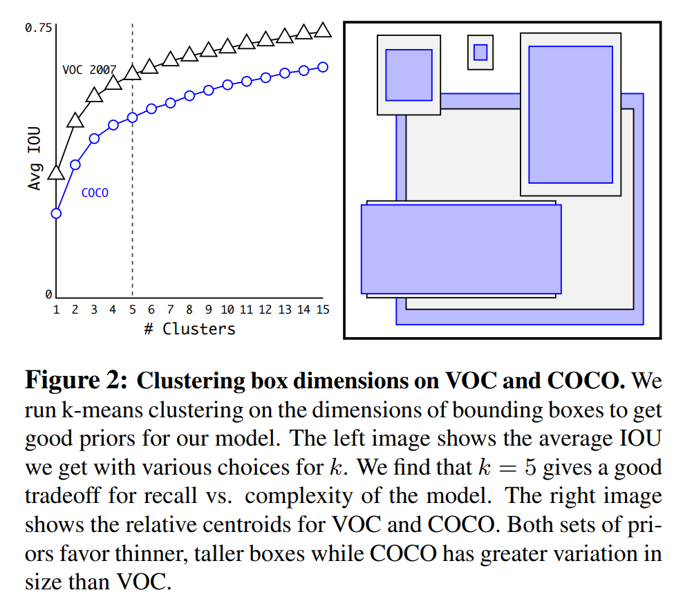
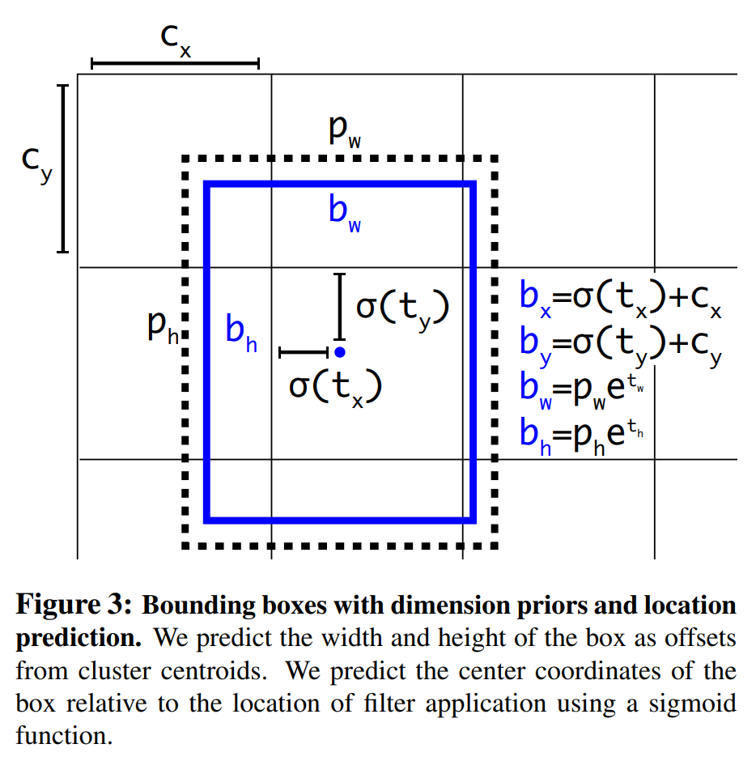
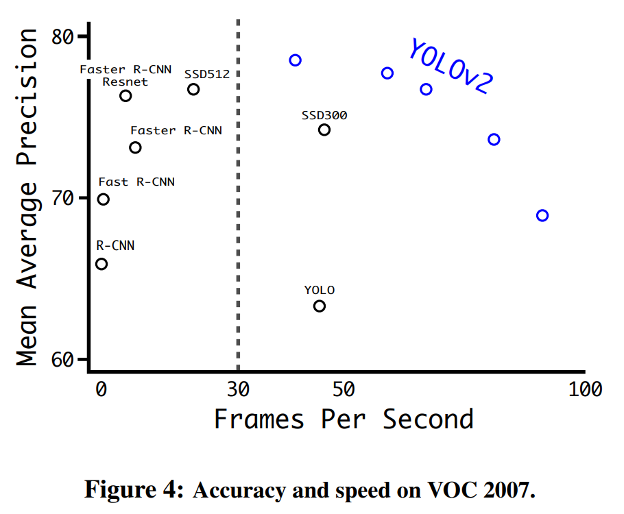
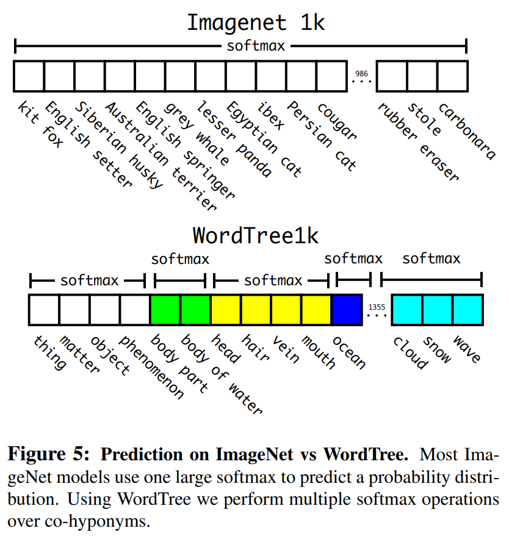
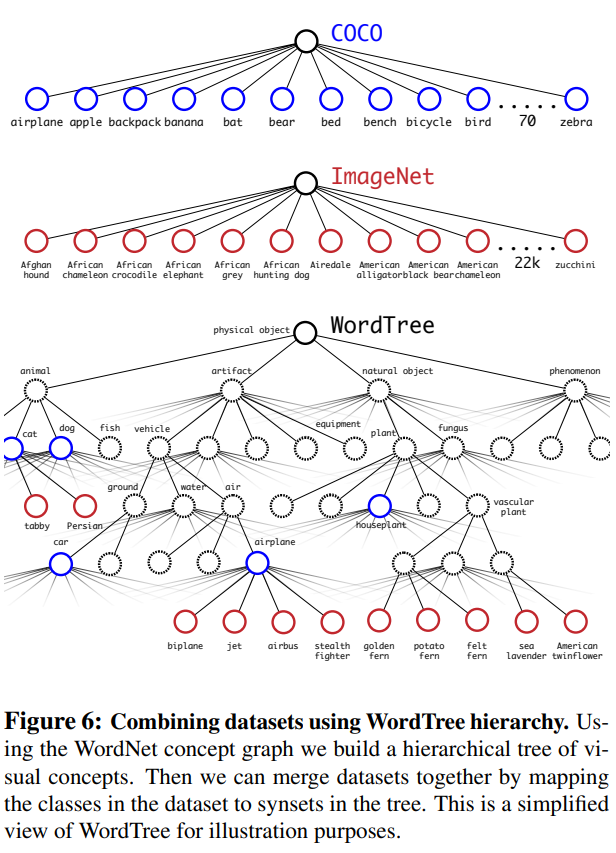
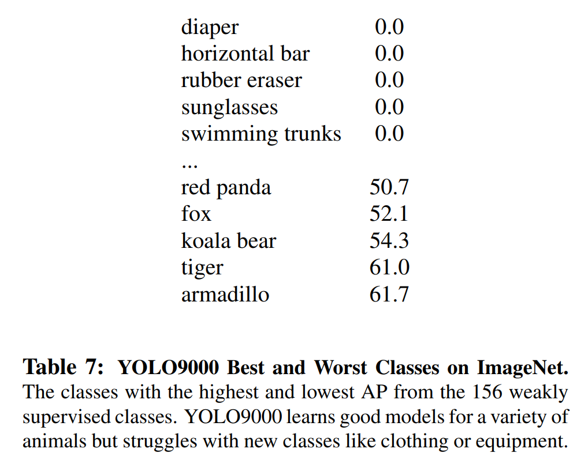

# 论文信息
- 时间：2017
- 期刊：CVPR
- 网络/算法名称：YOLO9000/YOLOv2
- 意义：检测9000个类别
- 作者：Joseph Redmon∗†, Ali Farhadi∗†; University of Washington∗, Allen Institute for AI†
- 实验环境：
- 数据集：
- [返回上一层 README](../README.md)
# 一、解决的问题
1. 摘要
    - 我们介绍了 YOLO9000，这是⼀种最先进的实时对象检测系统，可以检测 9000 多个对象类别。⾸先，我们提出了对 YOLO 检测⽅法的各种改进，既新颖⼜借鉴了先前的⼯作。改进后的模型 YOLOv2 在PASCAL VOC 和 COCO等标准检测任务上是最先进的。使⽤⼀种新颖的多尺度训练⽅法，相同的 YOLOv2 模型可以以不同的尺⼨运⾏，从⽽在速度和准确性之间提供轻松的权衡。在 67 FPS 时，YOLOv2 在 VOC 2007 上获得 76.8 mAP。在 40 FPS 时，YOLOv2 获得 78.6 mAP，优于最先进的⽅法，如 Faster R CNN with ResNet 和 SSD，同时仍然运⾏得更快。最后，我们提出了⼀种联合训练对象检测和分类的⽅法。使⽤这种⽅法，我们同时在 COCO 检测数据集和 ImageNet 分类数据集上训练 YOLO9000。我们的联合训练允许 YOLO9000 预测没有标记检测数据的对象类的检测。我们在 ImageNet 检测任务上验证了我们的⽅法。尽管只有 200 个类别中的 44 个类别的检测数据，YOLO9000 在 ImageNet 检测验证集上获得了 19.7 mAP。在不在 COCO 中的 156 个类中，YOLO9000 得到 16.0 mAP。但是 YOLO 可以检测的不仅仅是 200 个类别；它预测了 9000 多个不同对象类别的检测。⽽且它仍然实时运⾏。

2. Introduction中提到的问题
    - 通⽤对象检测应该快速、准确，并且能够识别各种各样的对象。⾃引⼊神经⽹络以来，检测框架变得越来越快速和准确。然⽽，⼤多数检测⽅法仍然局限于⼀⼩部分对象。

    - 与分类和标记等其他任务的数据集相⽐，当前的对象检测数据集是有限的。最常⻅的检测数据集包含数千到数⼗万张带有数⼗到数百个标签的图像。分类数据集有数百万张图像，有数万或数⼗万个类别

    - 我们希望检测能够扩展到对象分类级别。然⽽，⽤于检测的标记图像⽐⽤于分类或标记的标记要昂贵得多（标签通常是⽤⼾免费提供的）。因此我们不太可能在不久的将来看到与分类数据集相同规模的检测数据集。

3. Conclusion
    - 我们介绍了实时检测系统 YOLOv2 和 YOLO9000。 YOLOv2 是最先进的，并且⽐跨各种检测数据集的其他检测系统更快。此外，它可以在各种图像尺⼨下运⾏，以在速度和准确性之间提供平滑的权衡。

    - YOLO9000 是⼀个通过联合优化检测和分类来检测 9000 多个对象类别的实时框架。我们使⽤ WordTree 结合来⾃不同来源的数据和我们的联合优化技术在 ImageNet 和 COCO 上同时训练。 YOLO9000 是朝着缩⼩检测和分类之间的数据集⼤⼩差距迈出的重要⼀步。

    - 我们的许多技术在对象检测之外进⾏了概括。我们的 ImageNet WordTree 表⽰为图像分类提供了更丰富、更详细的输出空间。使⽤分层分类的数据集组合将在分类和分割领域中很有⽤。多尺度训练等训练技术可以为各种视觉任务带来好处。

    - 对于未来的⼯作，我们希望使⽤类似的技术进⾏弱监督图像分割。我们还计划使⽤更强⼤的匹配策略来改进我们的检测结果，以便在训练期间为分类数据分配弱标签。计算机视觉拥有⼤量标记数据。我们将继续寻找将不同来源和数据结构整合在⼀起的⽅法，以构建更强⼤的视觉世界模型。
    
# 二、做出的创新
1. Introduction中提到的创新
    - 我们提出了⼀种新⽅法来利⽤我们已有的⼤量分类数据，并⽤它来扩展当前检测系统的范围。我们的⽅法使⽤对象分类的层次视图，允许我们将不同的数据集组合在⼀起。

    - 我们还提出了⼀种联合训练算法，允许我们在检测和分类数据上训练⽬标检测器。我们的⽅法利⽤标记的检测图像来学习精确定位对象，同时使⽤分类图像来增加其词汇量和鲁棒性。

    - 使⽤这种⽅法，我们训练了 YOLO9000，这是⼀种实时对象检测器，可以检测超过 9000 种不同的对象类别。⾸先，我们改进了基础 YOLO 检测系统以⽣成 YOLOv2，这是⼀种最先进的实时检测器。然后我们使⽤我们的数据集组合⽅法和联合训练算法在 ImageNet 的 9000 多个类别以及来⾃ COCO 的检测数据上训练模型。

# 三、设计的模型
- 与最先进的检测系统相⽐，YOLO 存在各种缺点。与 Fast R-CNN 相⽐，YOLO 的错误分析表明 YOLO 产⽣了⼤量的定位错误。此外，与基于区域建议的⽅法相⽐，YOLO 的召回率相对较低。因此，我们主要关注提⾼召回和定位，同时保持分类准确性。

- 计算机视觉通常倾向于更⼤、更深的⽹络。更好的性能通常取决于训练更⼤的⽹络或将多个模型集成在⼀起。然⽽，对于 YOLOv2，我们需要⼀个更准确且速度仍然很快的检测器。我们不是扩⼤我们的⽹络，⽽是简化⽹络，然后使表⽰更容易学习。我们将过去⼯作中的各种想法与我们⾃⼰的新颖概念结合起来，以提⾼ YOLO 的性能。结果总结⻅表2。
    

1. Batch Normalization
    - 批量归⼀化导致收敛性显着改善，同时消除了对其他形式正则化的需要。通过在 YOLO 的所有卷积层上添加批量归⼀化，我们在 mAP 上获得了超过 2% 的改进。批量归⼀化也有助于规范化模型。通过批量归⼀化，我们可以在不过度拟合的情况下从模型中移除丢失。

1. High Resolution Classifier
    - 所有最先进的检测⽅法都使⽤在 ImageNet 上预训练的分类器。从 AlexNet 开始，⼤多数分类器对⼩于 256 × 256 的输⼊图像进⾏操作。原始的YOLO以224×224训练分类器⽹络，并将分辨率提⾼到448进⾏检测。这意味着⽹络必须同时切换到学习对象检测并适应新的输⼊分辨率。

    - 对于 YOLOv2，我们⾸先在 ImageNet 上以 448 × 448 全分辨率微调分类⽹络 10 个时期。这使⽹络有时间调整其过滤器以更好地处理更⾼分辨率的输⼊。然后我们在检测时微调⽣成的⽹络。这个⾼分辨率分类⽹络使我们的 mAP 增加了近 4%。

1. Convolutional With Anchor Boxes
    - YOLO 在卷积特征提取器之上使⽤完全连接的层直接预测边界框的坐标。Faster R-CNN 不是直接预测坐标，⽽是使⽤⼿⼯挑选的先验来预测边界框。Faster R-CNN 中的区域提议⽹络 (RPN) 仅使⽤卷积层来预测锚框的偏移量和置信度。由于预测层是卷积层，因此 RPN 会在特征图中的每个位置预测这些偏移量。预测偏移量⽽不是坐标可以简化问题并使⽹络更容易学习。

    - 我们从 YOLO 中移除全连接层，并使⽤锚框来预测边界框。⾸先，我们消除了⼀个池化层，使⽹络卷积层的输出具有更⾼的分辨率。我们还缩⼩⽹络以对 416 个输⼊图像⽽不是 448×448 进⾏操作。我们这样做是因为我们希望特征图中的位置数量为奇数，因此只有⼀个中⼼单元格。物体，尤其是⼤物体，往往会占据图像的中⼼，因此最好在中⼼有⼀个位置来预测这些物体，⽽不是四个都在附近的位置。 YOLO 的卷积层将图像下采样 32 倍，因此通过使⽤ 416 的输⼊图像，我们得到 13 × 13 的输出特征图。

    - 当我们转向锚框时，我们还将类别预测机制与空间位置分离，⽽是为每个锚框预测类别和对象性。在 YOLO 之后，objectness prediction 仍然预测 ground truth 和 proposed box 的 IOU，class predictions 预测该类在存在对象的情况下的条件概率。

    - 使⽤ anchor boxes 我们的准确性会略有下降。YOLO 仅预测每张图像 98 个框，但使⽤锚框我们的模型预测超过⼀千个。在没有锚框的情况下，我们的中间模型得到 69.5 mAP，召回率为 81%。使⽤锚框，我们的模型获得了 69.2 mAP，召回率为 88%。即使 mAP 降低，召回率的增加意味着我们的模型有更多空间提升。

1. Dimension Clusters
    - 在 YOLO 中使⽤ chor boxes 时，我们遇到了两个问题。⾸先是检测框尺⼨是⼿⼯挑选的。⽹络可以学习适当地调整框，但如果我们为⽹络选择更好的先验，我们可以使它更容易⽹络来学习预测好的检测。

    - 我们不是⼿动选择先验，⽽是在训练集边界框上运⾏ k-means 聚类以⾃动化基本上找到好的先验。如果我们使⽤具有欧⽒距离的标准 k-means，较⼤的框⽐较⼩的框产⽣更多的错误。然⽽，我们真正想要的是导致良好 IOU 分数的先验，这与框的⼤⼩⽆关。因此，对于我们的距离度量，我们使⽤：
        $$d(box,centroid) = 1 - IOU(box,centroid)$$

    - 我们对各种 k 值运⾏ k-means 并绘制具有最接近质⼼的平均 IOU，参⻅图2。我们选择 k = 5 作为模型复杂性和⾼召回率之间的良好折衷。簇质⼼与⼿⼯挑选的锚框明显不同。短⽽宽的检测框越来越少，⾼⽽薄的检测框越来越多。
        

    - 我们将平均 IOU 与我们的聚类策略和表 1 中⼿⼯挑选的锚框的最接近先验进⾏了⽐较。只有 5 个先验，质⼼的表现与 9 个锚框相似，平均 IOU 为 61.0 对⽐ 60.9。如果我们使⽤ 9 个质⼼，我们会看到更⾼的平均 IOU。这表明使⽤ k-means ⽣成我们的边界框以更好的表⽰开始模型，并使任务更容易学习。
        

1. Direct location prediction
    - 在 YOLO 中使⽤锚框时，我们遇到了第⼆个问题：模型不稳定，尤其是在早期迭代期间。⼤多数不稳定性来⾃预测框的 $(x, y)$ 位置。在区域提议⽹络中，⽹络预测值 $t_ {x}$ 和 $t_ {y}$ ，并且 $(x, y)$ 中⼼坐标计算如下：
        $$
        x = (t_ {x} * w_ {a}) - x_ {a} \\
        y = (t_ {y} * h_ {a}) - y_ {a} 
        $$

    - 例如， $t_ {x} = 1$ 的预测会将框向右移动锚框的宽度， $t_ {x} = −1$ 的预测会将其向左移动相同的量。

    - 该公式不受约束，因此任何锚框都可以在图像中的任何点结束，⽽不管预测框的位置如何。使⽤随机初始化，模型需要很⻓时间才能稳定到预测合理的偏移量。

    - 我们没有预测偏移量，⽽是遵循 YOLO 的⽅法并预测相对于⽹格单元位置的位置坐标。这将真实值限制在 0 和 1 之间。我们使⽤逻辑激活来限制⽹络的预测落在这个范围内。

    - ⽹络在输出特征图中的每个单元格处预测 $5$ 个边界框。⽹络为每个边界框预测 $5$ 个坐标， $t_ {x}、t_ {y}、t_ {w}、t_ {h} 和 t_ {o}$ 。如果单元格从图像的左上⻆偏移 $(c_ {x}, c_ {y})$ 并且边界框先验具有宽度和⾼度 $p_ {w}, p_ {h}$ ，则预测对应于：
        $$\begin{align}
        b_ {x} &= \sigma(t_ {x}) + c_ {x} \notag \\
        b_ {y} &= \sigma(t_ {y}) + c_ {y} \notag \\
        b_ {w} &= p_ {w} e^{t_ {w}} \notag \\
        b_ {h} &= p_ {h} e^{t_ {h}} \notag \\
        Pr(object) * IOU(b,object) &= \sigma(t_ {o}) \notag 
        \end{align}$$
        

    - 由于我们限制了位置预测，参数化更容易学习，使⽹络更稳定。使⽤维度集群以及直接预测边界框中⼼位置，使 YOLO ⽐使⽤锚框的版本提⾼了近 5%。

1. Fine-Grained Features
    - 这个修改后的 YOLO 在 $13 \times 13$ 特征图上预测检测。虽然这对于⼤型物体来说已经⾜够了，但它可能会受益于⽤于定位较⼩物体的更细粒度的特征。 Faster R-CNN 和 SSD 都在⽹络中的各种特征图上运⾏它们的提议⽹络以获得⼀系列分辨率。我们采⽤不同的⽅法，简单地添加⼀个直通层，以 $26 \times 26$ 的分辨率从较早的层中获取特征。

    - 直通层通过将相邻特征堆叠到不同通道⽽不是空间位置，将⾼分辨率特征与低分辨率特征连接起来，类似于 ResNet 中的恒等映射。这将 $26 \times 26 \times 512$ 的特征图变成 $13 \times 13 \times 2048$ 的特征图，可以与原始特征拼接。我们的检测器在这个扩展的特征图之上运⾏，因此它可以访问细粒度的特征。这提供了适度的 1% 的性能提升。

1. Multi-Scale Training
    - 原始的 YOLO 使⽤ 448×448 的输⼊分辨率。通过添加锚框，我们将分辨率更改为 416×416。但是，由于我们的模型仅使⽤卷积层和池化层，因此可以动态调整其⼤⼩。我们希望 YOLOv2 能够在不同尺⼨的图像上运⾏，因此我们将其训练到模型中。

    - 我们不是固定输⼊图像⼤⼩，⽽是每隔⼏次迭代更改⼀次⽹络。我们的⽹络每 10 个批次随机选择⼀个新的图像维度⼤⼩。由于我们的模型按 32 倍进⾏下采样，因此我们从以下 32 的倍数中提取： $\{320, 352, ..., 608\}$ 。因此，最⼩的选项是 320 × 320，最⼤的是 608 × 608。我们将⽹络调整到该维度并继续训练。

    - 这种制度迫使⽹络学会在各种输⼊维度上进⾏良好预测。这意味着同⼀个⽹络可以预测不同分辨率的检测。⽹络在更⼩的尺⼨下运⾏得更快，因此 YOLOv2 在速度和准确性之间提供了⼀个简单的权衡。

    - 在⾼分辨率下，YOLOv2 是最先进的检测器，在 VOC 2007 上具有 78.6 mAP，同时仍以⾼于实时速度运⾏。 YOLOv2的对⽐⻅表3。与 VOC 2007 上的其他框架, 图4
        

        

1. Further Experiments
    - 进⼀步的实验。我们训练 YOLOv2 以检测 VOC 2012。表4显⽰了 YOLOv2 与其他最先进检测系统的⽐较性能。YOLOv2 达到 73.4 mAP，同时运⾏速度远快于竞争⽅法。我们还在 COCO 上进⾏训练，并与表 5 中的其他⽅法进⾏⽐较。在 VOC 指标 (IOU = .5) 上，YOLOv2 获得 44.0 mAP，与 SSD 和 Faster R-CNN 相当。
        

## 有部分结构在[1、比之前模型的优势](#1比之前模型的优势)

# 四、实验结果

## 1、比之前模型的优势
1. Faster
    - ⼤多数检测框架都依赖 VGG-16 作为基本特征提取器。 VGG-16 是⼀个强⼤、准确的分类⽹络，但它不必要地复杂。 VGG-16 的卷积层需要 306.9 亿次浮点运算才能以 224 × 224 分辨率对单个图像进⾏单次传递。

    - YOLO 框架使⽤基于 Googlenet 架构的⾃定义⽹络。该⽹络⽐ VGG-16 更快，前向传播仅使⽤ 85.2 亿次操作。然⽽，它的精度略差于 VGG 16。对于 224 × 224 的单裁剪、前 5 精度，YOLO 的⾃定义模型获得 ImageNet 的 88.0%，⽽ VGG-16 为 90.0%。

    1. Darknet-19
        - 我们提出了⼀种新的分类模型作为 YOLOv2 的基础。我们的模型建⽴在⽹络设计的先前⼯作以及该领域的常识之上。与 VGG 模型类似，我们主要使⽤ 3×3 滤波器，并且在每个池化步骤后将通道数加倍。在 Network in Network (NIN) 的⼯作之后，我们使⽤全局平均池进⾏预测，并使⽤ 1×1 过滤器来压缩 3×3 卷积之间的特征表⽰。我们使⽤批量归⼀化来稳定训练、加速收敛并规范模型。

        - 我们的最终模型称为 Darknet-19，具有 19 个卷积层和 5 个最⼤池化层。有关完整说明，请参阅表6.Darknet-19 仅需要 55.8 亿次操作来处理图像，但在 ImageNet 上达到了 72.9% 的 top-1 精度和 91.2% 的 top-5 精度
            

2. Stronger
    - 我们提出了⼀种联合训练分类和检测数据的机制。我们的⽅法使⽤标记为检测的图像来学习特定于检测的信息，例如边界框坐标预测和⽬标性以及如何对常⻅对象进⾏分类。它使⽤仅带有类标签的图像来扩展它可以检测的类别数量。

    - 在训练期间，我们混合来⾃检测和分类数据集的图像。当我们的⽹络看到标记为检测的图像时，我们可以基于完整的 YOLOv2 损失函数进⾏反向传播。当它看到分类图像时，我们只从体系结构的特定分类部分反向传播损失

    - 这种⽅法带来了⼀些挑战。检测数据集只有常⻅的对象和⼀般标签，如“狗”或“船”。分类数据集具有更⼴泛和更深⼊的标签范围。 ImageNet 有⼀百多个品种的狗，包括“诺福克梗”、“约克夏梗”和“⻉灵顿梗”。如果我们想在两个数据集上进⾏训练，我们需要⼀种连贯的⽅式来合并这些标签。

    - ⼤多数分类⽅法使⽤跨越所有可能类别的 softmax 层来计算最终的概率分布。使⽤ softmax 假设类是互斥的。这给组合数据集带来了问题，例如，您不希望使⽤此模型组合 ImageNet 和 COCO，因为“Norfolk terrier”和“dog”类并不相互排斥。

    - 我们可以改为使⽤多标签模型来组合不假设互斥的数据集。这种⽅法忽略了我们所知道的关于数据的所有结构，例如所有的 COCO 类都是互斥的。

    1. Hierarchical classification
        -  ImageNet 标签是从 WordNet 中提取的，WordNet 是⼀个构建概念及其关联⽅式的语⾔数据库。在 WordNet 中，“Norfolk terrier”和“Yorkshire terrier”都是“terrier”的下义词，“terrier”是“hunting dog”的⼀种，“dog”是“dog”的⼀种，“canine”是“canine”等。分类假设标签采⽤平⾯结构，但是对于组合数据集，结构正是我们所需要的。

        - WordNet 的结构是有向图，⽽不是树，因为语⾔很复杂。例如，“狗”既是“⽝科动物”的⼀种，也是“家养动物”的⼀种，它们都是 WordNet 中的同义词集。我们没有使⽤完整的图结构，⽽是通过从 ImageNet 中的概念构建层次树来简化问题。

        - 为了构建这棵树，我们检查了 Ima geNet 中的视觉名词，并查看它们通过 WordNet 图到根节点的路径，在本例中为“物理对象”。许多同义词集在图中只有⼀条路径，因此⾸先我们将所有这些路径添加到我们的树中。然后我们迭代地检查我们留下的概念并添加尽可能少地⽣⻓树的路径。因此，如果⼀个概念有两条通往根的路径，⼀条路径会向我们的树添加三条边，⽽另⼀条只会添加⼀条边，我们会选择较短的路径。

        - 最终的结果是 WordTree，⼀个视觉概念的层次模型。为了使⽤ WordTree 执⾏分类，我们在给定同义词集的情况下预测每个节点的条件概率，以了解该同义词集的每个下位词的概率。例如，在“terrier”节点，我们预测：
            $$\begin{align}
            Pr(Norfolk terrier &|terrier) \notag \\
            Pr(Yorkshire terrier &|terrier) \notag \\
            Pr(Bedlington terrier &|terrier) \notag 
            \end{align}$$

        - 如果我们想计算特定节点的绝对概率，我们只需沿着穿过树到根节点的路径，乘以条件概率。因此，如果我们想知道一张照片是否是诺福克犬，我们可以计算：
            $$\begin{align}
            Pr(Norfolk terrier|terrier) &= Pr(Norfolk terrier|terrier) \notag \\
            ∗Pr(terrier &|hunting dog) \notag \\
            *...&* \notag \\
            ∗Pr(mammal &|animal) \notag \\
            ∗Pr(animal &|physical object) \notag 
            \end{align}$$

        - 出于分类⽬的，我们假设图像包含⼀个对象： $Pr(physical object) = 1$ 。

        - 为了验证这种⽅法，我们在使⽤ 1000 类 ImageNet 构建的 WordTree 上训练 Darknet-19 模型。为了构建 WordTree1k，我们添加了所有中间节点，将标签空间从 1000 扩展到 1369。在训练期间，我们将真实标签传播到树中，这样如果⼀个图像被标记为“诺福克梗”，它也会被标记为“狗”和“哺乳动物”等。为了计算条件概率，我们的模型预测了⼀个包含 1369 个值的向量，并且我们计算了作为同⼀概念的下位词的所有系统集的 softmax，请参⻅图 5 。
            

        - 使⽤与之前相同的训练参数，我们的分层 Darknet-19 达到了 71.9% 的 top-1 准确率和 90.4% 的 top-5 准确率。尽管添加了 369 个额外的概念并让我们的⽹络预测树结构，但我们的准确性仅略有下降。以这种⽅式进⾏分类也有⼀些好处。性能在新的或未知的对象类别上平稳下降。例如，如果⽹络看到⼀张狗的图⽚但不确定它是什么类型的狗，它仍然会以⾼置信度预测“狗”，但在下义词中分散的置信度较低。

        - 该配⽅也适⽤于检测。现在，我们不再假设每个图像都有⼀个对象，⽽是使⽤ YOLOv2 的对象性预测器来为我们提供 P r(physical object) 的值。检测器预测边界框和概率树。我们向下遍历树，在每次拆分时采⽤最⾼置信度路径，直到达到某个阈值并预测该对象类别。

    2. Dataset combination with WordTree
        - 我们可以⽤WordTree 以⼀种合理的⽅式将多个数据集组合在⼀起。我们只是将数据集中的类别映射到树中的同义词集。图6显⽰了使⽤ WordTree 组合来⾃ ImageNet 和 COCO 的标签的⽰例。WordNet ⾮常多样化，因此我们可以将这种技术⽤于⼤多数数据集。
            

    3. Joint classification and detection
        - 现在我们可以使⽤ WordTree 组合数据集，我们可以训练我们的分类和检测联合模型。我们想要训练⼀个超⼤规模检测器，因此我们使⽤ COCO 检测数据集和完整 ImageNet 版本中的前 9000 个类创建了我们的组合数据集。我们还需要评估我们的⽅法，以便我们添加 ImageNet 检测挑战中尚未包含的任何类。该数据集对应的 WordTree 有 9418 个类。 ImageNet 是⼀个⼤得多的数据集，因此我们通过对 COCO 进⾏过采样来平衡数据集，以便 ImageNet 仅⼤ 4:1 倍。

        - 我们使⽤这个数据集训练 YOLO9000。我们使⽤基本的 YOLOv2 架构，但只有 3 个先验⽽不是 5 个来限制输出⼤⼩。当我们的⽹络看到检测图像时，我们会像往常⼀样反向传播损失。对于分类损失，我们只反向传播标签相应级别或以上的损失。例如，如果标签是“狗”，我们会将任何错误分配给树中更下⽅的预测，“德国牧⽺⽝”与“⾦⽑猎⽝”，因为我们没有该信息

        - 当它看到分类图像时，我们只反向传播⻔分类损失。为此，我们只需找到预测该类别最⾼概率的边界框，然后计算其预测树上的损失。我们还假设预测框与 ground truth 标签重叠⾄少 .3 IOU，并且我们基于此假设反向传播⽬标性损失。

        - 使⽤这种联合训练，YOLO9000 学习使⽤ COCO 中的检测数据在图像中查找对象，并学习使⽤来⾃ ImageNet 的数据对各种这些对象进⾏分类。

        - 我们在 ImageNet 检测任务上评估 YOLO9000。ImageNet 的检测任务与 COCO 共享 44 个对象类别，这意味着 YOLO9000 只看到了⼤多数测试图像的分类数据，⽽不是检测数据。 YOLO9000 在不相交的 156 个对象类上获得 19.7 mAP 和 16.0 mAP，它从未⻅过任何标记的检测数据。该 mAP ⾼于 DPM 取得的结果，但 YOLO9000 仅在部分监督下在不同的数据集上进⾏训练。它还同时检测 9000 个其他对象类别，所有这些都是实时的。

        - 当我们分析 YOLO9000 在 Ima geNet 上的表现时，我们发现它可以很好地学习新的动物种类，但在学习服装和设备等类别⽅⾯却很吃⼒。新动物更容易学习，因为客观性预测很好地从 COCO 中的动物中概括出来。相反，COCO 没有针对任何类型服装的边界框标签，只有针对⼈的边界框标签，因此 YOLO9000 很难为“太阳镜”或“泳裤”等类别建模。
            

## 2、有优势的原因

## 3、改进空间

# 五、结论

## 1、模型是否解决了目标问题

## 2、模型是否遗留了问题

## 3、模型是否引入了新的问题

# 六、代码

# 读者角度（挖掘文章中没有提到的）：
1. 总结文章发现问题的思路
2. 总结文章改进的思想
3. 总结文章还存在或者可以改进的问题
4. 提出对模型参数和细节的一些思考和讨论