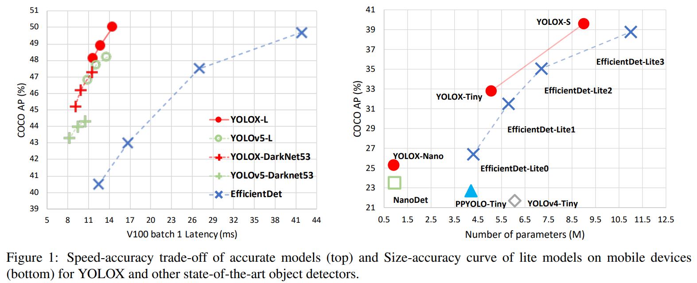
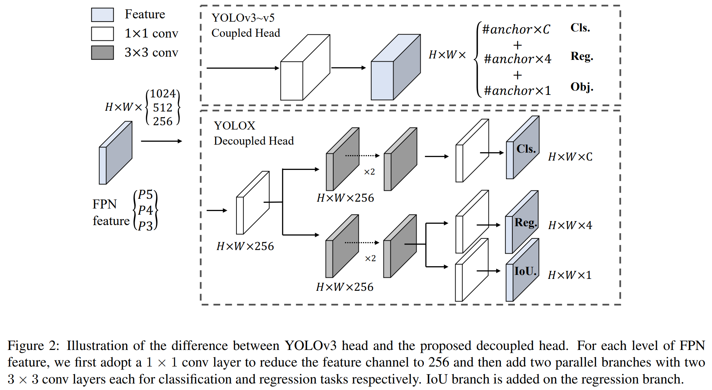
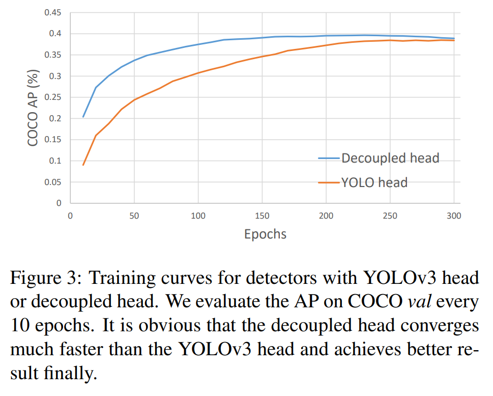

# 论文信息
- 时间：2021
- 期刊：CVPR
- 网络/算法名称：YOLOX
- 意义：将 YOLO 检测器切换为⽆锚⽅式
- 作者：Zheng Ge∗, Songtao Liu∗†, Feng Wang, Zeming Li, Jian Sun; Megvii Technology(旷视科技)
- 实验环境：
- 数据集：
- [返回上一层 README](../README.md)
# 一、解决的问题
1. 摘要
    - 在本报告中，我们对 YOLO 系列进⾏了⼀些改进，形成了⼀个新的⾼性能检测器YOLOX。我们将 YOLO 检测器切换为⽆锚⽅式，并进⾏其他先进的检测技术，即解耦头和领先的标签分配策略 SimOTA，以在⼤规模模型范围内获得最先进的结果：对于YOLO Nano 只有 0.91M 参数和 1.08G FLOPs，我们在 COCO 上获得 25.3% 的 AP，超过 NanoDet 1.8% AP；对于业界使⽤最⼴泛的检测器之⼀ YOLOv3，我们将其在 COCO 上的 AP 提升⾄ 47.3%，⽐当前最佳实践⾼出 3.0% AP；对于参数量与 YOLOv4-CSP、YOLOv5-L ⼤致相同的 YOLOX-L，我们在 Tesla V100 上以 68.9 FPS 的速度在 COCO 上实现了 50.0% AP，超过 YOLOv5-L 1.8% AP。此外，我们使⽤单个 YOLOX-L 模型赢得了流式感知挑战赛（CVPR 2021 ⾃动驾驶研讨会）的第⼀名。我们希望这份报告能为开发者提供有益的经验和研究⼈员在实际场景中，我们也提供了⽀持ONNX、TensorRT、NCNN、Openvino的deploy版本

1. Introduction 问题
    - 随着⽬标检测的发展，YOLO系列[23,24,25,1,7]始终追求实时应⽤的最佳速度和精度权衡。他们提取了当时可⽤的最先进的检测技术（例如， YOLOv2 [24] 的锚[26] ， YOLOv3 [25] 的残差⽹络[9] ）并优化最佳实践的实现。⽬前，YOLOv5 [7]在 COCO 上以 48.2% 的 AP 在 13.7 ms 上保持最佳权衡性能。

    - 然而，在过去的两年里，物体检测学术界的主要进展集中在无锚检测器[29，40，14]、高级标签分配策略[37，36，12，41，22，4]和端到端（无NMS）检测器[2，32，39]上。这些还没有集成到YOLO家族中，因为YOLOv4和YOLOv5仍然是基于锚的检测器，具有手工制定的训练分配规则。

1. Conclusion
    - 在本报告中，我们对 YOLO 系列进⾏了⼀些经验丰富的更新，形成了⼀个名为 YOLOX 的⾼性能⽆锚检测器。配备了⼀些最新的先进检测技术，即解耦头、⽆锚和先进的标签分配策略，YOLOX 在所有模型尺⼨上都⽐其他同类产品在速度和准确性之间取得了更好的权衡。值得注意的是，我们将 YOLOv3 的架构提升到 47.3% 的 COCO AP，超过当前最佳实践 3.0% AP，由于其⼴泛的兼容性，它仍然是业界使⽤最⼴泛的检测器之⼀。我们希望这份报告能够帮助开发者和研究者在实际场景中获得更好的体验。

# 二、做出的创新
1. Introduction 创新
    -  这就是我们来到这⾥的原因，通过经验丰富的优化将最近的进步交付给 YOLO 系列。考虑到 YOLOv4 和 YOLOv5 对于基于锚的管道可能有点过度优化，我们选择 YOLOv3 [25]作为我们的起点（我们将 YOLOv3-SPP 设置为默认 YOLOv3）。事实上，由于计算资源有限，在各种实际应⽤中软件⽀持不⾜，YOLOv3 仍然是业界使⽤最⼴泛的检测器之⼀。

    - 如图1 所⽰，随着上述技术的更新，我们将 YOLOv3 在分辨率为 640×640 的 COCO 上提⾼到 47.3% AP (YOLOX-DarkNet53)，超过了⽬前 YOLOv3 的最佳实践（44.3% AP， ultralytics version） ⼤幅度提⾼。此外，当切换到采⽤⾼级 CSPNet [31]主⼲和附加 PAN [19]头的⾼级 YOLOv5 架构时，YOLOX-L 在 COCO 上以 640 × 640 分辨率实现 50.0% AP，优于对应的 YOLOv5-L按 1.8% 美联社计算。我们还在⼩尺⼨模型上测试我们的设计策略。 YOLOX-Tiny 和 YOLOX-Nano（仅 0.91M Parameters 和 1.08G FLOPs）分别⽐对应的 YOLOv4-Tiny 和 NanoDet ⾼出10% AP 和 1.8% AP。
        

    - 我们已经在 https://github.com/Megvii-BaseDetection/YOLOX上发布了我们的代码，⽀持 ONNX、TensorRT、NCNN 和 Openvino。还有⼀件事值得⼀提，我们使⽤单个 YOLOX-L 模型赢得了 Streaming Perception Challenge（CVPR 2021 ⾃动驾驶研讨会）的第⼀名。

# 三、设计的模型
1. YOLOX-DarkNet53
    - 我们选择 YOLOv3 [25]和 Darknet53 作为我们的基线。在下⾯的部分中，我们将逐步介绍 YOLOX 中的整个系统设计。

    1. Implementation details
        - 从基线到最终模型，我们的训练设置基本一致。我们对模型进行了总共300个时期的训练，其中5个时期在COCO $train2017$ 上进行了预热[17]。我们使用随机梯度下降（SGD）进行训练。我们使用 $lr \times BatchSize/64$ （线性缩放[8]）的学习率，初始 $lr=0.01$ 和余弦 lr 调度。重量衰减为0.0005，SGD动量为0.9。默认情况下，对于典型的8-GPU设备，批处理大小为128。其他批量大小包括单个GPU训练也可以很好地工作。输入大小以32个步幅从448到832均匀绘制。本报告中的FPS和延迟都是在单个特斯拉V100上以FP16精度和 batch=1 进行测量的。

    2. YOLOv3 baseline
        - 我们的基线采用了DarkNet53主干和SPP层的架构，在一些论文中称为YOLOv3 SPP[1,7]。与最初的实现[25]相比，我们稍微改变了一些训练策略，增加了EMA权重更新、余弦lr调度、IoU损失和IoU感知分支。我们将BCE损失用于训练cls和obj分支，将IoU损失用于训练reg分支。这些一般的训练技巧与YOLOX的关键改进是正交的，因此我们将它们放在了基线上。此外，我们只进行RandomHorizontalFlip、ColorJitter和多尺度的数据增强，并放弃了RandomResizedCrop策略，因为我们发现RandomResiizedCrop与计划的马赛克增强有点重叠。有了这些增强，我们的基线在COCO val上实现了38.5%的AP，如表2所示。
            

    3. Decoupled head 
        - 在⽬标检测中，分类和回归任务之间的冲突是⼀个众所周知的问题[27,34]。因此，⽤于分类和定位的解耦头被⼴泛⽤于⼤多数⼀级和⼆级检测器[16,29,35,34]。然⽽，随着 YOLO 系列的主⼲和特征⾦字塔（例如，FPN [13]、 PAN [20]。）不断发展，它们的检测头仍然主要耦合，如图 2 所⽰。
            

        - 我们的两个分析实验表明耦合检测头可能会损害性能。 (1)如图3. (2)所⽰，⽤解耦的头部替换 YOLO 的头部⼤⼤提⾼了收敛速度。 decoupled head 对于端到端版本的 YOLO 是必不可少的（接下来会介绍）。从 Tab 可以看出。如图 1 所⽰，耦合头的端到端性能下降了 4.2% AP，⽽去耦合头的下降减少到 0.8% AP。因此，我们将 YOLO 检测头替换为图 2 中的精简耦合头。具体⽽⾔，它包含⼀个 1×1 卷积层以减少通道维度，然后是两个平⾏分⽀，分别具有两个 3×3 卷积层。我们在 Tab 中报告了在 V100 上 batch=1 的推理时间。 2和精简版去耦头带来额外的 1.1 毫秒（11.6 毫秒对 10.5 毫秒）。
            

    4. Strong data augmentation
        - 我们将Mosaic和MixUp添加到我们的增强策略中，以提高YOLOX的性能。Mosaic是ultralytics-YOLOv3提出的一种有效的扩增策略。然后它被广泛用于YOLOv4[1]、YOLOv5[7]和其他探测器[3]。MixUp[10]最初是为图像分类任务设计的，但后来在BoF[38]中进行了修改，用于对象检测训练。我们在模型中采用了MixUp和Mosaic实现，并在过去的15个时期中关闭了它，在表2中实现了42.0%的AP。在使用强大的数据增强后，我们发现ImageNet预训练不再有益，因此我们从头开始训练以下所有模型。

    5. Anchor-free
        - YOLOv4 [1]和 YOLOv5 [7]都遵循 YOLOv3 [25] 的原始基于锚的管道。然⽽，锚机制有许多已知问题。⾸先，为了达到最佳检测性能，需要在训练前进⾏聚类分析以确定⼀组最佳锚点。那些集群锚点是特定领域的，不太普遍。其次，anchor机制增加了检测头的复杂度，以及每幅图像的预测数量。在⼀些边缘 AI 系统上，在设备之间移动如此⼤量的预测（例如，从 NPU 到 CPU）可能成为整体延迟⽅⾯的潜在瓶颈。

        - Anchor-free检测器[29,40,14]在过去两年发展迅速。这些⼯作表明，anchor-free 检测器的性能可以与基于 anchor 的检测器相媲美。⽆锚机制显着减少了需要启发式调整的设计参数的数量和涉及的许多技巧（例如，An chor Clustering [24]， Grid Sensitive [11]。）以获得良好的性能，使检测器，特别是其训练和解码阶段，相当简单[29]。

        - 将YOLO切换为无锚方式非常简单。我们将每个位置的预测从3减少到1，并使它们直接预测四个值，即网格左上角的两个偏移，以及预测框的高度和宽度。我们将每个对象的中心位置指定为正样本，并预先定义比例范围，如[29]中所做，以指定每个对象的FPN级别。这种修改减少了探测器的参数和GFLOP，使其更快，但获得了更好的性能——42.9%的AP，如表2所示。

    6. Multi positives
        - 为了与YOLOv3的分配规则一致，上述无锚版本仅为每个对象选择一个正样本（中心位置），同时忽略其他高质量预测。然而，优化这些高质量的预测也可以带来有益的梯度，这可以缓解训练期间正/负采样的极端不平衡。我们简单地将中心3×3区域指定为阳性，在FCOS[29]中也称为“中心采样”。如表2所示，检测器的性能提高到45.0%AP，已经超过了目前的最佳实践ultralytics-YOLOv3（44.3% $AP^{2}$ ）。

    7. SimOTA
        - 高级标签分配是近年来物体检测的另一个重要进展。基于我们自己的研究OTA[4]，我们得出了高级标签分配的四个关键见解：1）损失/质量意识，2）中心在先，3）每个地面实况的正向锚定器的动态数目（缩写为动态top-k），4）全球视野。OTA满足上述四条规则，因此我们选择它作为候选标签分配策略。

        - 具体而言，OTA[4]从全局角度分析标签分配，并将分配过程公式化为最优传输（OT）问题，从而在当前分配策略中产生SOTA性能[12,41,36,22,37]。然而，在实践中，我们发现通过Sinkhorn-Knopp算法解决OT问题会带来25%的额外训练时间，这对于训练300个时期来说是相当昂贵的。因此，我们将其简化为动态top-k策略，称为SimOTA，以获得近似解。

        - 我们在这里简单介绍一下SimOTA。SimOTA首先计算成对匹配度，由每个预测 $gt$ 对的成本[4，5，12，2]或质量[33]表示。例如，在SimOTA中，gt $g_ {i}$ 和预测 $p_ {j}$ 之间的成本计算为：
            $$\begin{align}
            c_ {ij} = L^{cls}_ {ij} + \lambda L^{reg}_ {ij}
            \end{align}$$
            其中 $\lambda$ 为平衡系数。 $L^{cls}_ {ij}$ 和 $L^{reg}_ {ij}$ 是gt $g_ {i}$ 和预测 $p_ {j}$ 之间的分类损失和回归损失。然后，对于gt $g_ {i}$ ，我们选择固定中心区域内成本最低的前 $k$ 个预测作为其正样本。最后，这些阳性预测的相应网格被指定为阳性，而其余网格为阴性。注意， $k$ 值因不同的地面实况而变化。有关更多详细信息，请参阅OTA[4]中的动态 $k$ 估计策略。

        - SimOTA不仅减少了训练时间，而且避免了Sinkhorn-Knopp算法中额外的求解器超参数。如表2所示，SimOTA将检测器从45.0%AP提高到47.3%AP，比SOTA ultralytics-YOLOv3高3.0%AP，显示了高级分配策略的威力。

    8. End-to-end YOLO
        - 我们按照[39]添加了两个额外的conv层，一对一的标签分配和停止梯度。这些使检测器能够以端到端的方式执行，但略微降低了性能和推理速度，如表2所示。因此，我们将其作为一个可选模块，不涉及我们的最终模型。

2. Other Backbones
    - 除了 DarkNet53 之外，我们还在其他不同尺⼨的背⻣上测试了 YOLOX，其中 YOLOX 对所有相应的对应部分实现了⼀致的改进。

    1. Modified CSPNet in YOLOv5
        - 为了进⾏公平⽐较，我们采⽤了完全相同的 YOLOv5 主⼲，包括修改后的 CSPNet [31]、 SiLU 激活和 PAN [19]头。我们也遵循其缩放规则来⽣产 YOLOX S、YOLOX-M、YOLOX-L 和 YOLOX-X 模型。与 Tab 中的 YOLOv5 相⽐。如图 3 所⽰，我们的模型持续改进了 ~3.0% 到 ~1.0% AP，只有边际时间增加（来⾃解耦头）。

    1. Tiny and Nano detectors
        - 我们进⼀步将模型缩⼩为 YOLOX-Tiny，以便与 YOLOv4-Tiny [30] 进⾏⽐较。对于移动设备，我们采⽤深度卷积来构建⼀个只有 0.91M 参数和 1.08G FLOPs 的 YOLOX-Nano 模型。如选项卡所⽰。 4，YOLOX 在模型尺⼨⽐同类产品更⼩的情况下表现良好。

    1. Model size and data augmentation
        - 在我们的实验中，所有模型都保持了几乎相同的学习计划和优化参数，如2.1所示。然而，我们发现合适的增强策略因不同尺寸的模型而异。如表5所示，虽然对YOLOX-L应用MixUp可以将AP提高0.9%，但最好削弱对YOLOX Nano等小型模型的增强。具体而言，当训练小型模型，即YOLOX-S、YOLOX-Tiny和YOLOX-Nano时，我们消除了混合的统计并削弱了马赛克（将尺度范围从[0.1，2.0]缩小到[0.5，1.5]）。这样的改性将YOLOX Nano的AP从24.0%提高到25.3%。

        - 对于大型模型，我们还发现更强的增强更有帮助。事实上，我们的MixUp实现比[38]中的原始版本更重。受Copypaste[6]的启发，我们在将两张图像混合之前，通过随机采样的比例因子对它们进行了抖动处理。为了理解Mixup与缩放抖动的威力，我们将其与YOLOX-L上的Copypaste进行了比较。注意，Copypaste需要额外的实例掩码注释，而MixUp则不需要。但如表5所示，这两种方法实现了有竞争力的性能，表明当没有实例掩码注释可用时，具有缩放抖动的MixUp是Copypaste的合格替代品。
            

# 四、实验结果

## 1、比之前模型的优势
### Comparison with the SOTA
- 传统上，SOTA比较表如表6所示。然而，请记住，该表中模型的推理速度通常是不受控制的，因为速度随软件和硬件的不同而变化。因此，我们对图1中的所有YOLO系列使用相同的硬件和代码库。绘制了稍微受控的速度/精度曲线。
    

- 我们注意到，有一些高性能YOLO系列具有更大的型号尺寸，如Scale-YOLOv4[30]和YOLOv5-P6[7]。基于电流互感器的检测器[21]将精度SOTA提高到60 AP。由于时间和资源的限制，我们没有在本报告中探讨这些重要特征。然而，它们已经在我们的范围内了。

## 2、有优势的原因

## 3、改进空间

# 五、结论

## 1、模型是否解决了目标问题

## 2、模型是否遗留了问题

## 3、模型是否引入了新的问题

# 六、代码

# 读者角度（挖掘文章中没有提到的）：
1. 总结文章发现问题的思路
2. 总结文章改进的思想
3. 总结文章还存在或者可以改进的问题
4. 提出对模型参数和细节的一些思考和讨论