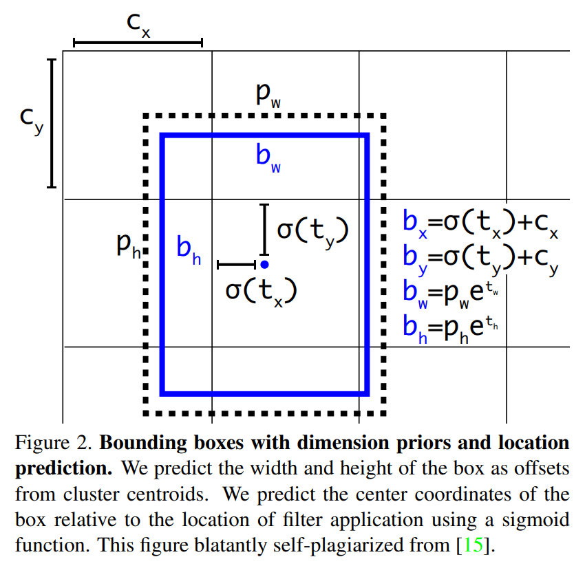
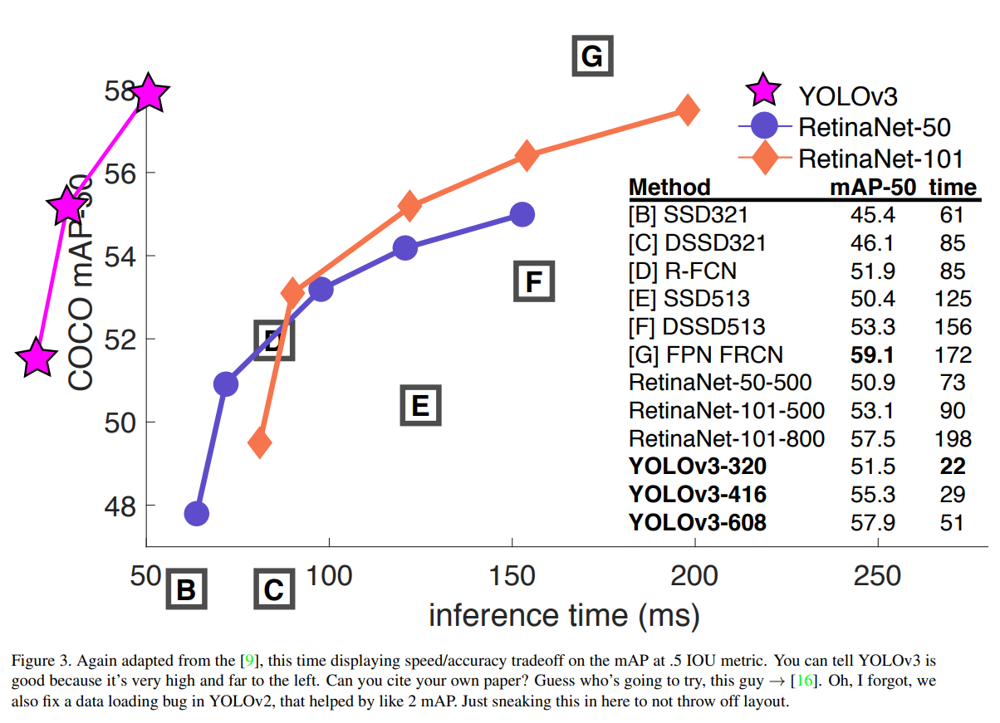
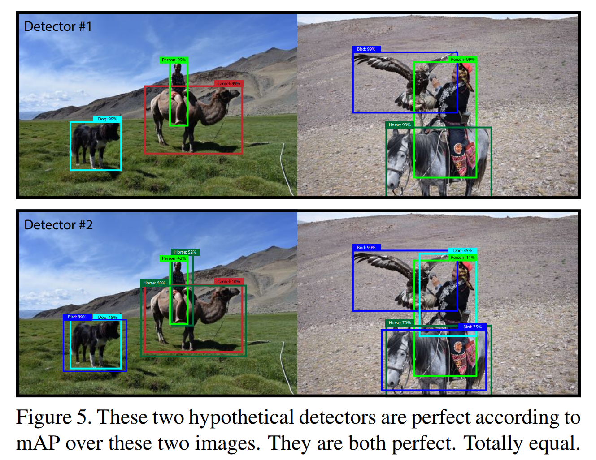
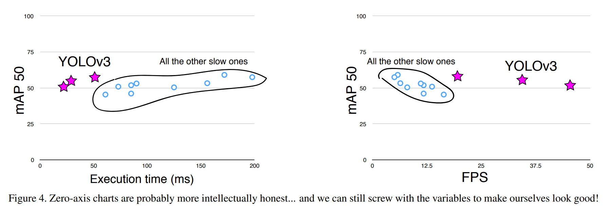

# 论文信息
- 时间：2018
- 期刊：CVPR
- 网络/算法名称：YOLOv3
- 意义：⽐v2⼤⼀点，但更准确，同时尽可能保证了速度
- 作者：Joseph Redmon, Ali Farhadi; University of Washington
- 实验环境：Titan X
- 数据集：
- [返回上一层 README](../README.md)
# 一、解决的问题
1. 摘要
    - 我们向 YOLO 展⽰了⼀些更新！我们做了⼀些⼩的设计更改以使其更好。我们还训练了这个⾮常强⼤的新⽹络。它⽐上次⼤⼀点，但更准确。不过还是很快的，不⽤担⼼。在 320 × 320 分辨率下，YOLOv3 在 28.2 mAP 下运⾏时间为 22 毫秒，与 SSD ⼀样准确，但速度快三倍。当我们查看旧的 .5 IOU mAP 检测指标时，YOLOv3 ⾮常好。它在 Titan X 上在 51 毫秒内达到 $57.9 AP_ {50}$ ，⽽RetinaNet 在 198 毫秒内达到 $57.5 AP_ {50}$ ，性能相似但速度快 3.8 倍

2. Introduction
    - 技术报告

# 二、做出的创新

## Things We Tried That Didn’t Work

- 在开发 YOLOv3 时，我们尝试了很多东西。很多都没有⽤。这是我们可以记住的东西。

1. Anchor box $x, y$ offset predictions
    - 我们尝试使⽤正常的锚框预测机制，您可以使⽤线性激活将 $x, y$ 偏移量预测为框宽度或⾼度的倍数。我们发现这个公式降低了模型的稳定性并且效果不是很好。

1. Linear $x, y$ predictions instead of logistic
    - 我们尝试使⽤线性激活来直接预测 $x, y$ 偏移量⽽不是逻辑激活。这导致 mAP 下降了⼏个点。

1. Focal loss
    - 我们尝试使⽤焦点损失。它使我们的 mAP 下降了⼤约 2 点。 YOLOv3 可能已经对 focal loss 试图解决的问题具有鲁棒性，因为它具有单独的对象性预测和条件类预测。因此对于⼤多数例⼦来说，类预测没有损失？或者其他的东西？我们不完全确定。

1. Dual IOU thresholds and truth assignment
    - Faster R CNN 在训练期间使⽤两个 IOU 阈值。如果⼀个预测与 ground truth 重叠 0.7，则它是⼀个积极的例⼦， $[.3−.7]$ 它被忽略，对于所有 ground truth 对象⼩于 .3，它是⼀个消极的例⼦。我们尝试了类似的策略，但没有取得好的结果。
    
    - 我们⾮常喜欢我们当前的公式，它似乎⾄少处于局部最优状态。这些技术中的⼀些可能最终会产⽣良好的结果，也许它们只是需要⼀些调整来稳定训练。

# 三、设计的模型
## The Deal

- 所以这是与 YOLOv3 的交易：我们主要从其他⼈那⾥获取好的想法。我们还训练了⼀个⽐其他⽹络更好的新分类器⽹络。我们将带您从头开始了解整个系统，以便您了解所有内容。

1. Bounding Box Prediction
    - 在 YOLO9000 之后，我们的系统使⽤维度集群作为锚框[YOLO9000] 来预测边界框。⽹络为每个边界框预测 4 个坐标， $t_ {x}、t_ {y}、t_ {w}、t_ {h}$ 。如果单元格从图像的左上⻆偏移 $(c_ {x}, c_ {y})$ 并且边界框先验具有宽度和⾼度 $p_ {w}, p_ {h}$ ，则预测对应于：
            $$\begin{align}
            b_ {x} &= \sigma(t_ {x}) + c_ {x} \notag \\
            b_ {y} &= \sigma(t_ {y}) + c_ {y} \notag \\
            b_ {w} &= p_ {w} e^{t_ {w}} \notag \\
            b_ {h} &= p_ {h} e^{t_ {h}} \notag 
            \end{align}$$

        

    - 在训练过程中，我们使用误差平方和损失。如果某些坐标预测的地面实况是 $\hat{t}_ {*}$ ，则我们的梯度是地面实况值（从地面实况框计算）减去我们的预测： $\hat{t}_ {*} - t_ {*}$ 。通过颠倒上述方程，可以很容易地计算出这个真值

    - YOLOv3使用逻辑回归预测每个边界框的对象性得分。如果边界框先验与地面实况对象的重叠量大于任何其他边界框先验，则该值应为1。如果边界框先验不是最好的，但确实与地面实况对象重叠了超过某个阈值，我们将忽略预测，如下[Faster R-CNN]。我们使用阈值.5。与[Faster R-CNN]不同，我们的系统只为每个地面实况对象分配一个边界框先验。如果边界框先验未指定给地面实况对象，则不会导致坐标或类预测的损失，只会导致对象性

2. Class Prediction
    - 每个框使⽤多标签分类预测边界框可能包含的类别。我们不使⽤ softmax，因为我们发现它对于良好的性能是不必要的，⽽是我们简单地使⽤独⽴的逻辑分类器。在训练期间，我们使⽤⼆元交叉熵损失进⾏类别预测。

    - 当我们转向更复杂的领域（如开放图像数据集[Open-images]）时，此公式会有所帮助。在这个数据集中有许多重叠的标签（即⼥⼈和⼈）。使⽤ softmax 强加了每个框只有⼀个类别的假设，但通常情况并⾮如此。多标签⽅法可以更好地为数据建模。

3.  Predictions Across Scales
    - YOLOv3 预测 3 种不同尺度的框。我们的系统使⽤与特征⾦字塔⽹络相似的概念从这些尺度中提取特征[Feature pyramid networks for object detection](https://arxiv.org/pdf/1612.03144.pdf)。从我们的基本特征提取器中，我们添加了⼏个卷积层。最后⼀个预测 3-d 张量编码边界框、对象性和类别预测。在我们使⽤ COCO 的实验中，我们在每个尺度上预测 3 个框，因此张量为 $N \times N \times [3 * (4 + 1 + 80)]$ ，⽤于 4 个边界框偏移、1 个对象性预测和 80 个类别预测。

    - 接下来，我们从之前的 2 层中获取特征图，并将其上采样 2 倍。我们还从⽹络早期获取⼀个特征图，并使⽤连接将其与我们的上采样特征合并。这种⽅法使我们能够从上采样的特征中获得更有意义的语义信息，并从早期的特征图中获得更细粒度的信息。然后我们添加更多的卷积层来处理这个组合的特征图，并最终预测⼀个类似的张量，尽管现在是原来的两倍。

    - 我们再次执⾏相同的设计来预测最终⽐例的框。因此，我们对第 3 尺度的预测受益于所有先前的计算以及⽹络早期的细粒度特征。

    - 我们仍然使⽤ k-means 聚类来确定我们的边界框先验。我们只是任意选择了 9 个集群和 3 个尺度，然后在尺度之间平均划分集群。在 COCO 数据集上，9 个簇是： $(10 \times 13), (16 \times 30), (33 \times 23), (30 \times 61), (62 \times 45), (59 \times 119), (116 \times 90), (156 \times 198), (373 \times 326)$ 。

4. Feature Extractor
    - 我们使⽤⼀个新的⽹络来执⾏特征提取。我们的新⽹络是 YOLOv2、Darknet-19 中使⽤的⽹络和新奇的残差⽹络材料之间的混合⽅法。我们的⽹络使⽤连续的 3 × 3 和 1 × 1 卷积层，但现在也有⼀些快捷连接并且明显更⼤。它有 53 个卷积层，所以我们称它为……等等……Darknet-53！
        

    - 这个新⽹络⽐ Darknet 19 更强⼤，但仍然⽐ ResNet-101 或 ResNet-152 更⾼效。
        

    - 每个⽹络都使⽤相同的设置进⾏训练，并以 256×256 的单裁剪精度进⾏测试。运⾏时间是在 Titan X 上以 256 × 256 测量的。因此，Darknet-53 的性能与最先进的分类器相当，但浮点运算更少，速度更快。 Darknet-53 优于 ResNet-101，速度快 1.5 倍。 Darknet-53 具有与 ResNet-152 相似的性能，并且速度快 2 倍。

    - Darknet-53 还实现了每秒测量的最⾼浮点运算。这意味着⽹络结构可以更好地利⽤ GPU，从⽽提⾼评估效率，从⽽加快速度。这主要是因为 ResNet 的层数太多⽽且效率不⾼。

5. Training
    - 我们仍然在没有硬性负⾯挖掘或任何其他东西的情况下训练完整图像。我们使⽤多尺度训练、⼤量数据扩充、批量归⼀化，以及所有标准的东西。我们使⽤ Darknet 神经⽹络框架进⾏训练和测试。

# 四、实验结果
## How We Do
- YOLOv3相当不错！见表3。就COCO而言，奇怪的平均AP指标与SSD变体不相上下，但速度快了3倍。不过，在这个指标上，它仍然远远落后于RetinaNet等其他型号。
    

    

- 然⽽，当我们查看 IOU= .5（或图表中的 $AP_ {50}$ ）时 mAP 的“旧”检测指标时，YOLOv3 ⾮常强⼤。它⼏乎与 RetinaNet 相当，并且远⾼于 SSD 变体。这表明 YOLOv3 是⼀个⾮常强⼤的检测器，擅⻓为对象⽣成像样的框。然⽽，随着 IOU 阈值的增加，性能会显着下降，这表明 YOLOv3 难以使框与对象完美对⻬。

- 过去，YOLO 在处理⼩物体时遇到了困难。然⽽，现在我们看到了这⼀趋势的逆转。通过新的多尺度预测，我们看到 YOLOv3 具有相对较⾼的 $AP_ {S}$ 性能。但是，它在中型和⼤型物体上的性能相对较差。需要进⾏更多调查才能弄清真相。

- 当我们绘制 $AP_ {50}$ 指标的精度与速度（⻅图5）时，我们发现 YOLOv3 ⽐其他检测系统具有显着优势。即，它更快更好。
    

    

## 1、比之前模型的优势

## 2、有优势的原因
### What This All Means
- YOLOv3 是⼀个很好的检测器。它很快，它很准确。它在 0.5 到 0.95 IOU 指标之间的 COCO 平均 AP 上没有那么好。但它在 0.5 IOU 的旧检测指标上⾮常好。

- 我们为什么要切换指标？最初的 COCO 论⽂只有这样⼀句神秘的话：“评估服务器完成后将添加对评估指标的完整讨论”。 Russakovsky 等⼈报告说，⼈类很难区分 0.3 和 0.5 的 IOU！“训练人类对IOU为0.3的边界框进行视觉检查，并将其与IOU为0.5的边界框区分开来，这令人惊讶地困难。”[Best of both worlds: human-machine collaboration for object annotation](http://ai.stanford.edu/~olga/papers/RussakovskyCVPR15.pdf)如果人类很难分辨出区别，这有多重要？

- 但也许更好的问题是：“既然我们有了这些探测器，我们打算⽤它们做什么？”很多做这项研究的⼈都在⾕歌和 Facebook。我想⾄少我们知道这项技术掌握在好⼈⼿中，绝对不会⽤于收集您的个⼈信息并将其出售给......等等，你是说这正是它的⽤途？哦。

- 好吧，其他⼤量资助视觉研究的⼈是军队，他们从来没有做过任何可怕的事情，⽐如⽤新技术杀死很多⼈哦等等......(作者由海军研究办公室和⾕歌资助)

- 我⾮常希望⼤多数使⽤计算机视觉的⼈只是⽤它做⼀些快乐、好的事情，⽐如数国家公园⾥斑⻢的数量，或者追踪他们在房⼦周围游荡的猫。但是计算机视觉已经被⽤于可疑⽤途，作为研究⼈员，我们有责任⾄少考虑我们的⼯作可能造成的危害，并想办法减轻它。我们⽋这个世界太多了。

## 3、改进空间

# 五、结论

## 1、模型是否解决了目标问题

## 2、模型是否遗留了问题

## 3、模型是否引入了新的问题

# 六、代码

# 读者角度（挖掘文章中没有提到的）：
1. 总结文章发现问题的思路
2. 总结文章改进的思想
3. 总结文章还存在或者可以改进的问题
4. 提出对模型参数和细节的一些思考和讨论