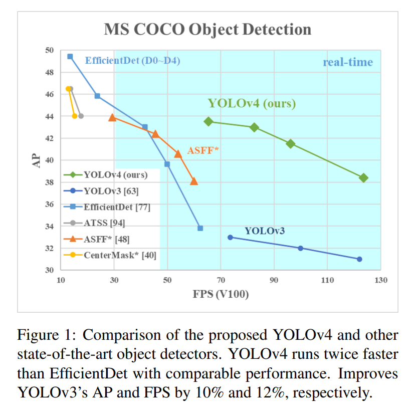
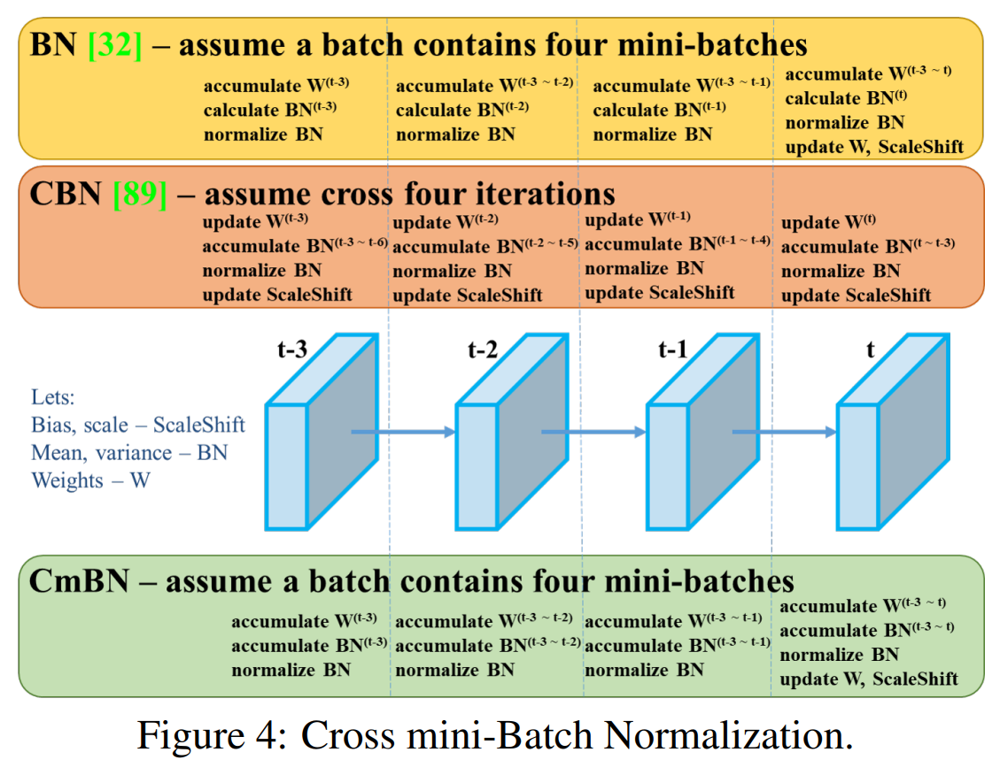
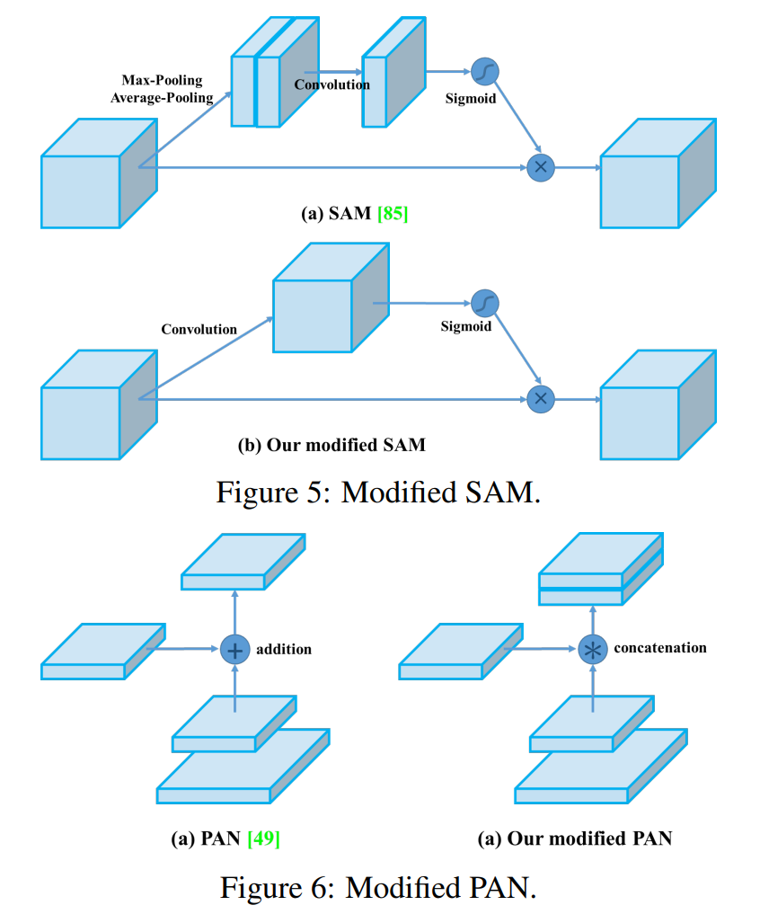

# 论文信息
- 时间：2020
- 期刊：arXiv
- 网络/算法名称：YOLOv4
- 意义：着重提高准确性
- 作者：Alexey Bochkovskiy, Chien-Yao Wang, Hong-Yuan Mark Liao
- 实验环境：Tesla V100
- 数据集：
- [返回上一层 README](../README.md)
# 一、解决的问题
1. 摘要
    - 据说有⼤量功能可以提⾼卷积神经⽹络 (CNN) 的准确性。需要在⼤型数据集上对这些特征的组合进⾏实际测试，并对结果进⾏理论验证。某些特征专⻔针对某些模型和某些问题专⻔运⾏，或者仅适⽤于⼩规模数据集；⽽⼀些特性，例如批归⼀化和残差连接，适⽤于⼤多数模型、任务和数据集。我们假设此类通⽤特征包括加权残差连接 (WRC)、跨阶段部分连接 (CSP)、跨⼩批量归⼀化 (CmBN)、⾃我对抗训练 (SAT) 和 Mish 激活。我们使⽤新功能：WRC、CSP、CmBN、SAT、Mish activation、Mosaic data augmentation、CmBN、DropBlock regularization和 CIoU  loss，并将其中⼀些功能组合起来以获得最先进的结果：43.5% AP ( 65.7% $AP_ {50}$)⽤于 MS COCO 数据集，在 Tesla V100 上实时速度为 65 FPS

2. Introduction 问题
    - ⼤多数基于 CNN 的对象检测器在很⼤程度上仅适⽤于推荐系统。例如，通过城市摄像机搜索免费停⻋位是由慢速准确模型执⾏的，⽽汽⻋碰撞警告与快速不准确模型有关。提⾼实时对象检测器的准确性不仅可以将它们⽤于提⽰⽣成推荐系统，还可以⽤于独⽴流程管理和减少⼈⼯输⼊。传统图形处理单元 (GPU) 上的实时对象检测器操作允许以可承受的价格⼤量使⽤它们。最准确的现代神经⽹络不是实时运⾏的，需要⼤量 GPU 进⾏⼤批量训练。我们通过创建⼀个在传统 GPU 上实时运⾏的 CNN 来解决这些问题，并且训练只需要⼀个传统 GPU。

3. 结论
    - 我们提供最先进的检测器，它⽐所有可⽤的替代检测器更快 (FPS) 和更准确（MS COCO AP50...95和AP50） 。所描述的检测器可以在具有 8-16 GB-VRAM 的传统 GPU 上进⾏训练和使⽤，这使得它的⼴泛使⽤成为可能。⼀级锚基检测器的原始概念已证明其可⾏性。我们已经验证了⼤量特征，并选择使⽤它们来提⾼分类器和检测器的准确性。这些功能可以⽤作未来研究和开发的最佳实践。

# 二、做出的创新
1. Introduction 创新
    - 这项⼯作的主要⽬标是设计⽣产系统中物体检测器的快速运⾏速度和并⾏计算的优化，⽽不是低计算量理论指标（BFLOP）。我们希望设计的对象可以很容易地训练和使⽤。例如，任何使⽤传统 GPU 进⾏训练和测试的⼈都可以获得实时、⾼质量和令⼈信服的⽬标检测结果，如图 1 所⽰的 YOLOv4 结果。我们的贡献总结如下：
        

        1. 我们开发了⼀个⾼效⽽强⼤的⽬标检测模型。它使每个⼈都可以使⽤ 1080 Ti 或 2080 Ti GPU 来训练超快速和准确的物体检测器。

        1. 我们在检测器训练期间验证了最先进的 Bag-of-Freebies 和 Bag-of-Specials 对象检测⽅法的影响。

        1. 我们修改了最先进的⽅法，使它们更有效，更适合单 GPU 训练，包括 CBN 、 PAN 、 SAM 等。

2. Related work
    

    1. Object detection models
        - 现代检测器通常由两部分组成，⼀个是在 ImageNet 上预训练的主⼲，另⼀个是⽤于预测类别和对象边界框的头部。对于那些在 GPU 平台上运⾏的检测器，它们的主⼲可以是 VGG [68]、 ResNet [26]、 ResNeXt [86]或 DenseNet [30]。对于那些在 CPU 平台上运⾏的检测器，它们的主⼲可以是 SqueezeNet [31]、 MobileNet [28、66、27、74] 或 ShuffleNet [97、53]。对于头部，通常分为两类，即⼀级⽬标检测器和⼆级⽬标检测器。最具代表性的两级⽬标检测器是R-CNN [19]系列，包括fast R-CNN [18]、 faster R-CNN [64]、 R-FCN [9]和 Libra R-CNN [58] 。也可以使两级⽬标检测器成为⽆锚点⽬标检测器，例如 RepPoints [87]。对于单级⽬标检测器，最具代表性的模型是 YOLO [61、62、63] 、SSD [50]和 RetinaNet [45]。近年来，开发了⽆锚单级⽬标检测器。这类检测器有CenterNet [13]、 CornerNet [37、38 ]、FCOS [78]等。近年来发展起来的物体检测器往往在backbone和head之间插⼊⼀些层，这些层通常⽤于收集来⾃不同阶段的特征图。我们可以称之为物体检测器的颈部。通常，⼀个颈部由若⼲条⾃下⽽上的路径和若⼲条⾃上⽽下的路径组成。配备这种机制的⽹络包括特征⾦字塔⽹络 (FPN) [44]、路径聚合⽹络 (PAN) [49]、 BiFPN [77]和 NAS-FPN [17]。除了上述模型之外，⼀些研究⼈员将重点放在直接构建⼀个新的主⼲⽹（DetNet [43]、 DetNAS [7]）或⼀个新的整体模型（SpineNet [12]、 HitDe tector [20]）来进⾏⽬标检测。

        - 综上所述，⼀个普通的物体检测器由⼏部分组成：
            - Input: Image, Patches, Image Pyramid

            - Backbones: VGG16 [68], ResNet-50 [26], SpineNet[12], EfficientNet-B0/B7 [75], CSPResNeXt50 [81], CSPDarknet53 [81]

            - Neck:
                -  Additional blocks: SPP [25], ASPP [5], RFB[47], SAM [85]

                - Path-aggregation blocks: FPN [44], PAN [49], NAS-FPN [17], Fully-connected FPN, BiFPN[77], ASFF [48], SFAM [98]

            - Heads:
                - Dense Prediction (one-stage):
                    - RPN [64], SSD [50], YOLO [61], RetinaNet[45] (anchor based)

                    - CornerNet [37], CenterNet [13], MatrixNet[60], FCOS [78] (anchor free)

                - Sparse Prediction (two-stage):
                    - Faster R-CNN [64], R-FCN [9], Mask R-CNN [23] (anchor based)

                    - RepPoints [87] (anchor free)

    2. Bag of freebies
        - 通常，传统的物体检测器是离线训练的。因此，研究⼈员总是喜欢利⽤这⼀优势，开发更好的训练⽅法，使⽬标检测器在不增加推理成本的情况下获得更好的精度。我们把这些只改变训练策略或只增加训练成本的⽅法称为“bag of freebies”。对象检测⽅法经常采⽤的并且符合 bag of freebies 定义的是数据增强。数据增强的⽬的是增加输⼊图像的可变性，使设计的⽬标检测模型对从不同环境获得的图像具有更⾼的鲁棒性。例如，光度失真和⼏何失真是两种常⽤的数据增强⽅法，它们肯定有利于⽬标检测任务。在处理光度失真时，我们调整图像的亮度、对⽐度、⾊调、饱和度和噪声。对于⼏何失真，我们添加了随机缩放、裁剪、翻转和旋转。

        - 上⾯提到的数据增强⽅法都是逐像素的调整，调整区域的所有原始像素信息都被保留。此外，⼀些从事数据增强的研究⼈员将他们的重点放在模拟对象遮挡问题上。他们在图像分类和⽬标检测⽅⾯取得了很好的效果。例如，random erase [100]和 CutOut [11]可以随机选择图像中的矩形区域并填充随机或互补值零。⾄于捉迷藏[69]和⽹格掩码[6]，它们随机或均匀地选择图像中的多个矩形区域并将它们替换为全零。如果将类似的概念应⽤于特征图，则有 DropOut [71]、 DropConnect [80]和 DropBlock [16]⽅法。此外，⼀些研究⼈员提出了将多张图像⼀起使⽤来进⾏数据增强的⽅法。例如，MixUp [92]使⽤两个图像以不同的系数⽐率相乘和叠加，然后⽤这些叠加的⽐率调整标签。⾄于CutMix [91]，就是将裁剪后的图像覆盖到其他图像的矩形区域，并根据混合区域的⼤⼩调整标签。除了上述⽅法外，⻛格迁移 GAN [15]也被⽤于数据增强，这种⽤法可以有效减少 CNN 学习到的纹理偏差。

        - 与上面提出的各种方法不同，其他一些 bag of freebies 方法致力于解决数据集中的语义分布可能存在偏差的问题。在处理语义分布偏差问题时，一个非常重要的问题是不同类别之间存在数据不平衡的问题，而这个问题通常通过两级对象检测器中的硬反例挖掘[72]或在线硬例挖掘[67]来解决。但实例挖掘方法不适用于单级目标检测器，因为这种检测器属于密集预测架构。因此，Lin等人[45]提出了焦点损失来处理不同类别之间存在的数据不平衡问题。另一个非常重要的问题是，很难用一个热门的硬表示来表达不同类别之间的关联度的关系。这种表示方案经常在执行标记时使用。[73]中提出的标签平滑是将硬标签转换为软标签进行训练，这可以使模型更加鲁棒。为了获得更好的软标签，Islam等人[33]引入了知识蒸馏的概念来设计标签精化网络。

        - 最后一个 bag of freebies 是边界框（BBox）回归的目标函数。传统的物体检测器通常使用均方误差（MSE）来直接对BBox的中心点坐标和高度和宽度进行回归，即 $\{x_ {center}, y_ {center}, w, h\}$ ，或左上点和右下点，即 $\{x_ {top_left}, y_ {top_left}, x_ {bottom_right}, y_ {bottom_right} \}$ 。对于基于锚的方法，它是估计相应的偏移量，例如 ${x_ {center_offest}, y_ {center_offest}, w_ {offest}, h_ {offest}}$ 和 ${x_ {top_left_offset}, y_ {top_left_offset}, x_ {bottom_right_offset}, y_ {bottom_right_offset}}$ 。然而，直接估计BBox每个点的坐标值就是将这些点视为自变量，但实际上并没有考虑对象本身的完整性。为了更好地处理这个问题，一些研究人员最近提出了IoU损失[90]，它考虑了预测BBox区域和地面实况BBox区域的覆盖范围。IoU损失计算过程将通过使用地面实况执行IoU，然后将生成的结果连接到一个完整的代码中，从而触发BBox的四个坐标点的计算。由于IoU是一个尺度不变的表示，它可以解决传统方法计算 ${x, y, w, h}$ 的 $l_ {1}$ 或 $l_ {2}$ 损失时，损失会随着尺度的增加而增加的问题。最近，一些研究人员继续改善IoU的损失。例如，GIoU损失[65]除了包括覆盖区域外，还包括对象的形状和方向。他们建议找到能够同时覆盖预测BBox和地面实况BBox的最小面积BBox，并使用该BBox作为分母来取代最初用于IoU损失的分母。至于DIoU损失[99]，它额外考虑了物体中心的距离，而CIoU损失[199]，另一方面，同时考虑了重叠面积、中心点之间的距离和纵横比。CIoU可以在BBox回归问题上获得更好的收敛速度和精度。

    3. Bag of specials
        - 对于那些只增加少量推理成本但能显着提⾼⽬标检测准确率的插件模块和后处理⽅法，我们称之为“bag of specials”。⼀般来说，这些插件模块是为了增强模型中的某些属性，⽐如扩⼤感受野，引⼊注意⼒机制，或者加强特征整合能⼒等，⽽后处理是⼀种筛选模型预测结果的⽅法。

        - 可用于增强接收场的常见模块有SPP[25]、ASPP[5]和RFB[47]。SPP模块起源于空间金字塔匹配（SPM）[39]，SPM的原始方法是将特征图分割成几个 $d×d$ 相等的块，其中 $d$ 可以是 $\{1,2,3,...\}$，从而形成空间金字塔，然后提取单词袋特征。SPP将SPM集成到CNN中，并使用最大池操作而不是字袋操作。由于He等人[25]提出的SPP模块将输出一维特征向量，因此在全卷积网络（FCN）中应用是不可行的。因此，在YOLOv3[63]的设计中，Redmon和Farhadi将SPP模块改进为最大池输出与内核大小 $k×k$ 的级联，其中 $k=\{1,5,9,13\}$ ，步长等于1。在这种设计下，相对较大的 $k×k$ 最大池化有效地增加了主干特征的感受野。在添加了SPP模块的改进版本后，YOLOv3-608在MS COCO对象检测任务上将 $AP_ {50}$ 升级2.7%，代价是额外计算0.5%。ASPP[5]模块和改进的SPP模块之间的操作差异主要来自于原始的 $k×k$ 内核大小，在扩张卷积操作中，步长的最大池化等于1到几个 $3×3$ 内核大小，扩张比等于 $k$ ，步长等于1。RFB模块使用 $k×k$ 核的几个扩张卷积，扩张比等于 $k$ ，步长等于1，以获得比ASPP更全面的空间覆盖。RFB[47]仅花费7%的额外推理时间，即可将MS COCO上SSD的 $AP_ {50}$ 增加5.7%。

        - 对象检测中常用的注意力模块主要分为通道式注意力和点式注意力，这两种注意力模型的代表分别是挤压和激发（SE）[29]和空间注意力模块（SAM）[85]。尽管SE模块可以将ResNet50在ImageNet图像分类任务中的能力提高1%top-1的准确度，而只需增加2%的计算工作量，但在GPU上，它通常会增加约10%的推理时间，因此更适合用于移动设备。但对于SAM，它只需要支付0.1%的额外计算，并且可以将ResNet50 SE在ImageNet图像分类任务中的前1级精度提高0.5%。最棒的是，它根本不会影响GPU上的推理速度。

        - 在特征集成方面，早期的实践是使用跳过连接[51]或超列[22]将低级物理特征集成到高级语义特征。随着FPN等多尺度预测方法的流行，人们提出了许多集成不同特征金字塔的轻量级模块。这类模块包括SFAM[98]、ASFF[48]和BiFPN[77]。SFAM的主要思想是使用SE模块对多尺度级联特征图执行通道级重新加权。至于ASFF，它使用softmax作为逐点级别重新加权，然后添加不同比例的特征图。在BiFPN中，提出了多输入加权残差连接来执行按比例的级别重新加权，然后添加不同尺度的特征图。

        - 在深度学习的研究中，一些人把重点放在寻找良好的激活函数上。一个好的激活函数可以使梯度更有效地传播，同时不会引起太多的额外计算成本。2010年，Nair和Hinton[56]提出了ReLU，以实质上解决传统tanh和sigmoid激活函数中经常遇到的梯度消失问题。随后，LReLU[54]、PReLU[24]、ReLU6[28]、标度指数线性单元（SELU）[35]、Swish[59]、硬Swish[27]和Mish[55]等也被提出，它们也被用于解决梯度消失问题。LReLU和PReLU的主要目的是解决当输出小于零时ReLU的梯度为零的问题。至于ReLU6和hard Swish，它们是专门为量化网络设计的。对于神经网络的自归一化，提出了SELU激活函数来满足这一目标。需要注意的一点是，Swish和Mish都是连续可微的激活函数。

        - 在基于深度学习的对象检测中常用的后处理方法是NMS，它可以用来过滤那些对同一对象预测不好的BBox，并且只保留具有更高响应的候选BBox。NMS试图改进的方式与优化目标函数的方法一致。NMS提出的原始方法没有考虑上下文信息，因此Girshick等人[19]在R-CNN中添加了分类置信度得分作为参考，并根据置信度得分的顺序，按照高分到低分的顺序执行贪婪NMS。对于软NMS[1]，它考虑了对象的遮挡可能导致具有IoU分数的贪婪NMS的置信度分数下降的问题。DIoU NMS[99]开发人员的思维方式是在软NMS的基础上，将中心点距离的信息添加到BBox筛选过程中。值得一提的是，由于上述后处理方法都没有直接参考捕获的图像特征，因此在后续开发无锚方法时不再需要后处理。

# 三、设计的模型
- 基本⽬标是神经⽹络在⽣产系统中的快速运⾏速度和并⾏计算的优化，⽽不是低计算量理论指标（BFLOP）。我们提出了实时神经⽹络的两种选择：
    - 对于 GPU，我们在卷积层中使⽤少量组 (1 - 8)：CSPResNeXt50 / CSPDarknet53

    - 对于 VPU - 我们使⽤分组卷积，但我们避免使⽤挤压和激发 (SE) 块 - 具体包括以下模型：EfficientNet-lite / MixNet [76] / GhostNet [21] / MobileNetV3

1. Selection of architecture
    - 我们的⽬标是在输⼊⽹络分辨率、卷积层数、参数数（过滤器⼤⼩ 2 * 过滤器 * 通道/组）和层输出（过滤器）数量之间找到最佳平衡。例如，我们的⼤量研究表明，就 ILSVRC2012 (ImageNet) 数据集[10] 的对象分类⽽⾔，CSPResNext50 与 CSPDarknet53 相⽐要好得多。然⽽，相反地，在 MS COCO 数据集 [46] 上检测对象⽅⾯，CSPDarknet53 ⽐ CSPResNext50 更好。

    - 下⼀个⽬标是为不同的检测器级别从不同的⻣⼲级别选择额外的块来增加感受野和参数聚合的最佳⽅法：例如 FPN、PAN、ASFF、BiFPN。

    - 最适合分类的参考模型并不总是最适合检测器。与分类器相⽐，检测器需要以下内容：

        - 更高的输入网络大小（分辨率）-用于检测多个小型对象
        
        - 更多的层-用于更高的感受野，以覆盖输入网络的增加尺寸

        - 更多的参数–使模型能够更大地检测单个图像中不同大小的多个对象

    - 假设地讲，我们可以假设⼀个具有更⼤感受野⼤⼩（具有更多 3 × 3 卷积层数）和更多参数的模型应该被选择作为主⼲。表1显⽰了 CSPResNeXt50、CSPDarknet53 和 EfficientNet B3 的信息。CSPResNext50 仅包含 16 个 3×3 卷积层、425×425 感受野和 20.6 M 个参数，⽽ CSPDarknet53 包含 29 个 3×3 卷积层、725×725 感受野和 27.6 M 个参数。这⼀理论论证以及我们的⼤量实验表明，CSPDarknet53 神经⽹络是两者中作为检测器主⼲的最佳模型。
        

    - 感受野⼤⼩不同的影响总结如下：
        - 最大对象大小-允许查看整个对象

        - 最大网络大小-允许查看对象周围的上下文

        - 超过网络大小-增加图像点和最终激活之间的连接数量

    - 我们在 CSPDarknet53 上添加了 SPP 块，因为它显着增加了感受野，分离出最重要的上下⽂特征并且⼏乎没有降低⽹络运⾏速度。我们使⽤ PANet 作为不同检测器级别的不同主⼲级别的参数聚合⽅法，⽽不是 YOLOv3 中使⽤的 FPN。

    - 最后，我们选择 CSPDarknet53 主⼲、SPP 附加模块、PANet 路径聚合颈部和 YOLOv3（基于锚点）头作为 YOLOv4 的架构。

    - 未来我们计划为检测器显着扩展 Bag of Freebies (BoF) 的内容，理论上可以解决⼀些问题并提⾼检测器的准确性，并以实验⽅式依次检查每个特征的影响。

    - 我们不使⽤跨 GPU 批归⼀化（CGBN 或 SyncBN）或昂贵的专⽤设备。这允许任何⼈在传统图形处理器（例如 GTX 1080Ti 或 RTX 2080Ti）上重现我们最先进的成果。

2. Selection of BoF and BoS
    - 为了改进⽬标检测训练，CNN 通常使⽤以下内容：
        - Activations: ReLU, leaky-ReLU, parametric-ReLU, ReLU6, SELU, Swish, or Mish

        - Bounding box regression loss: MSE, IoU, GIoU, CIoU, DIoU

        - Data augmentation: CutOut, MixUp, CutMix

        - Regularization method: DropOut, DropPath [36], Spatial DropOut [79], or DropBlock

        - Normalization of the network activations by their mean and variance:批量归一化（BN）[32]、跨GPU批量归一化（CGBN或SyncBN）[93]、滤波器响应归一化（FRN）[70]或跨迭代批量归一化（CBN）[89]

        - Skip-connections：残差连接、加权残差连接、多输入加权残差连接或跨级部分连接（CSP）

    - ⾄于训练激活函数，由于PReLU和SELU更难训练，⽽ReLU6是专⻔为量化⽹络设计的，因此我们将上述激活函数从候选列表中剔除。在requalization的⽅法上，发表Drop Block的⼈详细⽐较了他们的⽅法和其他的⽅法，他们的regularization⽅法胜出很多。因此，我们毫不犹豫地选择了 DropBlock 作为我们的正则化⽅法。⾄于归⼀化⽅法的选择，由于我们关注的是只使⽤⼀个 GPU 的训练策略，因此不考虑 syncBN。

3. Additional improvements
    - 为了使设计的检测器更适合在单GPU上进⾏训练，我们进⾏了额外的设计和改进，具体如下：
        - 我们介绍了一种新的数据增强镶嵌和自我对抗训练（SAT）方法

        - 我们在应用遗传算法的同时选择最优超参数

        - 我们修改了一些现有的方法，使我们的设计适合于有效的训练和检测——修改的SAM、修改的PAN和跨小批量归一化（CmBN）

    - Mosaic代表了一种新的数据增强方法，它混合了4幅训练图像。因此，混合了4个不同的上下文，而CutMix只混合了2个输入图像。这允许检测正常上下文之外的对象。此外，批处理规范化从每层上的4个不同图像计算激活统计信息。这大大减少了对大型迷你批量的需求。

    - 自我对抗训练（SAT）也是一种新的数据增强技术，分为两个前向-后向阶段。在第一阶段，神经网络改变原始图像，而不是网络权重。通过这种方式，神经网络对自己进行对抗性攻击，改变原始图像，以创建图像上没有所需对象的欺骗。在第二阶段，训练神经网络以正常方式检测修改图像上的对象

    - CmBN 表⽰ CBN 修改版本，如图4 所⽰，定义为 Cross mini-Batch Normalization (CmBN)。这仅在单个批次中的⼩批次之间收集统计信息。
        

    - 我们将 SAM 从空间注意修改为点注意，并将 PAN 的快捷连接替换为连接，分别如图5和图6 所⽰。
        

4. YOLOv4
    - 在本节中，我们将详细阐述 YOLOv4 的细节:
    
    - YOLOv4 consists of:
        -  Backbone: CSPDarknet53 [81]

        - Neck: SPP [25], PAN [49]

        - Head: YOLOv3 [63]

    - YOLO v4 uses：
        - Bag of Freebies (BoF) for backbone: CutMix and Mosaic data augmentation, DropBlock regularization, Class label smoothing

        - Bag of Specials (BoS) for backbone: Mish activation, Cross-stage partial connections (CSP), Multi-input weighted residual connections (MiWRC)

        - Bag of Freebies (BoF) for detector: CIoU-loss, CmBN, DropBlock regularization, Mosaic data augmentation, Self-Adversarial Training, Eliminate grid sensitivity, Using multiple anchors for a single ground truth, Cosine annealing scheduler [52], Optimal hyper-parameters, Random training shapes

        - Bag of Specials (BoS) for detector: Mish activation, SPP-block, SAM-block, PAN path-aggregation block, DIoU-NMS

# 四、实验结果
1. 不同特征对分类器训练的影响
    - 通过引⼊以下功能提⾼了分类器的准确性：CutMix and Mosaic data augmentation, Class label smoothing, and Mish activation

2. 不同特征对Detector训练的影响
    - 检测器在使⽤ SPP、PAN 和 SAM 时获得最佳性能

3. 不同主⼲和预训练权重对Detector训练的影响
    - 最终结果是主⼲ CSPDarknet53 ⽐ CSPResNeXt50 更适合检测器

4. 不同 mini-batch size 对 Detector 的影响
    - 现在加⼊ BoF 和 BoS 训练策略后，mini-batch size对检测器的性能⼏乎没有影响。这个结果表明，在引⼊ BoF 和 BoS 之后，不再需要使⽤昂贵的 GPU 进⾏训练。换句话说，任何⼈都可以仅使⽤常规 GPU 来训练出⾊的检测器。

## 1、比之前模型的优势

## 2、有优势的原因

## 3、改进空间

# 五、结论

## 1、模型是否解决了目标问题

## 2、模型是否遗留了问题

## 3、模型是否引入了新的问题

# 六、代码

# 读者角度（挖掘文章中没有提到的）：
1. 总结文章发现问题的思路
2. 总结文章改进的思想
3. 总结文章还存在或者可以改进的问题
4. 提出对模型参数和细节的一些思考和讨论