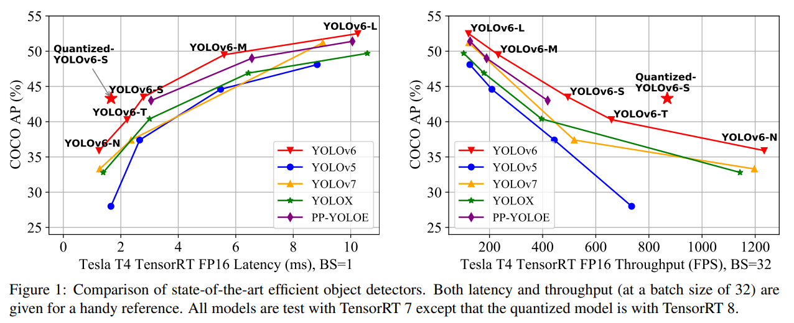
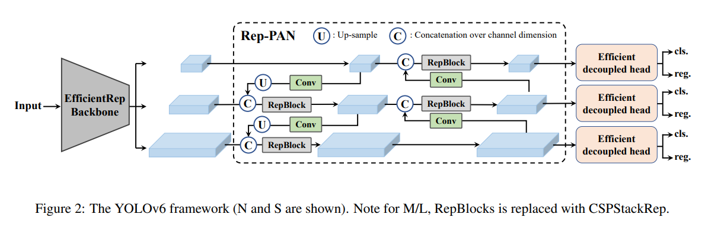
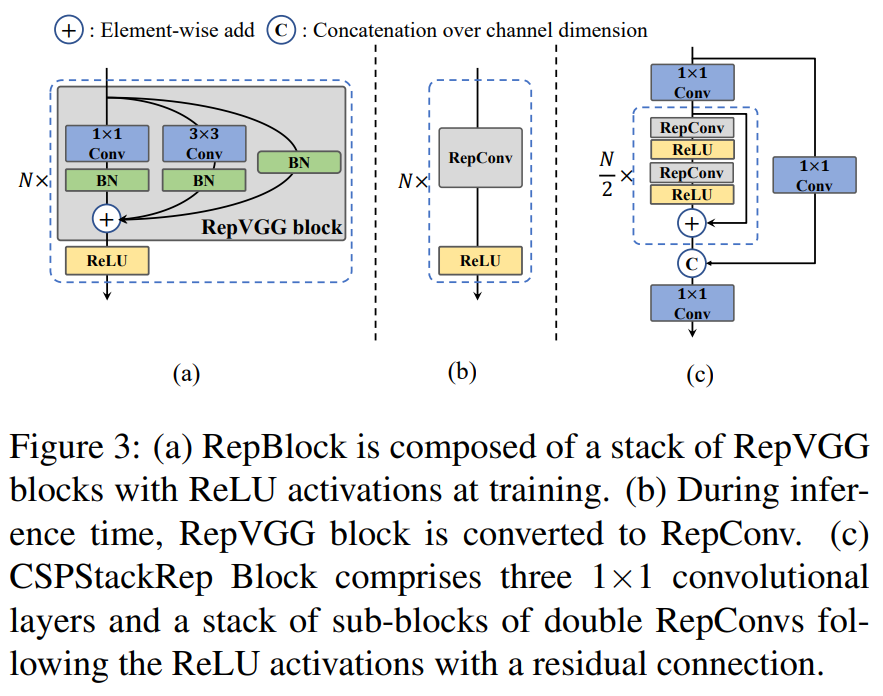
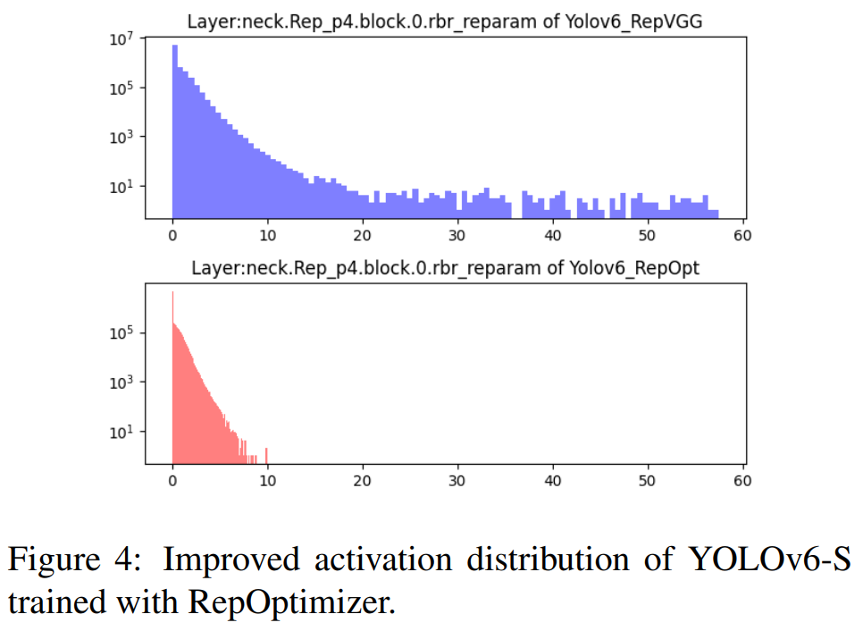
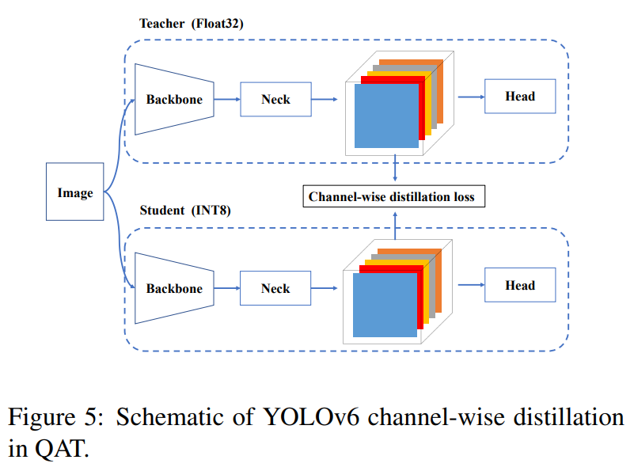

# 论文信息
- 时间：2022
- 期刊：arXiv
- 网络/算法名称：YOLOv6
- 意义：极限推向新的⾼度
- 作者：Chuyi Li∗, Lulu Li∗, Hongliang Jiang∗, Kaiheng Weng∗, Yifei Geng∗, Liang Li∗, Zaidan Ke∗, Qingyuan Li∗, Meng Cheng∗, Weiqiang Nie∗, Yiduo Li∗, Bo Zhang∗, Yufei Liang, Linyuan Zhou, Xiaoming Xu†, Xiangxiang Chu, Xiaoming Wei, Xiaolin Wei; Meituan Inc.
- 实验环境：
- 数据集：
- [返回上一层 README](../README.md)
# 一、解决的问题
1. 摘要
    - 多年来，YOLO系列一直是高效物体检测的事实上的行业级标准。YOLO社区蓬勃发展，丰富了其在众多硬件平台和丰富场景中的使用。在这份技术报告中，我们努力将其极限提升到一个新的水平，以坚定不移的心态推进行业应用。考虑到现实环境中对速度和精度的不同要求，我们广泛研究了行业或学术界的最新物体检测进展。具体来说，我们大量吸收了最近网络设计、训练策略、测试技术、量化和优化方法的思想。除此之外，我们整合了我们的思想和实践，以构建一套可在各种规模上部署的网络，以适应多样化的用例。在YOLO作者的慷慨许可下，我们将其命名为YOLOv6。我们也对用户和贡献者的进一步改进表示热烈欢迎。为了了解性能，我们的YOLOv6-N在NVIDIA Tesla T4 GPU上以1234 FPS的吞吐量在COCO数据集上达到35.9%的AP。YOLOv6-S在495 FPS时达到43.5%的AP，优于同规模的其他主流探测器（YOLOv5-S、YOLOX-S和PPYOLOE-S）。我们的量化版本YOLOv6-S甚至以869 FPS的速度带来了最先进的43.3%的AP。此外，与具有类似推理速度的其他检测器相比，YOLOv6-M/L还实现了更好的精度性能（即49.5%/52.3%）。我们仔细地进行了实验，以验证每种成分的有效性

1. Introduction 问题
    - YOLO 系列⼀直是⼯业应⽤中最受欢迎的检测框架，因为它在速度和准确性之间取得了出⾊的平衡。 YOLO 系列的开创性⼯作是 YOLOv1-3 [32-34]，它开辟了单级检测器的新道路，并在后来进⾏了实质性改进。 YOLOv4 [1]将检测框架重组为⼏个独⽴的部分（主⼲、颈部和头部），并在当时验证了 bag-of-freebies 和 bag-of-specials 以设计适合在单个 GPU 上训练的框架。⽬前，YOLOv5 [10]、 YOLOX [7]、PPY OLOE [44]和 YOLOv7 [42]都是部署⾼效检测器的竞争候选者。不同尺⼨的模型通常通过缩放技术获得。

    - 在这份报告中，我们根据经验观察了⼏个促使我们重新设计 YOLO 框架的重要因素： 
        1. RepVGG [3]的重新参数化是⼀种尚未在检测中得到充分利⽤的⾼级技术。我们还注意到 RepVGG 块的简单模型缩放变得不切实际，为此我们认为⼩型和⼤型⽹络之间的⽹络设计的优雅⼀致性是不必要的。普通的单路径架构对于⼩型⽹络是更好的选择，但对于更⼤的模型，参数的指数增⻓和单路径架构的计算成本使其不可⾏； 
        
        2. 基于重新参数化的检测器的量化也需要细致的处理，否则在训练和推理期间由于其异构配置⽽难以处理性能下降。

        3. 以前的作品[7,10,42,44]往往不太关注部署，其延迟通常在 V100 等⾼成本机器上进⾏⽐较。当涉及到真实的服务环境时，存在硬件差距。通常，像 Tesla T4 这样的低功耗 GPU 成本较低，并且提供相当好的推理性能。 
        
        4. 标签分配和损失函数设计等⾼级领域特定策略需要考虑架构差异进⾏进⼀步验证；
        
        5. 对于部署，我们可以容忍训练策略的调整，以提⾼准确率性能但不增加推理成本，例如知识蒸馏。

    - 考虑到上述观察结果，我们带来了 YOLOv6 的诞⽣，它在准确性和速度⽅⾯实现了迄今为⽌最好的权衡。我们在图 1 中展⽰了 YOLOv6 与其他类似规模的同⾏的⽐较。为了在不降低性能的情况下提⾼推理速度，我们研究了前沿的量化⽅法，包括训练后量化 (PTQ) 和量化感知训练 (QAT)，并将它们容纳在 YOLOv6 中以实现部署就绪⽹络的⽬标。
        

1. 结论
    - 简⽽⾔之，考虑到持续的⼯业需求，我们展⽰了 YOLOv6 的当前形式，仔细检查了最新的物体检测器组件的所有进步，同时灌输了我们的思想和实践。结果在准确性和速度上都超过了其他可⽤的实时检测器。为了⽅便⼯业部署，我们还为 YOLOv6 提供了定制化的量化⽅法，呈现出开箱即⽤的极速检测器。我们衷⼼感谢学术界和⼯业界的绝妙想法和努⼒。未来，我们将继续扩展这个项⽬，以满⾜更⾼标准和更苛刻的场景。
    
# 二、做出的创新
1. Introduction 创新
    - 我们为不同场景中的工业应用量身定制了一系列不同规模的网络。不同规模的体系结构各不相同，以实现最佳的速度和精度权衡，其中小型模型具有简单的单路径主干，而大型模型建立在高效的多分支块上。

    - 我们给YOLOv6注入了一种自蒸馏策略，既用于分类任务，也用于回归任务。同时，我们动态调整来自教师和标签的知识，以帮助学生模型在所有培训阶段更有效地学习知识

    - 我们广泛验证了用于标签分配、损失函数和数据增强技术的先进检测技术，并选择性地采用它们来进一步提高性能。

    - 我们在RepOptimizer[2]和通道蒸馏[36]的帮助下改革了检测的量化方案，这导致了一种快速准确的检测器，在32的批量下具有43.3%的COCO AP和869 FPS的吞吐量。
# 三、设计的模型
- YOLOv6 的改进设计包括以下组件，⽹络设计、标签分配、损失函数、数据增强、⾏业便利的改进以及量化和部署：

    1. Network Design
        - ⻣⼲⽹：与其他主流架构相⽐，我们发现 RepVGG [3]⻣⼲⽹在推理速度相似的⼩型⽹络中具有更多的特征表⽰能⼒，但由于参数和计算成本的爆炸式增⻓。在这⽅⾯，我们将 RepBlock [3]作为我们⼩型⽹络的构建块。对于⼤型模型，我们修改了⼀个更⾼效的 CSP [43]块，命名为 CSPStackRep Block。颈部：YOLOv6 的颈部继 YOLOv4 和 YOLOv5 之后采⽤ PAN 拓扑[24] 。我们⽤ RepBlocks 或 CSPStackRep Blocks 来增强颈部以拥有 Rep PAN。 Head：我们简化 decoupled head 使其更⾼效，称为 Efficient Decoupled Head。

    1. Label Assignment
        - 我们通过⼤量实验评估了YOLOv6 上标签分配策略[5,7,18,48,51]的最新进展，结果表明TAL [5]更有效且训练更友好。

    1. Loss Function
        - 主流的无锚对象检测器的损失函数包括分类损失、框回归损失和对象损失。对于每一种损失，我们都用所有可用的技术进行了系统的实验，并最终选择VariFocul损失[50]作为我们的分类损失，选择SIoU[8]/GIoU[35]损失作为我们的回归损失。

    1. Industry-handy improvements
        - ：我们引⼊了额外的常⻅做法和技巧来提⾼性能，包括⾃蒸馏和更多的训练时期。对于⾃蒸馏，分类和框回归分别由教师模型监督。由于 DFL [20]，框回归的蒸馏成为可能。此外，来⾃软标签和硬标签的信息⽐例通过余弦衰减动态下降，这有助于学⽣在训练过程中选择性地获取不同阶段的知识。此外，我们在评估时遇到了没有添加额外的灰⾊边框⽽导致性能受损的问题，为此我们提供了⼀些补救措施。

    1. Quantization and deployment
        - 为了解决基于量化重新参数化的模型的性能下降，我们使⽤ RepOpti mizer [2]训练 YOLOv6以获得 PTQ 友好的权重。我们进⼀步采⽤ QAT 和通道蒸馏[36]和图形优化来追求极致性能。我们量化的 YOLOv6-S 以 42.3% 的 AP 和 869 FPS 的吞吐量（批量⼤⼩ = 32）达到了最先进的⽔平。

1. Network Desig
    - 一级物体探测器通常由以下部分组成：脊椎、颈部和头部。主干主要决定了特征的表示能力，同时，它的设计对推理效率有着至关重要的影响，因为它承担了很大一部分计算成本。颈部用于将低级物理特征与高级语义特征聚合，然后建立各级金字塔特征图。头部由几个卷积层组成，并根据颈部组装的多层次特征预测最终检测结果。从结构的角度来看，它可以分为基于锚和无锚，或者更确切地说，参数耦合头和参数解耦头。

    - 在YOLOv6中，基于硬件友好的网络设计原理[3]，我们提出了两个可缩放的可重新参数化主干和瓶颈，以适应不同大小的模型，以及一个具有混合信道策略的高效解耦头。YOLOv6的整体架构如图2所示。
        

    1. Backbone
        - 如上所述，⻣⼲⽹络的设计对检测模型的有效性和效率有很⼤的影响。以前，已经表明多分⽀⽹络[13,14,38,39]通常可以⽐单路径⽹络[15,37] 实现更好的分类性能，但它通常伴随着并⾏性的降低并导致增加推理延迟。相反，像 VGG [37]这样的普通单路径⽹络具有⾼并⾏性和较少内存占⽤的优势，从⽽提⾼推理效率。最近在 RepVGG [3] 中，提出了⼀种结构重新参数化⽅法，以将训练时间多分⽀拓扑与推理时间平⾯架构分离，以实现更好的速度精度权衡。

        - 受上述工作的启发，我们设计了一种高效的可重新参数化主干，称为EfficientRep。对于小型模型，主干的主要组件是训练阶段的RepBlock，如图3（a）所示。在推理阶段，每个RepBlock被转换为具有ReLU激活函数的3×3卷积层堆栈（表示为RepConv），如图所示。第3（b）段。通常，3×3卷积在主流GPU和CPU上进行了高度优化，并且具有更高的计算密度。因此，EfficientRep Backbone充分利用了硬件的计算能力，在显著降低推理延迟的同时增强了表示能力。
            

        - 然⽽，我们注意到随着模型容量的进⼀步扩⼤，单路径平⾯⽹络中的计算成本和参数数量呈指数增⻓。为了在计算负担和准确性之间取得更好的权衡，我们修改了⼀个 CSPStackRep Block 来构建中型和⼤型⽹络的⻣⼲⽹。如图3 (c) 所⽰，CSPStackRep Block 由三个 1×1 卷积层和⼀堆⼦块组成，⼦块由两个 RepVGG 块[3]或 RepConv（分别在训练或推理时）和残差连接组成.此外，采⽤交叉阶段部分（CSP）连接来提⾼性能⽽⽆需过多的计算成本。与 CSPRepResStage [45]相⽐，它具有更简洁的外观，并考虑了准确性和速度之间的平衡。

    2.  Neck
        - 在实践中，多尺度的特征集成已被证明是⽬标检测的关键和有效部分[9,21,24,40] 。我们采⽤来⾃ YOLOv4 [1]和 YOLOv5 [10]的改进 PAN 拓扑[24]作为检测颈部的基础。此外，我们将 YOLOv5 中使⽤的 CSP Block 替换为 RepBlock（适⽤于⼩型模型）或 CSPStackRep Block（适⽤于⼤型模型），并相应地调整宽度和深度。 YOLOv6 的颈部被标记为 Rep-PAN。

    3. Head
        1. Efficient decoupled head
            - YOLOv5的检测头是一个耦合头，其参数在分类和定位分支之间共享，而FCOS[41]和YOLOX[7]中的检测头将两个分支解耦，并在每个分支中引入额外的两个3×3卷积层以提高性能。

            - 在 YOLOv6 中，我们采⽤混合通道策略来构建更⾼效的 decoupled head。具体来说，我们将中间 3×3 卷积层的数量减少到只有⼀个。头部的宽度由脊柱和颈部的宽度乘数共同缩放。这些修改进⼀步降低了计算成本，以实现更低的推理延迟。

        2. Anchor-free
            - 检测器因其更好的泛化能⼒和解码预测结果的简单性⽽脱颖⽽出。其后处理的时间成本⼤⼤降低。有两种类型的⽆锚检测器：基于锚点的[7,41]和基于关键点的[16,46,53] 。在 YOLOv6 中，我们采⽤了基于锚点的范式，其框回归分⽀实际上预测了锚点到边界框四个边的距离。

2. Label Assignment
    - 标签分配负责在训练阶段将标签分配给预定义的锚点。以前的⼯作提出了各种标签分配策略，从简单的基于 IoU 的策略和内部真实⽅法[41]到其他更复杂的⽅案[5,7,18,48,51] 。

    1. SimOTA
        - OTA [6]将⽬标检测中的标签分配视为最佳传输问题。它从全局⻆度为每个 ground-truth 对象定义正/负训练样本。 SimOTA [7]是 OTA [6] 的简化版本，它减少了额外的超参数并保持了性能。 SimOTA 在 YOLOv6 的早期版本中被⽤作标签分配⽅法。然⽽，在实践中，我们发现引⼊ SimOTA 会减慢训练过程。⽽陷⼊不稳定训练的情况并不少⻅。因此，我们希望有 SimOTA 的替代品。

    2. Task alignment learning
        - Task Alignment Learning (TAL) 最早在 TOOD [5] 中提出，其中设计了分类分数和预测框质量的统⼀度量。 IoU 被这个度量取代以分配对象标签。在⼀定程度上缓解了任务（分类和框回归）错位的问题。

        - TOOD的另一个主要贡献是关于任务对齐头（T头）。T头堆叠卷积层以构建交互式特征，在此基础上使用任务对齐预测器（TAP）。PP-YOLOE[45]通过用轻质ESE注意力取代T型头中的层注意力，改进了T型头，形成了ET型头。然而，我们发现ET头会降低我们模型中的推理速度，而且它没有精度增益。因此，我们保留了高效解耦磁头的设计。

        - 此外，我们观察到 TAL 可以带来⽐ SimOTA 更多的性能提升并稳定训练。因此，我们采⽤ TAL 作为 YOLOv6 中的默认标签作为签名策略。

3. Loss Functions
    - ⽬标检测包含两个⼦任务：分类和定位，对应两个损失函数：分类损失和框回归损失。对于每个⼦任务，近年来都有各种损失函数。在本节中，我们将介绍这些损失函数并描述我们如何为 YOLOv6 选择最佳损失函数。

    1. Classification Loss
        - 提⾼分类器的性能是优化检测器的关键部分。 Focal Loss [22]修改了传统的交叉熵损失，以解决正例和负例之间或难易样本之间的类不平衡问题。为了解决训练和推理之间质量估计和分类使⽤不⼀致的问题，Quality Focal Loss (QFL) [20]进⼀步扩展了 Focal Loss，联合表⽰分类分数和分类监督的定位质量。⽽ VariFocal Loss (VFL) [50]源于 Focal Loss [22]，但它不对称地处理正样本和负样本。通过考虑不同重要性的正样本和负样本，它平衡了来⾃两个样本的学习信号。 Poly Loss [17]将常⽤的分类损失分解为⼀系列加权多项式基。它在不同的任务和数据集上调整多项式系数，通过实验证明它⽐交叉熵损失和焦点损失更好。

        - 我们评估所有这些⾼级分类损失YOLOv6 最终采⽤ VFL [50]。

    1. Box Regression Loss
        - 框回归损失提供了重要的学习信号来精确定位边界框。 L1 loss是早期作品中的original box regression loss。逐渐地，各种精⼼设计的框回归损失如⾬后春笋般涌现，例如 IoU 系列损失[8,11,35,47,52,52]和概率损失[20]。

        1. IoU-series Loss
            -  IoU损失[47]将预测框的四个边界作为一个整体进行回归。由于其与评估指标的一致性，它已被证明是有效的。IoU有许多变体，如GIoU[35]、DIoU[52]、CIoU[55]、α-IoU[11]和SIoU[8]等，形成了相关的损失函数。在这项工作中，我们对GIoU、CIoU和SIoU进行了实验。SIoU应用于YOLOv6-N和YOLOv6-T，而其他人则使用GIoU

        1. Probability Loss
            - Distribution Focal Loss (DFL) [20]将框位置的潜在连续分布简化为离散概率分布。它在不引⼊任何其他强先验的情况下考虑了数据中的模糊性和不确定性，这有助于提⾼框定位精度，尤其是当真实框的边界模糊时。在 DFL 上，DFLv2 [19]开发了⼀个轻量级⼦⽹络，以利⽤分布统计与实际定位质量之间的密切相关性，进⼀步提⾼检测性能。然⽽，DFL 通常输出⽐⼀般框回归多 17 倍的回归值，导致⼤量开销。额外的计算成本极⼤地阻碍了⼩型模型的训练。⽽ DFLv2 由于额外的⼦⽹络进⼀步增加了计算负担。在我们的实验中，DFLv2 在我们的模型上为 DFL 带来了类似的性能提升。因此，我们只在 YOLOv6-M/L 中采⽤ DFL。实验细节可以在第 3.3.3 节中找到。

    1. Object Loss
        - Object loss 最早是在 FCOS [41]中提出的，⽬的是降低低质量边界框的得分，以便在后处理中将其过滤掉。它也被⽤于 YOLOX [7]以加速收敛并提⾼⽹络精度。作为像 FCOS 和 YOLOX ⼀样的 anchor-free 框架，我们在 YOLOv6 中尝试了 object loss。不幸的是，它并没有带来很多积极的影响。详细信息在第 3 节中给出。

4. Industry-handy improvements
    - 以下技巧可以在实际练习中使⽤。它们的⽬的不是为了进⾏公平⽐较，⽽是⽆需太多乏味的努⼒就能稳定地提⾼性能。

    1. More training epochs
        - 实证结果表明，检测器的性能随着训练时间的增加⽽提⾼。我们将训练持续时间从 300 个 epoch 延⻓到 400 个 epoch，以达到更好的收敛性。

    1. Self-distillation
        - 为了进一步提高模型的准确性，同时不引入太多额外的计算成本，我们应用了经典的知识提取技术，最大限度地减少教师和学生预测之间的KL偏差。我们把老师限制为学生本身，但要经过预先训练，因此我们称之为自我升华。注意，KL发散通常用于测量数据分布之间的差异。然而，在对象检测中有两个子任务，其中只有分类任务可以直接利用基于KL发散的知识提取。由于DFL损失[20]，我们也可以在框回归上执行它。然后，知识蒸馏损失可以公式化为：
            $$\begin{align}
            L_ {KD} = KL(p^{cls}_ {t}||p^{cls}_ {s}) + KL(p^{reg}_ {t}||p^{reg}_ {s})
            \end{align}$$
            其中 $p^{cls}_ {t}$ 和 $p^{cls}_ {s}$ 分别是教师模型和学生模型的类预测，因此 $p^{reg}_ {t}$ 和 $p^{reg}_ {s}$ 是框回归预测。总损失函数现在被公式化为：
            $$\begin{align}
            L_ {total} = L_ {det} + \alpha L_ {KD}
            \end{align}$$
            其中 $L_ {det}$ 是利用预测和标签计算的检测损耗。引入超参数 $\alpha$ 来平衡两种损失。在培训的早期阶段，老师的软标签更容易学习。随着培训的继续，学生的表现将与老师相匹配，这样硬标签将对学生有更多帮助。在此基础上，我们将余弦权重衰减应用于 $\alpha$ ，以动态调整来自教师的硬标签和软标签的信息。我们进行了详细的实验来验证自蒸馏对YOLOv6的影响，这将在第3节中讨论

    1. Gray border of images
        - 我们注意到，在评估 YOLOv5 [10]和 YOLOv7 [42]的实现中的模型性能时，每个图像周围都有⼀个半步⻓的灰⾊边框。虽然没有添加有⽤的信息，但它有助于检测图像边缘附近的对象。这个技巧也适⽤于 YOLOv6。

        - 然⽽，额外的灰⾊像素明显降低了推理速度。没有灰⾊边界，YOLOv6 的性能会下降， [10,42]中也是如此。我们假设该问题与⻢赛克增强中的灰⾊边框填充有关[1,10]。在最后⼀个时期[7] （⼜名淡化策略）期间关闭⻢赛克增强的实验⽤于验证。对此，我们改变灰⾊边框的⾯积，将带有灰⾊边框的图像直接调整为⽬标图像⼤⼩。结合这两种策略，我们的模型可以在不降低推理速度的情况下保持甚⾄提⾼性能。

5. Quantization and Deployment
    - 对于⼯业部署，通常的做法是采⽤量化来进⼀步加快运⾏时间，⽽不会对性能造成太⼤影响。训练后量化（PTQ）只⽤⼀个⼩的校准集直接量化模型。⽽量化感知训练 (QAT) 通过访问训练集进⼀步提⾼了性能，这通常与蒸馏结合使⽤。然⽽，由于 YOLOv6 中⼤量使⽤重新参数化块，以前的 PTQ 技术⽆法产⽣⾼性能，⽽在训练和推理过程中匹配假量化器时很难结合 QAT。我们在这⾥展⽰了部署过程中的陷阱和我们的解决⽅法。

    1. Reparameterizing Optimizer
        - RepOptimizer [2]建议在每个优化步骤进⾏梯度重新参数化。该技术还很好地解决了基于重新参数化的模型的量化问题。因此，我们以这种⽅式重建 YOLOv6 的重新参数化块，并使⽤ RepOptimizer 对其进⾏训练以获得 PTQ 友好的权重。特征图的分布⼤⼤缩⼩（例如图4，B.1 中有更多内容），这极⼤地有利于量化过程，结果参⻅第3.5.1节。
            

    1. Sensitivity Analysis
        - 我们通过将量化敏感运算部分转换为浮点运算，进一步提高了PTQ性能。为了获得灵敏度分布，通常使用几种度量，即均方误差（MSE）、信噪比（SNR）和余弦相似度。通常为了进行比较，可以选择输出特征图（在激活某一层之后），以在量化和不量化的情况下计算这些度量。作为一种替代方案，通过打开和关闭特定层的量化来计算验证AP也是可行的[29]。

        - 我们在使⽤ RepOptimizer 训练的 YOLOv6-S 模型上计算所有这些指标，并选择前 6 个敏感层进⾏浮动运⾏。敏感性分析的完整图表可以在 B.2 中找到。

    1. Quantization-aware Training with Channel-wise Distillation
        - 如果 PTQ 不⾜，我们建议采⽤量化感知训练 (QAT) 来提⾼量化性能。为了解决训练和推理过程中假量化器不⼀致的问题，有必要在 RepOptimizer 上构建 QAT。此外，channel wise distillation [36] （后来称为 CW Distill）在 YOLOv6 框架内进⾏了调整，如图5 所⽰。这也是⼀种⾃蒸馏⽅法，其中教师⽹络是 FP32 精度的学⽣本⾝。参⻅第 3.5.1 节中的实验。
            

# 四、实验结果
1. 考虑到这项⼯作的⽬标是为⼯业应⽤构建⽹络，我们主要关注部署后所有模型的速度性能，包括吞吐量（批量⼤⼩为 1 或 32 时的 FPS）和 GPU 延迟，⽽不是FLOPs 或参数的数量

1. 对于不同⼤⼩的模型，最佳⽹络结构应该有不同的解决⽅案。
## 1、比之前模型的优势

## 2、有优势的原因

## 3、改进空间

# 五、结论

## 1、模型是否解决了目标问题

## 2、模型是否遗留了问题

## 3、模型是否引入了新的问题

# 六、代码

# 读者角度（挖掘文章中没有提到的）：
1. 总结文章发现问题的思路
2. 总结文章改进的思想
3. 总结文章还存在或者可以改进的问题
4. 提出对模型参数和细节的一些思考和讨论