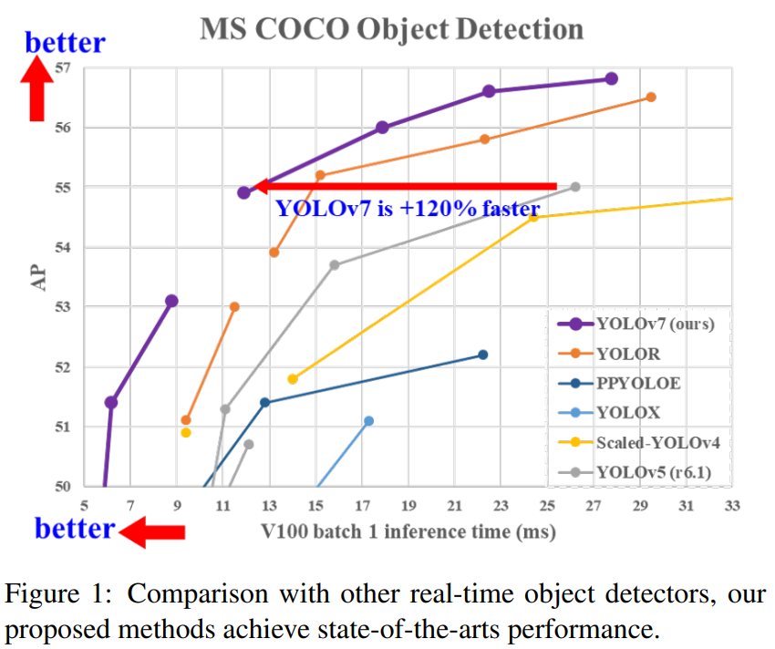
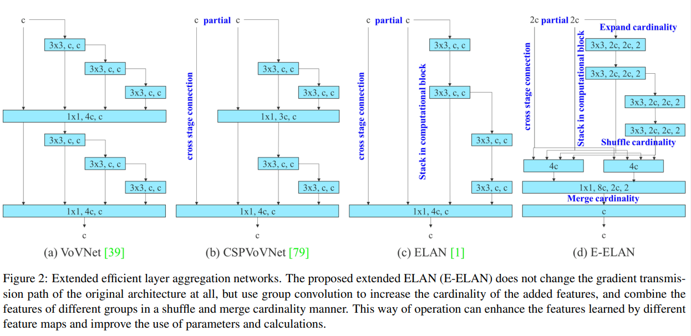
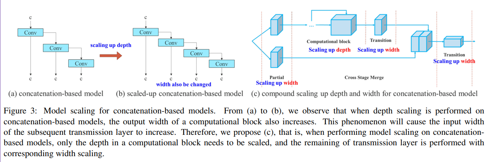
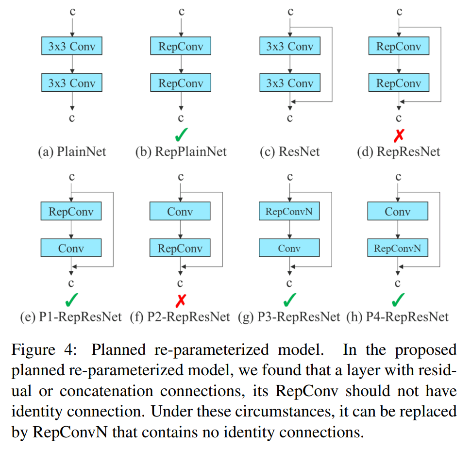
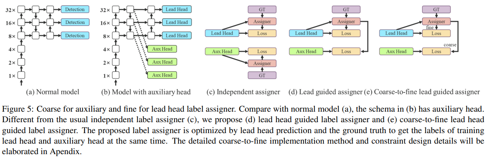

# 论文信息
- 时间：2022
- 期刊：CVPR
- 网络/算法名称：YOLOv7
- 意义：更快更准
- 作者：Chien-Yao Wang1, Alexey Bochkovskiy, and Hong-Yuan Mark Liao1; 1
Institute of Information Science, Academia Sinica, Taiwan
- 实验环境：
- 数据集：MS COCO
- [返回上一层 README](../README.md)
# 一、解决的问题
1. 摘要
    - YOLOv7 在 5 FPS 到 160 FPS 的范围内在速度和精度上都超过了所有已知的物体检测器，并且在 GPU V100 上具有 30 FPS 或更⾼的所有已知实时物体检测器中具有最⾼的精度 56.8% AP。 YOLOv7-E6 ⽬标检测器（56 FPS V100，55.9% AP）在速度上优于基于Transformer的检测器 SWIN L Cascade-Mask R-CNN（9.2 FPS A100，53.9% AP）509% 的速度和 2% 的精度，以及卷积基于检测器 ConvNeXt-XL Cascade-Mask R-CNN（8.6 FPS A100，55.2% AP）的速度提⾼了 551%，准确度提⾼了 0.7% AP，以及 YOLOv7 优于：YOLOR、YOLOX、Scaled-YOLOv4、YOLOv5、DETR、可变形 DETR、DINO-5scale-R50、ViT-Adapter-B 和许多其他速度和准确性的物体检测器。此外，我们只在 MS COCO 数据集上从头开始训练 YOLOv7，⽽不使⽤任何其他数据集或预训练权重。
        

1. Introduction 问题
    - 实时⽬标检测是计算机视觉中⼀个⾮常重要的主题，因为它通常是计算机视觉系统中的必要组件。例如，多⽬标跟踪[94,93]、⾃动驾驶[40,18]、机器⼈[35,58]、医学图像分析[34,46]等。执行实时⽬标的计算设备检测通常是⼀些移动CPU或GPU，以及各⼤⼚商开发的各种神经处理单元（NPU）。例如，Apple 神经引擎（Apple）、神经计算棒（Intel）、Jetson AI 边缘设备（Nvidia）、边缘 TPU（Google）、神经处理引擎（Qualcomm）、AI 处理单元（MediaTek）和 AI SoC (Kneron)，都是 NPU。上⾯提到的⼀些边缘设备专注于加速不同的操作，例如普通卷积、深度卷积或 MLP 操作。在本⽂中，我们提出的实时⽬标检测器主要是希望它能够同时⽀持从边缘到云端的移动GPU和GPU设备。

    - 近年来，实时⽬标检测器仍在为不同的边缘设备开发。例如，开发MCUNet [49,48]和 NanoDet [54]的选择专注于⽣产低功耗单芯⽚并提⾼边缘 CPU 的推理速度。⾄于 YOLOX [21]和 YOLOR [81] 等⽅法，它们专注于提⾼各种 GPU 的推理速度。最近，实时对象检测器的开发集中在⾼效架构的设计上。⾄于可在 CPU [54,88,84,83]上使⽤的实时⽬标检测器，它们的设计⼤多基于 MobileNet [28,66,27] 、 ShuffleNet [92,55]或 GhostNet [25]。另⼀种主流的实时⽬标检测器是为 GPU [81,21,97]开发的，它们⼤多使⽤ ResNet [26]、 DarkNet [63]或 DLA [87]，然后使⽤ CSPNet [80]策略优化建筑学。本⽂提出的⽅法的发展⽅向不同于当前主流的实时⽬标检测器。除了架构优化之外，我们提出的⽅法将侧重于训练过程的优化。我们的重点将放在⼀些优化的模块和优化⽅法上，这些模块和优化⽅法可能会增加训练成本以提⾼⽬标检测的准确性，但不会增加推理成本。我们将建议的模块和优化⽅法称为trainable bag-of-freebies。

    - 最近，模型重新参数化[13、12、29 ]和动态标签分配[20、17、42 ]已成为⽹络训练和⽬标检测中的重要课题。主要是在上述新概念的提出之后，⽬标检测器的训练演化出了很多新的问题。在本⽂中，我们将介绍我们发现的⼀些新问题，并设计有效的⽅法来解决这些问题。对于模型重参数化，我们利⽤梯度传播路径的概念分析了适⽤于不同⽹络层的模型重参数化策略，并提出了有计划的重参数化模型。此外，当我们发现使⽤动态标签分配技术时，多输出层模型的训练会产⽣新的问题。即：“如何为不同分⽀的输出分配动态⽬标？”

1. Conclusions
    - 在本⽂中，我们提出了⼀种新的实时对象检测器架构和相应的模型缩放⽅法。此外，我们发现⽬标检测⽅法的演变过程产⽣了新的研究主题。在研究过程中，我们发现了重新参数化模块的替换问题和动态标签分配的分配问题。为了解决这个问题，我们提出了可训练的免费赠品袋⽅法来提⾼⽬标检测的准确性。基于以上，我们开发了 YOLOv7 系列⽬标检测系统，获得了最先进的结果。
    
# 二、做出的创新
1. Introduction 创新
    - 针对“如何为不同分⽀的输出分配动态⽬标？”这个问题，我们提出了⼀种新的标签分配⽅法，称为 coarse-to-fine lead guided label assignment。

    - 本⽂的贡献总结如下：
        1. 我们设计了⼏种 trainable bag-of-freebies ⽅法，使得实时⽬标检测可以在不增加推理成本的情况下⼤⼤提⾼检测精度；

        1. 对于⽬标检测⽅法的演进，我们发现了两个新问题，即重新参数化的模块如何替换原始模块，以及动态标签作为符号策略如何处理分配给不同的输出层。此外，我们还提出了解决这些问题所带来的困难的⽅法；
        
        1. 我们提出了可以有效利⽤参数和计算的实时⽬标检测器的“扩展”和“复合缩放”⽅法；
        
        1. 我们提出的⽅法可以有效地减少 state-of-the-art 实时⽬标检测器的⼤约 40% 的参数和 50% 的计算量，并且具有更快的推理速度和更⾼的检测精度。

1. Related work
    1. Real-time object detectors
        - ⽬前最先进的实时⽬标检测器主要基于 YOLO [61,62,63]和 FCOS [76,77]，它们是[3,79,81,21,54,85,23] 。能够成为最先进的实时⽬标检测器通常需要具备以下特性：
            1. 更快更强的⽹络架构；
            
            1. 更有效的特征整合⽅法[22,97,37,74,59,30,9,45]；

            1. 更准确的检测⽅法[76,77,69]；
            
            1. 更稳健的损失函数[96,64,6,56,95,57]；
            
            1. 更有效的标签分配⽅法[99,20,17,82,42]；
            
            1. 更有效的训练⽅法。
            
        - 在本⽂中，我们不打算探索需要额外数据或⼤型模型的⾃我监督学习或知识蒸馏⽅法。相反，我们将为与上述 (4)、(5) 和 (6) 相关的最先进⽅法派⽣的问题设计新的 trainable bag-of-freebies ⽅法。

    1. Model re-parameterization
        - 模型重新参数化技术[71,31,75,19,33,11,4,24,13,12,10,29,14,78]在推理阶段将多个计算模块合并为⼀个。模型重参数化技术可以看作是⼀种集成技术，我们可以将其分为两类，即模块级集成和模型级集成。模型级重新参数化以获得最终推理模型的常⻅做法有两种。⼀种是⽤不同的训练数据训练多个相同的模型，然后对多个训练好的模型进行权值平均。另⼀种是对不同迭代次数的模型权重进行加权平均。模块级重新参数化是最近⽐较热⻔的研究问题。这种⽅法在训练时将⼀个模块拆分成多个相同或不同的模块分⽀，在推理时将多个分⽀模块整合成⼀个完全等价的模块。然⽽，并⾮所有提出的重新参数化模块都可以完美地应⽤于不同的体系结构。考虑到这⼀点，我们开发了新的重参数化模块，并为各种架构设计了相关的应⽤策略。

    1. Model scaling
        - 模型缩放[72,60,74,73,15,16,2,51]是⼀种放⼤或缩⼩已设计模型并使其适合不同计算设备的⽅法。模型缩放⽅法通常使⽤不同的缩放因⼦，如resolution（输⼊图像的⼤⼩）、depth（层数）、width（通道数）和stage（特征pyramid的数量），从⽽实现⼀个⽹络参数量、计算量、推理速度和准确性的良好权衡。⽹络架构搜索（NAS）是常⽤的模型缩放⽅法之⼀。 NAS 可以⾃动从搜索空间中搜索合适的缩放因⼦，⽽⽆需定义太复杂的规则。 NAS的缺点是需要⾮常昂贵的计算来完成对模型缩放因⼦的搜索。在[15]中，研究者分析了缩放因⼦与参数量和操作量之间的关系，试图直接估计⼀些规则，从⽽获得模型缩放所需的缩放因⼦。查阅⽂献，我们发现⼏乎所有的模型缩放⽅法都独⽴地分析了单个缩放因⼦，甚⾄复合缩放类别中的⽅法也独⽴地优化了缩放因⼦。这样做的原因是因为⼤多数流行的 NAS 架构处理的缩放因⼦不是很相关。我们观察到，所有基于连接的模型，例如 DenseNet [32]或 VoVNet [39]，都会在缩放此类模型的深度时改变某些层的输⼊宽度。由于所提出的架构是基于级联的，我们必须为此模型设计⼀种新的复合缩放⽅法。
# 三、设计的模型
1. Architecture
    1. Extended efficient layer aggregation networks
        - 在⼤多数关于设计⾼效架构的⽂献中，主要考虑的⽆⾮是参数的数量、计算量和计算密度。从内存访问成本的特点出发，Ma 等⼈。 [55]还分析了输⼊/输出通道⽐、体系结构的分⽀数和元素操作对⽹络推理速度的影响。美元等。 [15]在执行模型缩放时还考虑了激活，即更多地考虑卷积层输出张量中的元素数量。图2 (b)中CSPVoVNet [79]的设计是 VoVNet [39]的变体。除了考虑上述基本设计问题外，CSPVoVNet [79]的体系结构还分析了梯度路径，以使不同层的权重能够学习更多不同的特征。上述梯度分析⽅法使引⽤更快更准确。图2 (c) 中的ELAN [1]考虑了以下设计策略“如何设计⾼效⽹络？”。他们得出了⼀个结论：通过控制最短最⻓的梯度路径，更深层的⽹络可以有效地学习和收敛。在本⽂中，我们提出了基于 ELAN 的扩展 ELAN（E-ELAN），其主要架构如图2（d）所⽰。
            

        - 无论梯度路径长度和大规模ELAN中计算块的堆叠数量如何，它都达到了稳定状态。如果无限制地堆叠更多的计算块，这种稳定状态可能会被破坏，参数利用率会降低。所提出的E-ELAN使用扩展、混洗、合并基数来实现在不破坏原始梯度路径的情况下持续增强网络学习能力的能力。在架构方面，E-ELAN只改变了计算块的架构，而过渡层的架构完全没有改变。我们的策略是使用群卷积来扩展计算块的通道和基数。我们将对计算层的所有计算块应用相同的组参数和信道乘法器。然后，每个计算块计算出的特征图将根据设置的组参数 $g$ 被打乱为 $g$ 组，然后将它们连接在一起。此时，每组特征图中的通道数量将与原始架构中的通道数相同。最后，我们添加 $g$ 组特征图来执行合并基数。除了保持原有的ELAN设计架构外，E-ELAN还可以引导不同组的计算块学习更多样化的特征。

    1. Model scaling for concatenation-based models
        - 模型缩放的主要⽬的是调整模型的⼀些属性，⽣成不同尺度的模型，以满⾜不同推理速度的需要。例如，EfficientNet [72]的缩放模型考虑了宽度、深度和分辨率。⾄于 scaled-YOLOv4 [79]，其缩放模型是调整阶段数。在[15] 中， Dollar´ 等⼈。分析了vanilla convolution和group convolution在进行宽深缩放时对参数量和计算量的影响，并以此设计了相应的模型缩放⽅法。以上⽅法主要⽤于PlainNet或ResNet等架构。这些架构在执行scaling up或scaling down时，每⼀层的⼊度和出度都不会发⽣变化，因此我们可以独⽴分析每个缩放因⼦对参数量和计算量的影响。然⽽，如果将这些⽅法应⽤于基于级联的体系结构，我们会发现，当对深度进行放⼤或缩⼩时，紧接基于级联的计算块之后的转换层的⼊度会降低或增加，如图3（a）和（b）所⽰。
            

        - 从上述现象可以推断，对于基于级联的模型，我们不能单独分析不同的⽐例因⼦，⽽必须综合考虑。以 scaling up depth 为例，这样的动作会导致过渡层的输⼊通道和输出通道之间的⽐率发⽣变化，这可能会导致模型的硬件使⽤率下降。因此，我们必须为基于级联的模型提出相应的复合模型缩放⽅法。当我们缩放计算块的深度因⼦时，我们还必须计算该块的输出通道的变化。然后，我们将在过渡层上进行相同变化量的宽度因⼦缩放，结果如图3（c）所⽰。我们提出的复合缩放⽅法可以保持模型在初始设计时具有的属性并保持最佳结构。

1. Trainable bag-of-freebies
    1. Planned re-parameterized convolution
        - 尽管 RepConv [13]在 VGG [68]上取得了优异的性能，但是当我们将其直接应⽤于 ResNet [26]和 DenseNet [32]等架构时，其精度会显着降低。我们使⽤梯度流传播路径来分析重新参数化卷积应该如何与不同的⽹络相结合。我们还相应地设计了计划的重新参数化卷积。

        - RepConv 实际上在⼀个卷积层中结合了 3×3 卷积、1×1 卷积和恒等连接。在分析了 RepConv 和不同架构的组合和对应性能后，我们发现 RepConv 中的⾝份连接破坏了 ResNet 中的残差和 DenseNet 中的连接，这为不同的特征图提供了更多的梯度多样性。由于上述原因，我们使⽤不带⾝份连接的 RepConv (RepConvN) 来设计计划的重新参数化卷积的体系结构。在我们的想法中，当⼀个有残差或concatenation的卷积层被re-parameterized convolution代替时，应该没有identity connection。图4显⽰了我们设计的⽤于 PlainNet 和 ResNet 的“计划重新参数化卷积”的⽰例。⾄于基于残差模型和基于级联模型的完整计划的重新参数化卷积实验，将在消融研究会议中展⽰。
            

    1. Coarse for auxiliary and fine for lead loss
        - 深度监督[38]是⼀种经常⽤于训练深度⽹络的技术。它的主要思想是在⽹络的中间层增加额外的辅助头，以辅助损失为指导的浅层⽹络权重。即使对于通常收敛良好的 ResNet [26]和 DenseNet [32]等架构，深度监督[70,98,67,47,82,65,86,50]仍然可以显着提⾼模型在许多⽅⾯的性能任务。图5 (a) 和 (b) 分别显⽰了“没有”和“有”深度监督的对象检测器架构。在本⽂中，我们将负责最终输出的头称为lead head，⽤于辅助训练的头称为auxiliary head。
            

        - 接下来我们要讨论标签分配的问题。以往在深度⽹络的训练中，标签分配通常直接参考ground truth，根据给定的规则⽣成hard label。然⽽，近年来，如果我们以⽬标检测为例，研究⼈员往往利⽤⽹络预测输出的质量和分布，然后与ground truth⼀起考虑，使⽤⼀些计算和优化⽅法来⽣成可靠的软标签[61,8,36,99,91,44,43,90,20,17,42] 。例如，YOLO [61]使⽤边界框回归和ground truth预测的IoU作为objectness的软标签。在本⽂中，我们将这种将⽹络预测结果与ground truth⼀起考虑然后分配软标签的机制称为“标签分配器”。

        - 无论辅助主管或领导主管的情况如何，都需要针对目标目标进行深度监督培训。在软标签分配器相关技术的发展过程中，我们意外地发现了一个新的衍生问题，即“如何为辅助头和引导头分配软标签？”据我们所知，到目前为止，相关文献还没有探讨过这个问题。目前最流行的方法的结果如图5（c）所示，即分离辅助头和引导头，然后使用它们自己的预测结果和地面实况来执行标签分配。本文提出的方法是一种新的标签分配方法，通过引导头预测来引导辅助头和引导头。换句话说，我们使用引导头预测作为指导来生成从粗到细的分层标签，这些标签分别用于辅助头和引导头学习。两种提出的深度监督标签分配策略分别如图5（d）和（e）所示。

        1. Lead head guided label assigner
            - 主要是根据lead head的预测结果和ground truth进行计算，通过优化过程⽣成soft label。这组软标签将⽤作辅助头和引导头的⽬标训练模型。之所以这样做是因为lead head有⽐较强的学习能⼒，所以由它⽣成的soft label应该更能代表源数据和⽬标之间的分布和相关性。此外，我们可以将这种学习视为⼀种⼴义残差学习。通过让较浅的辅助头直接学习lead head已经学习到的信息，lead head将更能够专注于学习尚未学习到的剩余信息。

        1. Coarse-to-fine lead head guided label assigner
            - 粗到细引导头引导标签分配器还使用引导头的预测结果和地面实况来生成软标签。然而，在这个过程中，我们生成了两组不同的软标签，即粗标签和细标签，其中细标签与引导头引导的标签分配器生成的软标签相同，而粗标签是通过放宽正样本分配过程的约束，允许更多的网格被视为正目标来生成的。原因是辅助头的学习能力不如引导头强，为了避免丢失需要学习的信息，我们将在物体检测任务中重点优化辅助头的召回。对于导联头的输出，我们可以从高召回率的结果中过滤出高精度的结果作为最终输出。然而，我们必须注意，如果粗标签的附加权重接近细标签的附加权值，那么在最终预测时可能会产生不良先验。因此，为了使这些超粗正网格的影响更小，我们在解码器中进行了限制，使得超粗正栅格不能完美地产生软标签。上述机制允许在学习过程中动态调整细标签和粗标签的重要性，并使细标签的可优化上限始终高于粗标签。

    1. Other trainable bag-of-freebies
        - 在本节中，我们将列出⼀些可训练的免费赠品。这些免费赠品是我们在训练中使⽤的⼀些技巧，但最初的概念并不是我们提出的。这些免费赠品的训练细节将在附录中详细说明，包括
            1. conv-bn-activation topology 中的 Batch normalization：这部分主要将 batch normalization 层直接连接到卷积层。这样做的⽬的是在推理阶段将batch normalization的均值和⽅差融⼊到卷积层的bias和weight中。

            1. YOLOR [81]中的隐式知识结合卷积特征图加法乘法的⽅式：YOLOR中的隐式知识可以在推理阶段通过预计算简化为⼀个向量。该向量可以与前⼀个或后⼀个卷积层的偏置和权重相结合。
            
            1. EMA 模型：EMA 是 mean teacher [75]中使⽤的⼀种技术，在我们的系统中，我们纯粹使⽤ EMA 模型作为最终的推理模型。

# 四、实验结果
1. 从结果中我们看到，如果与 YOLOv4 相⽐，YOLOv7 的参数减少了 75%，计算量减少了 36%，AP ⾼了 1.5%。如果与最先进的 YOLOR-CSP 相⽐，YOLOv7 的参数减少了 43%，计算量减少了 15%，AP 提⾼了 0.4%。在tiny模型的性能上，与YOLOv4-tiny-31相⽐，YOLOv7-tiny减少了39%的参数数量和49%的计算量，但保持了相同的AP。

1. 在云 GPU 模型上，我们的模型仍然可以有更⾼的 AP，同时减少 19% 的参数数量和 33% 的计算量。

## 1、比之前模型的优势

## 2、有优势的原因

## 3、改进空间

# 五、结论

## 1、模型是否解决了目标问题

## 2、模型是否遗留了问题

## 3、模型是否引入了新的问题

# 六、代码

# 读者角度（挖掘文章中没有提到的）：
1. 总结文章发现问题的思路
2. 总结文章改进的思想
3. 总结文章还存在或者可以改进的问题
4. 提出对模型参数和细节的一些思考和讨论