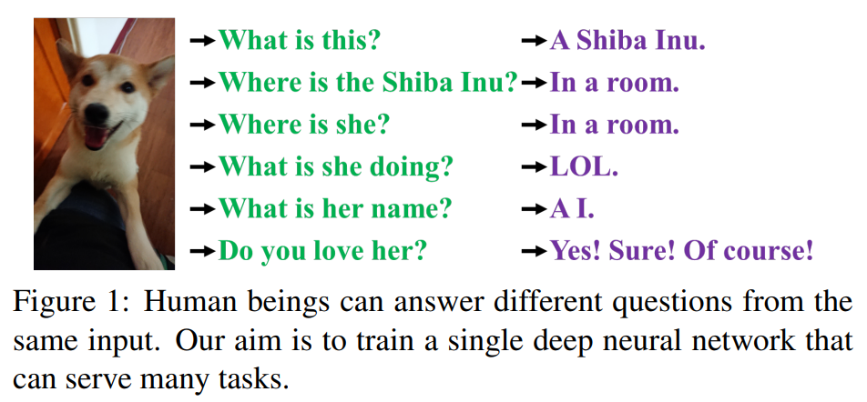
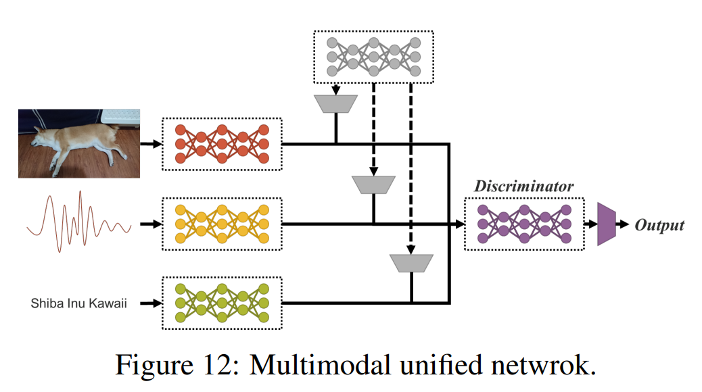
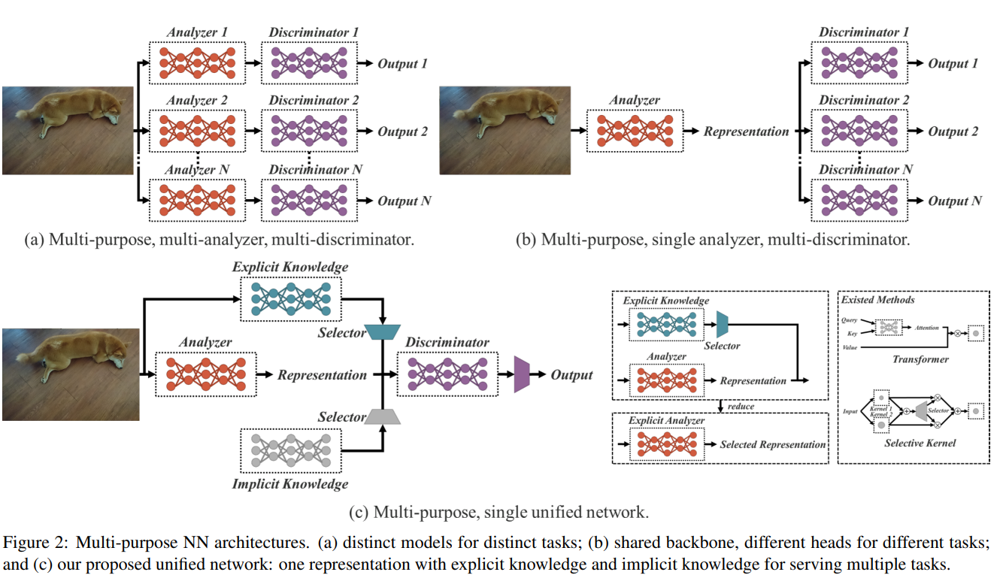
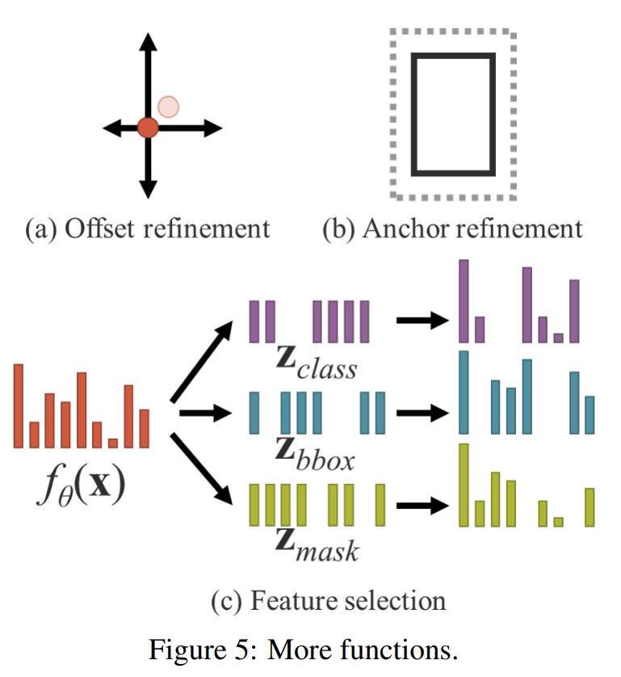
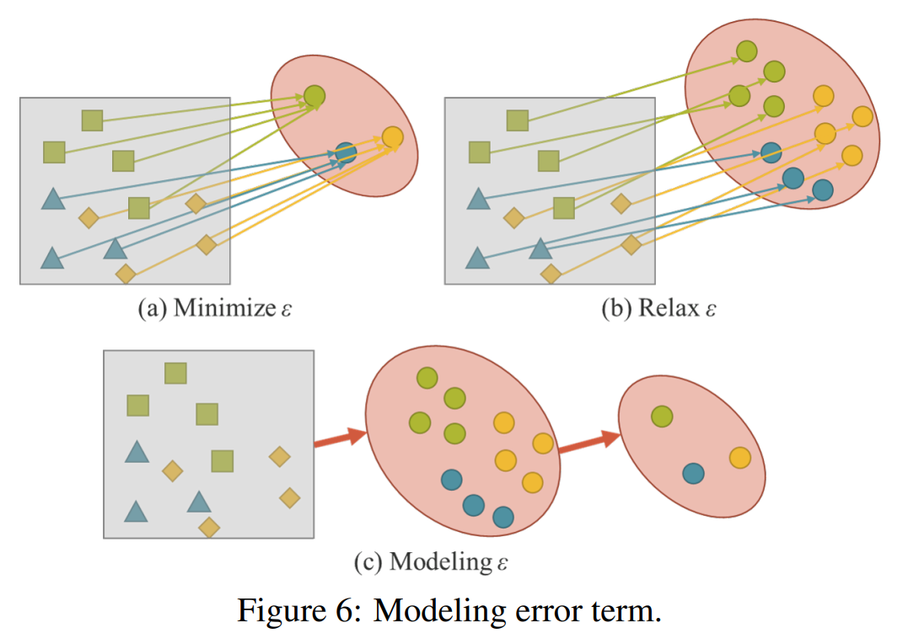
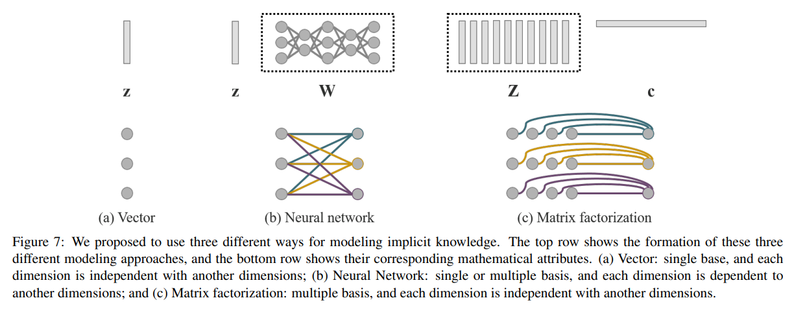

# 论文信息
- 时间：2021
- 期刊：Journal of information science and engineering
- 网络/算法名称：YOLOR
- 意义：统⼀的⽹络来编码隐性知识和显性知识
- 作者：Chien-Yao Wang1, I-Hau Yeh2, and Hong-Yuan Mark Liao1; 1Institute of Information Science, Academia Sinica, Taiwan; 2Elan Microelectronics Corporation, Taiwan
- 实验环境：
- 数据集：
- [返回上一层 README](../README.md)
# 一、解决的问题
1. 摘要
    - ⼈们通过视觉、听觉、触觉以及过去的经验来“理解”世界。⼈类经验可以通过正常学习（我们称之为显性知识）或潜意识（我们称之为隐性知识）来学习。这些通过正常学习或潜意识获得的经验会被编码并存储在⼤脑中。利⽤这些丰富的经验作为⼀个巨⼤的数据库，⼈类可以有效地处理数据，即使它们是事先看不到的。在这篇论⽂中，我们提出了⼀个统⼀的⽹络来编码隐性知识和显性知识，就像⼈脑可以从正常学习和潜意识学习中学习知识⼀样。统⼀⽹络可以⽣成统⼀表⽰，同时服务于各种任务。我们可以在卷积神经⽹络中执⾏内核空间对⻬、预测细化和多任务学习。结果表明，当将隐性知识引⼊神经⽹络时，它有利于所有任务的性能。我们进⼀步分析了从所提出的统⼀⽹络中学习到的隐式表⽰，它显⽰出捕捉不同任务的物理意义的强⼤能⼒。

1. Introduction 问题
    - 如图1 所⽰，⼈类可以从不同的⻆度分析同⼀份数据。然⽽，经过训练的卷积神经⽹络 (CNN) 模型通常只能实现⼀个⽬标。⼀般来说，可以从经过训练的 CNN 中提取的特征通常对其他类型的问题的适应性很差。造成上述问题的主要原因是我们只从神经元中提取特征，⽽没有使⽤CNN中丰富的隐性知识。当真正的⼈脑在运作时，上述隐性知识可以有效地辅助⼤脑执⾏各种任务。
        

    - 内隐知识是指在潜意识状态下学习到的知识。然而，对于内隐学习如何运作以及如何获得内隐知识，目前还没有系统的定义。在神经网络的一般定义中，从浅层获得的特征通常被称为显式知识，从深层获得的特征被称为隐式知识。在本文中，我们将与观测直接对应的知识称为显式知识。至于模型中隐含的与观察无关的知识，我们称之为隐含知识

1. 结论
    - 在本⽂中，我们展⽰了如何构建⼀个集成隐性知识和显性知识的统⼀⽹络，并证明它在单⼀模型架构下对多任务学习仍然⾮常有效。未来，我们会将训练扩展到多模态和多任务，如图12 所⽰。
        

# 二、做出的创新
1. Introduction 创新
    - 我们提出了⼀个统⼀的⽹络来整合隐性知识和显性知识，并使学习模型包含⼀般表⽰，⽽这种⼀般表⽰使⼦表⽰能够适⽤于各种任务。图2.(c) 说明了建议的统⼀⽹络架构。
        

    - 构建上述统⼀⽹络的⽅法是结合压缩感知和深度学习，主要理论基础可以在我们之前的⼯作中找到[16,17,18 ] 。在[16]中，我们证明了通过扩展字典重构残差的有效性。在[17, 18] 中，我们使⽤稀疏编码来重建 CNN 的特征图并使其更加健壮。这项⼯作的贡献总结如下：

        1. 我们提出了⼀个可以完成各种任务的统⼀⽹络，它通过整合隐式知识和显式知识来学习⼀般表⽰，并且可以通过这种⼀般表⽰来完成各种任务。所提出的⽹络以⾮常⼩的额外成本（不到⼀万个参数和计算量）有效地提⾼了模型的性能。

        2. 我们将核空间对⻬、预测细化和多任务学习引⼊到隐性知识学习过程中，并验证了它们的有效性。

        3. 我们分别讨论了使⽤向量、神经⽹络或矩阵分解作为隐性知识建模⼯具的⽅式，同时验证了其有效性。

        4. 我们确认所提出的学习到的隐式表⽰可以准确对应特定的物理特征，并且我们还以视觉⽅式呈现它。我们还证实，如果符合⽬标物理意义的算⼦，可以⽤来整合隐性知识和显性知识，会产⽣事半功倍的效果。

        5. 结合最先进的⽅法，我们提出的统⼀⽹络在⽬标检测⽅⾯实现了与 Scaled-YOLOv4-P7 [15]相当的精度，推理速度提⾼了 88%。

2. Related work
    - 我们对与该研究主题相关的⽂献进⾏了审查。本篇⽂献综述主要分为三个⽅⾯：（1）显式深度学习：将涵盖⼀些可以根据输⼊数据⾃动调整或选择特征的⽅法，（2）隐式深度学习：将涵盖隐式深度学习的相关⽂献知识学习和隐微分导数，以及（3）知识建模：它将列出⼏种可⽤于集成隐性知识和显性知识的⽅法。

    1. Explicit deep learning
        - 显式深度学习可以通过以下⽅式进⾏。其中，Transformer [14,5,20]是⼀种⽅式，主要通过query, key, or value来获取self-attention。Non-local networks [21,4,24]是另⼀种获取注意⼒的⽅式，它主要提取时间和空间上的pair-wise attention。另⼀种常⽤的显式深度学习⽅法[7,25]是通过输⼊数据⾃动选择合适的内核。

    1.  Implicit deep learning
        - 属于隐式深度学习范畴的⽅法主要是隐式神经表征[11]和深度均衡模型[2,3,19] 。前者主要是获取离散输⼊的参数化连续映射表⽰来执⾏不同的任务，后者是将隐式学习转化为残差形式的神经⽹络，并对其进⾏平衡点计算。

    1. Knowledge modeling
        - ⾄于属于知识建模范畴的⽅法，主要包括稀疏表⽰[1,23]和记忆⽹络[22,12] 。前者使⽤范例、predefined over complete或learned dictionary来进⾏建模，⽽后者则依靠组合各种形式的embedding形成记忆，并使记忆能够动态地增加或改变。

3. How implicit knowledge works?
    - 本研究的主要⽬的是进⾏⼀个可以有效训练隐性知识的统⼀⽹络，因此我们将⾸先关注如何训练隐性知识并在后续中快速推理。由于隐式表⽰zi与观察⽆关，我们可以将其视为⼀组常数张量  $Z = {\mathbf{z}_ {1}, \mathbf{z}_ {2}, ..., \mathbf{z}_ {k}}$ 。在本节中，我们将介绍作为常量张量的隐性知识如何应⽤于各种任务。

    1. Manifold space reduction
        - 我们认为，⼀个好的表⽰应该能够在其所属的流形空间中找到合适的投影，并有助于后续的客观任务取得成功。例如，如图3所⽰，如果⽬标类别能够被投影空间中的超平⾯成功分类，那将是最好的结果。在上⾯的例⼦中，我们可以通过投影向量和隐式表⽰的内积来达到流形空间降维的⽬的，有效的实现各种任务。
            

    1. Kernel space alignment
        - 在多任务和多头神经⽹络中，内核空间错位是⼀个常⻅问题，图4.(a) 显⽰了多任务和多头 NN 中内核空间错位的⽰例。为了解决这个问题，我们可以对输出特征和隐式表⽰进⾏加法和乘法运算，从⽽可以对内核空间进⾏平移、旋转和缩放，以对⻬神经⽹络的每个输出内核空间，如图4所⽰。(b)上述操作模式可以⼴泛应⽤于不同领域，例如特征⾦字塔⽹络（FPN）[8]中⼤对象和⼩对象的特征对⻬，利⽤知识蒸馏来整合⼤模型和⼩模型，以及处理零样本域转移和其他问题。
            

    1. More functions
        - 除了可以应⽤于不同任务的功能外，隐性知识还可以扩展成更多的功能。如图5 所⽰，通过引⼊加法，可以使神经⽹络预测中⼼坐标的偏移量。还可以引⼊乘法来⾃动搜索锚的超参数集，这是基于锚的对象检测器经常需要的。此外，可以分别使⽤点乘法和连接法进⾏多任务特征选择，为后续计算设置前置条件。
            

# 三、设计的模型
## 文章附录还有一些详细结构说明

## Implicit knowledge in our unified networks
- 在本节中，我们将⽐较传统⽹络和提出的统⼀⽹络的⽬标函数，并解释为什么引⼊隐式知识对于训练多⽤途⽹络很重要。同时，我们还将详细阐述这项⼯作中提出的⽅法的细节。

1. Formulation of implicit knowledge
    1. Conventional Networks:
        - 对于卷积⽹络训练的⽬标函数，我们可以⽤式（1）表⽰如下：
            $$\begin{align} \begin{split}
            y = f_ {\theta}(\mathbf{x}) + \epsilon \\
            \mathbf{minimize} \quad \epsilon
            \end{split} \end{align}$$
            其中 $\mathbf{x}$ 是观察值， $\theta$ 是神经⽹络的参数集，  $f_ {\theta}$ 表⽰神经⽹络的操作，是误差项， $y$ 是给定任务的⽬标。

        - 在传统神经⽹络的训练过程中，通常会进⾏最⼩化 $\epsilon$ 以使 $f_ {θ}(\mathbf{x})$ 尽可能接近⽬标。这意味着我们期望具有相同⽬标的不同观察是fθ获得的⼦空间中的单个点，如图6(a)所⽰。换句话说，我们期望获得的解空间仅对当前任务 $t_ {i}$ 具有判别性，并且对各种潜在任务中除 $t_ {i}$ 以外的任务具有不变性， $T \ t_ {i}$ ，其中 $T = \{t_ {1}, t_ {2}, ..., t_ {n}\}$ 。

        - 对于通⽤神经⽹络，我们希望得到的表⽰可以服务于属于 $T$ 的所有任务。因此，我们需要放宽 $\epsilon$ 要求，使在流形空间上同时找到每个任务的解决⽅案成为可能，如图6(b) 所⽰。然⽽，上述要求使我们⽆法使⽤简单的数学⽅法，例如单热向量的最⼤值，或欧⽒距离的阈值，来获得 $t_ {i}$ 的解。为了解决这个问题，我们必须对误差项 $\epsilon$ 建模，以找到针对不同任务的解决⽅案，如图6(c) 所⽰。
            

    1. Unified Networks:
        - 为了训练所提出的统⼀⽹络，我们同时使⽤显性和隐性知识对误差项进⾏建模，然后⽤它来指导多⽤途⽹络训练过程。相应的训练⽅程如下：
            $$\begin{align} \begin{split}
            y = f_ {\theta}(\mathbf{x}) + \epsilon + g_ {\phi}(\epsilon_ {ex}(\mathbf{x}),\epsilon_ {im}(\mathbf{z}))\\
            \mathbf{minimize} \quad \epsilon  + g_ {\phi}(\epsilon_ {ex}(\mathbf{x}),\epsilon_ {im}(\mathbf{z}))
            \end{split} \end{align}$$
            其中， $\epsilon_ {ex}$ 和 $\epsilon_ {im}$ 是分别对来自观测 $\mathbf{x}$ 和潜在代码 $\mathbf{z}$ 的显式误差和隐式误差进行建模的运算。 $g_ {\phi}$ 是一种特定任务的运算，用于组合或选择来自显式知识和隐式知识的信息。

        - 有⼀些现有的⽅法来集成显式知识转化为 $f_ {\theta}$ ，因此我们可以将(2)重写为(3)。
            $$\begin{align}
            y = f_ {\theta}(\mathbf{x}) \star g_ {\phi}(\mathbf{z})
            \end{align}$$
            其中 $\star$ 表示一些可能的算子，它们可以组合 $f_ {\theta}$ 和 $g_ {\phi}$ 。在这项工作中，将使用第3节中介绍的运算符，即加法、乘法和级联

        - 如果我们将错误项的推导过程扩展到处理多个任务，我们可以得到以下等式：
            $$\begin{align}
            F(\mathbf{x},\theta,\mathbf{Z},\mathbf{\Phi},\mathbf{Y},\mathbf{\Psi}) = 0
            \end{align}$$
            其中 $\mathbf{Z} = \{ \mathbf{z}_ {1}, \mathbf{z}_ {2}, ..., \mathbf{z}_ {T} \}$ 是⼀组 $T$ 个不同任务的隐式潜在代码。 $\Phi$ 是可⽤于从 $\mathbf{Z}$ ⽣成隐式表⽰的参数。 $\Psi$ ⽤于根据显式表⽰和隐式表⽰的不同组合计算最终输出参数。

        - 对于不同的任务，我们可以使⽤下⾯的公式来获得对所有 $\mathbf{z} \in \mathbf{Z}$ 的预测。
            $$\begin{align}
            d_ {\Psi}(f_ {\theta}(\mathbf{x}), g_ {\phi}(\mathbf{z}),y) = 0
            \end{align}$$
            对于所有任务，我们从⼀个共同的统⼀表⽰ $f_ {\theta}(\mathbf{x})$ 开始，经过任务特定的隐式表⽰ $g_ {\phi}(\mathbf{z})$ ，最后⽤任务特定的鉴别器 $d_ {\Psi}$ 完成不同的任务。

    

2. Modeling implicit knowledge
    - 我们提出的隐性知识可以建模为以下⽅式：

    1. Vector / Matrix / Tensor:
        $$\begin{align}
        \mathbf{z}
        \end{align}$$
        直接⽤向量 $\mathbf{z}$ 作为隐含知识的先验，直接作为隐含表⽰。这时，必须假设各个维度是相互独⽴的。

    1. Neural Network:
        $$\begin{align}
        \mathbf{Wz}
        \end{align}$$
        ⽤向量 $\mathbf{z}$ 作为隐含知识的先验，再⽤权重矩阵 $\mathbf{W}$ 进⾏线性组合或⾮线性化，成为隐含表⽰。这时，必须假设每个维度都是相互依赖的。我们还可以使⽤更复杂的神经⽹络来⽣成隐式表⽰。或者⽤⻢尔可夫链来模拟不同任务之间隐式表⽰的相关性。

    1. Matrix Factorization:
        $$\begin{align}
        \mathbf{Z^{T}c}
        \end{align}$$
        使⽤多个向量作为隐含知识的先验，这些隐含先验基 $\mathbf{Z}$ 和系数 $\mathbf{c}$ 将形成隐含表⽰。我们还可以进⼀步对 $\mathbf{c}$ 做稀疏约束，转化为稀疏表⽰形式。此外，我们还可以对 $\mathbf{Z}$ 和 $\mathbf{c}$ 施加⾮负约束，将它们转换为⾮负矩阵分解 (NMF) 形式。

3. Training
    - 假设我们的模型一开始没有任何先验的隐式知识，也就是说，它不会对显式表示 $f_ {\theta}(\mathbf{x})$ 产生任何影响。当组合运算符 $\star \in \{ addition, concatenation \}$，初始隐式先验 $\mathbf{z}～N(0, \sigma)$ ，以及当合并运算符 $\star$ 是乘法， $\mathbf{z}～N(1, \sigma)$ 。这里， $\sigma$ 是一个非常小的值，接近于零。对于 $\mathbf{z}$ 和 $\phi$ ，在训练过程中都使用反向传播算法进行训练。

4. Inference
    - 由于隐含知识与观察 $\mathbf{x}$ ⽆关，⽆论隐含模型gφ多么复杂，都可以在执⾏推理阶段之前将其简化为⼀组常数张量。换句话说，隐含信息的形成对我们算法的计算复杂度⼏乎没有影响。另外，当上⾯的算⼦是乘法运算时，如果后⾯的层是卷积层，那么我们就⽤下⾯的（9）式来积分。遇到加法算⼦，如果前⼀层是卷积层，没有激活函数，就⽤下图的（10）来积分。
        $$\begin{align}
        \begin{split}
        \mathbf{x}_ {l+1} &= \sigma(W_ {l}(g_ {\phi}(\mathbf{z})\mathbf{x}_ {l}) + b_ {l}) \\
        &= \sigma(W^{'}_ {l}(\mathbf{x}_ {l}) + b_ {l}), where W^{'}_ {l} = W_ {l}g_ {\phi}(\mathbf{z})
        \end{split}
        \end{align}$$
        $$\begin{align}
        \begin{split}
        \mathbf{x}_ {l+1} &= W_ {l}(\mathbf{x}_ {l}) + b_ {l} + g_ {\phi}(\mathbf{z}) \\
        &= W_ {l}(\mathbf{x}_ {l}) + b^{'}_ {l}, where \quad b^{'}_ {l} = b_ {l} + g_ {\phi}(\mathbf{z})
        \end{split}
        \end{align}$$

# 四、实验结果
1. 在使⽤隐式表⽰进⾏特征空间对⻬后，所有包括APS、 APM、 APL在内的性能提升了0.5%左右，这是⼀个⾮常显着的提升。

2. 在特征对⻬实验的隐含知识中，我们看到加法和连接都提⾼了性能，⽽乘法实际上降低了性能。特征对⻬的实验结果完全符合其物理特性，因为它必须处理全局移位和所有个体簇的缩放。在⽤于预测细化实验的隐含知识中，由于级联算⼦会改变输出的维度，因此我们在实验中仅⽐较使⽤加法和乘法算⼦的效果。在这组实验中，应⽤乘法的性能优于应⽤加法。分析原因，我们发现center shift在执⾏预测时使⽤的是加法解码，⽽anchor scale使⽤的是乘法解码。由于中⼼坐标以⽹格为界，影响较⼩，⼈⼯设置的anchor拥有较⼤的优化空间，因此提升更为显着。
## 1、比之前模型的优势

## 2、有优势的原因

## 3、改进空间

# 五、结论

## 1、模型是否解决了目标问题

## 2、模型是否遗留了问题

## 3、模型是否引入了新的问题

# 六、代码

# 读者角度（挖掘文章中没有提到的）：
1. 总结文章发现问题的思路
2. 总结文章改进的思想
3. 总结文章还存在或者可以改进的问题
4. 提出对模型参数和细节的一些思考和讨论