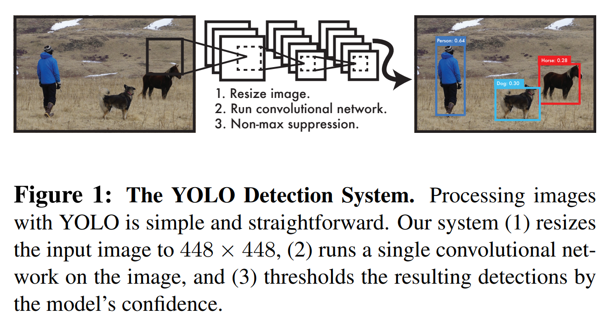
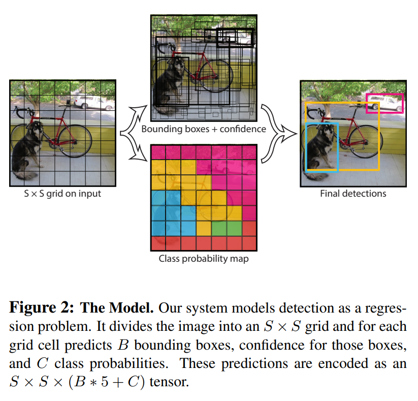
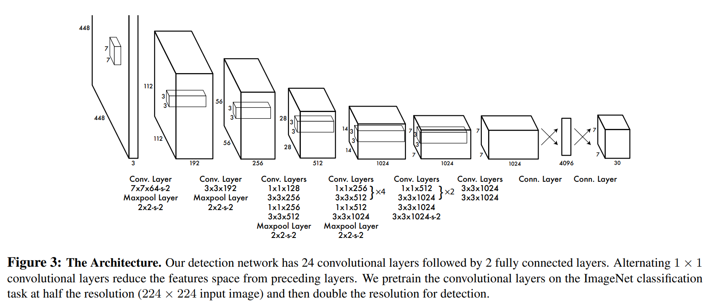

# 论文信息
- 时间：2016
- 期刊：CVPR
- 网络/算法名称：YOLO
- 意义：从R-CNN的两阶段网络变成一个网络
- 作者：Joseph Redmon∗, Santosh Divvala∗†, Ross Girshick¶, Ali Farhadi∗†; University of Washington∗, Allen Institute for AI†, Facebook AI Research¶
- 实验环境：Titan X GPU
- 数据集：
- [返回上一层 README](../README.md)
# 一、解决的问题
1. 摘要：
    - 我们介绍 YOLO，⼀种新的对象检测⽅法。先前关于对象检测的⼯作将分类器重新⽤于执⾏形式检测。相反，我们将对象检测框定为空间分离的边界框和相关类概率的回归问题。在⼀次评估中，单个神经⽹络直接从完整图像预测边界框和类别概率。由于整个检测管道是单个⽹络，因此可以直接在检测性能上进⾏端到端优化。我们的统⼀架构⾮常快。我们的基础 YOLO 模型以每秒 45 帧的速度实时处理图像。⽹络的⼀个较⼩版本，Fast YOLO，每秒处理惊⼈的 155 帧，同时仍然实现其他实时检测器的两倍 mAP。与最先进的检测系统相⽐，YOLO 会产⽣更多的定位错误，但不太可能在背景上预测误报。最后，YOLO 学习了⾮常通⽤的对象表⽰。当从⾃然图像泛化到艺术品等其他领域时，它优于其他检测⽅法，包括 DPM 和 R-CNN。

- ⼈类瞥⼀眼图像，⽴即知道图像中有什么对象、它们在哪⾥以及它们如何相互作⽤。⼈类的视觉系统快速⽽准确，使我们能够执⾏复杂的任务，例如驾驶时⼏乎不需要有意识的思考。快速、准确的物体检测算法将允许计算机在没有专⻔传感器的情况下驾驶汽⻋，使辅助设备能够向⼈类⽤⼾传达实时场景信息，并释放通⽤、响应式机器⼈系统的潜⼒。

- 当前的检测系统重新利⽤分类器来执⾏形式检测。为了检测⼀个物体，这些系统采⽤该物体的分类器，并在测试图像中的不同位置和尺度上对其进⾏评估。可变形部件模型 (DPM) 等系统使⽤滑动窗⼝⽅法，其中分类器在整个图像 [Object Detection with Discriminatively Trained Part Based Models](https://cs.brown.edu/people/pfelzens/talks/mlss.pdf) 上均匀分布的位置运⾏。

- 最近的一些方法，如R-CNN使用区域建议方法，首先在图像中生成潜在的边界框，然后在这些建议的框上运行分类器。分类后，后处理用于细化边界框，消除重复检测，并基于场景中的其他对象重新搜索框(R-CNN)。这些复杂的管道很慢，很难优化，因为每个单独的组件都必须单独训练。

2. 结论
    - 我们介绍了 YOLO，⼀种⽤于对象检测的统⼀模型。我们的模型构建简单，可以训练直接在完整图像上。与基于分类器的⽅法不同，YOLO 是在直接对应于检测性能的损失函数上训练的，并且整个模型是联合训练的。
    
    - Fast YOLO 是⽂献中最快的通⽤⽬标检测器，YOLO 推动了实时⽬标检测的最新技术⽔平。 YOLO 还可以很好地泛化到新领域，使其成为依赖快速、稳健对象检测的应⽤程序的理想选择。

    
# 二、做出的创新
- 我们将⽬标检测重新定义为⼀个单⼀的回归问题，直接从图像像素到边界框坐标和类别概率。使⽤我们的系统，您只需看⼀次 (YOLO) 图像即可预测存在的对象及其位置。
    
- YOLO ⾮常简单：⻅图1。单个卷积⽹络同时预测多个边界框和这些框的类别概率。YOLO 在完整图像上进⾏训练并直接优化检测性能。与传统的对象检测⽅法相⽐，这种统⼀模型有⼏个好处。
    1. ⾸先，YOLO 速度极快。由于我们将检测框定为回归问题，因此我们不需要复杂的管道。我们只需在测试时在新图像上运⾏我们的神经⽹络来预测检测。我们的基础⽹络以每秒 45 帧的速度运⾏，在 Titan X GPU 上没有批处理，⽽快速版本以超过 150 fps 的速度运⾏。这意味着我们可以实时处理流式视频，延迟时间⼩于 25 毫秒。此外，YOLO 的平均精度是其他实时系统的两倍多。
        

    1. 其次，YOLO 对图像进⾏全局推理做出预测。与基于滑动窗⼝和区域建议的技术不同，YOLO 在训练和测试期间看到整个图像，因此它隐式编码有关类别及其外观的上下⽂信息。Fast R-CNN 是⼀种顶级检测⽅法，它会将图像中的背景块误认为是物体，因为它看不到更⼤的上下⽂。与 Fast R-CNN 相⽐，YOLO 产⽣的背景错误数量不到⼀半。

    1. 第三，YOLO 学习对象的泛化表⽰。在对⾃然图像进⾏训练并在艺术作品上进⾏测试时，YOLO 的性能⼤⼤优于 DPM 和 R-CNN 等顶级检测⽅法。由于 YOLO 具有⾼度的通⽤性，因此在应⽤于新领域或意外输⼊时不太可能崩溃。

- YOLO 在准确性上仍然落后于最先进的检测系统。虽然它可以快速识别图像中的物体，但它很难精确定位某些物体，尤其是⼩物体。我们在实验中进⼀步检查这些权衡。

# 三、设计的模型
- 我们将物体检测的独⽴组件统⼀到⼀个神经⽹络中。我们的⽹络使⽤整个图像的特征来预测每个边界框。它还同时预测图像的所有类别的所有边界框。这意味着我们的⽹络对完整图像和图像中的所有对象进⾏全局推理。YOLO 设计⽀持端到端训练和实时速度，同时保持⾼平均精度。

- 我们的系统将输⼊图像划分为 $S \times S$ ⽹格。如果⼀个物体的中⼼落在⼀个⽹格单元中，则该⽹格单元负责检测该物体。

- 每个网格单元预测 $B$ 个边界框和这些框的置信度分数。这些置信度分数反映了模型对盒子包含对象的置信度，以及它认为盒子预测的准确度。形式上，我们将置信度定义为 $Pr(Object)*IOU^{truth}_ {pred}$ 。如果该单元格中不存在对象，则置信度得分应为零。否则，我们希望置信度分数等于预测框和真值之间的交集除以联合（IOU）。

- 每个边界框由5个预测组成： $x、y、w、h$ 和置信度。 $(x，y)$ 坐标表示相对于网格单元边界的框的中心。相对于整个图像预测宽度和高度。最后，置信度预测表示预测框和任何地面真实框之间的IOU

- 每个网格单元还预测 $C$ 个条件类概率 $Pr(Class_ {i} | Object)$。这些概率取决于包含对象的网格单元。我们只预测每个网格单元的一组类概率，而不考虑框 $B$ 的数量。

- 在测试时，我们将条件类概率和单个盒子置信度预测相乘：
    $$\begin{align}
    Pr(Class_ {i} | Object) * Pr(Object) * IOU^{truth}_ {pred} = Pr(Class_ {i}) * IOU^{truth}_ {pred}
    \end{align}$$
    这为我们提供了每个盒子的特定类别的置信度分数。这些分数编码了该类出现在框中的概率以及预测框与对象的匹配程度。
    

- 对于PASCAL VOC的YOLO评估，我们使用 $S=7，B=2$ 。PASCAL VOC有20个标签类别，因此 $C=20$ 。我们的最终预测是 $7 \times 7 \times 30$ 张量。

1. Network Design
    - 我们将该模型实现为卷积神经⽹络，并在PASCAL VOC 检测数据集上对其进⾏评估。⽹络的初始卷积层从图像中提取特征，⽽全连接层预测输出概率和坐标。

    - 我们的⽹络架构受到⽤于图像分类的 GoogLeNet 模型的启发。我们的⽹络有 24 个卷积层，后⾯跟着 2 个全连接层。我们不使⽤ GoogLeNet 使⽤的初始模块，⽽是简单地使⽤ $1 \times 1$ 缩减层，然后是 $3 \times 3$ 卷积层，类似于[Network in network](https://arxiv.org/pdf/1312.4400.pdf)。完整的⽹络如图 3 所⽰。
        

    - 我们还训练了⼀个快速版本的 YOLO，旨在突破快速⽬标检测的界限。 Fast YOLO 使⽤的神经⽹络具有更少的卷积层（9 个⽽不是 24 个）以及这些层中更少的过滤器。除了⽹络的⼤⼩，YOLO 和 Fast YOLO 的所有训练和测试参数都相同。

    - 我们⽹络的最终输出是预测的 $7 \times 7 \times 30$ 张量。

2. Training
    - 我们在 ImageNet 1000 级竞赛数据集上预训练了我们的卷积层。对于预训练，我们使⽤图3中的前 20 个卷积层，然后是⼀个平均池化层和⼀个完全连接的层。我们对该⽹络进⾏了⼤约⼀周的训练，并在 ImageNet 2012 验证集上实现了 88% 的单⼀作物前 5 准确度，与 Caffe 模型库中的 GoogLeNet 模型相当。我们使⽤ [Darknet](http://pjreddie.com/darknet/) 框架进⾏所有训练和推理。

    - 然后我们转换模型以执⾏检测。[Object Detection Networks on Convolutional Feature Maps](https://arxiv.org/pdf/1504.06066.pdf)表明将卷积层和连接层添加到预训练⽹络可以提⾼性能。按照他们的例⼦，我们添加了四个卷积层和两个具有随机初始化权重的全连接层。检测通常需要细粒度的视觉信息，因此我们将⽹络的输⼊分辨率从 224 × 224 增加到 448 × 448。

    - 我们的最后⼀层预测类别概率和边界框坐标。我们通过图像宽度和⾼度对边界框宽度和⾼度进⾏归⼀化，使它们落在 0 和 1 之间。我们将边界框 $x$ 和 $y$ 坐标参数化为特定⽹格单元位置的偏移量，因此它们也被限制在 0 和 1 之间。

    - 我们对最后⼀层使⽤线性激活函数，所有其他层使⽤以下泄漏整流线性激活：
        $$\begin{align}
        \phi(x) = \left\{ 
        \begin{aligned}
        &x,   &   &if x > 0 \\
        &0.1x,  &   &otherwise, 
        \end{aligned}
        \right.
        \end{align}$$

    - 我们优化我们的输出中的平⽅和误差模型。我们使⽤平⽅和误差是因为它很容易优化，但是它并不完全符合我们最⼤化平均精度的⽬标。它对定位误差和分类误差进⾏同等加权，这可能并不理想。此外，在每个图像中，许多⽹格单元不包含任何对象。这会将这些单元格的“置信度”分数推向零，通常会压倒包含对象的单元格的梯度。这可能会导致模型不稳定，导致训练在早期出现分歧。

    - 为了解决这个问题，我们增加了边界框坐标预测的损失，并减少了不包含对象的框的置信度预测的损失。我们使⽤两个参数 $\lambda_ {coord}$ 和 $\lambda_ {noobj}$ 来实现这⼀点。我们设置 $\lambda_ {coord} = 5$ 和 $\lambda_ {noobj} = .5$ 。

    - Sum-squared error 也对⼤检测框和⼩检测框中的错误进⾏同等加权。我们的误差指标应该反映⼤检测框中的⼩偏差⽐⼩检测框中的⼩偏差更重要。为了部分解决这个问题，我们预测边界框宽度和⾼度的平⽅根⽽不是直接预测宽度和⾼度。

    - YOLO 预测每个⽹格单元的多个边界框。我们在 ImageNet 1000 级竞赛数据集上预训练了我们的卷积层。对于预训练，我们使⽤图3中的前 20 个卷积层，然后是⼀个平均池化层和⼀个完全连接的层。我们对该⽹络进⾏了⼤约⼀周的训练，并在 ImageNet 2012 验证集上实现了 88% 的单⼀作物前 5 准确度，与 Caffe 模型库中的 GoogLeNet 模型相当。我们使⽤ Darknet 框架进⾏所有训练和推理。在训练时，我们只希望⼀个边界框预测器负责每个对象。我们分配⼀个预测器“负责”预测⼀个对象，基于该预测具有最⾼的当前 IOU 与基本事实。这导致边界框预测器之间的专业化。每个预测器在预测特定⼤⼩、纵横⽐或对象类别⽅⾯变得更好，从⽽提⾼整体召回率。

    - 在培训期间，我们优化了以下多部分loss function:
        $$\begin{align}
        \lambda_ {coord} &\sum^{S^{2}}_ {i=0} \sum^{B}_ {j=0} \mathbb{1}^{obj}_ {ij}[(x_ {i} - \hat{x}_ {i})^{2} + (y_ {i} - \hat{y}_ {i})^{2}] \notag \\
        &+\lambda_ {coord} \sum^{S^{2}}_ {i=0} \sum^{B}_ {j=0} \mathbb{1}^{obj}_ {ij}[(\sqrt{w_ {i}} - \sqrt{\hat{x}_ {i}})^{2} + (\sqrt{h_ {i}} - \sqrt{\hat{h}_ {i}})^{2}] \notag \\
        &+\sum^{S^{2}}_ {i=0} \sum^{B}_ {j=0} \mathbb{1}^{obj}_ {ij}(C_ {i} - \hat{C}_ {i})^{2} \notag \\
        &+\lambda_ {noobj} \sum^{S^{2}}_ {i=0} \sum^{B}_ {j=0} \mathbb{1}^{noobj}_ {ij}(C_ {i} - \hat{C}_ {i})^{2} \notag \\
        &+\sum^{S^{2}}_ {i=0} \mathbb{1}^{obj}_ {i} \sum_ {c \in classes}(p_ {i}(c) - \hat{p}_ {i}(c))^{2}
        \end{align}$$
        其中 $\mathbb{1}^{obj}_ {i}$ 表示对象是否出现在单元格 $i$ 中， $\mathbb{1}^{obj}_ {ij}$ 表示单元格 $i$ 中的第 $j$ 个边界框预测器对该预测“负责”

    - 请注意，如果对象存在于该⽹格单元中，损失函数只会惩罚分类错误（因此前⾯讨论的条件类概率）。如果该预测器对地⾯真值框“负责”（即具有该⽹格单元中任何预测器的最⾼ IOU），它也只会惩罚边界框坐标误差。

    - 我们在PASCAL VOC 2007 和 2012 的训练和验证数据集上对⽹络进⾏了⼤约 135 个 epoch 的训练。在 2012 年进⾏测试时，我们还包括了 VOC 2007 测试数据进⾏训练。在整个训练过程中，我们使⽤ 64 的批量⼤⼩、0.9 的动量和 0.0005 的衰减。

    - 我们的学习率计划如下：对于第⼀个 epoch，我们慢慢地将学习率从 $10^{-3}$ 提⾼到 $10^{-2}$ 。如果我们以⾼学习率开始，我们的模型通常会因梯度不稳定⽽发散。我们继续⽤ $10^{-2}$ 训练 75 个时期，然后⽤ $10^{-3}$ 训练 30 个时期，最后⽤ $10^{-4}$ 训练30 个时期。

    - 为了避免过度拟合，我们使⽤ dropout 和⼴泛的数据增强。在第⼀个连接层之后的 rate = .5 的 dropout 层会阻⽌层之间的共同适应[Improving neural networks by preventing co-adaptation of feature detectors](https://arxiv.org/pdf/1207.0580.pdf)。对于数据增强，我们引⼊了⾼达原始图像⼤⼩ 20% 的随机缩放和平移。我们还在 HSV 颜⾊空间中将图像的曝光和饱和度随机调整了 1.5 倍。

3. Inference
    - 就像在训练中⼀样，预测测试图像的检测只需要⼀次⽹络评估。在PASCAL VOC 上，⽹络预测每个图像 98 个边界框和每个框的类别概率。 YOLO 在测试时⾮常快，因为它只需要⼀个⽹络评估，这与基于分类器的⽅法不同。

    - ⽹格设计在边界框预测中强制实施空间多样性。通常很清楚⼀个对象落⼊哪个⽹格单元，⽹络只为每个对象预测⼀个框。但是，⼀些⼤的物体或附近的物体多个单元格的边界可以被多个单元格很好地定位。⾮最⼤抑制可⽤于修复这些多重检测。虽然不像 R-CNN 或 DPM 那样对性能⾄关重要，但⾮最⼤抑制会在 mAP 中增加 2-3%。

4. Limitations of YOLO
    - YOLO 对边界框预测施加了很强的空间约束，因为每个⽹格单元只能预测两个框并且只能有⼀个类别。这种空间约束限制了我们的模型可以预测的附近物体的数量。我们的模型很难处理成群出现的⼩物体，例如⻦群。

    - 由于我们的模型学习从数据中预测边界框，因此它很难泛化到具有新的或不寻常的纵横⽐或配置的对象。我们的模型还使⽤相对粗糙的特征来预测边界框，因为我们的架构具有来⾃输⼊图像的多个下采样层。

    - 最后，当我们训练⼀个接近检测性能的损失函数时，我们的损失函数对⼩边界框和⼤边界框的错误处理相同。⼤检测框中的⼩错误通常是良性的，但⼩检测框中的⼩错误对 IOU 的影响要⼤得多。我们的主要错误来源是不正确的本地化。

# 四、实验结果

## 1、比之前模型的优势
- ⽬标检测是计算机视觉中的核⼼问题。检测管道通常从输⼊图像中提取⼀组稳健的特征开始([Haar](https://ieeexplore.ieee.org/stamp/stamp.jsp?tp=&arnumber=710772)、 [SIFT](https://www.cs.ubc.ca/~lowe/papers/iccv99.pdf)、[HOG](https://hal.inria.fr/inria-00548512/file/hog_cvpr2005.pdf)、[卷积特征](https://www.semanticscholar.org/reader/b8de958fead0d8a9619b55c7299df3257c624a96))。然后，分类器[Robust real-time object detection, An extended set of haar-like features for rapid object detection, R-CNN, Object detection with discriminatively trained part
based models]或定位器[Learning to localize objects with structured output regression, Overfeat]⽤于识别特征空间中的对象。这些分类器或定位器在整个图像或图像中的某些区域⼦集上以滑动窗⼝⽅式运⾏[Selective search for object recognition、Region-based segmentation and object detection、Edge boxes: Locating object proposals from edges] 。我们将 YOLO 检测系统与⼏个顶级检测框架进⾏⽐较，突出关键相似点和不同点

1. Deformable parts models
    - 可变形部件模型 (DPM) 使⽤滑动窗⼝⽅法进⾏对象检测。 DPM 使⽤不相交的管道来提取静态特征、对区域进⾏分类、预测⾼分区域的边界框等。我们的系统⽤单个卷积神经⽹络替换了所有这些不同的部分。该⽹络同时执⾏特征提取、边界框预测、⾮极⼤值抑制和上下⽂推理。⽹络不是静态特征，⽽是在线训练特征并针对检测任务优化它们。我们的统⼀架构导致⽐ DPM 更快、更准确的模型。

1. R-CNN
    - R-CNN 及其变体使⽤区域建议⽽不是滑动窗⼝来查找图像中的对象。可选择的搜索⽣成潜在的边界框，卷积⽹络提取特征，SVM 对框进⾏评分，线性模型调整边界框，⾮最⼤抑制消除重复检测。这个复杂管道的每个阶段都必须独⽴精确调整，并且最终系统⾮常慢，在测试时每张图像花费超过 40 秒。

    - YOLO 与 R-CNN 有⼀些相似之处。每个⽹格单元提出潜在的边界框并使⽤卷积特征对这些框进⾏评分。然⽽，我们的系统对⽹格单元提案施加了空间限制，这有助于减少对同⼀对象的多次检测。我们的系统还提出了更少的边界框，每张图像只有 98 个，⽽选择性搜索⼤约有 2000 个。最后，我们的系统将这些单独的组件组合成⼀个单⼀的、联合优化的模型。

1. Other Fast Detectors
    -  R-CNN关注通过共享计算和使⽤神经⽹络提出区域⽽不是选择性搜索来加速 R-CNN 框架。虽然它们提供了⽐ R-CNN 更快的速度和准确性改进，但两者仍然缺乏实时性能。

    - 许多研究⼯作都集中在加速 DPM 管道上。它们加速 HOG 计算，使⽤级联，并将计算推向 GPU。然⽽，只有 30Hz DPM 实际上是实时运⾏的。

    - YOLO 没有尝试优化⼤型检测管道的各个组件，⽽是完全抛弃了管道并且设计速度很快。

    - 可以对⼈脸或⼈等单⼀类别的检测器进⾏⾼度优化，因为它们需要处理的变化要少得多。YOLO 是⼀种通⽤检测器，可以学习同时检测各种对象。

1. Deep MultiBox
    - 与 R-CNN 不同，Szegedy 等⼈。训练卷积神经⽹络来预测感兴趣区域，⽽不是使⽤选择性搜索。 MultiBox 还可以通过将置信度预测替换为单个类别预测来执⾏单个对象检测。然⽽，Multi Box 不能执⾏⼀般的对象检测，仍然只是更⼤检测管道中的⼀个部分，需要进⼀步的图像块分类。 YOLO 和 MultiBox 都使⽤卷积⽹络来预测图像中的边界框，但 YOLO 是⼀个完整的检测系统。

1. OverFeat
    - Sermanet 等⼈。训练⼀个卷积神经⽹络来执⾏定位并调整该定位器来执⾏检测。 OverFeat 有效地执⾏滑动窗⼝检测，但它仍然是⼀个不相交的系统。 Over Feat 针对定位⽽⾮检测性能进⾏了优化。与 DPM ⼀样，定位器在进⾏预测时只会看到本地信息。 OverFeat ⽆法推断全局上下⽂，因此需要⼤量的后处理才能产⽣连贯的检测。

1. MultiGrasp
    - 我们的⼯作在设计上相似Redmon 等⼈[Real-time grasp detection using convolutional neural networks](https://arxiv.org/pdf/1412.3128.pdf) 的抓取检测。我们的边界框预测⽹格⽅法基于 MultiGrasp 系统，⽤于回归到抓取。然⽽，抓取检测⽐对象检测简单得多。 MultiGrasp 只需要为包含⼀个对象的图像预测单个可抓取区域。它不必估计物体的⼤⼩、位置或边界或预测它的类别，只需找到适合抓取的区域。 YOLO 预测图像中多个类别的多个对象的边界框和类别概率。

## 2、有优势的原因

## 3、改进空间

# 五、结论

## 1、模型是否解决了目标问题

## 2、模型是否遗留了问题

## 3、模型是否引入了新的问题

# 六、代码

# 读者角度（挖掘文章中没有提到的）：
1. 总结文章发现问题的思路
2. 总结文章改进的思想
3. 总结文章还存在或者可以改进的问题
4. 提出对模型参数和细节的一些思考和讨论