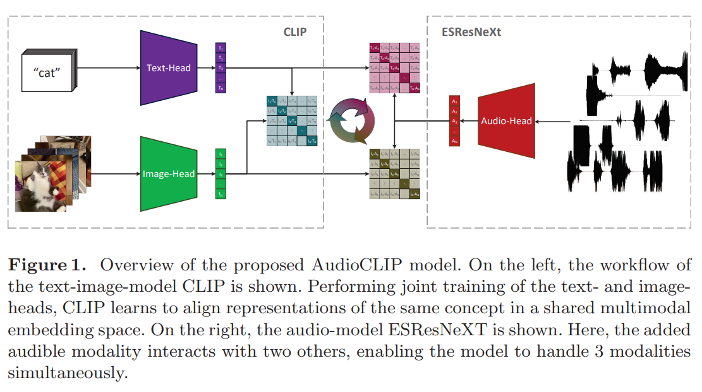

# 论文信息
- 时间：2021
- 期刊：GCPR
- 网络名称： AudioCLIP
- 意义：CLIP进入语音领域
- 作者：
- 实验环境：
- 数据集：
- [返回上一层 README](../README.md)
# 一、解决的问题

# 二、做出的创新

1. 三个模态
    - 文本
    - 视频
    - 语音
2. 视觉和文本沿用CLIP
3. 语音部分：
    - 加入语音编码器（ESResNet）
    - 得到语义特征
4. 三个模态两两算相似度矩阵，然后相加
# 三、设计的模型

# 四、实验结果

## 1、比之前模型的优势

## 2、有优势的原因

## 3、改进空间

# 五、结论

## 1、模型是否解决了目标问题

## 2、模型是否遗留了问题

## 3、模型是否引入了新的问题

# 六、代码

# 读者角度（挖掘文章中没有提到的）：
1. 总结文章发现问题的思路
2. 总结文章改进的思想
3. 总结文章还存在或者可以改进的问题
4. 提出对模型参数和细节的一些思考和讨论