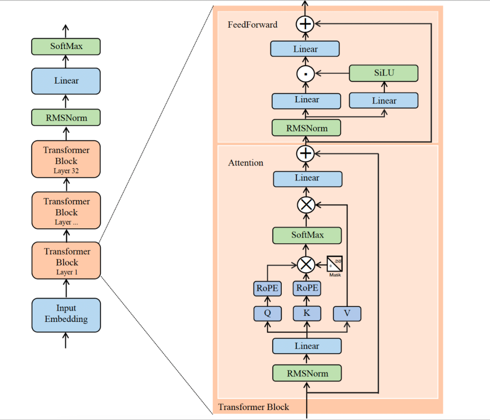
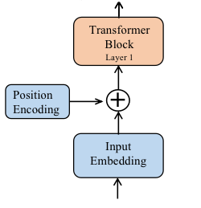
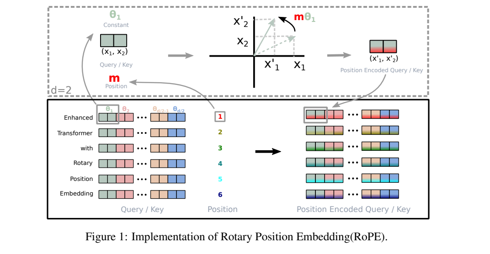
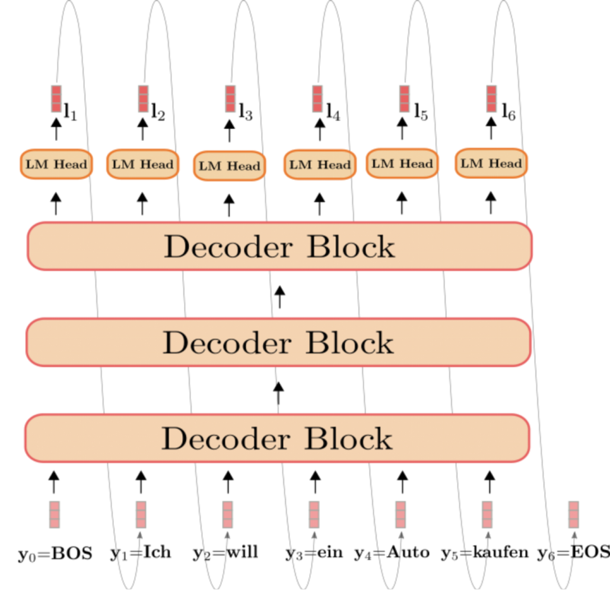
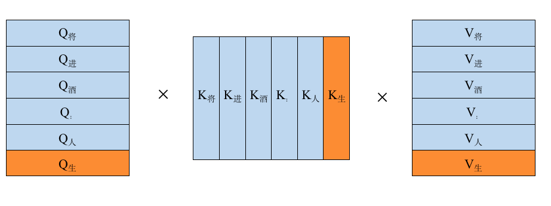
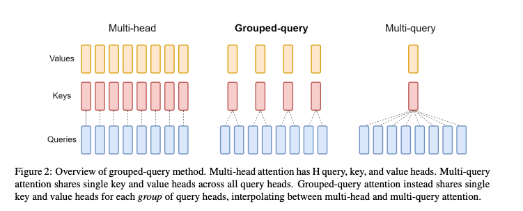

## 目录

- [0 前言](#0-前言)
- [1 处理流程](#1-处理流程)
    - [1.1 Code](#11-code)
- [2 模型结构](#2-模型结构)
    - [2.1 RMSNorm](#21-rmsnorm)
    - [2.2 RoPE](#22-rope)
        - [2.2.1 绝对位置编码](#221-绝对位置编码)
        - [2.2.2 旋转位置编码](#222旋转位置编码)
        - [2.2.3 RoPE Code](#223-rope-code)
    - [2.3 KV Cache & GQA](#23-kv-cache--gqa)
        - [2.3.1 KV Cache](#231-kv-cache)
        - [2.3.2 MQA & GQA](#232-mqa--gqa)
        - [2.3.3 Code](#233-code)
    - [2.4 FeedForward](#24-feedforward)
- [参考资料](#参考资料)
- [返回上一层 README](../README.md)

## 0 前言

LLM(Large Language Model)应该是今年深度学习领域一项具有革命性的技术突破，如果你尝试使用过OpenAI的ChatGPT3.5那么你一定会惊叹AI的强大。而对于这样具有"里程碑"意义的科学工作，笔者向来是非常感兴趣的，所以本篇blog就来聊聊LLM是如何work的～

一如既往，笔者会更关注该如何高效部署推理LLM，而非训练。而要想更好的部署推理模型，笔者始终觉得第一步应该是要熟悉model结构是如何，推理过程及前后处理又是如何，我们不能想当然的以为它大概是什么样子，所以本文就结合code一起来看一看，所谓纸上得来终觉浅  绝知此事要躬行

因为ChatGPT3.5/4没有开源，所以本文选择Meta AI半开源的LLM 模型  Llama 2，该模型也是Hugging Face open_llm_leaderboard的榜首模型

> 所谓半开源即只有inference过程没有train过程

老样子：

- paper ：https://arxiv.org/abs/2307.09288
    
- code   ：https://github.com/facebookresearch/llama
    
- 笔者逐行注释的code ：https://github.com/sunkx109/llama
    

## 1 处理流程

首先在了解Llama 2模型结构细节之前，我们先来看一看大语言模型通常的处理流程：

1. **输入数据**：LLM的输入数据是一段文本，可以是一个句子或一段话。文本通常被表示成单词或字符的序列。
    
    ```
    [君不见黄河之水天上来，奔流到海不复回。君不见高堂明镜悲白发，朝如青丝暮成雪。...五花马、千金裘，呼儿将出换美酒，与尔同销万古愁]
    ```
    
2. **Tokenization**：之后需要将文本进行Tokenization，将其切分成单词或字符，形成Token序列。之后再将文本映射成模型可理解的输入形式，将文本序列转换为整数索引序列(这个索引就是单词或字符在语料库中的index)，这个过程通常由一些开源的文本Tokenzier工具，如sentencepiece等来处理
    
    ```
    序列化-> 
    ['BOS','君','不','见','黄','河','之','水','天','上','来','，' ,'奔','流','到'...'与','尔','同','销','万','古','愁','EOS']
    
    假设语料库索引化->
    ['BOS','10','3','67','89','21','45','55','61','4','324','565' ,'789','6567','786'...'7869','9','3452','563','56','66','77','EOS']
    ```
    
3. **Embedding**：文本信息经过Tokenization之后变成了token序列，而Embedding则继续将**每个**Token映射为一个实数向量，为Embedding Vector
    
    ```
    'BOS'-> [p_{00},p_{01},p_{02},...,p_{0d-1}]
    '10' -> [p_{10},p_{11},p_{12},...,p_{1d-1}]
    '3'  -> [p_{20},p_{21},p_{22},...,p_{2d-1}]
    ...
    'EOS'-> [p_{n0},p_{n1},p_{n2},...,p_{nd-1}]
    ```
    
4. **位置编码**：对于Token序列中的每个位置，添加位置编码（Positional Encoding）向量，以提供关于Token在序列中位置的信息。位置编码是为了区分不同位置的Token，并为模型提供上下文关系的信息。
    
    ```
    [p_{00},p_{01},p_{02},...,p_{0d-1}]       [pe_{00},pe_{01},pe_{02},...,pe_{0d-1}]
    [p_{10},p_{11},p_{12},...,p_{1d-1}]       [pe_{10},pe_{11},pe_{12},...,pe_{1d-1}]
    [p_{20},p_{21},p_{22},...,p_{2d-1}]    +  [pe_{20},pe_{21},pe_{22},...,pe_{2d-1}]
    ...                                       ...  
    [p_{n0},p_{n1},p_{n2},...,p_{nd-1}]       [pe_{n0},pe_{n1},pe_{n2} ,...,pe_{nd-1}]
    ```
    
5. **Transformer** ：在生成任务中，模型只需要用到Transformer 的decoder阶段，即**Decoder-Only**，比如GPT、LLaMA 都是。
    
6. **自回归生成**：在生成任务中，使用自回归（Autoregressive）方式，即逐个生成输出序列中的每个Token。在解码过程中，每次生成一个Token时，使用前面已生成的内容作为上下文，来帮助预测下一个Token。
    
    ```python
    model = LLaMA2()
    def generate(inputs, n_tokens_to_generate):    
        for _ in range(n_tokens_to_generate): # auto-regressive decode loop        
            output = model(inputs) # model forward pass        
            next = np.argmax(output[-1]) # greedy sampling        
            inputs.append(next) # append prediction to input    
        return inputs[len(inputs) - n_tokens_to_generate :]  # only return generated tokens
    input = [p0, p1,p2]  #对应['BOS','君','不']
    output_ids = generate(input, 3) # 假设生成 ['p3','p4','p5']
    output_ids = decode(output_ids) # 通过Tokenization解码
    output_tokens = [vocab[i] for i in output_ids] # "见" "黄" "河"
    ```
    
7. **输出处理**：生成的Token序列通过一个输出层，通常是线性变换加上Softmax函数，将每个位置的概率分布转换为对应Token的概率。根据概率，选择概率最高的Token或者作为模型的预测结果。或者其他的的方法生成next token ,比如:
    
    ```python
    def sample_top_p(probs, p):    
        #从给定的概率分布中采样一个token，采样的方式是先对概率进行排序，然后计算累积概率，    
        #然后选择累积概率小于p的部分，最后在这部分中随机选择一个token。    
        probs_sort, probs_idx = torch.sort(probs, dim=-1, descending=True) #给定的概率降序排序    
        probs_sum = torch.cumsum(probs_sort, dim=-1) #从第一个元素开始，依次将序列中的每个元素与前面所有元素的和相加得到的    
        mask = probs_sum - probs_sort > p     
        probs_sort[mask] = 0.0 #将累计和减去当前值>p的地方全部置0,留下来的就是概率较大的    
        probs_sort.div_(probs_sort.sum(dim=-1, keepdim=True)) #归一化下    
        next_token = torch.multinomial(probs_sort, num_samples=1) # 从归一化之后的样本抽取一个样本    
        next_token = torch.gather(probs_idx, -1, next_token) #从原始probs_idx找到next_token所对应的index    
        return next_token
    ```
    
8. **重复生成**：在生成任务中，可以重复以上的自回归生成过程，生成多个Token，直到遇到终止标记（如句号或结束符号）或达到预设的最大输出长度。
    

### 1.1 Code

本段代码在`llama/generation.py`中的generate函数，为了便于梳理逻辑笔者这里做了一些裁剪

```python
@torch.inference_mode()
def generate(prompt_tokens: List[List[int]], #提示的tokens    
    max_gen_len: int, #最大生成长度    
    temperature: float = 0.6,    
    top_p: float = 0.9,    
    logprobs: bool = False,    
    echo: bool = False,
    ) -> Tuple[List[List[int]], Optional[List[List[float]]]]:    
        ...    
        min_prompt_len = min(len(t) for t in prompt_tokens) # 提示句子中最短的提示长度    
        max_prompt_len = max(len(t) for t in prompt_tokens) # 提示句子中最长的提示长度    
        ...    
        total_len = min(params.max_seq_len, max_gen_len + max_prompt_len) #最终要生成字总长度    
        pad_id = self.tokenizer.pad_id #填充字，在tokenizer中定义的填充字    
        # 生成一个shape 为(提示token的组数,total_len) 初始字符为pad_id的tokens    
        tokens = torch.full((bsz, total_len), pad_id, dtype=torch.long, device="cuda")    
        ...# 接着将prompt_tokens填充至tokens    
        prev_pos = 0 #初始位置为0    
        eos_reached = torch.tensor([False] * bsz, device="cuda") # 用于判断prompt中的每个句子是否已经处理完成    
        input_text_mask = tokens != pad_id #mask 标记那些不是填充字的地方    
        for cur_pos in range(min_prompt_len, total_len):        
            #初始时加载prompt部分进行预测第一个生成的token        
            logits = self.model.forward(tokens[:, prev_pos:cur_pos], prev_pos) # 以每个句子中的[prev_pos:cur_pos]部分作为输入去推理        
            if logprobs:            
                # 如果开启了计算概率，就会把当前输出的序列logits，与原始提示中的序列右移一位之后            
                token_logprobs[:, prev_pos + 1 : cur_pos + 1] = -F.cross_entropy(                
                    input=logits.transpose(1, 2),                
                    target=tokens[:, prev_pos + 1 : cur_pos + 1], #shape=(bst,cur_pos-prev_pos)                
                    reduction="none",                
                    ignore_index=pad_id, #这里需要注意一下，ignore_index参数的作用是忽略target中为pad_id所对应的logits分量                                     
                                         #也就说当target右移到了pad_id，那么他与logits计算的loss不对整体loss产生影响，也就是你预测的是啥就是啥                                     
                                         #target也不知道正确答案了            
                )        
            if temperature > 0:            
                probs = torch.softmax(logits[:, -1] / temperature, dim=-1) #带温度系数的softmax            
                next_token = sample_top_p(probs, top_p) #按sample_top_p的方式取next_token        
            else:            
                next_token = torch.argmax(logits[:, -1], dim=-1) #之间取概率最大的next_token        
            # only replace token if prompt has already been generated        
            ...#再将生成的next_token填入cur_pos位置        
            tokens[:, cur_pos] = next_token        
            prev_pos = cur_pos        
            ... #更改eos_reached的值，但所有句子全部生成完毕时退出 
            
#最后按照生成的tokens的顺序返回即可
```

## 2 模型结构

可以说目前主流的LLM处理模型都是基于Transformer而进行构建的，Llama 2也不例外，而LLM这种生成式的任务是根据给定输入文本序列的上下文信息预测下一个单词或token，所以LLM模型通常只需要使用到Transformer Decoder部分，而所谓Decoder相对于Encoder就是在计算Q\*K时引入了Mask以确保当前位置只能关注前面已经生成的内容。

> 笔者在之前写过一篇[关于Vision Transformer的解读](http://mp.weixin.qq.com/s?__biz=MzU2NzE2MjE2Nw==&mid=2247484003&idx=1&sn=0572c32793dd6f9a9c6c5426f09fedaf&chksm=fca0263bcbd7af2d7726ad0bb1b3e4264843839b5bcbd593ec93a2d89ae0f886ea3b2c591487&scene=21#wechat_redirect)，ViT就是典型的Transformer Encoder，有兴趣的可以自行对比一下差异



Llama 2的模型结构与标准的Transformer Decoder结构基本一致，主要由32个 Transformer Block 组成，不同之处主要包括以下几点：

1. 前置的RMSNorm层
    
2. Q在与K相乘之前，先使用RoPE进行位置编码
    
3. K V Cache，并采用Group Query Attention
    
4. FeedForward层
    

那么下文将结合具体的代码来展开聊一聊这些差异

### 2.1 RMSNorm

在之前的Vision Transformer我们提到过，Transformer中的Normalization层一般都是采用LayerNorm来对Tensor进行归一化，LayerNorm的公式如下

$$\begin{equation} LayerNorm : y=\frac{x-E[x]}{\sqrt{Var[x]+\epsilon}} * \gamma + \beta \end{equation}$$
$$\begin{equation} E[x]=\frac{1}{N} \sum^{N}_ {i=1}x_ {i} \end{equation}$$
$$\begin{equation} Var[x]=\frac{1}{N}\sum^{N}_ {i=1}(x_ {i} - E[x])^{2} \end{equation}$$
    

而RMSNorm就是LayerNorm的变体，RMSNorm省去了求均值的过程,也没有了偏置 $\beta$ ，即

$$\begin{equation} RMSNorm:y=\frac{x}{\sqrt{Mean(x^2)+\epsilon}} * \gamma \end{equation}$$
$$\begin{equation} Mean(x^2)=\frac{1}{N}\sum^{N}_ {i=1}x^{2}_ {i} \end{equation}$$             

> 其中 $\gamma$ 和 $\beta$ 为可学习的参数

```python
# RMSNorm
class RMSNorm(torch.nn.Module):    
    def __init__(self, dim: int, eps: float = 1e-6):        
        super().__init__()        
        self.eps = eps # ε        
        self.weight = nn.Parameter(torch.ones(dim)) #可学习参数γ    
    
    def _norm(self, x):        
        # RMSNorm        
        return x * torch.rsqrt(x.pow(2).mean(-1, keepdim=True) + self.eps)    
        
    def forward(self, x):        
        output = self._norm(x.float()).type_as(x)        
        return output * self.weight
```

### 2.2 RoPE

Llama 2 在对序列进行位置编码时，也与标准Transformer不一样，Llama 2的位置编码在每个Attention层中分别对 $Q K$ 进行RoPE位置编码，而不是在Transformer Block之前进行一次位置编码，也就是说每次计算Attention时都分别要对 $Q K$ 做位置编码(llama 2 官方代码中是这么干的)。

一次我们知道输入数据经过tokenization之后，会得到一组单词索引序列 $\lbrace w_ {0}, w_ {1}, w_ {2},..., w_ {n} \rbrace$ ，之后经过embedding处理后也就变成了 $\lbrace x_ {0}, x_ {1}, x_ {2},..., x_ {n} \rbrace$ ，embedding后的序列通过Linear层将输入数据 $x_ {i}$ 转换为对应的 $q_ {i}, k_ {i}, v_ {i}$ ，之后便会对 $q_ {i}, k_ {i}$ 两者做RoPE位置编码，之后便计算Attention

> 其中 $x_ {i}$ 为第 $i$ 个单词索引序列所对应的 $d$ 维词嵌入向量 $x_ {i_ {0}}, x_ {i_ {1}}, x_ {i_ {2}},..., x_ {i_ {d-1}}$ 

#### 2.2.1 绝对位置编码

在标准的Transformer中通常是在整个网络进入Transformer Block之前做一个位置编码，如下图所示



比较经典的位置编码用公式表达就是，其中 $p_ {i,2t}$ 表示第`i`嵌入向量 $x_ {i}$ 的第`2t`个位置的位置编码

$$\begin{equation} f_ {\lbrace q,k,v \rbrace}(x_ {i}, i) = W_ {\lbrace q,k,v \rbrace}(x_ {i} + p_ {i}) \end{equation}$$
$$\begin{equation} p_ {i,2t} = sin(\frac{i}{10000^{\frac{2t}{d}}}) \end{equation}$$
$$\begin{equation} p_ {i,2t+1} = cos(\frac{i}{10000^{\frac{2t}{d}}}) \end{equation}$$

#### 2.2.2旋转位置编码

首先，在介绍RoPE时，先抛出一个问题：RoPE解决了一个什么问题？

按照苏神的话来说："在RoPE中，我们的出发点就是“**通过绝对位置编码的方式实现相对位置编码**”，这样做既有理论上的优雅之处，也有实践上的实用之处，比如它可以拓展到线性Attention中就是主要因为这一点。"

为了达到这个目的，假设通过下述运算给 $q,k$ 添加了绝对位置信息：

$$\begin{equation} \bar{q}_ {m} = f_ {q}(x_ {m},m), \bar{k}_ {n} = f_ {q}(k_ {n},n) \end{equation}$$

也就说经过上述函数处理，使得 $\bar{q}_ {m},\bar{k}_ {n}$ 为带有位置 $m,n$ 的绝对位置信息。之后Attention会对 $\bar{q}_ {m},\bar{k}_ {n}$ 进行内积运算，所以希望经过上述函数处理之后，$\bar{q}_ {m},\bar{k}_ {n}$ 在进行内积时能带入 $m-n$ 这个相对位置信息，即满足

$$\begin{equation} <f_ {q}(x_ {m},m),f_ {k}(k_ {n},n)> = g(x_ {m},x_ {n},m-n) \end{equation}$$

> 注意：这里只有 $f_ {q}(x_ {m},m)$ 和 $f_ {k}(k_ {n},n)$ 是**待求解的函数**，其中 $<>$ 表示求内积操作。而对于 $g(x_ {m},x_ {n},m-n)$ ，我们**只需要它的表示式中含有 $(x_ {m},x_ {n},m-n)$ 即可**，或者换句话说 $\bar{q}_ {m},\bar{k}_ {n}$ 内积的值**受 $(m-n)$ 的影响**，那么我们的目的就达到了

那么如何求解 $f()$ 这个函数呢？有兴趣的朋友可以去看看苏神写的关于RoPE的blog`[2]`的求解过程部分，也可以直接去看相应的原论文RoFormer, 这里笔者水平有限就不深入了

论文给出了这个 $f()$ 函数的解，即

$$\begin{equation} 
\begin{split} 
f_ {q}(x_ {m},m) &= (W_ {q}x_ {m})e^{im\theta} \\
f_ {k}(k_ {n},n) &= (W_ {k}x_ {n})e^{in\theta}
\end{split} 
\end{equation}$$

我们将这个解带入公式(5)可以得到

$$\begin{equation} 
\begin{split} 
g(x_ {m},x_ {n},m-n) &= <f_ {q}(x_ {m},m),f_ {k}(k_ {n},n)> \\
                     &= Re[(W_ {q}x_ {m})(W_ {k}x_ {n})^{*}e^{i(m-n)\theta}]
\end{split} 
\end{equation}$$

> 其中 $Re$ 表示复数的实部，$(W_ {k}x_ {n})^{*}$ 表示 $(W_ {k}x_ {n})$ 的共轭复数


从公式(12)不难发现公式(11)的这个解的确能让 $\bar{q}_ {m},\bar{k}_ {n}$ 内积的值**受 $(m-n)$ 的影响**，也就说这个绝对位置编码的引入能使得 $q,k$ 在进行Attention计算时也引入了相对位置信息，所以真妙啊。另外，关于公式(12)的推导，大家有兴趣可以参考 一文看懂 LLaMA 中的旋转式位置编码`[1]`中查看具体的推导过程，这里为了保证行文的流畅性就先不展开了。

好了，有了 $f()$ 函数这个解之后，那就要思考如何以代码来实现这样一个RoPE位置编码，那么我们继续分析公式(11)，根据欧拉公式有

$$e^{ix} = cos(x)+isin(x)$$

‍代入公式(11)，可以得

$$\begin{equation} 
\begin{split} 
f_ {q}(x_ {m},m) &= (W_ {q}x_ {m})e^{im\theta} \\
                 &= (W_ {q}x_ {m})[cos(m\theta)+isin(m\theta)]
\end{split}
\end{equation}$$

                       

接着论文中为了更好的利用2维平面的向量的几何性质，假设此时嵌入向量的维度为`d=2`，那么展开公式(8)可得

$$\begin{equation} 
\begin{split} 
f_ {q}(x_ {m},m) &= (W_ {q}x_ {m})[cos(m\theta)+isin(m\theta)] \\
                 &= \begin{pmatrix} W^{11}_ {q} & W^{12}_ {q} \\ W^{21}_ {q} & W^{22}_ {q} \end{pmatrix} \begin{pmatrix} x^{1}_ {m} \\ x^{2}_ {m} \end{pmatrix} [cos(m\theta)+isin(m\theta)] \\
                 &= (q^{(1)}_ {m},q^{(2)}_ {m}) [cos(m\theta)+isin(m\theta)]
\end{split}
\end{equation}$$
                   

我们进一步将 $(q^{(1)}_ {m},q^{(2)}_ {m})$ 这个向量用复数形式表示即 $(q^{(1)}_ {m}+iq^{(2)}_ {m})$ ,代入公式(14)又可得

$$\begin{equation} 
\begin{split} 
f_ {q}(x_ {m},m) &= (q^{(1)}_ {m},q^{(2)}_ {m}) [cos(m\theta)+isin(m\theta)] \\
                 &= (q^{(1)}_ {m}+iq^{(2)}_ {m}) [cos(m\theta)+isin(m\theta)] \\
                 &= [q^{(1)}_ {m}cos(m\theta) - q^{(2)}_ {m}sin(m\theta)] + i[q^{(1)}_ {m}sin(m\theta) + q^{(2)}_ {m}cos(m\theta)]
\end{split}
\end{equation}$$

在将公式(15)转换为向量的表达形式  

$$\begin{equation} 
\begin{split} 
f_ {q}(x_ {m},m) &= [q^{(1)}_ {m}cos(m\theta) - q^{(2)}_ {m}sin(m\theta)] + i[q^{(1)}_ {m}sin(m\theta) + q^{(2)}_ {m}cos(m\theta)] \\
                 &= [q^{(1)}_ {m}cos(m\theta) - q^{(2)}_ {m}sin(m\theta)], i[q^{(1)}_ {m}sin(m\theta) + q^{(2)}_ {m}cos(m\theta)] \\
                 &= \begin{pmatrix} cos(m\theta) & -sin(m\theta) \\ sin(m\theta) & cos(m\theta) \end{pmatrix} \begin{pmatrix} q^{(1)}_ {m} \\ q^{(2)}_ {m} \end{pmatrix}
\end{split}
\end{equation}$$

到这里终于得到了论文中详解，同理

$$\begin{equation} 
f_ {k}(x_ {n},n) = \begin{pmatrix} cos(n\theta) & -sin(n\theta) \\ sin(n\theta) & cos(n\theta) \end{pmatrix} \begin{pmatrix} k^{(1)}_ {n} \\ k^{(2)}_ {n} \end{pmatrix}
\end{equation}$$      

而对于多维词嵌入向量而言，即`d>2`的情况，同样可以通过，两两一组的方式来实现这种机制，即

$$\begin{equation} 
f_ {q}(x_ {m},m) = R^{d}_ {\theta,m}q_ {m} = \begin{pmatrix} 
cos(n\theta_ {1}) & -sin(n\theta_ {1}) & 0 & 0 & ... & 0 & 0 \\ 
sin(m\theta_ {1}) & cos(m\theta_ {1}) & 0 & 0 & ... & 0 & 0 \\
0 & 0 & cos(n\theta_ {2}) & -sin(n\theta_ {2}) & ... & 0 & 0 \\ 
0 & 0 & sin(m\theta_ {2}) & cos(m\theta_ {2}) & ... & 0 & 0 \\
... & ... & ... & ... & ... & ... & ... \\
0 & 0 & 0 & 0 & ... & cos(n\theta_ {\frac{d}{2}}) & -sin(n\theta_ {\frac{d}{2}}) \\ 
0 & 0 & 0 & 0 & ... & sin(m\theta_ {\frac{d}{2}}) & cos(m\theta_ {\frac{d}{2}}) \\
\end{pmatrix} 
\begin{pmatrix} 
q^{(1)}_ {m} \\ 
q^{(2)}_ {m} \\
q^{(3)}_ {m} \\ 
q^{(4)}_ {m} \\
... \\
q^{(d-1)}_ {m} \\ 
q^{(d)}_ {m}
\end{pmatrix}
\end{equation}$$

公式(18)这就是整个整个RoPE在位置编码时所做的工作，可以发现 $R^{d}_ {\theta,m}q_ {m}$ 是一个稀疏矩阵，这样直接对 $q,k$ 进行矩阵乘法的位置编码会很低效，所以可以**通过以下方法来实现RoPE**  

$$\begin{equation} 
R^{d}_ {\theta,m}x =
\begin{pmatrix} 
x_ {1} \\ 
x_ {2} \\
x_ {3}\\ 
x_ {4} \\
... \\
x_ {d-1} \\ 
x_ {d}
\end{pmatrix}
\otimes
\begin{pmatrix} 
cos(m\theta_ {1}) \\ 
cos(m\theta_ {1}) \\
cos(m\theta_ {2}) \\ 
cos(m\theta_ {2}) \\
... \\
cos(m\theta_ {\frac{d}{2}}) \\ 
cos(m\theta_ {\frac{d}{2}})
\end{pmatrix}
+
\begin{pmatrix} 
-x_ {2} \\ 
x_ {1} \\
-x_ {4}\\ 
x_ {3} \\
... \\
-x_ {d} \\ 
x_ {d-1}
\end{pmatrix}
\otimes
\begin{pmatrix} 
sin(m\theta_ {1}) \\ 
sin(m\theta_ {1}) \\
sin(m\theta_ {2}) \\ 
sin(m\theta_ {2}) \\
... \\
sin(m\theta_ {\frac{d}{2}}) \\ 
sin(m\theta_ {\frac{d}{2}})
\end{pmatrix}
\end{equation}$$

论文也提供了一个非常直观的图来说明RoPE的处理过程，如下所示, 序列两个一对利用复数坐标嵌入位置信息



至此就算完成了对RoPE的原理解读了，看到公式(19)也解答了我在看`llama.cpp`的后端CUDA RoPe算子时，用一个线程处理两个相邻的数据

#### 2.2.3 RoPE Code

```python
def precompute_freqs_cis(dim: int, end: int, theta: float = 10000.0):    
    # 计算词向量元素两两分组以后，每组元素对应的旋转角度     
    # arange生成[0,2,4...126]    
    freqs = 1.0 / (theta ** (torch.arange(0, dim, 2)[: (dim // 2)].float() / dim))    
    # t = [0,....end]    
    t = torch.arange(end, device=freqs.device)  # type: ignore    
    # t为列向量 freqs为行向量做外积    
    # freqs.shape = (t.len(),freqs.len()) #shape (end,dim//2)    
    freqs = torch.outer(t, freqs).float()  # type: ignore    
    # 生成复数    
    # torch.polar(abs,angle) -> abs*cos(angle) + abs*sin(angle)*j    
    freqs_cis = torch.polar(torch.ones_like(freqs), freqs)  # complex64    
    # freqs_cis.shape  = (end,dim//2)    
    return freqs_cis
def reshape_for_broadcast(freqs_cis: torch.Tensor, x: torch.Tensor):    
    # ndim为x的维度数 ,此时应该为4    
    ndim = x.ndim    
    assert 0 <= 1 < ndim    
    assert freqs_cis.shape == (x.shape[1], x.shape[-1])    
    shape = [d if i == 1 or i == ndim - 1 else 1 for i, d in enumerate(x.shape)]    
    # (1,x.shape[1],1,x.shape[-1])    
    return freqs_cis.view(*shape)
def apply_rotary_emb(    
    xq: torch.Tensor,    
    xk: torch.Tensor,    
    freqs_cis: torch.Tensor,
    ) -> Tuple[torch.Tensor, torch.Tensor]:    
    # xq.shape = [bsz, seqlen, self.n_local_heads, self.head_dim]    
    # xq_.shape = [bsz, seqlen, self.n_local_heads, self.head_dim//2 , 2]    
    # torch.view_as_complex用于将二维向量转换为复数域 torch.view_as_complex即([x,y]) -> (x+yj)    
    # 所以经过view_as_complex变换后xq_.shape = [bsz, seqlen, self.n_local_heads, self.head_dim//2]    
    xq_ = torch.view_as_complex(xq.float().reshape(*xq.shape[:-1], -1, 2))    
    xk_ = torch.view_as_complex(xk.float().reshape(*xk.shape[:-1], -1, 2))    
    freqs_cis = reshape_for_broadcast(freqs_cis, xq_) # freqs_cis.shape = (1,x.shape[1],1,x.shape[-1])    
    # xq_ 与freqs_cis广播哈达玛积    
    # [bsz, seqlen, self.n_local_heads, self.head_dim//2] * [1,seqlen,1,self.head_dim//2]    
    # torch.view_as_real用于将复数再转换回实数向量, 再经过flatten展平第4个维度     
    # [bsz, seqlen, self.n_local_heads, self.head_dim//2] ->[bsz, seqlen, self.n_local_heads, self.head_dim//2,2 ] ->[bsz, seqlen, self.n_local_heads, self.head_dim]    
    xq_out = torch.view_as_real(xq_ * freqs_cis).flatten(3)    
    xk_out = torch.view_as_real(xk_ * freqs_cis).flatten(3)    
    return xq_out.type_as(xq), xk_out.type_as(xk)
    # 精简版Attention
class Attention(nn.Module):    
    def __init__(self, args: ModelArgs):        
        super().__init__()        
        self.wq = Linear(...)        
        self.wk = Linear(...)        
        self.wv = Linear(...)    
                    
        self.freqs_cis = precompute_freqs_cis(dim, max_seq_len * 2)    
        
    def forward(self, x: torch.Tensor):        
        bsz, seqlen, _ = x.shape        
        xq, xk, xv = self.wq(x), self.wk(x), self.wv(x)        
        xq = xq.view(bsz, seqlen, self.n_local_heads, self.head_dim)        
        xk = xk.view(bsz, seqlen, self.n_local_kv_heads, self.head_dim)        
        xv = xv.view(bsz, seqlen, self.n_local_kv_heads, self.head_dim)         
        # attention 操作之前，应用旋转位置编码        
        xq, xk = apply_rotary_emb(xq, xk, freqs_cis=freqs_cis)        
        #...        
        # 进行后续Attention计算        
        scores = torch.matmul(xq, xk.transpose(1, 2)) / math.sqrt(dim)       
        scores = F.softmax(scores.float(), dim=-1)        
        output = torch.matmul(scores, xv)  # (batch_size, seq_len, dim)  
# ......
```

### 2.3 KV Cache & GQA

#### 2.3.1 KV Cache

大模型推理性能优化的一个常用技术是KV Cache，那么什么是KV Cache呢？首先这里的KV值得分别是Attention计算时的KV，而非哈希存储引擎中的Key和Value，这里的Cache也不是那个会发生Cache Missing的Cache , 这里的KV Cache就是将Attention中的KV缓存下来，通过空间换时间的方式来加速计算Attention。

从第一节处理流程中我们可以知道，在LLama 2模型的推理阶段是采用自回归的方式来进行推理，即每一个Token的生成都是由之前所有生成的所有token作为输入而得到的。



举个例子，假设有这样一个生成任务

```
In  [1]: {prompt:"将进酒："}
Out [1]: 将进酒：人

In  [2]: 将进酒：人
Out [2]: 将进酒：人生

In  [3]: 将进酒：人生
Out [3]: 将进酒：人生得

In  [4]: 将进酒：人生得
Out [4]: 将进酒：人生得意

In  [5]: 将进酒：人生得意
Out [5]: 将进酒：人生得意需

In  [6]: 将进酒：人生得意需
Out [6]: 将进酒：人生得意需尽

In  [7]: 将进酒：人生得意需尽
Out [7]: 将进酒：人生得意需尽欢
```

而第四次的处理过程是用"**将进酒：人生得**" 来预测下一个"**意**"字，所以需要把"**将进酒：人生得**"进行token化后再进行Attention计算，即 $Softmax(Q*K^{T})*V$ ,如下图所示



不难发现在第三次处理的时候，就已经把"**将进酒：人生**"所对应的 $Q,K,V$ 进行过相关的运算，所以没必要在对他们进行Attention计算，这样就能节省大部分算力，由此KV Cache便是来解决这个问题的：通过将每次计算的K和V缓存下来，之后新的序列进来时只需要从KV Cache中读取之前的KV值即可，就不需要再去重复计算之前的KV了。此外，对于Q也不用将序列对应的所有 $Q_ i$ 都计算出来，只需要计算最新的 $Q_ {newtoken}$ , (即此时句子长度为1), K V同理，所以我们用简易代码描述一下这个过程就是

```python
def mha(x, c_attn, c_proj, n_head, kvcache=None):  # [n_seq, n_embd] -> [n_seq, n_embd]    
    # qkv projection    
    # when we pass kvcache, n_seq = 1. so we will compute new_q, new_k and new_v    
    x = linear(x, **c_attn)  # [n_seq, n_embd] -> [n_seq, 3*n_embd]    
    # split into qkv    
    qkv = np.split(x, 3, axis=-1)  # [n_seq, 3*n_embd] -> [3, n_seq, n_embd]    
    if kvcache:        
        # qkv        
        new_q, new_k, new_v = qkv  # new_q, new_k, new_v = [1, n_embd]        
        old_k, old_v = kvcache        
        k = np.vstack([old_k, new_k]) # k = [n_seq, n_embd], where n_seq = prev_n_seq + 1        
        v = np.vstack([old_v, new_v]) # v = [n_seq, n_embd], where n_seq = prev_n_seq + 1        
        qkv = [new_q, k, v]
```

> 至于为什么不用缓存Q？我理解这是一种单向注意机机制，他只管每次进来的token与past tokens的注意力，而past tokens不会管后面token的注意力，所以就不需要 $Q_ {past_token}$ ，也就不需要缓存Q，**这里如果读者有更好的理解欢迎指出**

另外，利用KV Cache技术能节省多少计算量呢？大家有兴趣可以看看分析transformer模型的参数量、计算量、中间激活、KV cache`[4]`

#### 2.3.2 MQA & GQA

但你转念一下，可是  真的能缓存的了吗？我们来算笔账，以Llama 7B模型为例，hidden_size为4096，也就说每个 $K,V$ 有4096 个数据，假设是半精度浮点数据float16，一个Transformer Block中就有 4096 * 2  *2 = 16KB的单序列 $K,V$ 缓存空间，而Llama 2一共32个Transformer Block，所以单序列整个模型需要16 * 32 = 512KB的缓存空间，那多序列呢？如果此时句子长度为1024 ，那是不是就得512MB的缓存空间了。而现在英伟达最好的卡 H100 的 SRAM 缓存大概是 50MB，而 A100 则是 40MB。 而 7B 模型都这样，175B 模型就更不用说了`[5]`。

既然SRAM放不下，我们放到DRAM(GPU显存)行不行呢？答案是可以，但要牺牲性能。我们学过CUDA编程，我们知道全局内存(GPU)的读写速度要远低于共享内存和寄存器，由此便会导致一个问题: **Memory Wall（内存墙）**。所谓内存墙简单点说就是你处理器ALU太快，但是你内存读写速度太慢跟不上，这就会导致ALU算完之后在那等着你数据搬运过来，进而影响性能。

那么该如何解决呢？答案无非是从硬件层面和软件层面来说：从硬件层面，可以使用HBM(高速带宽内存)提高读取速度，或者抛弃冯诺依曼架构，改变计算单元从内存读数据的方式，不再以计算单元为中心，而以存储为中心，做成计算和存储一体的“**存内计算**”`[5]`，比如"**忆阻器**"。而从软件层面就是优化算法，由此便引入Llama 2所使用的GQA (Group Query Attention)

为了简单明了说明MQA GQA这里用GQA原论文的一个图来表示



就如图例所言，多头注意力机制(MHA)就是多个头各自拥有自己的 $Q,K,V$ 来算各自的Self-Attention，而MQA(Multi Query Attention)就是Q依然保持多头，但是K,V只有一个，所有多头的Q共享一个K,V ,这样做虽然能最大程度减少KV Cache所需的缓存空间，但是可想而知参数的减少意味着精度的下降，所以为了在精度和计算之间做一个trade-off，GQA (Group Query Attention)孕育而生，即Q依然是多头，但是分组共享K,V，即减少了K,V缓存所需的缓存空间，也暴露了大部分参数不至于精度损失严重

#### 2.3.3 Code

这一部分最后结合Llama 2的代码来看看他们的具体实现(为了篇幅做了一些简化)

```python
def repeat_kv(x: torch.Tensor, n_rep: int) -> torch.Tensor:    
    """torch.repeat_interleave(x, dim=2, repeats=n_rep)"""    
    bs, slen, n_kv_heads, head_dim = x.shape    
    # 根据n_rep，拓展KV    
    if n_rep == 1:        
        return x    
    return (x[:, :, :, None, :].expand(bs, slen, n_kv_heads, n_rep, head_dim).reshape(bs, slen, n_kv_heads * n_rep, head_dim))
class Attention(nn.Module):    
    def __init__(self, args: ModelArgs):        
        super().__init__()        
        ...        
        self.n_local_heads = args.n_heads // model_parallel_size #Q的头数        
        self.n_local_kv_heads = self.n_kv_heads // model_parallel_size  #KV的头数        
        self.n_rep = self.n_local_heads // self.n_local_kv_heads         
        ...        
        self.wq = ColumnParallelLinear(args.dim,args.n_heads * self.head_dim, # Q的头数* head_dim                                       
                                        ...)        
        self.wk = ColumnParallelLinear(args.dim,self.n_kv_heads * self.head_dim, # K的头数* head_dim                                       
                                        ...)        
        self.wv = ColumnParallelLinear(args.dim,self.n_kv_heads * self.head_dim,# V的头数* head_dim                                       
                                        ...)        
        self.wo = RowParallelLinear(args.n_heads * self.head_dim,args.dim,... )        
        self.cache_k = torch.zeros((args.max_batch_size,args.max_seq_len,self.n_local_kv_heads, #KV的头数                
                self.head_dim,)).cuda()        
        self.cache_v = torch.zeros((args.max_batch_size,args.max_seq_len,self.n_local_kv_heads,#KV的头数                                             
                self.head_dim,)).cuda()    
                
    def forward(        
        self,        
        x: torch.Tensor,        
        start_pos: int,        
        freqs_cis: torch.Tensor,        
        mask: Optional[torch.Tensor],    
        ):        
        bsz, seqlen, _ = x.shape        
        xq, xk, xv = self.wq(x), self.wk(x), self.wv(x)        
        
        xq = xq.view(bsz, seqlen, self.n_local_heads, self.head_dim)        
        xk = xk.view(bsz, seqlen, self.n_local_kv_heads, self.head_dim)        
        xv = xv.view(bsz, seqlen, self.n_local_kv_heads, self.head_dim)        
        xq, xk = apply_rotary_emb(xq, xk, freqs_cis=freqs_cis) #嵌入RoPE位置编码        
        ...        
        # 按此时序列的句子长度把kv添加到cache中       
        # 初始在prompt阶段seqlen>=1, 后续生成过程中seqlen==1        
        self.cache_k[:bsz, start_pos : start_pos + seqlen] = xk        
        self.cache_v[:bsz, start_pos : start_pos + seqlen] = xv        
        # 读取新进来的token所计算得到的k和v        
        keys = self.cache_k[:bsz, : start_pos + seqlen]        
        values = self.cache_v[:bsz, : start_pos + seqlen]        
        # repeat k/v heads if n_kv_heads < n_heads        
        keys = repeat_kv(keys, self.n_rep)  # (bs, seqlen, n_local_heads, head_dim)        
        values = repeat_kv(values, self.n_rep)  # (bs, seqlen, n_local_heads, head_dim)        
        xq = xq.transpose(1, 2)  # (bs, n_local_heads, seqlen, head_dim)        
        keys = keys.transpose(1, 2)        
        values = values.transpose(1, 2)        
        #计算q*k        
        scores = torch.matmul(xq, keys.transpose(2, 3)) / math.sqrt(self.head_dim)        
        if mask is not None:            
            #加入mask，使得前面的token在于后面的token计算attention时得分为0，mask掉            
            scores = scores + mask  # (bs, n_local_heads, seqlen, cache_len + seqlen)        
        scores = F.softmax(scores.float(), dim=-1).type_as(xq)        
        output = torch.matmul(scores, values)  # (bs, n_local_heads, seqlen, head_dim)        
        output = output.transpose(1, 2).contiguous().view(bsz, seqlen, -1)        
        return self.wo(output)
```

### 2.4 FeedForward

与标准的Transformer一样，经过Attention层之后就进行FeedForward层的处理，但LLama2的FeedForward与标准的Transformer FeedForward有一些细微的差异，这块没啥好讲的，看代码就行,需要注意的地方就是SiLU激活函数

$$SiLU(x)=x*Sigmoid(x)=\frac{x}{1+e^{-x}}$$                    

```python
class FeedForward(nn.Module):    
    def __init__(        
        self,        
        dim: int,        
        hidden_dim: int,        
        multiple_of: int,        
        ffn_dim_multiplier: Optional[float],    
        ):        
        super().__init__()        
        hidden_dim = int(2 * hidden_dim / 3)        
        # custom dim factor multiplier        
        if ffn_dim_multiplier is not None:            
            hidden_dim = int(ffn_dim_multiplier * hidden_dim)        
        hidden_dim = multiple_of * ((hidden_dim + multiple_of - 1) // multiple_of)        
        # Linear 1        
        self.w1 = ColumnParallelLinear(...)        
        # Linear 2        
        self.w2 = RowParallelLinear(...)        
        # Linear 3        
        self.w3 = ColumnParallelLinear(...)   
         
    def forward(self, x):        
        return self.w2(F.silu(self.w1(x)) * self.w3(x))
```

### 参考资料

[1] [一文看懂 LLaMA 中的旋转式位置编码](https://zhuanlan.zhihu.com/p/642884818)

[2] [Transformer升级之路：2、博采众长的旋转式位置编码](https://spaces.ac.cn/archives/8265)

[3] [大模型推理性能优化之KV Cache解读](https://zhuanlan.zhihu.com/p/630832593)

[4] [分析transformer模型的参数量、计算量、中间激活、KV cache](https://zhuanlan.zhihu.com/p/624740065)

[5] [为什么现在大家都在用 MQA 和 GQA？](https://mp.weixin.qq.com/s?__biz=MzUxMjE1NzA2MA==&mid=2247485053&idx=1&sn=a97df126cccc94aa330567326bb4f809&scene=21#wechat_redirect)

[6] [GPT in 60 Lines of NumPy](https://jaykmody.com/blog/gpt-from-scratch/)