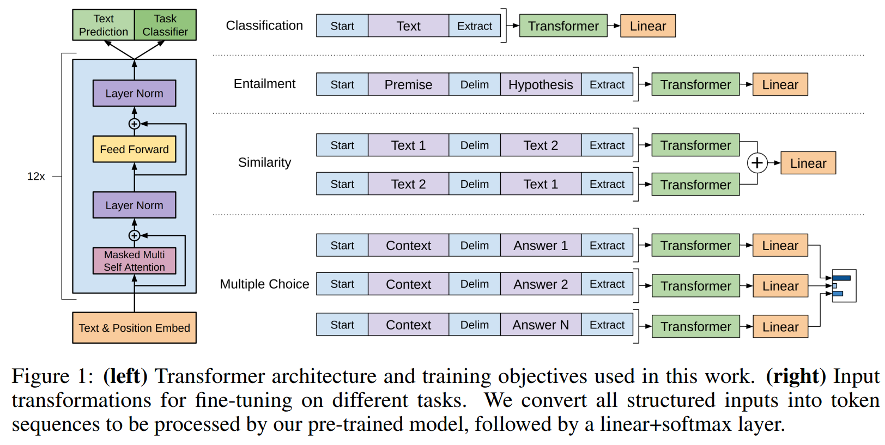

# 论文信息
- 时间：2018 2019 2020
- 期刊：mikecaptain.com, amazonaws.com, NeurIPS
- 网络名称： GPT1, 2, 3
- 意义：使用 Transformer 解码器来做预训练; 更大的 GPT 模型，朝着zero-shot learning迈了一大步; 100倍更大的 GPT-2，few-shot learning效果显著
- 作者：Alec Radford, Karthik Narasimhan, Tim Salimans, Ilya Sutskever; OpenAI
- 实验环境：V100 GPU
- 数据集：reddit, Common Crawl
- [返回上一层 README](../README.md)
# 一、解决的问题
1. “先做预训练，再做微调的子任务”是计算机视觉先成熟的
2. NLP标好的数据太少了，且没有太大的训练集
3. Transformer比RNN学到的特征更加稳健
# 二、做出的创新
1. GPT是把Transformer的解码器拿出来，然后在没有标号的大量的文本数据上训练一个语言模型，来获得预训练模型，然后再用它在子任务上做微调，得到每个任务所需的分类器
2. BERT是把Transformer的编码器拿过来。BERT里面一共有两个模型，一个是BERT base（对标GPT），一个是BERT large（GPT2更大）
3. 使用未标好的文本经行预训练
4. 做微调的时候，使用了两个目标函数
# 三、设计的模型
1. GPT1：
    1. 用 $u_i$ 前面 $k-1$ 个词的条件概率 $$L_1(u)=\sum_{i}logP(u_i|u_{i-k},...,u_{i-1};\phi)$$ $L_1$ 是第一个目标函数，且这个是应用Transformer的解码器，解码器与编码器的区别在于：编码器能看到全部的输入；解码器只能看到前面的部分
    2. GPT比BERT要难：因为BERT是能看到所有的输入，做完形填空；GPT是只能看到前面的信息，预测未来。显然GPT更难些
    3. fine-tuning：softmax算概率： $$P(y|x^1,...,x^m)=softmax(h_{l}^{m}W_y)$$  第二个目标函数： $$L_2(C)=\sum_{(x,y)}logP(y|x^1,...,x^m)$$ 训练一个模型，去预测句子中的下一个词和预测词的标号。第三个目标函数： $$L_3(C)=L_2(C)+\lambda \cdot L_1(C)$$

    
    - 开始符、分隔符、抽取符：特殊记号
    - 无论任务类型怎么变，Transformer层的结构不会变，这就是这篇文章的最大卖点

2. GPT2：
    1. 模型和数据集做的更大，打回BERT。站队站好了，没办法舍弃解码器
    2. 主要看他怎么做zero-shot，做到下游任务的时候，不需要下游任务的任何标号
    3. 现在的模型泛化性不好，所以都是收集一个数据集，训练一个模型；多任务学习，训练的时候看多个任务，使用多个损失函数，达到在多个任务上的成果
    4. 与GPT1的不同：
        - zero-shot下游任务的时候，预训练模型不再动了，所以不可以给模型输入没看到过的特殊记号
        - 训练数据：reddit->法语翻译英语
        - 直接使用预训练模型去做子任务

3. GPT3：
    1. 考虑few-shot，考虑模型的有效性
    2. 做子任务的时候，不做参数更新和微调

    
    - meta-learning in-context learning
    
    4. 1750亿可学习的参数

    
    - zero-shot:告诉模型要干什么，然后给输入
    - one-shot：告诉模型要做什么，然后给一个样本。注意这个样本只做预测，不做训练，不对模型算梯度，不会更新模型；目的是让注意力机制从长样本里找到有价值的信息->上下文学习
    - few-shot：告诉模型要做什么，然后给几个样本

    5. 模型架构个GPT2是一样的，把Sparse Transformer的工作加入了进来，然后设计了8个不同的模型

    6. 模型层数增加，宽度也应该增加。计算复杂度跟宽度是平方的关系，跟层数是线性的关系，批量变大，并行度更好，学习效果更好
    7. 批量大小增大的时候，学习率降低

# 四、实验结果

1. GPT3把Common Crawl作为负例，reddit作为正例，做一个Logic regression二分类
2. 做了数据去重，LSH算法，面试爱问
3. 加入已知得高质量数据集
## 1、比之前模型的优势
1. 使用的是验证损失
2. 模型越大，计算量越大。随着数据量指数增大，所计算的损失越小
## 2、有优势的原因

## 3、改进空间
1. GPT太大了， 难以复现
2. 没有特别好的目标函数
3. 没有特别好的迁移模型
# 五、结论

## 1、模型是否解决了目标问题

## 2、模型是否遗留了问题

## 3、模型是否引入了新的问题
- GPT3的局限性：
    - 文本生成上没有办法生成太长的文本，可能会把之前写过的内容重复输出
    - 结构和算法上的局限性，GPT3是语言模型，只能往前看，不能双向看
    - 语言模型，均匀学习，没有重点的学习。eg. 过度学习虚词，没有重点学习实词
    - 到底是真的学会了，还是仅仅找到了类似的答案，死记硬背
    - 还是一个黑箱模型
    - 伦理、种族、性别、能源等社会问题讨论
# 六、代码

# 读者角度（挖掘文章中没有提到的）：
1. 总结文章发现问题的思路
2. 总结文章改进的思想
3. 总结文章还存在或者可以改进的问题
4. 提出对模型参数和细节的一些思考和讨论
