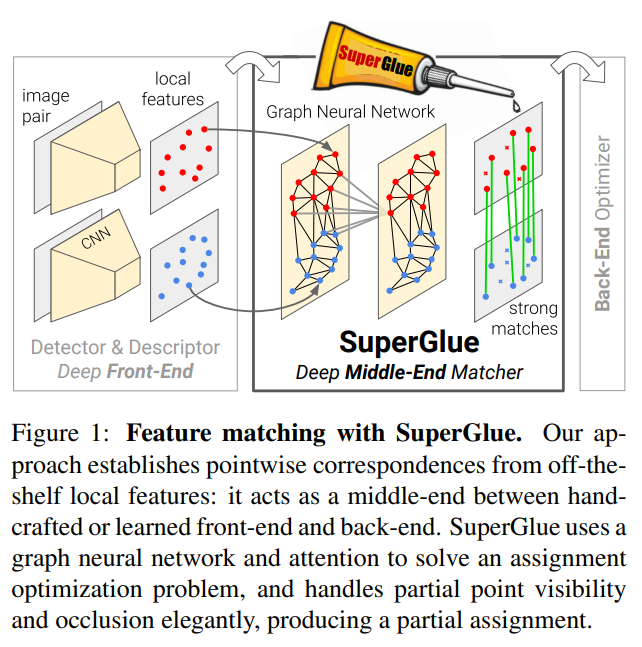
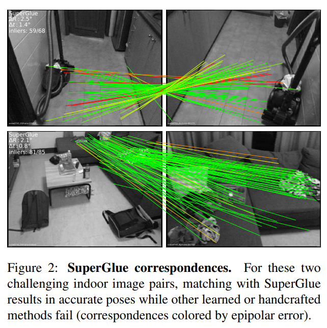
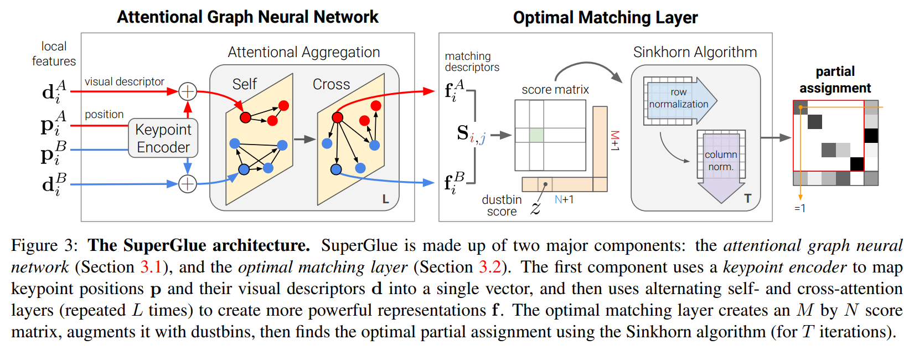
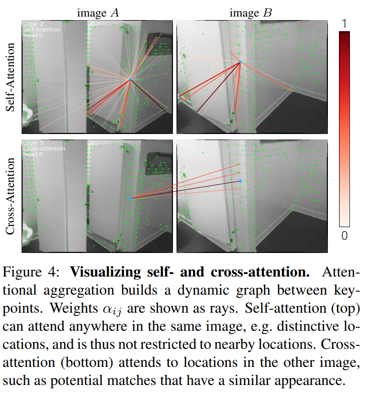

SuperGlue:用图神经网络学习特征匹配

Paul-Edouard Sarlin (1) , Daniel DeTone (2), Tomasz Malisiewicz (2), Andrew Rabinovich (2)

(1) ETH Zurich 

(2) Magic Leap公司

在Magic Leap公司完成硕士论文期间的工作。作者感谢他的学术导师:Cesar Cadena, Marcin Dymczyk, Juan Nieto。

摘要

本文介绍了SuperGlue,这是一个神经网络,通过联合寻找对应关系和拒绝不可匹配的点来匹配两个局部特征集。通过解决一个可微分的最优运输问题来估计分配,其成本由图神经网络预测。我们引入了一种基于注意力的灵活上下文聚合机制,使SuperGlue能够同时推理关于三维场景和特征分配。与传统的手工设计的启发式相比,我们的技术通过端到端的训练从图像对中学习姿态估计的先验知识,使SuperGlue能够推理三维场景。SuperGlue的性能优于其他学习方法,并在实际室内外环境中的姿态估计任务中获得最先进的结果。所提出的方法可以在现代GPU上实时运行,并可以轻松地集成到现代SfM或SLAM系统中。代码和训练权重公开可获得,网址:https://github.com/magicleap/SuperGluePretrainedNetwork。

1 介绍

图像匹配中的对应点对三维结构和相机姿态估计等几何计算机视觉任务,如同时定位与映射(SLAM)和结构化运动(SfM)至关重要。这样的对应关系一般通过匹配局部特征来估计,这种过程称为数据关联。大视角和光照变化、遮挡、模糊和缺乏纹理是使2D-2D数据关联特别具有挑战性的因素。

在本文中,我们提出了一种对特征匹配问题的新思考方式。我们没有学习更好的与任务无关的局部特征,然后使用简单的匹配启发式和技巧,而是使用一种新的神经架构SuperGlue来学习匹配过程从现有的局部特征。在SLAM的背景下,通常将问题分解为视觉特征提取前端和束调整或姿态估计后端,我们的网络直接位于中间(参见图1)。

SuperGlue可以从非专用局部特征检测器和描述符建立点对点的对应关系,它充当手工制作或学习前端和后端之间的中间端。SuperGlue使用图神经网络和注意力来解决分配优化问题,优雅地处理部分点可见性和遮挡。我们表明SuperGlue优于手工制作的匹配器和学习内点分类器。当与SuperPoint深度前端组合时,SuperGlue推进室内外姿态估计的状态,并为端到端深度SLAM铺平了道路。

2 相关工作

局部特征匹配通常通过
1. 检测兴趣点
1. 计算视觉描述符
1. 使用最近邻搜索进行匹配
1. 过滤不正确的匹配
1. 估计几何变换来执行。

2000年代开发的经典流程通常基于SIFT ,使用Lowe比率测试过滤匹配,互检约束,以及邻域一致性等启发式,并用RANSAC等稳健求解器找到变换。

最近的深度学习特征匹配研究通常关注从数据中用CNN学习更好的稀疏检测器和局部描述符。 为了提高区分度,一些工作明确考虑更广泛的上下文,使用区域特征或对数极坐标补丁。 其他方法学习将匹配分类为内点和外点。 这些是在最近邻搜索估计的匹配集上运行,因此忽略了分配结构并丢弃了视觉信息。 学习执行匹配的工作目前集中在稠密匹配或3D点云上,仍然存在同样的局限性。 相比之下,我们的可学习中间端使用单个端到端架构同时执行上下文聚合、匹配和过滤。

图匹配问题通常被公式化为二次分配问题,这是NP困难的,需要昂贵、复杂而不实用的求解器。 对于局部特征,2000年代的计算机视觉文献使用手工设计成本和许多启发式,使其复杂而脆弱。 Caetano等人学习了优化的线性分配问题的成本,但只使用浅层模型,而我们的SuperGlue使用深度神经网络学习灵活的成本。与图匹配相关的是最优运输问题,这是广义线性分配,有一个高效且简单的近似解,Sinkhorn算法。

深度学习针对点云等集合设计了生成排列等变或不变函数的方法,通过在元素之间聚合信息。 一些工作将所有元素视为平等,通过全局池化或实例标准化,而其他一些工作则关注特征或坐标空间中的局部邻域。 尽管自注意力可同时执行全局和数据依赖的局部聚合,但它更加灵活。 通过观察自我注意力可以看作是完全图上的消息传递图神经网络的一个实例,我们将注意力应用于具有多种边缘类型的图,类似于Transformer的成功,SuperGlue能够对两个局部特征集合进行复杂的推理。

3 SuperGlue架构

动机:在图像匹配问题中,可以利用世界的一些规律:3D世界在很大程度上是光滑的有时是平面的,如果场景静止,每个图像对的所有对应都源自单个本质变换,某些姿态比其他姿态更可能。 此外,2D关键点通常是突出的3D点的投影,如角点或斑点,因此跨图像的对应关系必须遵守某些物理约束:
1. 一个关键点最多只能在另一图像中有一个对应;
1. 由于遮挡和检测器失败,某些关键点将无法匹配。 

特征匹配的有效模型应该旨在找到相同3D点的所有重投影的对应关系,并识别没有匹配的关键点。 我们将SuperGlue表述为求解一个优化问题,其成本由深度神经网络预测。 这消除了对领域专业知识和启发式的需要——我们直接从数据中学习相关的先验知识。

概述: 考虑两幅图像 $A$ 和 $B$ ,每幅图像具有一组关键点位置 $\mathbf{p}$ 和相关的视觉描述符 $\mathbf{d}$ ——我们将它们联合称为 $(\mathbf{p},\mathbf{d})$ 作为局部特征。 位置包括 $x$ 和 $y$ 图像坐标以及检测置信度 $c$ ,即 $\mathbf{p}_ {i}:=(x,y,c)_ {i}$ 。 视觉描述符 $\mathbf{d}_ {i}\in\mathbb{R}^{D}$ 可以是SuperPoint等CNN提取的描述符,也可以是SIFT等传统描述符。 图像 $A$ 和 $B$ 分别具有 $M$ 个和 $N$ 个局部特征,索引分别为 $\mathcal{A}:={1,...,M}$ 和 $\mathcal{B}:={1,...,N}$ 。

部分分配: 约束1和2意味着对应关系来自两个关键点集的部分分配。 为了集成到下游任务中并提高可解释性,每个可能的对应应具有一个置信度值。 因此,我们将部分软分配矩阵 $\mathbf{P}\in[0,1]^{M\times N}$ 定义为:

$$\begin{equation} \mathbf{P}\mathbf{1}_ {N}\leq\mathbf{1}_ {M}\quad\text{and}\quad\mathbf{P}^{\top}\mathbf{1}_ {M}\leq\mathbf{1}_ {N} \end{equation}$$

我们的目标是设计一个神经网络,从两个局部特征集预测分配 $\mathbf{P}$ 。

注意力图神经网络

除了关键点的位置和视觉外观之外,集成其他上下文线索直观地可以增加其区分度。 例如,我们可以考虑与其它共可见关键点的空间和视觉关系,例如醒目的关键点,自我相似的关键点,统计上共现的关键点或相邻的关键点。 另一方面,了解第二个图像中的关键点可以通过比较候选匹配或从全局和无歧义的线索估计相对光度或几何变换来帮助消除歧义。

当要求匹配给定的模糊关键点时,人类会在两个图像之间来回查看:他们会浏览暂定的匹配关键点,检查每个关键点,并寻找可以帮助识别真正匹配的与其他自我相似性区分开来的上下文线索。 这暗示了一个可以关注特定位置的迭代过程。

因此,我们将SuperGlue的第一个主要模块设计为注意力图神经网络(见图3)。 给定初始局部特征,它通过让特征相互通信来计算匹配描述符 $\mathbf{f}_{i}\in\mathbb{R}^{D}$ 。 如我们将要展示的,长距离特征聚合在图像内和跨图像对稳健匹配至关重要。 

关键点编码器:每个关键点 $i$ 的初始表示 ${}^{(0)}\mathbf{x}_{i}$ 结合其视觉外观和位置。我们用多层感知器(MLP)将关键点位置嵌入高维向量:

$$\begin{equation} {}^{(0)}\mathbf{x}{i}=\mathbf{d}{i}+\text{MLP}_{\text{enc}}\left(\mathbf{p} _{i}\right) \end{equation}$$

这个编码器使图网络后面能够共同推理外观和位置,特别是与注意力结合使用时,它是语言处理中流行的“位置编码器”的一个实例。

多重图神经网络:我们考虑一个包含两个图像所有关键点的单个完全图。该图有两种类型的无向边——它是一个多重图。图像内边,或自边 $\mathcal{E}_ {\text{self}}$ ,将关键点 $i$ 连接到同一图像中的所有其他关键点。图像间边,或跨边 $\mathcal{E}_ {\text{cross}}$ ,将关键点 $i$ 连接到另一图像中的所有关键点。我们使用消息传递公式沿着两种类型的边传播信息。

产生的多重图神经网络从每个节点开始具有高维状态,并通过对所有给定边的所有节点同时聚合消息来计算每个层的更新表示。

设 ${}^{(\ell)}\mathbf{x}_ {i}^{A}$  为图像 $A$ 中第 $i$ 个元素在第 $\ell$ 层的中间表示。 消息 $\mathbf{m}_ {\mathcal{E}\to i}$ 是来自所有关键点 $\{j:(i,j)\in\mathcal{E}\}$ 的聚合结果,其中 $\mathcal{E}\in\{\mathcal{E}_ {\text{self}},\mathcal{E}_ {\text{cross}}\}$ . 对 $A$ 中所有 $i$ 的残差消息传递更新为:  

$$\begin{equation} {}^{(\ell+1)}\mathbf{x}_ {i}^{A}={}^{(\ell)}\mathbf{x}_ {i}^{A}+\text{MLP}\left(\left[{}^{(\ell)}\mathbf{x}_ {i}^{A}||\mathbf{m}_ {\mathcal{E}\to i}\right]\right) \end{equation}$$

其中 $[\cdot||\cdot]$ 表示拼接。 可以对 $B$ 中的所有关键点同时执行类似的更新。 使用不同参数的固定层数 $L$ 被链式连接,并交替聚合自边和跨边。 从 $\ell=1$ 开始,如果 $\ell$ 为奇数则 $\mathcal{E}=\mathcal{E}_ {\text{self}}$ ,如果 $\ell$ 为偶数则 $\mathcal{E}=\mathcal{E}_ {\text{cross}}$ 。

注意力聚合:注意力机制执行聚合并计算消息 $\mathbf{m}_ {\mathcal{E}\to i}$ 。 自边基于自注意力,跨边基于互注意力。 类似于数据库检索,查询关键点 $i$ 的表示,查询 $\mathbf{q}_ {i}$ ,根据其属性,键 $\mathbf{k}_ {j}$ ,检索某些元素的值 $\mathbf{v}_ {j}$ 。 消息计算为值的加权平均:

$$\begin{equation} \mathbf{m}_ {\mathcal{E}\to i}=\sum_ {j:(i,j)\in\mathcal{E}}\alpha_ {ij} \mathbf{v}_ {j} \end{equation}$$

其中注意力权重 $\alpha_ {ij}$ 是键-查询相似度的SoftMax: $\alpha_ {ij}=\text{Softmax}_ {j}\left(\mathbf{q}_ {i}^{\top}\mathbf{k}_ {j}\right)$ 。

键、查询和值都是图神经网络深度特征的线性投影。

考虑查询关键点 $i$ 在图像 $Q$ ,所有源关键点在图像 $S$ , $(Q,S)\in \{A,B \}^{2}$ ,我们可以写成:

$$\begin{equation} \begin{split}\mathbf{q}_ {i}&=\mathbf{W}_ {1} {}^{(\ell)}\mathbf{x}_ {i}^{Q}+\mathbf{b}_ {1} \\ \begin{bmatrix}\mathbf{k}_ {j} \\ \mathbf{v}_ {j} \end{bmatrix} &= \begin{bmatrix}\mathbf{W}_ {2} \\ \mathbf{W}_ {3} \end{bmatrix} {}^{(\ell)}\mathbf{x}_ {j}^{S}+\begin{bmatrix} \mathbf{b}_ {2} \\ \mathbf{b}_ {3}\end{bmatrix}\end{split} \end{equation}$$

每个层 $\ell$ 都有自己的投影参数,对两个图像的所有关键点学习和共享。 在实践中,我们用多头注意力提高表达能力。

我们的公式提供了最大的灵活性,因为网络可以基于特定属性(参见图4)关注关键点的子集。SuperGlue可以检索或关注基于外观和位置的关键点,因为它们都编码在表示 $\mathbf{x}_{i}$ 中。 这包括关注附近的关键点以及相似或显着关键点的相对位置。 这使得几何变换和分配的表示成为可能。 最后的匹配描述符是线性投影:

$$\begin{equation} \mathbf{f}{i}^{A}=\mathbf{W}\cdot{}^{(L)}\mathbf{x}_ {i}^{A}+\mathbf{b},\quad \forall i\in\mathcal{A} \end{equation}$$

$B$ 中的关键点类似。

最优匹配层

SuperGlue的第二个主要模块(见图3)是最优匹配层,它产生一个部分分配矩阵。 如标准图匹配公式中,通过计算所有可能匹配的评分矩阵 $\mathbf{S}\in\mathbb{R}^{M\times N}$ 并在约束1的约束下最大化总分 $\sum_ {i,j}\mathbf{S}_ {i,j}\mathbf{P}_ {i,j}$ 可以获得分配 $\mathbf{P}$ 。 这相当于求解线性分配问题。

评分预测:构建所有 $M\times N$ 潜在匹配的单独表示是不切实际的。 相反,我们将成对评分表达为匹配描述符的相似性:

$$\begin{equation} \mathbf{S}_ {i,j}=<\mathbf{f}_ {i}^{A},\mathbf{f}_ {j}^{B}>,\ \forall(i,j)\in \mathcal{A}\times\mathcal{B} \end{equation}$$

与学习的视觉描述符不同,匹配描述符未归一化,它们的幅度可以改变以反映预测置信度。

遮挡和可见性:为让网络抑制一些关键点,我们为每个集合添加一个垃圾箱,以便未匹配的关键点显式分配给它。这种技术在图匹配中很常见,SuperPoint [18]也使用垃圾箱来表示可能没有检测到的图像单元。
我们将得分 $\mathbf{S}$ 扩展到 $\mathbf{\bar{S}}$ ,通过追加新的行和列,即点对垃圾箱和垃圾箱对垃圾箱的得分,用一个可学习的参数填充:

$$\begin{equation} \mathbf{\bar{S}}_ {i,N+1}=\mathbf{\bar{S}}_ {M+1,j}=\mathbf{\bar{S}}_ {M+1,N+1}=z \in\mathbb{R} \end{equation}$$

而图像 $A$ 中的关键点将分配给图像 $B$ 中的单个关键点或垃圾箱, $B$ 中的垃圾箱具有与另一集中的关键点数一样多的匹配: $N$ , $M$ 分别用于 $A$ , $B$ 中的垃圾箱。我们表示为
 $\mathbf{a}=\begin{bmatrix}\mathbf{1}_ {M}^{\top}&N\end{bmatrix}^{\top}$  和
 $\mathbf{b}=\begin{bmatrix}\mathbf{1}_ {N}^{\top}&M\end{bmatrix}^{\top}$  每个关键点和垃圾箱在 $A$ 和 $B$ 中的期望匹配数。扩充的分配 $\mathbf{\bar{P}}$ 现在具有约束:

$$\begin{equation} \mathbf{\bar{P}}\mathbf{1}_ {N+1}=\mathbf{a}\quad\text{and}\quad\mathbf{\bar{P}}^{\top}\mathbf{1}_ {M+1}=\mathbf{b} \end{equation}$$

Sinkhorn算法:上述优化问题的解对应于分布 $\mathbf{a}$ 和 $\mathbf{b}$ 之间的最优运输,其得分为 $\mathbf{\bar{S}}$ 。其正则化熵形式自然产生所需的软分配,并可以在GPU上使用Sinkhorn算法有效解决。它是匈牙利算法的可微分版本,经典地用于二分图匹配,由迭代规范化 $\exp(\bar{\mathbf{S}})$ 沿行和列完成,类似于行和列softmax。经过 $T$ 次迭代后,我们舍弃垃圾箱并恢复 $\mathbf{P}=\bar{\mathbf{P}}_{1:M,1:N}$ 。

损失函数

通过设计,图神经网络和最优匹配层都是可微分的——这使得从匹配反向传播到视觉描述符成为可能。SuperGlue以监督方式从地面真值匹配 $\mathcal{M}=\{(i,j)\}\subset\mathcal{A}\times\mathcal{B}$ 进行训练。这些是从相对姿态的地面真值估计的,使用姿态和深度图或单应矩阵。这也让我们可以标记一些关键点 $\mathcal{I}\subseteq\mathcal{A}$ 和 $\mathcal{J}\subseteq\mathcal{B}$ 为不匹配,如果它们在附近没有任何重投影。给定这些标签,我们最小化分配 $\bar{\mathbf{P}}$ 的负对数似然:

$$\begin{equation} \begin{split}\text{Loss}=&-\sum_ {(i,j)\in\mathcal{M}}\log\bar{\mathbf{P}}_ {i,j}\\ &-\sum_ {i\in\mathcal{I}}\log\bar{\mathbf{P}}_ {i,N+1}-\sum_ {j\in \mathcal{J}}\log\bar{\mathbf{P}}_ {M+1,j} \end{split} \end{equation}$$

这种监督旨在同时最大化匹配的精度和召回率。

与相关工作的比较

SuperGlue架构对图像内部关键点的排列是平变的。与其他手工或学习方法不同,它对图像的排列也是平变的,这更好地反映了问题的对称性,并提供了有益的归纳偏置。另外,最优运输公式实施软匹配的互检,类似于[46],从而将其嵌入训练过程,而不是类似手工方法的硬互检。

SuperGlue对比实例归一化: 如SuperGlue所用的注意力是比实例归一化更灵活和强大的上下文聚合机制,实例归一化将所有关键点视为平等,此前用于特征匹配的工作[33, 71, 32, 44, 7]使用了它。

SuperGlue对比上下文描述符: SuperGlue可以联合推理外观和位置,而ContextDesc单独处理它们。 此外,ContextDesc是一个前端,还需要一个更大的区域提取器和关键点评分损失。 SuperGlue只需要局部特征,无论是学习的还是手工设计的,因此可以简单地替换现有的匹配器。

SuperGlue对比Transformer: SuperGlue借鉴了Transformer的自注意力,但将其嵌入图神经网络中,并额外引入了对称的互注意力。这简化了架构并在层之间获得了更好的特征重用。

4 实现细节

SuperGlue可以与任何局部特征检测器和描述符组合使用,但与SuperPoint尤其搭配良好,后者产生可重复和稀疏的关键点——使非常高效的匹配成为可能。 通过双线性采样从半稠密特征图中采样视觉描述符。 为了与其他匹配器进行公平比较,除非另有明确说明,否则在训练SuperGlue时我们不训练视觉描述符网络。 在测试时,可以使用置信度阈值(我们选择0.2)保留某些软分配中的匹配,或者使用全部匹配及其置信度在后续步骤中,例如加权姿态估计。

架构详细信息:所有中间表示(键、查询值、描述符)具有与SuperPoint描述符相同的维度 $D=256$ 。 我们使用具有4个头的交替多头自注意力和互注意力的 $L=9$ 层,并执行 $T=100$ 次Sinkhorn迭代。 模型用PyTorch实现,包含1200万个参数,在NVIDIA GTX 1080 GPU上实时运行:前向传递平均需要69毫秒(每秒15帧)。

训练详细信息:为允许数据增强,SuperPoint的检测和描述步骤在训练期间按批次即席执行。 为了高效批处理和提高鲁棒性,还添加了一定数量的随机关键点。 更多详细信息在附录E中提供。

5 实验

单应估计

我们使用真实图像和合成单应执行大规模单应估计实验,既使用稳健(RANSAC)又使用非稳健(DLT)估计器。

数据集:我们通过对真实图像采样随机单应并应用随机光度畸变生成图像对,遵循类似于[16, 18, 45, 44]的配方。 底层图像来自牛津和巴黎数据集中100万不同图像的集合,将其分为训练集、验证集和测试集。

基准:我们将SuperGlue与对SuperPoint局部特征应用的几种匹配器进行比较——最近邻(NN)匹配器和各种异常值拒绝器:互余约束、PointCN和顺序感知网络(OANet)。 所有学习方法(包括SuperGlue)都使用地面真值对应进行训练,通过从一幅图像到另一幅图像投影关键点找到。 我们按需生成单应和光度畸变——训练期间不会看到两次相同的图像对。

指标:精度 $P$ 和召回率 $R$ 从地面真值对应中计算。 使用RANSAC和直接线性变换(DLT)执行单应估计,后者有直接的最小二乘解。 我们计算图像四个角点的平均重投影误差,并报告小于10像素的累积误差曲线(AUC)下的面积。

结果:SuperGlue表达能力足以掌握单应变换,实现98%的召回率和高精度(见表1)。 估计的对应关系非常出色,以至于不需要稳健估计器——SuperGlue配DLT效果甚至优于RANSAC。像PointCN和OANet这样的异常值拒绝方法无法比NN匹配器本身预测更多正确的匹配(参见图6和附录A)。它们过于依赖初始描述符。

室内姿态估计

室内图像匹配非常具有挑战性,因为缺乏纹理、自我相似性丰富、场景3D几何复杂以及视角变化很大。 正如我们将要展示的,SuperGlue可以有效学习来克服这些挑战的先验知识。

数据集:我们使用ScanNet,这是一个大规模室内数据集,由单目序列组成,具有地面真值姿态和深度图像,以及明确定义的训练、验证和测试分割,对应不同的场景。 之前的工作根据时间差或基于SIFT的SfM可视性选择训练和评估对。 我们认为这限制了对难度,而是仅使用地面真值姿态和深度为给定序列的所有可能图像对计算重叠分数。 这导致显着更宽的基线对,这对应于室内图像匹配的当前前沿。 丢弃重叠过小或过大的对,我们为230个训练序列和1500个测试序列选择了2.3亿对训练对和1500个测试对。 

指标:与先前工作相同,我们报告姿态错误在阈值 $(5^{\circ},10^{\circ},20^{\circ})$ 处的AUC,其中姿态错误是旋转和平移的角度误差的最大值。 相对姿态是通过使用OpenCV的findEssentialMat和RANSAC以1像素除以焦距的内点阈值估计本质矩阵,然后recoverPose获得的。 与先前工作不同,我们使用明确的积分而不是粗略的直方图计算更精确的AUC。 精度 $P$ 是正确匹配数与估计匹配总数之比的平均值。 匹配得分(MS)是正确匹配数与检测到的关键点总数之比的平均值。 它不考虑对重叠并随可见共现关键点的数量减小。 如果其本征距离小于 $5\cdot 10^{-4}$ ,则认为匹配正确。

基准:我们评估SuperGlue和各种基准匹配器使用SIFT根归一化和SuperPoint特征。 SuperGlue使用从地面真值姿态和深度导出的对应关系和未匹配的关键点进行训练。 所有基准都基于最近邻(NN)匹配器和可能的异常值拒绝方法。 在“手工制作”类别中,我们考虑互检、Lowe比率测试、描述符距离阈值和更复杂的GMS。 “学习”类别中的方法是PointCN及其后续工作OANet和NG-RANSAC。 我们使用上述正确性标准在ScanNet上重新训练PointCN和OANet,用于SuperPoint和SIFT,以及各自的回归损失。 对于NG-RANSAC,我们使用原始训练模型。 我们不包括任何图匹配方法,因为考虑我们的关键点数量($>500$),它们的速度慢了几个数量级。 作为参考,还评估了其他局部特征:带GMS的ORB、D2-Net和使用公开可用的训练模型的ContextDesc。

结果:SuperGlue使姿态精度显着提高,优于手动和学习匹配器(见表2和图5),适用于SIFT和SuperPoint。 它比其他学习匹配器具有显着更高的精度,表明它具有更强的表达能力。 与应用于SIFT的比率测试相比,它产生多达10倍更多的正确匹配,因为它在所有可能的匹配的完整集而不是有限的最近邻集上运行。 

SuperGlue与SuperPoint的组合实现室内姿态估计的最先进结果。 它们相互补充,因为可重复的关键点使估计更多正确匹配成为可能,即使在非常具有挑战性的情况下(参见图2、图6和附录A)。

室外姿态估计

由于室外图像序列具有其自身的挑战(例如光照变化和遮挡),我们针对姿态估计任务训练和评估室外的SuperGlue。 我们使用与室内姿态估计任务相同的评估指标和基准方法。

数据集:我们在MegaDepth数据集上进行评估,它是CVPR'19图像匹配挑战的一部分。 它是YFCC100M数据集的子集,具有使用开箱即用的SfM工具获得的地面真值姿态和稀疏3D模型。 所有学习方法都在更大的MegaDepth数据集上训练,其中也具有使用多视立体计算的深度图。 删除照片旅游测试集中的场景。 类似室内,我们根据仅从SfM可见性计算的重叠得分选择具有挑战性的训练和评估图像对,如[19, 37]中所述。

结果:如表3所示,无论是应用于SuperPoint还是SIFT,SuperGlue都优于所有基准。 最值得注意的是,所得到的匹配精度非常高(84.9%),这增强了SuperGlue“粘合”局部特征的类比。

理解SuperGlue

abla研究:为评估我们的设计决策,我们在室内实验中重复使用SuperPoint特征,但这次关注不同的SuperGlue变体。 这个abla研究显示SuperGlue的所有模块都很有用,并带来实质性的性能改进(见表4)。

当我们在训练SuperGlue时同时反向传播SuperPoint描述符网络时,我们观察到AUC@20 ${}^{\circ}$ 从51.84提高到53.38。 这确认了SuperGlue适合匹配之外的端到端学习。

可视化注意力:广泛多样的自注意力和互注意力模式如图7所示,反映了学习行为的复杂性。 对趋势和内部工作原理进行详细分析在附录D中进行。

6 结论

本文证明了基于注意力的图神经网络在局部特征匹配中的强大作用。 SuperGlue的架构使用两种类型的注意力:
(i) 自注意力,扩大了局部描述符的感受野,
(ii) 互注意力,实现跨图像通信,其灵感来自人类在匹配图像时的来回查看方式。 
我们的方法使用最优运输问题优雅地处理部分分配和遮挡的点。 
实验结果表明,与现有方法相比,SuperGlue在极端宽基线的室内外图像对上的相对姿态估计中取得了显著提高。 此外,SuperGlue具有实时运行速度,适用于经典和学习特征。

总之,我们的可学习中间端用强大的神经模型替换了手工制作的启发式,在单一统一的架构中同时执行上下文聚合、匹配和过滤。 
我们认为,与深度前端相结合时,SuperGlue是实现端到端深度SLAM的重要里程碑。