# 目标检测网络综述

该综述吸收于B站UP主[霹雳吧啦Wz](https://space.bilibili.com/18161609)([GitHub](https://github.com/WZMIAOMIAO/deep-learning-for-image-processing))和B站UP主[Tsiu-Hinghiok](https://space.bilibili.com/111391089)的内容学习而来

## 目录

- [R-CNN](#r-cnn)
- [Fast R-CNN](#fast-r-cnn)
- [Faster R-CNN](#faster-r-cnn)
- [FPN](#fpn)
- [SSD](#ssd)
- [Mask R-CNN](#mask-r-cnn)
- [RetinaNet](#retinanet)
- [YOLOv1](#yolov1)
- [YOLOv2](#yolov2)
- [YOLOv3](#yolov3)
- [FCOS](#fcos)
- [YOLOv3 SPP](#yolov3-spp)
- [YOLOv4](#yolov4)
- [YOLOv5](#yolov5)
- [YOLOX](#yolox)
- [YOLOR](#yolor)
- [YOLOv6](#yolov6-美团官方解读--qa)
- [YOLOv6](#yolov6-总结)
- [YOLOv7](#yolov7)
- [YOLOv8](#yolov8)


# R-CNN
- [ppt](../ppt/R-CNN/R-CNN.pdf)
## 1. 优势/历史地位
- R-CNN可以说是利用深度学习进行目标检测的开山之作。作者Ross Girshick多次在PASCAL VOC的目标检测竞赛中折桂，曾在2010年带领团队获得终身成就奖。

## 2. 算法流程
- 一共分为4个步骤
    1. 一张图像生成1K~2K个候选区域(使用Selective Search方法) 

    1. 对每个候选区域，使用深度网络提取特征

    1. 特征送入每一类的SVM 分类器，判别是否属于该类

    1. 使用回归器精细修正候选框位置
        

- 框架
    

## 3. 缺点
1. 测试速度慢：
    - 测试一张图片约53s(CPU)。用Selective Search算法提取候选框用时约2秒，一张图像内候选框之间存在大量重叠，提取特征操作冗余。

2. 训练速度慢：
    - 过程及其繁琐

3. 训练所需空间大：
    - 对于SVM和bbox回归训练，需要从每个图像中的每个目标候选框提取特征，并写入磁盘。对于非常深的网络，如VGG16，从VOC07训练集上的5k图像上提取的特征需要数百GB的存储空间。


# Fast R-CNN
- [ppt](../ppt/Fast%20R-CNN/Fast_R-CNN.pdf)
## 1. 优势/历史地位
- Fast R-CNN是作者Ross Girshick继R-CNN后的又一力作。同样使用VGG16作为网络的backbone，与R-CNN相比训练时间快9倍，测试推理时间快213倍，准确率从62%提升至66%(再Pascal VOC数据集上)。

- R-CNN是将每个锚框都扔进CNN中，这里进行了多次重复计算；而Fast R-CNN直接将图像扔入CNN中，进行特征提取，再将锚框映射到特征图上

- R-CNN的CNN和SVM需要单独训练，Fast R-CNN让CNN和下游分类任务一块训练，可以进行统一的梯度下降

## 2. 算法流程
- 一共分为3个步骤
    1. 一张图像生成1K~2K个候选区域(使用Selective Search方法)

    1. 将图像输入网络得到相应的特征图，将SS算法生成的候选框投影到特征图上获得相应的特征矩阵

    1. 将每个特征矩阵通过ROI pooling层缩放到7x7大小的特征图，接着将特征图展平通过一系列全连接层得到预测结果
        

- 框架
    

## 3. 缺点
1. 测试速度没有非常优秀：
    - 除去SS算法生成锚框的时间，测试一张图片约2s(CPU)；涵盖锚框生成时间，用时2s左右。


# Faster R-CNN
- [ppt](../ppt/Faster%20R-CNN/Faster_R-CNN.pdf)
## 1. 优势/历史地位
- Faster R-CNN是作者Ross Girshick继Fast R-CNN后的又一力作。同样使用VGG16作为网络的backbone，推理速度在GPU上达到5fps(包括候选区域的生成)，准确率也有进一步的提升。在2015年的ILSVRC以及COCO竞赛中获得多个项目的第一名。

- 核心是RPN网络，实现了生成锚框、特征提取和分类网络的同一训练，替代了SS算法。可以认为Faster R-CNN就是RPN+除去SS的Fast R-CNN

- 将Fast R-CNN检测图片的速度从除去SS算法生成锚框的时间，检测图片需要0点几秒，实现了整个网络检测图片只需要0点几秒


## 2. 算法流程
- 一共分为3个步骤
    1. 将图像输入网络得到相应的特征

    1. 使用RPN结构生成候选框，将RPN生成的候选框投影到特征图上获得相应的特征矩阵

    1. 将每个特征矩阵通过ROI pooling层缩放到7x7大小的特征图，接着将特征图展平通过一系列全连接层得到预测结果
        

- 框架
    

- 注意：
    1. 锚框(anchor)是在特征图上生成的；候选框(bounding box)是在原图上生成的。
    2. 提议框(proposal)是锚框(anchor)进行学习、偏移后得到的

## 3. 缺点
1. 仍然是two-stage的：
    - two-stage还是太慢了
    - RPN一次预测，Fast R-CNN还有一次预测

1. 对小目标检测效果很差
    - 因为是对一个尺度的特征层进行检测

# FPN
- [ppt](../ppt/FPN/fpn.pdf)
## 1. 优势/历史地位
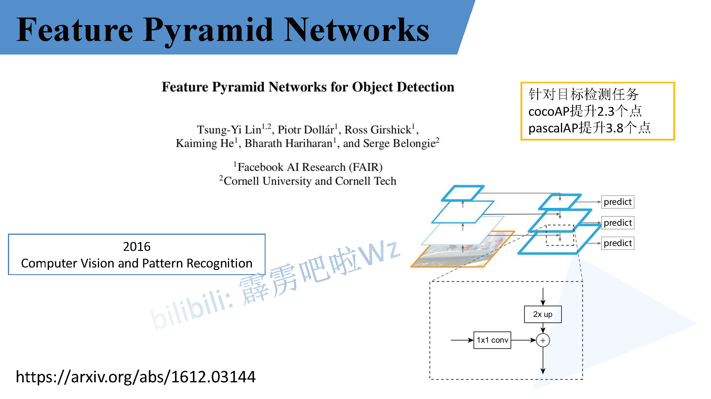

## 2. 算法流程
1. 特征图像处理类型
    

    - 生成不同尺度的特征图像
        - (a)的效率很低
        - (b)是标准的Faster R-CNN的流程，对小目标预测效果不好
        - (c)是SSD的类型
        - (d)FPN结构

1. 融合过程
    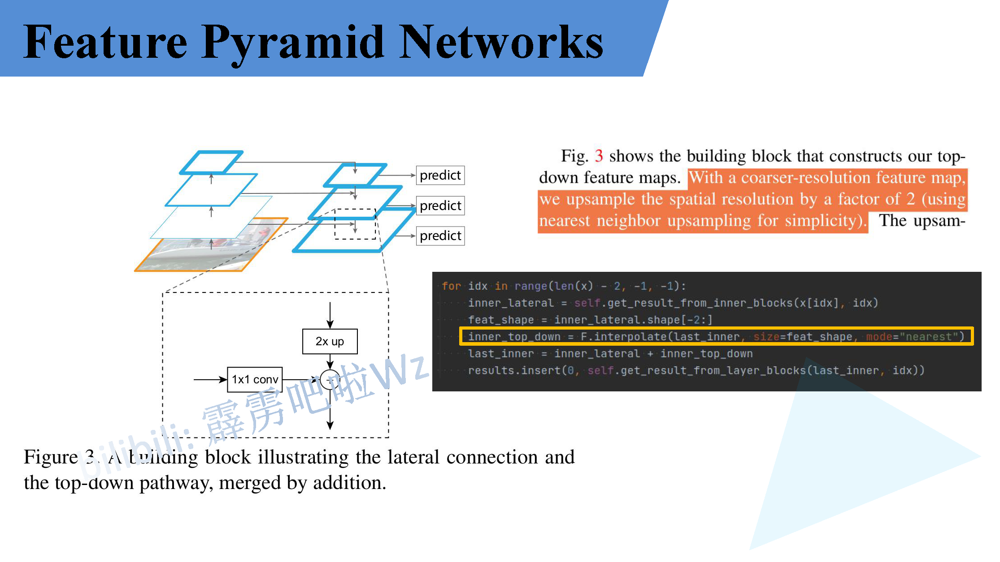

    - 下采样都是2的整数倍
    - 1x1卷积核的目的就是调整不同特征图的channel
        - 通常越小的特征图的channel越多
        - 原论文中1x1的卷积核的个数为256，即最终得到的特征图的channel都等于256
    - 上采样也是2倍
    - 算法就是nearest neighbour upsampling

1. 网络结构
    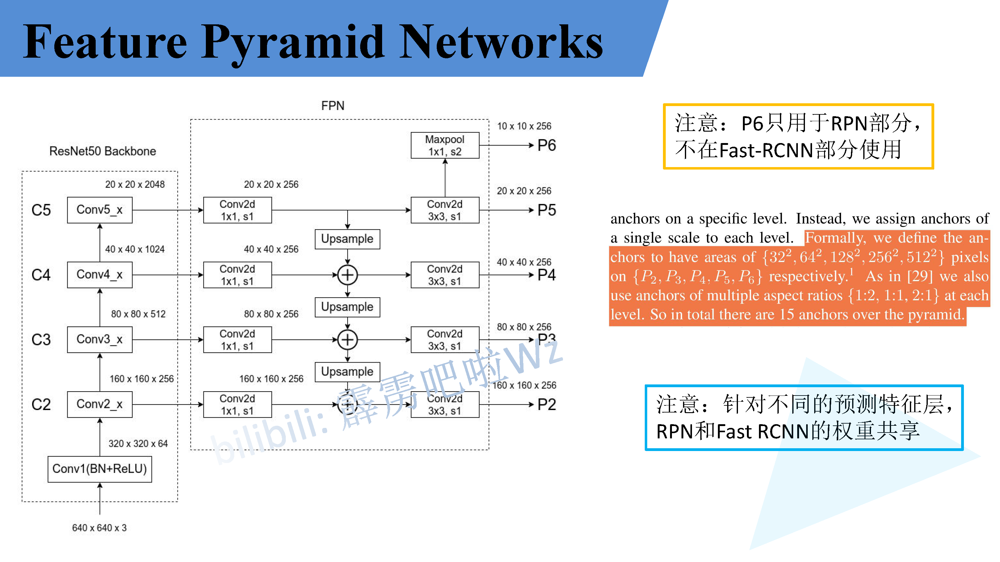

    - 不同尺寸的预测特征层预测不同大小的proposal
    - 通常尺寸大的特征图检测小目标(尺寸小的anchors)，尺寸小的特征图检测大目标(尺寸大的anchors)

1. RPN的proposal映射到不同的预测特征层
    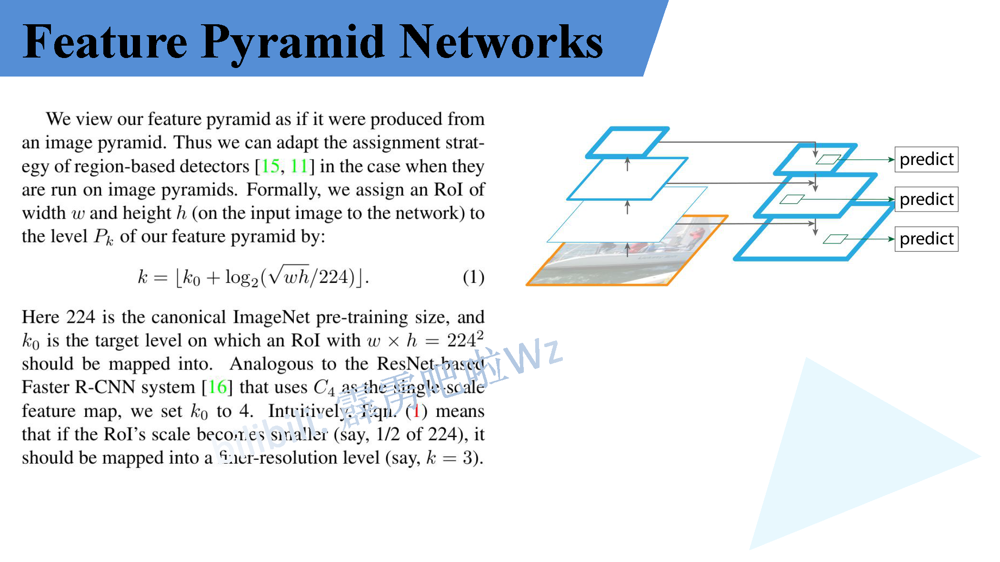
    
    - k：2，3，4，5(对应P2 P3 P4 P5)
    - k0 = 4
    - w, h：RPN预测得到的proposal在原图上的宽度和高度

    - 映射方法Level Mapper
        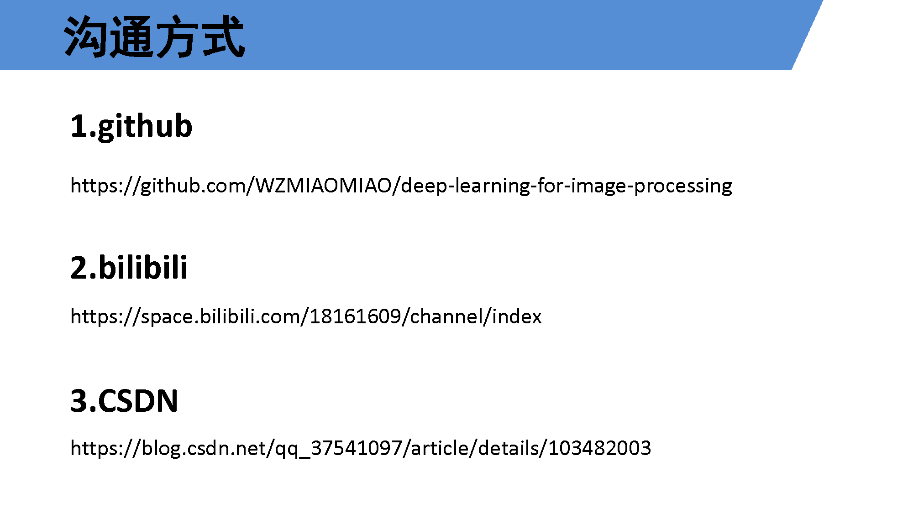

## 3. 缺点


# SSD
- [ppt](../ppt/SSD/SSD.pdf)
## 1. 优势/历史地位
- 借助VGG的框架在不同特征尺度上预测不同尺度的目标
    
- one-stage，但是还没完全超过two-stage
    

## 2. 算法流程
- VGG+多尺度预测
    

- $(c+4)\times k$ 卷积核需要参与预测
    - c个类别
    - 4个边界框回归参数
    - k个边界框
    

    - 注意：
        - Faster R-CNN中是预测4c个，是因为对每个类别预测4个边界框回归参数
        - SSD对每个Default box只生成4个边界框参数，不关注属于哪个类别的

- Ground Truth：IOU匹配
    - 负样本算highest confidence loss
    - 负样本是正样本三倍（Hard Negative Mining）


## 3. 缺点

# Mask R-CNN
- [ppt](../ppt/Mask%20R-CNN/mask_r-cnn.pdf)


- 图像分类：返回类别及概率
- 目标检测：返回类别和检测框
- 语义分割：返回分割后的物体(像素分类)
- 实例分割：语义分割只能分割出类别，但是实例分割可以将同一类别的不同物体进行分割


## 1. 优势/历史地位


## 2. 算法流程
1. Mask R-CNN & Faster R-CNN
    

    - Faster R-CNN源码也是RoIAlign，而不是RoIpooling

    - Mask 分支如下：
        

1. RoIAlign
    - 为什么将RoIpooling替换成RoIAlign
        - 因为RoIpooling涉及两次取整操作，两次取整肯定会导致定位的偏差
        - 论文称这个现象为misalignment
        

        - 用RoIAlign定位更加准确

    - RoIpooling
        

        - 第一次取整：特征图相对于原图的步距，需要做除法
        - 第二次取整：特征图可能不会被均分

    - RoIAlign
        
        
        - 第一步不取整
        - 第二部均分，依靠sampling ratio设置每个均分区域有 $(sampling ratio)^{2}$ 个采样点
            - 当采用多个采样点的时候，每个子区域的输出取所有采样点的均值

        

        - 通过双线性插值去计算采样点的数值
        - 0.3125是大矩形框的左上角点坐标
        - 3.875是大矩形框的右下角点坐标
        - u是橙色点距离左侧最近黑边的距离
        - v是橙色点距离右侧最近黑边的距离

        

        

        

        

1. Mask分支(FCN)
    

    - 预测器的RoIAlign和mask的RoIAlign是不一样的，不共用

    

    

    - 之前讲过的FCN对每个像素，每个类别都会去预测一个概率分数。对每个像素沿channel方向做一个softmax处理。那么通过softmax处理就知道每个像素，归属每个类别的分数
    - 这里在每个Mask分支都会预测一个蒙版。但是，我们不会针对每一个数据沿channel方向做softmax方向处理，而是根据Fast R-CNN分支，预测该目标的类别信息，这样类别与类别之间不存在竞争关系

    

    - RPN提供的边界框很多，相当于提供给Mask分支很多训练样本，且都是于GT有很大交集的
    - 类似随机裁剪数据增强的效果
    - 但是最终预测就采用Fast R-CNN的结果，是为了得到最准确的效果
        - 因为Fast R-CNN里面还有nms，可以进一步滤除

1. Mask R-CNN损失
    

1. Mask分支损失
    

    - 在RPN筛选的时候，知道输入的GT label，然后在计算损失的时候，把对应label的Mask拿出来
    - 虽然不做softmax处理了，但是还是对mask做了sigmoid，让预测值的范围在0~1之间
    - 由于RPN还知道proposal的具体位置，就可以让gt在原图上裁剪对应位置，缩放到和mask一样的大小，用来计算loss
    - 在gt mask中，对应目标区域的数值等于1，对应背景区域的数值是等于0的

1. Mask分支预测使用
    


## 3. 缺点


# YOLOv1
- [ppt](../ppt/YOLO/yolov1.pdf)
## 1. 优势/历史地位
- 比Faster R-CNN快，45FPS

## 2. 算法流程
- B个bounding box(默认是两个)，同时附带一个confidence，以及类别。总共就是 $[4(位置参数)+1(confidence)]*B+20(类别数)$ 
- 坐标x,y是相对预测目标的cell的坐标，范围在0~1之间；w,h是相对整张图片的大小，范围也是0~1之间
- confidence：预测目标与真实目标的交并比
- bounding box的损失计算的时候开根号了。因为大目标和小目标偏移同样的距离，大目标的IOU受影响明显小于小目标

## 3. 缺点
- 对群体小目标检测效果很差。因为YOLOv1对bounding box进行预测，且每个cell只关注两个框，还都是预测同一个类别
- 目标出现新的尺寸，效果也会很差(scale能力不强)
- 出错的原因大概率都是因为定位不准
- 比Faster R-CNN准确率低，只有63.4mAP
- 比同年的SSD的输入图像尺寸、速度和精度都低

# YOLOv2
- [ppt](../ppt/YOLOv2/yolov2.pdf)
## 1. 优势/历史地位
- 回归了R-CNN和SSD的anchor检测方式
- mAP和FPS都非常高

## 2. 算法流程
- 做了7种的尝试：
    - Batch Normalization
        - 有帮助训练收敛
        - 正则化操作
        - 替代drop out
        - 可以提升两个百分点
    - High Resolution Classifier
        - 此前都是224x224，作者使用448x448
        - 可以提升4个百分点
    - Convolutional With Anchor Boxes
        - 简化边界框预测
        - mAP下降0.3%，但是召回率增加了7%
    - Dimension Clusters
        - 此前没说box的尺寸是怎么选取的，用k-means生成priors
        - 好的priors对网络训练分厂有帮助
    - Direct location prediction
        - 直接基于anchor训练，模型会不稳定，特别是训练的前期。大部分不稳定因素都来源于预测anchor的中心坐标。由于公式并没有限制 $t_ {x}和t_ {y}$ 的值，中心坐标加上回归参数可能出现在图像的任意位置。用sigmoid函数对 $t_ {x}和t_ {y}$ 加以限制在[0,1]之间，保证预测框的稳定
    - Fine-Grained Features
        - 在预测特征图上，结合一些更底层的信息。底层信息包含更多的图像细节，图像细节在检测小目标的时候用处很大。高、低层细节融合，进行细节补充(passthrough layer)
    - Multi-Scale Training
        - 为了提高YOLOv2的鲁棒性，作者将图像缩放到不同尺度。每迭代10个batch，就将网络的缩放因子进行随机改变(32的整数倍)

- backbone：Darknet-19
    - 预测数量：$[4(位置参数)+1(confidence)+20(类别数)]*5(一共5个这样的box)$ 
## 3. 缺点


# RetinaNet
- [ppt](../ppt/RetinaNet/retinanet.pdf)
## 1. 优势/历史地位
- one-stage网络首次超越two-stage
- 论文名称：Focal Loss for Dense Object Detection
- RetinaNet的对比效果
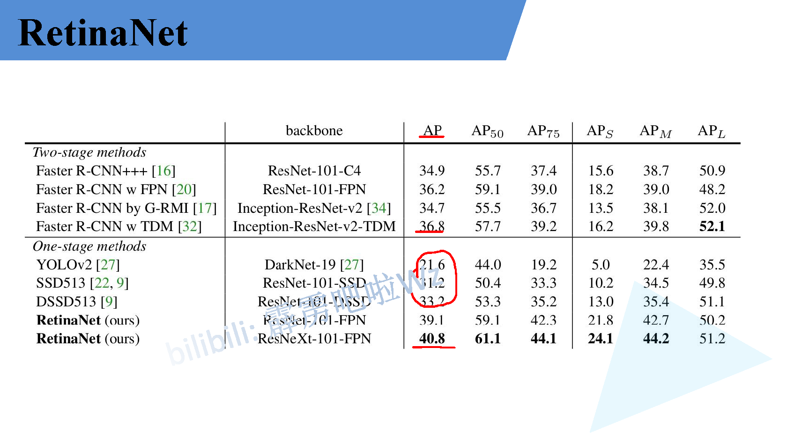

- 很明显，RetinaNet的效果远远好于two-stage和现有的one-stage

## 2. 算法流程


1. 采用FPN结构
    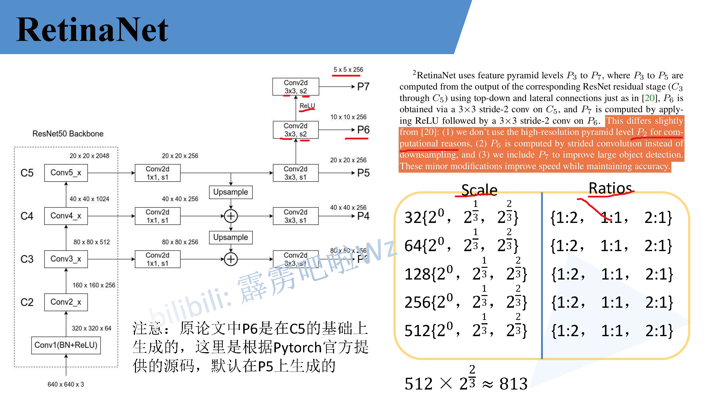
    
    - 注意：在原论文中P6是在C5的基础上生成的，这里是根据pytorch官方提供的实现方式绘制的
    - 而且，FPN会在C2位置生成P2，但是RetinaNet没有，原论文说，P2会占用更多的计算资源
    - 使用了3个scale，3个ratio，共9组anchor template

1. 预测器部分
    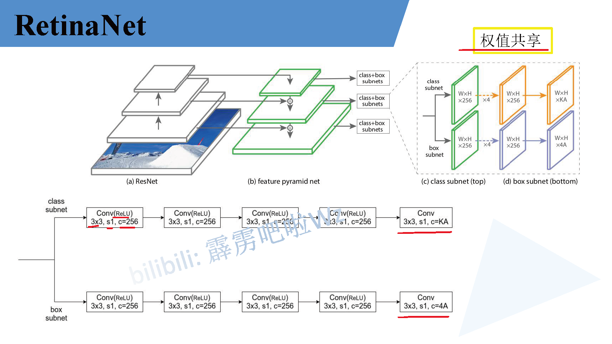

    - 之前的FPN和Faster R-CNN是类似的，是two-stage网络
        - 首先会根据RPN生成proposal
        - 再通过Fast R-CNN生成最终的预测参数

    - RetinaNet是one-stage网络，所以直接使用了一个 **权值共享** 的预测头，就是不同特征层的权值都共享
    - 预测器有两个分支：
        - 类别分支，但是不包含背景类别
        - 目标框参数

1. 正负样本
    

    1. $IoU >= 0.5$ , 正样本
    2. $IoU < 0.4$ , 负样本
    3. $IoU \in [0.4, 0.5)$ , 舍弃

1. 损失计算
    

    - 核心是Focal Loss
    - 详细内容在YOLOv3 SPP中讲解了

- 其余内容与R-CNN差不多，熟练掌握Faster R-CNN代码
## 3. 缺点

# YOLOv3
- [ppt](../ppt/YOLOv3/yolov3.pdf)
## 1. 优势/历史地位
- 内容很少，主要是整合了当前主流网络的优势
- YOLOv3的速度是非常快的，但是mAP其实不是特别出色，没有RetinaNet那么好
    - 在COCO AP IOU=0.5位置上精度还是不错的
## 2. 算法流程
- 修改了backbone
    - YOLOv2使用了DarkNet-19，YOLOv3使用了DarkNet-53
    
    - DarkNet-53没有pooling层，全部用卷积层下采样
    - 速度快的原因是DarkNet-53的通道数比ResNet少，意味着卷积核个数少
- Conv + BN + LeakyReLU
- 每一个方框都是一个残差结构
- YOLOv3结构在论文中非常模糊
1. 输入图像416x416
2. 3个预测特征层
    - 每个特征层上是3个尺度
    - $N \times N \times [3 \times (4+1+80)]$
        - N是预测特征层的尺寸
        - 每个cell预测3种尺度
        - 4个box偏移参数
        - 1个confidence score
        - COCO上80个类别
3. 尺寸较小的特征图会进行上采样，并与尺寸大一倍的特征图在通道数的维度上进行拼接
    - 每个尺度的特征图都是通过最后一个1x1的卷积层进行预测
4. anchor机制

- 与faster R-CNN和SSD不一样的地方：
    - 前者是目标中心点的参数相对于cell的中心点
    - YOLOv2，v3是相对于cell的左上角点
    - $\sigma(x) = Sigmoid(x)$
5. 正负样本匹配
    - 每个GT都会分配一个bounding box prior
    - 寻找于gt重合度最高的bounding box代替gt
        - 如果这个bounding box重合度不是最高的，但是又大于我们设定的阈值，会被丢弃
        - 剩下的就被认为是负样本
        - 对于没有被分配到gt的bounding box是没有位置和类别损失的，只有confidence(objectness)
    - 按照上述原论文的说明，会导致正样本非常的少，因此找一个优化方案：
        - gt于anchor模板左上角重合去做IOU
        - 设置一个IOU阈值，认为大于阈值的都是正样本
        - GT中心在哪一个cell里面，这个cell里面对应IOU超过阈值的anchor template就是正样本
6. 损失计算(论文没给，UP自己写的)
    - 置信度损失
        - logistic regression：实际一般都是二值交叉熵损失(Binary Cross Entropy)
    - 分类损失
        - 二值交叉熵损失(Binary Cross Entropy)
        - 问题：每个预测值是用Sigmoid处理的，是互不干扰的，会导致类别的概率之和不为1
    - 定位损失(了解即可，后面的网络就改了)
        - sum of squared error loss


## 3. 缺点
- 检测精度没完全赶上R-CNN系列


# FCOS
- [ppt](../ppt/FCOS/FCOS.pdf)
## 1. 优势/历史地位
- Anchor Free
    - 之前的网络都是anchor based
    - 基于生成好的anchor，去预测它的偏移和倍率系数
    - 预测l, r, t, b
    

- One-Stage
- FCN-based

## 2. 算法流程
1. 前言
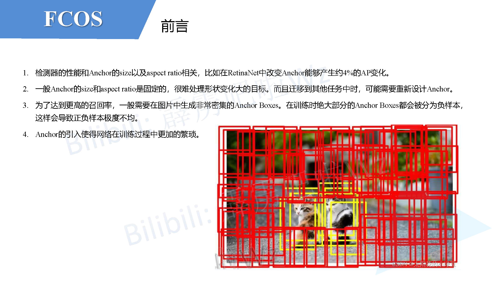

1. FCOS网络结构
    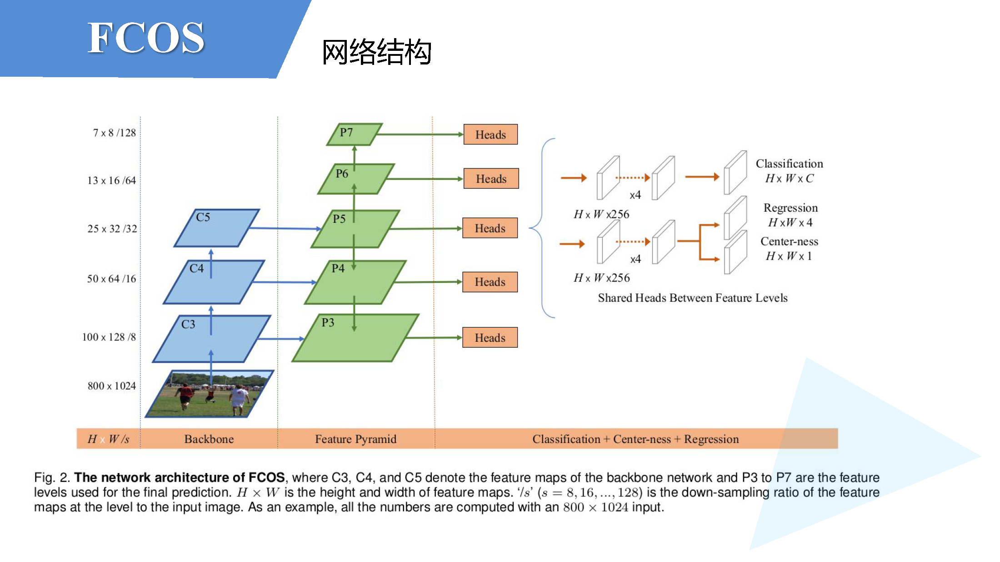

    - 20年的版本是把Center-ness和Regression放在了一个分支

    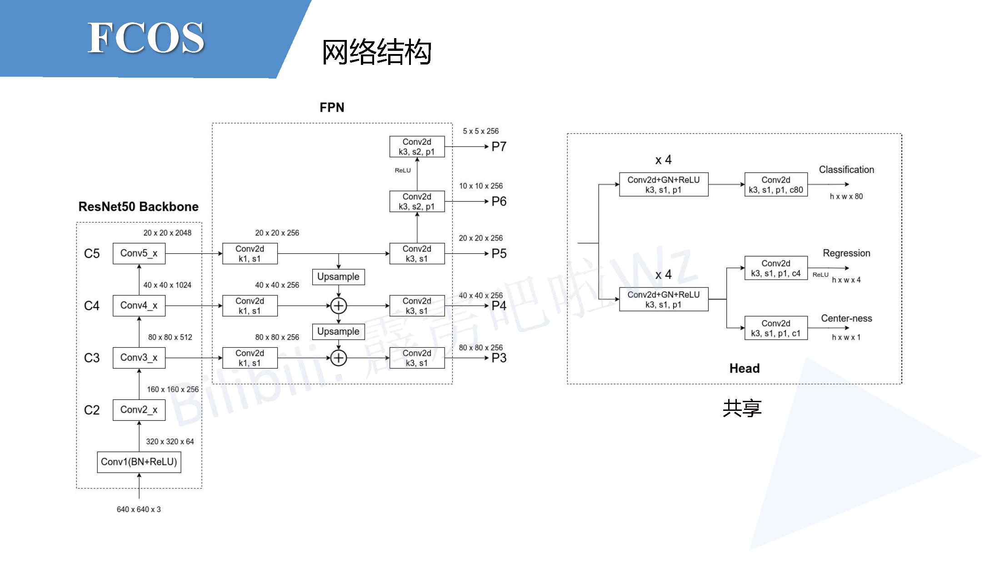

    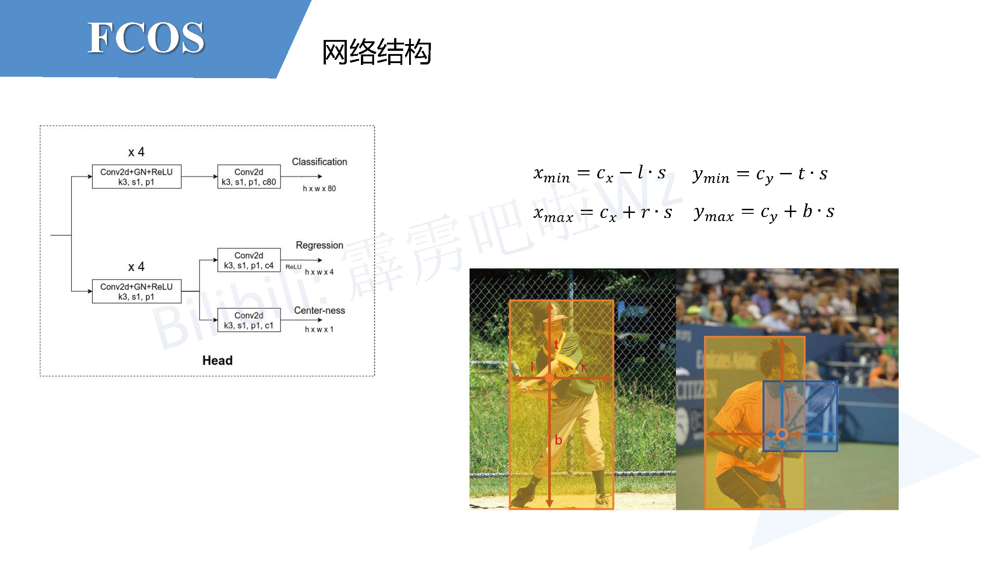

    - 5个预测特征层共用同一个Head
    - 注意Regression部分，正常应该预测 $4 \times num_anchors$ 组参数，但是由于anchor free，不依赖anchors的尺寸，所以只预测4个

    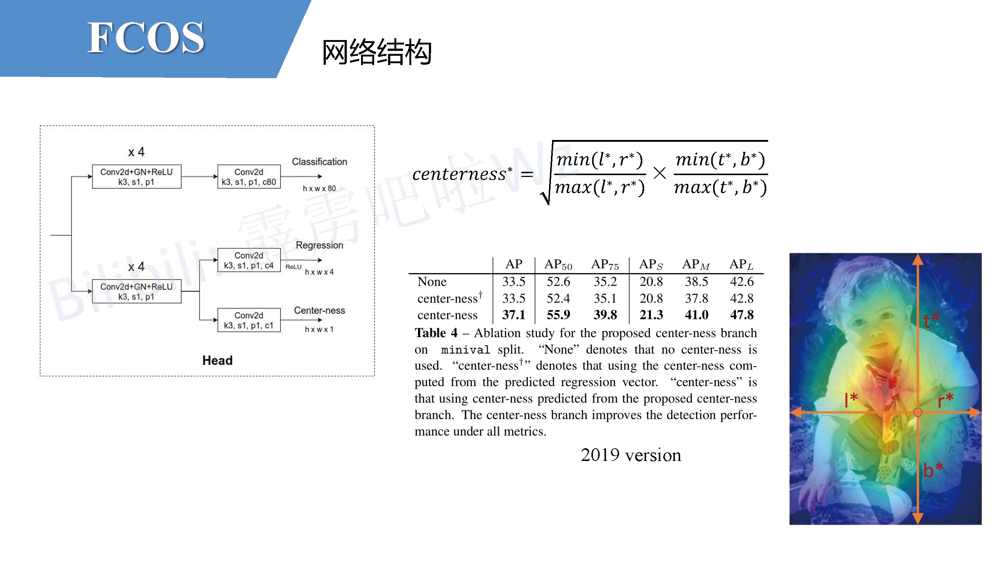

    - centerness是反映了当前预测点，对于目标中心的远近程度
    - 热度图中，蓝色代表数值0，红色代表数值为1
    - 加上了centerness分支有助于提高mAP

1. 正负样本的匹配
    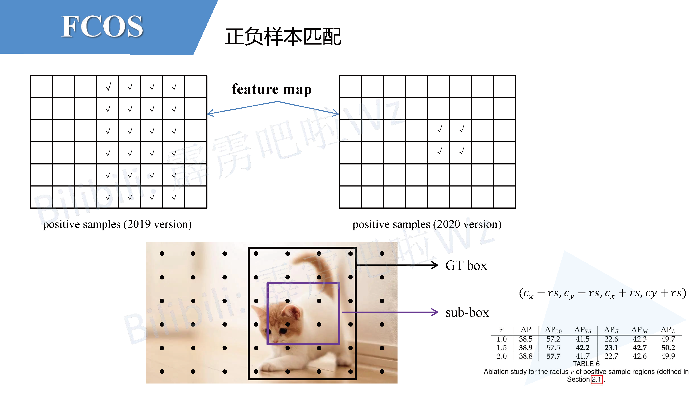

    - 之前的都是通过GT和Anchor box做IoU找正样本，并设定阈值
    - 现在是anhor free，没有anchors，就没办法使用之前的方法
    - 19年说的是，只要预测点落入GT box中，就是正样本
    - 20年认为，落入sub-box才叫正样本
        - $c_ {x}$就是中心点坐标
        - s是特征图相对于原图的步距
        - r是超参数

    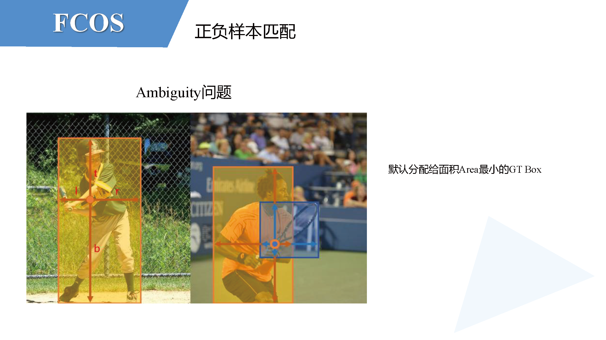

    - 同时落入多个相交区域怎么办？
        - 默认分配给面积最小的GT Box
        - 但是这并不是一个很好的解决方法，通过引入FPN结构处理


1. 损失计算
    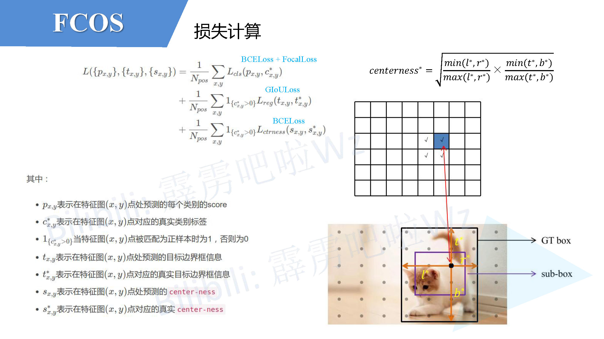

1. Ambiguity问题
    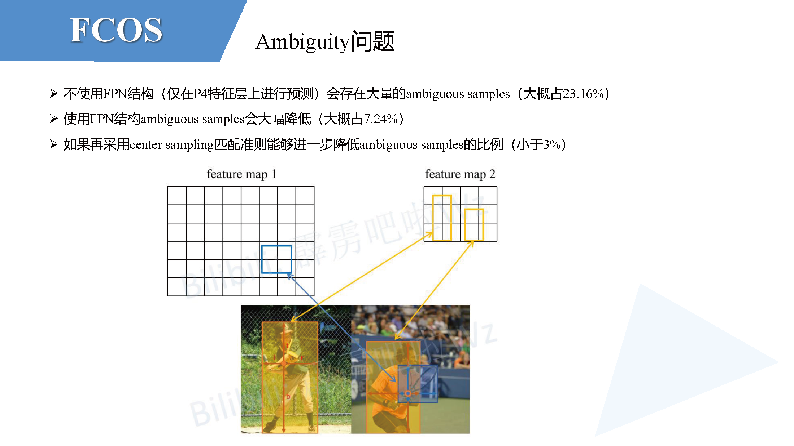

    - 尺寸更大的特征图，适合预测小目标
    - 尺度更小的特征图，适合预测大目标

1. Assigning objects to FPN
    

    - $l^{*}, t^{*}, r^{*}, b^{*}$ 是相对于于预测中心点，到GT box边界的左侧距离，上侧距离，右侧距离和下面距离
    - $m_ {i}$ 是作者预先给的一套阈值
        - 例如：在P3特征图上 $m_ {2} < 3 < m_ {3}$ 视为正样本

## 3. 缺点


# YOLOv3 SPP
- [ppt](../ppt/YOLOv3%20SPP/yolov3spp.pdf)
## 1. 优势/历史地位


- u版代码，作者做了非常多的trick
- Focal loss作者说效果不好，没启用
## 2. 算法流程
1. Mosacic图像增强
    - 实现方法
        - 将多张图片拼接在一起，看作一张图像输入网络
    - 优势：
        1. 增加数据的多样性
        1. 增加目标个数
        1. BN能一次性统计多张图片的参数

1. SPP模块

    - 注意：
        - 这里的SPP和SPPnet中的SPP(Spatial Pyramid Pooling)结构不一样
        - 只是借鉴
    - 在第一个预测特征图之前，拆开了Convolution Set，加入了SPP模块
    - 在多个通路都添加SPP的模块，只有在大图像的情况下效果才比较好，mAP会增加，但是速度变慢

1. CIoU Loss
    - IoU Loss -> GIoU Loss -> DIoU Loss -> CIoU Loss
    1. IoU Loss
        - IoU不同的情况下，L2损失可能相同
        - 优点：
            1. 能够更好的反应重合成都
            1. 具有尺度不变性
        - 缺点：
            1. 当不相交时loss为0
            1. 收敛慢
            1. 回归的不够准确

    1. GIoU Loss
        - 优点：
            1. IoU为0，也有损失

        - 缺点：
            1. 两个框尺寸相同，且x或y方向重合，那么会退化成IoU
            1. 收敛慢
            1. 回归的不够准确
    1. DIoU Loss
        - 优点：
            1. 更快的收敛
            1. 更高的定位精度
            1. 相较于前两者，最大的特色是：
                - 能反映出gt和bbox的位置关系带来的损失差距
        - 缺点：
            1. 考虑的信息还是不够周全

    1. CIoU Loss
        - 优点：
            - 考虑全面
                - 重叠面积(IoU)
                - 中心点距离(DIoU)
                - 长宽比(全新的内容)

1. Focal Loss
    - 针对One-Stage目标检测模型，都会面临一个Class Imbalance问题，就是正负样本不平衡
        - two-stage没有这么严重是因为，在第二阶段之前，第一阶段会把检测框的数量压得很小，就不会出现one-stage几十个正样本面对上万个负样本的情况

    - 正样本高权重少数量，也填充不了负样本低权重大数量的情况。这种现象叫degenerate models
        - 此前通过hard negative mining是实现了筛选对训练有帮助的，大损失的负样本，但是不如Focal Loss

    - 比正常的Cross Entropy Loss引入 $\alpha$ 和 $\gamma$ 两个超参数
        - $\alpha$用于平衡正负样本的权重，但是不能区分那些是容易的样例，那些是复杂的样例
        - $\gamma$所在的损失负责降低简单样本的损失权重，这样我们就可以聚焦于训练复杂的负样本
    - 但是实验证明，敏感的Focal Loss同样容易受到噪音的干扰，因此数据集尽量不要出现标注错误的现象

## 3. 缺点
- 检测精度没完全赶上R-CNN系列


# YOLOv4
- [ppt](../ppt/YOLOv4/yolov4.pdf)
## 1. 优势/历史地位
- 不是原作者的工作了
- mAP提升10%
- FPS提升12%
- 和YOLOv3提升并不大

## 2. 算法流程
1. 网络结构


- Backbone: CSPDarknet53
- Neck: SPP, PAN
- Head:YOLOv3

    1. CSPDarkNet53
        - Strengthening learning ability of a CNN
        - Removing computational bottlenecks
        - Reducing memory costs

        

        

        

    1. SPP
        

    1. PAN(Path Aggregation Network)
        - PAN其实就是在Upsampling之后，再做一个downsampling
        - 对之前的PAN做的更改是
            - 把融合过程的addition变成了concatenation
        


2. 优化策略
- Eliminate grid sensitivity
- Mosaic data augmentation
- IoU threshold(match positive sample)
- Optimizered Anchors
- CIoU

    1. Eliminate grid sensitivity
        

        

        - Sigmoid的问题：当gt box的中心点坐标在grid cell的左上角点时，需要预测的参数 $t_ {x}, t_ {y}$ 都是0，但是Sigmoid要在负无穷的情况才能趋于0，这恶鬼条件非常难以达到
        - 解决方法：引入缩放因子

    1. Mosaic data augmentation
        

    1. IoU threshold(match positive sample)
        

        

        

        - 原作者的意思是，首先取大于阈值的anchor模板，且只取最大的
            - 但是这样的话，正样本数量就太少了
        - 所以现在普遍的做法是，取所有大于阈值的anchor模板，都当成正样本，并匹配上对应的gt
        - 相当于从gt和模板的一对一映射，变成了gt对anchor是一对多
        - YOLOv4取阈值算IoU的步骤都一样，但是取正样本的时候，领域的grid cell对应的AT(anchor template)也被认为是正样本
            - 只会取上下左右四个方向的grid cell，不取左上、左下、右上、右下四个方向

    1. Optimizered Anchors
        

        - YOLOv3 的尺寸是通过聚类得到的
        - YOLOv4针对512x512优化了一下
        - 但是YOLOv5用的还是YOLOv3的anchor尺寸

    1. CIoU
        

        - 和YOLOv3 SPP一样
    
## 3. 缺点


# YOLOv5
- [ppt](../ppt/YOLOv5/yolov5.pdf)

## 1. 优势/历史地位


- 距离YOLOv4出来很近
- 迭代版本很多
- YOLOv5根据大小升序分为(n, s, m, l, x)，图像尺寸640x640，最大下采样32倍，预测特征层3层
    - (n6, s6, m6, l6, x6)，图像尺寸1280x1280，下采样率64倍，预测特征层有4层

## 2. 算法流程
- 绘制的是l大小模型的图


1. 网络结构
    - Backbone：New CSP Darknet53
    - Neck：SPPF，New CSP-PAN
    - Head：YOLOv Head

    - 补充：
        - 将6.1之前的Focus模块替换成了6行的普通卷积层。两者功能相同，但后者效率更高
        

        - SPP -> SPPF：结果等价，效率更高，UP的实验说快了两倍左右
        

2. 数据增强
    1. Mosaic
    2. Copy Paste
        - 注意：必须有对应实例的标签，不然没法启用
        - 本质就是将不同实例拼接到不同图像上，相当于机器PS
    3. Random affine
        - 随机仿射变换
        - 随机旋转、平移、缩放、错切
    4. MixUP
        - 两张图片按透明程度混合成一张新的图片

    5. Albumentations(一个包)
        - 滤波、直方图均衡化以及改变图片质量等等

    6. Augment HSV(Hue, Saturation, Value)
        - 调色度、饱和度和明度

    7. Random horizontal flip
        - 按一定比例，随机的水平翻转


3. 训练策略(策略很多，UP只罗列了一部分)
    1. Multi-scale training(0.5~1.5x)
        - 一定都是32的整数倍

    1. Auto Anchor(For training custom data)
        - 根据自定义数据集，重新自动聚类生成新的anchor template的大小

    1. Warmup and Cosine LR scheduler
        - 训练初期，让学习率从一个很小的值，慢慢增长到我们设定的值
        - cosine的形式慢慢降低学习率

    1. EMA(Exponential Moving Average)
        - 学习变量加了一个动量，让训练更加平滑

    1. Mixed precision(含有TensorCores的GPU才支持混合精度训练)
        - 混合精度训练
        - 减少GPU显存占用
        - 加速网络训练

    1. Evolve hyper-parameters(炼丹)
        - 建议使用默认


4. 损失计算
    1. Classes loss，分类损失，采用的是BCE loss，注意只计算正样本的分类损失。
    2. Objectness loss，obj损失，采用的依然是BCE loss，注意这里的obj指的是网络预测的目标边界框与GT Box的CIoU。这里计算的是所有样本的obj损失。
        - 很多人之前实现YOLOv3和YOLOv4，把obj设置为，有目标为1，无目标为0
        - 但是在YOLOv5中，obj是CIoU
    3. Location loss，定位损失，采用的是CIoU loss，注意只计算正样本的定位损失。
    4. 平衡不同尺度损失
        - 针对三个预测特征层（P3, P4, P5）上的obj损失采用不同的权重

5. 消除Grid敏感度
    - 和YOLOv4的[算法流程 -> 优化策略 -> Eliminate grid sensitivity]差不多
    - 将计算公式革新了
        
        - 指数不受限，很容易出现指数爆炸的情况

6. 匹配正样本
    - 计算gt和at的长宽比值 -> 计算比例差异，越接近于1，差异越小 -> 找到宽度/高度差异最大的比值
    - 差异小于阈值则匹配成功
        

    - 和YOLOv4一样去扩充正样本

## 3. 缺点


# YOLOX
- [ppt](../ppt/YOLOX/YOLOX.pdf)

## 1. 优势/历史地位
- 借鉴于FCOS
- 与之前的网络最大的区别就是Anchor-Free
- 解耦检测头：decoupled detection head
- 更先进的正负样本匹配：advanced label assigning strategy(SimOTA)
- 获得了Streaming Perception Challenge的第一名
## 2. 算法流程
- 整体论文结构


1. 前言
    - 主要对比YOLOv5
    - 数据集分辨率很高的话，建议使用YOLOv5，应为YOLOX也只是640x640
    

1. YOLOX网络结构
    - 使用网络结构(YOLOX-L)绘制的图
    

    - YOLOX是基于YOLOv5的v5.0构建的，网络结构到PAN之前都一样，只有Head不一样(上面的YOLOv5是v6.1，和v5.0还有出入)
    - 区别：
        1. Focus -> 6x6的卷积(原理一样)
        1. YOLOv5是SPPF，但是YOLOX是SPP，而且YOLOX的摆放位置和YOLOv5也是一样的
        1. YOLOv5的检测头是1x1的卷积层，在YOLOX中改成如下的形式：
            
            
            - 作者认为YOLOv5这么做是一个耦合的检测头，耦合的检测头对网络是有害的。但是如果换成解耦的检测头，可以加速收敛，提升AP
            - 检测类别和检测定位以及obj的卷积层是分开的。检测三个项目的检测头是参数不共享的，而且不同的预测特征层的检测头参数也是不共享的。FCOS是共享的

1. Anchor-Free
    
    
    - 这里预测的 $x_ {center}, y_{center}, w, h$ 都是在预测特征层上的尺度，再恢复到原图上还要计算缩放问题
    - 仔细看这个公式，之前的YOLO公式是要乘上对应ancher的尺寸，这里公式里不再使用anchor尺寸了，所以是anchor free

1. 损失计算
    

1. 正负样本匹配SimOTA
    - 论文消融实验都是和YOLOv3做对比

    

    

    

    - 在FCOS网络中，落入sub-box中的所有anchor point视为正样本，除此之外都是负样本
    - 在YOLOX中也是做了一个预筛选，首先找在GT box或者fixed center area(类似sub-box)范围之内的anchor point(fixed center area由一个参数，center_radius=2.5)
    - 可以将YOLOX中的点细分为两个部分：
        1. 既落入GT box，又落入fixed center box
        2. 除了上面之外的点
    - 从损失(cost)公式中，可以看到，前两项是正常的分类损失和定位损失，后一项就是除了GT box和fixed center box交集区域以外的点，给了一个很大的权重，迫使降低这个部分的错误率

    

    - 筛选IoU最大的10个，或者更少的anchors

    

    - dynamic_ks代表论文中的Dynamic k Estimation Stragegy，意思是，每个GT分配的正样本的个数不一样，需要动态计算
    - 计算方法就是：对GT分配的正样本的IoU矩阵，对IoU的值进行求和，再向下取正

    

    - 根据dynamic_ks确定anchors的最终个数，根据cost的升序排列，选最小的dynamic_ks个anchors

    

    - 如果出现一个anchor被分配给了多个GT，那就看它跟哪个GT的cost最小，将其分配给对应的GT
        - 注意：这一步是在确定了每个GT最小的dynamic_ks个anchors，意味着冲突竞争中失败的GT们，最终获得的anchors数量会减少

    

## 3. 缺点


# YOLOR

- 专注于某个感官的时候，其他感官的感受性可能会降低

## 1. 面临的挑战
1. 一般训练中的问题
    

    - 训练网络的过程大致如下：
        

    - 我们对事物的关注点如下：
        

    - 为什么我们会产生这样的原因呢？
        

    - 学习的时候，其实我们只学习不同类别之间有区分的地方，相似的地方我们不关注。就像下面的activation map上，猫和狗的身体在map上都不显现，因为靠猫和狗的身体无法帮助我们区分猫还是狗
        

    - 这也就带来一个问题：就像下面的皮卡丘，它们相似的部分我们不关注。这就会导致，它改变了颜色，改变了公母，改变了帽子，我们都不会关注，因为我们忽略它们形状类似的部分。
    - 导致这件事情的原因就是，在训练网络的Formula里的error，我们只把它们当成一个简单的error数值，却没去考虑它和原图有这个不同的点具体是什么？没有追根溯源
        

1. 多任务训练的问题
    - 最简单的想法就是，一个任务训练疑个model。但是这会消耗大量的资源，而且最后的结果也并不一定是最好的。
        
    
    - 现在我们希望，所有的任务共用一个网络，就是backbone，这样我们可以在real time的时间里，做出相应的结果
    - 但是会发现，有的任务采取这种方法，效果还不错。但是有的任务就训练不起来
    - 这是因为不同任务需要的特征不一样，而且对特征的需求可能是冲突的。比如对目标检测任务检测宝可梦，希望宝可梦们的特征尽可能的相似；而对宝可梦的性别分析，可能要分析尾巴的花纹。那么这对特征提取就会有一定的冲突
        

    - 现在的一些解决方案是上述两种方案的折中：训练多个特征提取器，但是之间互相share一些weights，不共享的权重，用于提取特别需要的特征。
    - 但是问题是，怎么有效率的去甄别要共享哪些权重呢？
        

## 2. 解决方案
1. Manifold Learning
    - 在高维度上评估距离是不可靠的。就像第二幅图，可能红色之间的距离，甚至比红色和蓝色之间的距离都要远
    - 但是如果降维到低维度上，就可以更好的使用距离error方法
        

    - 常用的Manifold Learning方法是t-SNE方法
    - 找到一个合适的Manifold Learning的方法是很重要的
        

    - 来看一个例子
    - x轴上代表了狗的姿势，y轴上代表了狗的种类
        

    - 通过reduce维度，我们可以将复杂的问题投影到低维度上，变成一个简单的问题来处理
    - 如果reduce其中一个dimension的话，可以只提取一个种类的但是不同姿势的狗
        

    - 如果reduce另一个dimension的话，可以只提取一个姿势的但是不同种类的狗
        
        

1. Model the Error Term
    - 对error建模，让模型知道为什么error了
    - 希望我们的任务输出，在high dimension上，每个维度上的数据是有关联性的

    - 此前我们是把属于同一类的error，映射到低维度的时候，都压缩成一个类别，压缩之后就丢失了这个类别的属性信息了，也没办法进一步知道它们具体error的点
        

    - 现在我们不对维度进行压缩了，我们映射到更高的维度，寻找一个新的方式进行映射压缩，这个方式压缩后，可以反映出为什么会产生error
        

    - 那么我们就要对error进行一个建模
    - 获得了error在高维的投影，我们就可以根据error种类的需要，去做不同的Manifold，获得对应压缩后的结果
        

    - 在结合这些explicit和implicit上面，可以有很多运算操作：addition, multiplication, concatenation
        

1. Disentangle the Representation of Input and Tasks
    - 根据输入和任务去做裁剪
    - 相同的输入，但是在不同的想法下，是有不同的答案的
        

    - 需要找到只跟输入有关，但是跟任务无关的 $P(x)$
    - 需要找到只跟任务有关，但是跟输入无关的 $P(c)$
    - 最好还能找到基于任务的输入的关系，这样就能解释为什么通过这个输入能够得到这样的输出
        

## 3. YOLOR for Object Detection
1. YOLOR
    - 中间的Analyzer是只跟Input有关
    - 根据输入可以得到一定的explicit Knowledge
    - 以及一些网络中没有输入的Implicit Kownledge
    - 通过Discriminator用来分辨任务种类
        

1. Explicit Kownledge
    

1. Implicit Kownledge
    - 在论文中，我们更关注Implicit Kownledge
    

    - 举一个之前在object detection上常见的问题
    - 高分辨率的图像，所包含的信息是很多的
    - 低分辨率的图像，包含信息很少
        

    - 但是我们很容易把多个分辨率的图像，都reduce到信息最少的低分辨率图像上
    - 原因就是之前的目标检测error都压缩了很多信息，所以即使高分辨率图像包含了大量信息，但是由于低分辨率图像上没有，取交集之后，就相当于映射到了低分辨率图像的信息集上
        

    - 近几年非常流行的FPN网络就在解决这个问题
    - 不同分支可以对不同物件分析不同的信息
        

    - 但是这样会导致，不同分支产生的特征彼此之间很难去映射
    - 大的特征图信息多，小的特征图信息少，映射很困难
        

    - 这时候Implicit Knowledge的作用就显现出来了
    - Implicit Knowledge的加入，对原始特征图上的特征都做了不同程度的偏移，从而使多个特征图放在一块的时候可以进行一个比较
        

## 4. 实验的结果和结论
1. YOLOR + YOLO
    - combine explicit knowledge and implicit knowledge
    - addition：把不同特征通过加法做结合
    - multiplication：类似attention的机制
    - concatenation：类似给定一个条件去做condition的运算
        
    
    - 对最后的特征图使用加法或者乘法
        

    - 最后得到的一些准度的结果
        
    
    - 很显然，implicit knowledge在初始化为1附近采样的情况下，能够根据anchors的尺寸，学习到周期性的内容，也能根据数据集中每个类别样本数量的多少做出调整
        

    - 在中间层添加了implicit knowledge后，也会产生数值上的一些区分
        

    - feature special alignment效果还是不错的
    - 实验结果是，略微增加了参数量(基数很大，百分比很小)，但是提高了0.5%的精度
        
        
    - 做了很对不同的implicit knowledge model
    - Neural network：认为得到的z中的每个维度彼此是关联的
    - 矩阵分解：认为得到的z中的每个维度彼此是独立的，但是每个维度也有很多不同的变因导致最后的结果，通过乘以一个权重c，进行每个维度的加权和
    - 结果是，不管采用哪种方法，最后都是提升
        

    - 最后提升了88%的速度和3.8%的精度


1. YOLOR + Multiple Tasks
    

    

    

    

    

    

## 5. Q&A
- $z$ 是implicit的部分
- $x$ 是explicit的部分
- $z$ 是加在channel轴上
- $z$ 是被训练出来的
- 矩阵分解的方法中， $c$ 是coeffience
- 比attention based方法，参数量更少，但是效果更好


# YOLOv6 美团官方解读 + QA

## 1. 算法演进技术讲解


- 目录
    

- 背景
    

    

- YOLOv6的诞生——由于工业的需求
    

- YOLOv6的性能
    - BS = batch_size
        

- 改进部分
    

- 网络结构设计
    

    - 整体网络框架
        

        - 结构
            - Backbone
            - Neck
            - Head
        - 结构重参数化思想设计了两个模块
            - RepBlock
                - 在推理的时候，将训练时候的多分支结构等效成一个3x3的卷积
                - 保证训练的时候能够学习更多的特征
                - 保证在推理的时候有足够的速度
            - CSPStackRep Block

    - 网络的设计思路
        
    
    - 实验
        - Backbone部分采用不同网路的对比实验
            

        - 结构重参数化和激活函数
            

    - 检测头设计
        

- 先进目标检测算法探索
    
    
    - 标签分配策略
        

        - ATSS有一个问题，一旦网络配置和数据集确定了之后，那么正负样本的选择就是固定下来的，没办法随着训练的过程进行改变
        - SimOTA是根据OTA演化而来的。SimOTA在训练中容易不稳定，训练速度也会慢一些

    - 消融实验
        

    - 损失函数
        

        - 目标损失可有可无

    - 损失函数消融实验
        

        - DFL的思想是将连续的坐标回归问题，转化成了离散的分类问题解决的，所以在预测阶段，比常规坐标预测多16个维度的tensor输出，多的计算量会对小模型影响较大
        - DFL虽然能够带来一定的精度提升，但是会对速度有一定影响，会变慢
        - 引入目标损失，网络的精度反而下降了。原因可能是，目标分支的引入和之前正负样本的分配策略、TAL的任务对齐存在冲突。之前TAL只需要对齐分类和回归，但是现在增加了目标分支，对其内容从两个变成了三个，任务增大，学习难度增加，从而因修改那个效果

- 工业遍历技巧
    

    - 自蒸馏训练
        

        - 因为教师网络和学习网络都是同样的网络结构，所以称为自蒸馏
        - 训练的时候，教师网络提供的软标签带有更多的信息，可以更方便学生网络的拟合

    - 实验
        

        - 小网络没用DFL，因为影响速度
        - 小网络的分类分支做了蒸馏，但是效果还不如多训练100轮效果好
            - 多轮训练还是有助于模型收敛的
        - 在训练的最后15轮关闭Mosica预处理策略，能够提升模型精度
        - 加入灰边有助于提升精度

- 总结与展望
    

    - 模型选择
        

    - 模型指标
        

    - 未来
        

## 2. 量化部署实战指南


- 目录
    

- 背景
    

    - 模型量化在实际业务部署中，是最有效最广泛的模型压缩方法
    - PTQ在实际业务中，使用很广泛，因为不需要额外的训练过程，也容易上手，但是不可避免的又精度损失
    - QAT在训练过程中引入量化操作，通过训练消除量化误差

    

    - 为什么YOLOv6不大量使用QAT结构弥补精度？
        - 因为YOLOv6使用了大量重参数化结构
        - 重参数化结构是一个两阶段的模式，多分支结构
        - 如果在这时加入伪量化算子，进行QAT训练的话，在训练结束之后，每一个支路的scale参数是不一样的，不一样就没办法融合，进行性能上的提升

    - 如果使用Deploy模式(所有分支都融合的情况)，进行QAT，这时候模型是没有边的，没有边的模型是很难训练的，很容易崩掉

- 量化问题解决
    - Backbone替换
        

        - RepOpt使用优化器重参数化的方法，代替原来的结构重参数化
        - Rep难题主要是在结构重参数化的过程中，导致kernel的分布过差(实际有待考证)
        - RepOpt训练有；两个阶段
            - 超参搜索：搜索各个层的scale参数，用来初始化第二阶段的一个Optimizer
            - 正常的网络训练过程

    - COCO复现结果
        

    - 部分量化改善精度
        

        - 对部分层进行量化，把敏感的层剔除
        - 如何去寻找敏感层很关键，提出四种方法
        - 获得了各层的敏感性排序，把最敏感的6层进行跳过，虽然精度有影响，但是能够极大的提升量化精度

    - QAT量化
        

    - 其他方法
        
    
    - 图优化(TensorRT部署流程)
        

        - TensorRT可以自动对带有PTQ和QAT量化算子的模型进行融合，但是有的情况下自动融合算子是无法实现的，比如两个输入有不同的scale，为了实现数值的精度，它就必须在它附近的算子进行量化和反量化。让精度保持一致，这部分就会导致性能损失
            - 解决方案就是对不同输入手动置成相同的scale，美团采用两者中最大的scale

    - 部署优化
        

        - 提高GPU并发的利用率

    - 结果
        

### 3. Q&A
1. 为什么DFL对小模型影响很大？
    - DFL的思想是将连续的坐标回归问题，转化成了离散的分类问题解决的，所以在预测阶段，比常规坐标预测多16个维度的tensor输出，多的计算量会对模型性能影响较大

2. 自己训练也要400个epoch吗？是不是太多了
    - 多训练有助于模型收敛。不过要看曲线图，如果能提前收敛当然好

3. YOLOv6的量化现在已经做的比主流的PTQ和QAT都要复杂了，那是不是太难操作了？
    - 主要难点在Backbone换成了RepOpt，虽然效果很好，但是目前还持有质疑，期待后续工作发布

4. 自蒸馏网络的教师网络使用正常训练，给学生的网络训练前期使用，后期就不直接用硬GT了嘛？
    - 权重衰减只是对蒸馏的Loss进行权重衰减，实际还是会有一些权重的，后期还是会有蒸馏的Loss，但是会比硬标签的Loss相对小一些

5. 增加灰边是在训练的时候还是推理的时候？
    - 在推理的时候进行训练的策略。训练开启Mosica，也相当于做了灰边处理

6. 量化中采用图优化是不是要了解每一个算子，图优化增么解决超多算子？
    - 使用图优化本质上是为了提高模型性能，所以会对精度有影响。或者说本质上因为QAT对性能不是很优化，实际有采用QAT的模型，PTQ的方式去部署

7. 数据量少如何选模型？
    - 建议Fine-tune，然后根据自己需求，选速度优势的小网络，或者精度优势的大网络

8. 不同数据量化跳过的层是不一样的？
    - 根据不同业务进行不同的跳过。

9. 自蒸馏训练？
    - 两阶段训练。先训练教师网络，常规训练，然后在训练蒸馏过程

10. 使用RepConv计算量，参数量？
    - 推理转化成了正常的卷积，所以推理过程的参数量和计算量是一样的

11. 为什么不用更大的网络作为教师网络？
    - 自蒸馏就是用了同样的网络结构。更大的网络训练成本更高，

# YOLOv6 总结

## 1. 概述
YOLOv6是美团视觉智能部研发的一款目标检测框架。致力于工业应用。本框架同时专注于检测的精度和推理效率，在工业界常用的尺寸模型中：YOLOv6-nano在COCO上的精度可达35.0%AP，在T4上推理速度可达1242FPS；YOLOv6-s在COCO上精度可达43.1%AP，在T4上推理速度可达520FPS。在部署方面，YOLOv6支持GPU（TensorRT）、CPU（OPENVINO）、ARM（MNN、TNN、NCNN）等不同平台的部署，极大地简化工程部署时的适配工作。

### 精度与速度远超YOLOv5和YOLOX的新框架
目标检测作为计算机视觉领域的一项基础性技术，在工业界得到了广泛的应用，其中YOLO系列算法因其较好的综合性能，逐渐成为大多数工业应用时的首选框架。至今，业界已衍生出许多YOLO检测框架，其中以YOLOv5、YOLOX和PP-YOLOE最具代表性，但在实际使用中，我们发现上述框架在速度和精度方面仍有很大的提升空间。基于此，我们通过研究并借鉴了业界已有的先进技术，开发了一套新的目标检测框架——YOLOv6。该框架支持模型训练、推理及多平台部署等全链条的工业应用需求，并在网络结构、训练策略等算法层面进行了多项改进和优化，在COCO数据集上，YOLOv6在精度和速度方面均超越其他同体量算法，相关结果如下：
    

展示了不同尺寸网络下各检测算法的性能对比，曲线上的点分别表示该检测算法在不同尺寸网络下(s/tiny/nano)的模型性能，从图中可以看到，YOLOv6在精度和速度方面均超越其他YOLO系列同体量算法。
    

图 展示了输入分辨率变化时各检测网络模型的性能对比，曲线上的点从左往右分别表示图像分辨率依次增大时(384/448/512/576/640)该模型的性能，从图中可以看到，YOLOv6在不同分辨率下，仍然保持较大的性能优势。

## 2. YOLOv6关键技术介绍
YOLOv6主要在Backbone、Neck、Head以及训练策略等方面进行了诸多的改进：
- 我们统一设计了更高效的Backbone和Neck：受到硬件感知神经网络设计思想的启发，基于RepVGG style设计了可重参数化、更高效的骨干网络EfficientRep Backbone和Rep-PAN Neck
- 优化设计了更简洁有效的Efficient Decoupled Head，在维持精度的同时，进一步降低了一般解耦头带来的额外延时开销。
- 在训练策略上，我们采用Anchor-free无锚范式，同时辅以SimOTA标签分配策略以及SIoU边界框回归算是来进一步提高检测精度。

### 2.1 Hardware-friendly的骨干网络设计
YOLOv5/YOLOX使用的Backbone和Neck都基于CSPNet搭建，采用了多分支的方式和残差结构。对于GPU等硬件来说，这种结构会一定程度上增加延时，同时减小内存带宽利用率。下图 为计算机体系结构领域中的Roofline Model介绍图，显示了硬件中计算能力和内存带宽之间的关联关系
    

于是，我们基于硬件感知神经网络设计的思想，对Backbone和Neck进行了重新设计和优化。该思想基于硬件的特性、推理框架/编译框架的特点，以硬件和编译友好的结构作为设计原则，在网络构建时，综合考虑硬件计算能力、内存带宽、编译优化特性、网络表征能力等，进而获得又快又好的网络结构。对上述重新设计的两个检测部件，我们在YOLOv6中分别称为EfficientRep Backbone和Rep-PAN Neck，其主要贡献点在于：
1. 引入了RepVGG style结构
    

2. 基于硬件感知思想重新设计了Backbone和Neck
RepVGG Style结构时一种在训练时具有多分支拓扑，而在实际部署时可以等效融合为单个3x3卷积的一种可重参数化的结构(融合过程如下图所示)。通过融合成的3x3的卷积结构，可以有效利用计算密集型硬件计算能力(比如GPU)，同时也可获得GPU/CPU上已经高度优化的NVIDIA cuDNN和Intel MKL编译框架的帮助。

实验表明，通过上述策略，YOLOv6减少了在硬件上的延时，并显著提升了算法的精度，让检测网络更快更强。以nano尺寸模型为例，对比YOLOv5-nano采用的网络结构，本方法在速度上提升了21%，同时精度提升3.6%AP。
    

**Efficient Backbone:** 在Backbone设计方面，我们基于以上Rep算子设计了一个高效的Backbone。相比于YOLOv5采用的CSP-Backbone，该Backbone能够高效利用硬件(如GPU)算力的同时，还具有较强的表征能力

下图 为EfficientRep Backbone具体设计结构图，我们将Backbone中stride=2的普通Conv层替换成了stride=2的RepConv层。同时，将原始的CSP-Block都重新设计为RepBlock，其中RepBlock的第一个RepConv会做channel维度的变换和对齐。另外，我们还将原始的SPPF优化设计为更加高效的SimSPPF。
    

**Rep-PAN:** 在Neck设计方面，为了让其在硬件上推理更加高效，以达到更好的精度与速度的平衡，我们基于硬件感知神经网络设计思想，为YOLOv6设计了一个更有效地特征融合网络结构。

Rep-PAN基于PAN拓扑方式，用RepBlock替换了YOLOv5中使用的CSP-Block，同时对整体Neck中的算子进行了调整，目的是在硬件上达到了高效推理二点同时，保持较好的多尺度特征融合能力(Rep-PAN结构图如下图)
    

### 2.2 更简洁高效的Decoupled Head
在YOLOv6中，我们采用了解耦检测头(Decoupled Head)结构，并对其进行了精简设计。原始YOLOv5的检测头是通过分类和回归分支融合共享的方式来实现的，而YOLOX的检测头则是将分类和回归分支进行解耦，同时新增了两个额外的3x3的卷积层，虽然提升了检测精度，但一定程度上增加了网络延时。

因此，我们对解耦头进行了精简设计，同时综合考虑到相关算子表征能力和硬件上计算开销这两者的平衡，采用Hybrid Channels策略重新设计了一个更高效的解耦头结构，在维持精度的同时将低了延时，缓解了解耦头中3x3卷积带来的额外延时开销。通过在nano尺寸模型上进行消融实验，对比相同通道数的解耦头结构，精度提升0.2%AP的同时，速度提升6.8%。
    
    

### 2.3 更有效的训练策略
为了进一步提升检测精度，我们吸收借鉴了学术界和工业界其他检测框架的先进研究进展：Anchor-free无锚范式、SImOTA标签分配策略以及SIoU边界框回归损失。

**Anchor-free无锚范式**

YOLOv6采用了更简洁的Anchor-free检测方法。由于Anchor-based检测器需要在训练之前进行聚类分析以确定最佳Anchor集合，这会一定程度提高检测器的复杂度；同时，在一些边缘端的应用中，需要在硬件之间搬运大量检测结果的步骤，也会带来额外的延时。而Anchor-free无锚范式因其泛化能力强，解码逻辑更简单，在近几年中应用比较广泛。经过对Anchor-free的实验调研，我们发现，相较于Anchor-based
    

检测器的复杂度而带来的额外延时，Anchor-free检测器在速度上有51%的提升。
    

**SimOTA标签分配策略(基本上就是继承了YOLOX的思想)**

为了获得更多高质量的正样本，YOLOv6引入了SimOTA算法动态分配正样本，进一步提高检测精度。YOLOv5的标签分配策略是基于Shape匹配，并通过跨网格匹配策略增加正样本数量，从而使得网络快速收敛，但是该方法属于静态分配方法，并不会随着网络训练的过程而调整。

近年来，也出现不少基于动态标签分配的方法，此类方法会根据训练过程中的网络数出来分配正样本，从而可以产生更多高质量的正样本，接入又促进网络的正向优化。例如，OTA通过将样本匹配建模成最佳传输问题，求得全局信息下的最佳样本匹配策略以提升精度，但OTA由于使用了Sinkhorn-Knopp算法导致训练时间加长，而SimOTA算法使用Top-K近似策略来得到样本最佳匹配，大大加快了寻来你速度。故YOLOv6采用了SimOTA动态分配策略，并结构无锚范式，在nano尺寸模型上平均检测精度提升1.3%AP。

SimOTA的流程：
1. 确定正样本候选区域
2. 计算anchor与gt的iou
3. 在候选区域内计算cost
4. 使用iou确定每个gt的dymanic_k
5. 为每个gt去cost排名那个最小的前dynamic_k个anchor作为正样本，其余为负样本。
6. 使用正负样本计算loss

**SIoU边界框回归损失**

为了京一部提升回归精度，YOLOv6采用了SIoU边界框回归损失函数来监督网络的学习。目标检测网络的训练一般需要至少定义两个损失函数：分类损失和边界框回归损失，而损失函数的定义往往对检测精度以及寻来你速度产生较大的影响。

近年来，常用的边界框回归损失包括IoU、GIoU、CIoU、DIoU loss等等，这些损失函数通过考虑预测框与目标框之间的重叠程度、中心点距离、纵横比等因素来衡量两者之间的差距，从而指导网络最小化损失，以提升回归精度。但是这些方法都没有考虑到预测框与目标框之间方向的匹配性。SIoU损失函数通过引入了所需回归之间的向量角度，重新定义了距离损失，有效降低了回归的自由度，加快网络收敛，进一步提升了回归精度。通过在YOLOv6s上采用SIoU loss进行实验，对比CIoU loss，平均检测精度提升0.3%AP。
    

SIoU:
- Angle cost
- Distance cost
- Shape cost
- IoU cost

## 3. 实验结果
经过以上优化策略和改进，YOLOv6在多个不同尺寸下的模型均取得了卓越表现。下表1展示了YOLOv6-nano的消融实验结果，从实验结果可以看出，我们自主设计的检测网络在精度和速度上都带来了很大的增益。
    

- YOLOv6-nano在COCO val上取得了35.0%AP的精度，同时在T4上使用TRT FP16 batchsize=32进行推理，可达到1242FPS的性能，相较于YOLOv5-nano精度提升7%AP，速度提升85%
- YOLOv6-tiny在COCO val上取得了41.3%AP的精度，同时在T4上使用TRT FP16 batchsize=32进行推理，可达到602FPS的性能，相较于YOLOv5-s精度提升3.9%AP，速度提升29.4%
- YOLOv6-s在COCO val上取得了41.3%AP的精度，同时在T4上使用TRT FP16 batchsize=32进行推理，可达到520FPS的性能，相较于YOLOX-s精度提升2.6%AP，速度提升29.4%；相较于PP-YOLOE-s精度提升20.4%AP的条件下，在T4上使用TRT FP16 进行单batch推理，速度提升71.3%


# YOLOv7

## 1. 创新点
1. E-ELAN: Extended efficient layer aggregation networks
    
    - 区分ELAN和E-ELAN
    - 这篇文章的重点结构
    - ELAN/E-ELAN配置文件结构：
        - [from, number, module, args]
        - from: 当前层的输入是来自于那一层
        - number: 当前模块的数量
        - module: 该层的模块类型
        - args: 创建该层对应的模块时，需要传递的参数
            - [channels, kernel_size, stride]
    - E-ELAN是两个并行的ELAN
        

        - 空洞卷积的等价形式
            

    - ELAN和E-ELAN对比
        

2. 模型缩放方法Model scaling for concatenation-based models
    - 调节模型的属性，产生模型不同速度需求下的不同大小
    - 基于拼接操作(ELAN和E-ELAN就用了)的复合模型缩放方法
    - 能够同时改变深度和宽度
        

3. 计划的重参数化卷积
    - 把卷积用到残差模块或者拼接模块
        - 去看RepVGG
        - 训练的时候采用非常复杂的结构
        - 训练完成后重参数化称为一个等效的卷积
        - 能够在不增加推理速度的情况下，提升模型的效果

    - 虽然重参数化方法在VGG上很好使，但是不能直接使用的ResNet和DensNet这种有残差结构的网络上
    - RepConvN就是在RepConv基础上去掉了恒等连接
        

    - 结论：当一层带有残差或者拼接的模块时，必须使用没有恒等连接的重参数化结构

    - 作者只在代码里使用了最简单的重参数化替换方法，没有在残差或者卷积上使用，也就是没有使用这个结论

3. 两种新的标签分配方法
    1. Deep supervision
        

        - 在基本的检测头上，增加了辅助检测头
        - 辅助检测头参与反向传播

    2. label assignment
        - hard label：根据真实GT框对应的目标框，GT中心位置在哪，就产生什么标签
        - soft label：不再只通过红色标注框中心点位置，分配标注框。而是不同的网格位置，和这个红色的标注框去做额外的复杂运算，再最终确定标注框的分配位置
            
        
        - 分配器Assigner：实际代码中是OTA

    3. 求损失
        - Lead Head和Auxiliary Head都需要计算损失
        - YOLOv7提出两种guided assigner计算损失
        - fine label：中心和邻域共3个hard label共同计算出标注框的soft label，称之为细粒度软标签。粗粒度软标签被认为是中心和其4邻域hard label的计算结果
        - coarse label：

4. 训练技巧
    1. BN层融合
    1. 隐式知识
    1. EMA

## 2. 算法流程
1. 模型种类
    - 基础模型
        - YOLOv7-tiny：边缘计算GPU
            - leaky ReLU
            - SiLU
        - YOLOv7：常规GPU
        - YOLOv7-W6：云GPU
    - YOLOv7-X：使用了复合模型缩放方法，扩大了模型的宽度和深度，常规GPU
    - 在YOLOv7-W6基础上使用符合模型缩放得到扩大的模型
        - YOLOv7-E6：云GPU
        - YOLOv7-D6：云GPU
    - YOLOv7-E6E：在YOLOv7-E6基础上，把所有ELAN都替换成E-ELAN的模型，云GPU

2. 网络结构
    

    - 配置文件中的Conv不仅仅是普通的Conv，是Conv + BN
    + SiLU的组合，也被称为CBS层

    - ELAN
        
    
    - MP1
        

        - 复杂版的最大池化层：因为输入输出通道数不变，但是尺寸减半
    - SPPCSPC
        

    - ELAN'
        

    - MP2
        

    - Detect
        

        - 预测数量self.no = 类别数 + 回归参数(4) + 目标参数(1)
        - 锚框数量self.na一般都是3
        - 常见数值255 = self.no * self.na(其中self.no的类别数取80)

    - 预测框计算公式
        

    - DownC
        

    - ELAN所有变体
        

    - ImplicitA和IMplicitM
        - 就是加了一个可学习的向量
        - A是Add，加法
        - M是multiple，乘法


3. YOLOv7网络结构
    - YOLOv7-tiny
        

    - YOLOv7
        

    - YOLOv7-W6
        

    - YOLOv7-X
        

    - YOLOv7-E6
        

    - YOLOv7-D6
        

    - YOLOv7-E6E
        

# YOLOv8

## 什么是 YOLOv8？

YOLOv8 是最新的最先进的 YOLO 模型，可⽤于对象检测、图像分类和实例分割任务。 YOLOv8 由 [Ultralytics](https://ultralytics.com/?ref=blog.roboflow.com) 开发，他还创建了具有影响⼒和⾏业定义的 YOLOv5 模型。 YOLOv8 在 YOLOv5 的基础上包含了许多架构和开发⼈员体验的变化和改进。

截⾄撰写本⽂时，YOLOv8 正在积极开发中，因为 Ultralytics 致⼒于开发新功能并响应社区的反馈。事实上，当 Ultralytics 发布模型时，它会得到⻓期⽀持：该组织与社区合作，使模型达到最佳状态。

## YOLO如何成⻓为YOLOv8

[YOLO (You Only Look Once)](https://blog.roboflow.com/guide-to-yolo-models/) 系列模型在计算机视觉界名声⼤噪。 YOLO 之所以出名，是因为它在保持较⼩模型尺⼨的同时具有相当⾼的准确性。 YOLO 模型可以在单个 GPU 上进⾏训练，这使得⼴泛的开发⼈员可以使⽤它。机器学习从业者可以在边缘硬件或云中以低成本部署它。

⾃ 2015 年由 Joseph Redmond ⾸次推出以来，YOLO ⼀直受到计算机视觉社区的培育。在早期（版本 1-4），YOLO 在 Redmond 编写的名为 [Darknet](https://blog.roboflow.com/training-yolov4-on-a-custom-dataset/) 的⾃定义深度学习框架中以 C 代码维护。

YOLOv8 作者，Ultralytics 的 Glenn Jocher，在 PyTorch 中跟踪了 YOLOv3 存储库 [YOLOv3 repo in PyTorch](https://blog.roboflow.com/training-a-yolov3-object-detection-model-with-a-custom-dataset/) （来⾃ Facebook 的深度学习框架）。随着 shadow repo 中的训练变得更好，Ultralytics 最终推出了⾃⼰的模型： [YOLOv5](https://blog.roboflow.com/how-to-train-yolov5-on-a-custom-dataset/).

鉴于其灵活的 Pythonic 结构，YOLOv5 迅速成为世界上的 SOTA 存储库。这种结构允许社区发明新的建模改进，并使⽤类似的 PyTorch ⽅法在存储库中快速共享它们。

除了强⼤的模型基础，YOLOv5 维护者⼀直致⼒于⽀持围绕该模型的健康软件⽣态系统。他们积极解决问题并根据社区需求推动存储库的功能。

在过去两年中，各种模型从 YOLOv5 PyTorch 存储库中分⽀出来，包括 [Scaled-YOLOv4](https://roboflow.com/model/scaled-yolov4?ref=blog.roboflow.com), [YOLOR](https://blog.roboflow.com/train-yolor-on-a-custom-dataset/), 和 [YOLOv7](https://blog.roboflow.com/yolov7-breakdown/)。 世界各地出现了其他基于 PyTorch 的模型，例如 [YOLOX](https://blog.roboflow.com/how-to-train-yolox-on-a-custom-dataset/) 和 [YOLOv6](https://blog.roboflow.com/how-to-train-yolov6-on-a-custom-dataset/). ⼀路⾛来，每个 YOLO 模型都带来了新的 SOTA 技术，这些技术继续推动模型的准确性和效率。

在过去六个⽉中，Ultralytics 致⼒于研究 YOLO 的最新 SOTA 版本 YOLOv8。YOLOv8 于 2023 年 1 ⽉ 10 ⽇发布。

## 为什么要使⽤ YOLOv8？

以下是您应该考虑在下⼀个计算机视觉项⽬中使⽤ YOLOv8 的⼏个主要原因：

1. YOLOv8在COCO和Roboflow 100上测得准确率很⾼。
2. YOLOv8 具有许多⽅便开发⼈员的功能，从易于使⽤的 CLI 到良好的结构化的 Python 包。
3. 围绕 YOLO 有⼀个庞⼤的社区，围绕 YOLOv8 模型的社区也在不断壮⼤，这意味着计算机视觉界有很多⼈可以在您需要指导时为您提供帮助。

YOLOv8 在 COCO 上实现了很强的准确性。例如，YOLOv8m 模型 中等模型 在 COCO 上测量时达到 50.2% mAP。当针对 Roboflow 100（⼀个专⻔评估各种任务特定领域的模型性能的数据集）进⾏评估时，YOLOv8 的得分明显优于 YOLOv5。本⽂后⾯的性能分析中提供了这⽅⾯的更多信息。

此外，YOLOv8 中⽅便开发⼈员的功能⾮常重要。与将任务拆分到您可以执⾏的许多不同 Python ⽂件的其他模型不同，YOLOv8 带有⼀个 CLI，可以使模型训练更加直观。这是对 Python 包的补充，它提供⽐以前的模型更⽆缝的编码体验。

当您考虑要使⽤的模型时，围绕 YOLO 的社区是值得注意的。许多计算机视觉专家都知道 YOLO 及其⼯作原理，并且⽹上有⼤量关于在实践中使⽤ YOLO 的指导。虽然 YOLOv8 在撰写本⽂时是新的，但⽹上有许多指南可以提供帮助。

以下是我们⾃⼰的⼀些学习资源，您可以使⽤它们来增进对 YOLO 的了解：

- [Roboflow 模型上的 YOLOv8 模型卡](https://roboflow.com/model/yolov8?ref=blog.roboflow.com)
- [如何在⾃定义数据集上训练 YOLOv8 模型](https://blog.roboflow.com/how-to-train-yolov8-on-a-custom-dataset/)
- [如何将 YOLOv8 模型部署到 Raspberry Pi](https://blog.roboflow.com/how-to-deploy-a-yolov8-model-to-a-raspberry-pi/)
- [⽤于训练 YOLOv8 对象检测模型的 Google Colab Notebook](https://colab.research.google.com/github/roboflow-ai/notebooks/blob/main/notebooks/train-yolov8-object-detection-on-custom-dataset.ipynb?ref=blog.roboflow.com)
- [⽤于训练 YOLOv8 分类模型的 Google Colab Notebook](https://colab.research.google.com/github/roboflow-ai/notebooks/blob/main/notebooks/train-yolov8-classification-on-custom-dataset.ipynb?ref=blog.roboflow.com)
- [⽤于训练 YOLOv8 分割模型的 Google Colab Notebook](https://colab.research.google.com/github/roboflow-ai/notebooks/blob/main/notebooks/train-yolov8-classification-on-custom-dataset.ipynbhttps://colab.research.google.com/github/roboflow-ai/notebooks/blob/main/notebooks/train-yolov8-instance-segmentation-on-custom-dataset.ipynb?ref=blog.roboflow.com)
- [使⽤ YOLOv8 和 ByteTRACK 跟踪和计数⻋辆](https://youtu.be/OS5qI9YBkfk?ref=blog.roboflow.com)

让我们深⼊了解架构以及 YOLOv8 与之前的 YOLO 模型的不同之处。

## YOLOv8 架构：深⼊探讨

YOLOv8 尚未发表论⽂，因此我们⽆法直接了解其创建过程中进⾏的直接研究⽅法和消融研究。话虽如此，我们分析了有关模型的存储库和可⽤信息，以开始记录 YOLOv8 中的新功能。

如果您想⾃⼰查看代码，请查看 [YOLOv8 存储库](https://github.com/ultralytics/ultralytics?ref=blog.roboflow.com) 并查看 [此代码差异](https://github.com/ultralytics/yolov5/compare/master...exp13?ref=blog.roboflow.com) 以了解⼀些研究是如何完成的。

在这⾥，我们提供了有影响⼒的模型更新的快速总结，然后我们将查看模型的评估，这不⾔⾃明。

GitHub ⽤⼾ RangeKing 制作的下图显⽰了⽹络架构的详细可视化。


### ⽆锚检测

YOLOv8 是⼀个⽆锚模型。这意味着它直接预测对象的中⼼⽽不是已知 [锚框](https://blog.roboflow.com/what-is-an-anchor-box/) 的偏移量。


[锚框](https://blog.roboflow.com/what-is-an-anchor-box/) 是早期 YOLO 模型中众所周知的棘⼿部分，因为它们可能代表⽬标基准框的分布，⽽不是⾃定义数据集的分布。

](../pictures/YOLOv8/YOLOv8%20The%20detection%20head%20of%20YOLOv5.png)

Anchor free 检测减少了框预测的数量，从⽽加速了⾮最⼤抑制 (NMS)，这是⼀个复杂的后处理步骤，在推理后筛选候选检测。

](../pictures/YOLOv8/YOLOv8%20The%20detection%20head%20for%20YOLOv8.png)

### 新的卷积

stem 的第⼀个 `6x6` conv 被 `3x3` 替换,  主要构建块被更改，[C2f](https://github.com/ultralytics/ultralytics/blob/dba3f178849692a13f3c43e81572255b1ece7da9/ultralytics/nn/modules.py?ref=blog.roboflow.com#L196) 更换 [C3](https://github.com/ultralytics/yolov5/blob/cdd804d39ff84b413bde36a84006f51769b6043b/models/common.py?ref=blog.roboflow.com#L157) . 该模块总结如下图，其中 "f" 是特征数, "e" 是扩展率，CBS是由 `Conv`, `BatchNorm` 和后⾯的 `SiLU` 组成的block 。

在 `C2f` 中, `Bottleneck` 的所有输出(两个具有残差连接的 3x3 `convs` 的奇特名称) 都被连接起来。⽽在 `C3` 中，仅使⽤了最后⼀个 `Bottleneck` 的输出。


`Bottleneck` 与 YOLOv5 相同，但第⼀个 conv 的内核⼤⼩从 `1x1` 更改为 `3x3`。从这些信息中，我们可以看到 YOLOv8 开始恢复到 2015 年定义的 ResNet 块。

在颈部，特征直接连接⽽不强制使⽤相同的通道尺⼨。这减少了参数数量和张量的整体⼤⼩。

### 关闭⻢赛克增强

深度学习研究倾向于关注模型架构，但 YOLOv5 和 YOLOv8 中的训练例程是它们成功的重要部分。

YOLOv8 在在线训练期间增强图像。在每个时期，模型看到它所提供的图像的变化略有不同。

其中⼀种增强称为 [⻢赛克增强](https://blog.roboflow.com/advanced-augmentations/)。这涉及将四张图像拼接在⼀起，迫使模型学习新位置、部分遮挡和不同周围像素的对象。


然⽽，如果在整个训练过程中执⾏，这种增强根据经验显⽰会降低性能。在最后⼗个训练时期将其关闭是有利的。

这种变化是在 YOLOv5 repo 和 YOLOv8 研究中加班时对 YOLO 建模给予仔细关注的典范。

## YOLOv8 精度改进

YOLOv8 研究的主要动机是对 [COCO 基准进⾏实证评估](https://blog.roboflow.com/coco-dataset/)。随着⽹络和训练例程的每⼀部分都得到调整，新的实验将运⾏以验证更改对 COCO 建模的影响。

### YOLOv8 COCO 精度

COCO（Common Objects in Context）是评估对象检测模型的⾏业标准基准。在 COCO 上⽐较模型时，我们查看推理速度的 mAP 值和 FPS 测量。模型应该以相似的推理速度进⾏⽐较。

下图显⽰了 YOLOv8 在 COCO 上的准确性，使⽤的数据由 Ultralytics 团队收集并发布在他们的 [YOLOv8 README](https://github.com/ultralytics/ultralytics?ref=blog.roboflow.com) 中：


在撰写本⽂时，YOLOv8 COCO 的准确性是推理延迟相当的模型的最新⽔平。

### RF100 精度

在 Roboflow，我们从 [Roboflow Universe](https://universe.roboflow.com/?ref=blog.roboflow.com) 中抽取了 100 个样本数据集，⼀个包含超过 100,000 个数据集的存储库，⽤于评估模型对新领域的泛化能⼒。我们的基准测试是在英特尔的⽀持下开发的，是计算机视觉从业者的基准测试，旨在为以下问题提供更好的答案：“该模型在我的⾃定义数据集上的表现如何？”

我们在 [RF100](https://www.rf100.org/?ref=blog.roboflow.com) 上评估了 YOLOv8与 YOLOv5 和 YOLOv7 ⼀起进⾏基准测试，以下箱线图显⽰了每个模型的 _mAP@.50._

_我们将每个模型的⼩型版本运⾏ 100 个 epoch，我们只⽤⼀个种⼦运⾏⼀次，因此由于梯度抽签，我们对这个结果持 **保留态度**_

下⾯的箱线图告诉我们，当针对 Roboflow 100 基准进⾏测量时，YOLOv8 有更少的离群值和更好的 mAP。


以下条形图显⽰了每个 RF100 类别的平均 _mAP@.50_ 。同样，YOLOv8 优于所有以前的模型。


相对于 YOLOv5 评估，YOLOv8 模型在每个数据集上产⽣了相似的结果，或者显着提⾼了结果。

## YOLOv8 存储库和 PIP 包

[YOLOv8代码库](https://github.com/ultralytics/ultralytics?ref=blog.roboflow.com) 旨在成为社区使⽤和迭代模型的地⽅。由于我们知道这个模型会不断改进，我们可以将最初的 YOLOv8 模型结果作为基线，并期待随着新迷你版本的发布⽽进⾏未来的改进。

我们希望的最好结果是研究⼈员开始在 Ultralytics 存储库之上开发他们的⽹络。研究⼀直在 YOLOv5 的分⽀中进⾏，但如果模型在⼀个位置制作并最终合并到主线中会更好。

### YOLOv8 存储库布局

YOLOv8 模型使⽤与 YOLOv5 相似的代码和新结构，其中分类、实例分割和对象检测任务类型由相同的代码例程⽀持。

模型仍然使⽤相同的 [YOLOv5 YAML  格式](https://roboflow.com/formats/yolov8-pytorch-txt?ref=blog.roboflow.com) 进⾏初始化并且数据集格式保持不变。


### YOLOv8 CLI

`ultralytics` 包随 CLI⼀起分发。许多 YOLOv5 ⽤⼾都熟悉这⼀点，其中核⼼训练、检测和导出交互也是通过 CLI 完成的。

```
yolo task=detect mode=val model={HOME}/runs/detect/train/weights/best.pt data={dataset.location}/data.yaml
```

您可以在 `[detect, classify, segment]` 中传递 `task` , 在 `[train, predict, val, export]` 中传递 `mode` , 将 `model` 作为未初始化的 `.yaml` 或先前训练的 `.pt` ⽂件传递。

### YOLOv8 Python 包

除了可⽤的 CLI ⼯具外，YOLOv8 现在作为 PIP 包分发。这使本地开发变得更加困难，但释放了将 YOLOv8 编织到 Python 代码中的所有可能性。

```
from ultralytics import YOLO

# Load a model
model = YOLO("yolov8n.yaml")  # build a new model from scratch
model = YOLO("yolov8n.pt")  # load a pretrained model (recommended for training)

# Use the model
results = model.train(data="coco128.yaml", epochs=3)  # train the model
results = model.val()  # evaluate model performance on the validation set
results = model("https://ultralytics.com/images/bus.jpg")  # predict on an image
success = YOLO("yolov8n.pt").export(format="onnx")  # export a model to ONNX format
```

## The YOLOv8 注释格式

YOLOv8 使⽤ YOLOv5 PyTorch TXT 注释格式，这是 Darknet 注释格式的修改版本。如果您需要将数据转换为 YOLOv5 PyTorch TXT 以⽤于您的 YOLOv8 模型，我们可以满⾜您的需求。查看我们的 [Roboflow 转换](https://roboflow.com/formats/yolov8-pytorch-txt?ref=blog.roboflow.com) 学习如何转换数据以⽤于新的 YOLOv8 模型的⼯具。

## YOLOv8 标注⼯具

Ultralytics 是 YOLOv8 的创建者和维护者，已与 Roboflow 合作成为推荐⽤于 YOLOv8 项⽬的注释和导出⼯具。使⽤ Roboflow，您可以为 YOLOv8 ⽀持的所有任务（对象检测、分类和分割）注释数据并导出数据，以便您可以将其与 YOLOv8 CLI 或 Python 包⼀起使⽤。

## YOLOv8 ⼊⻔

要开始将 YOLOv8 应⽤于您⾃⼰的⽤例，请查看我们的指南，了解 [如何在⾃定义数据集上训练 YOLOv8](https://blog.roboflow.com/how-to-train-yolov8-on-a-custom-dataset/).

要查看其他⼈使⽤ YOLOv8 做什么， [请浏览 Roboflow Universe 以获取其他 YOLOv8 模型](https://blog.roboflow.com/yolov8-models-apis-datasets/)，数据集和灵感。

对于将模型投⼊⽣产并使⽤主动学习策略不断更新模型的从业者 [部署 YOLOv8 模型](https://blog.roboflow.com/upload-model-weights-yolov8/)，在我们的推理引擎中使⽤它，并在您的数据集上进⾏标签辅助。

快乐的训练，当然还有快乐的推理！

## YOLOv8 FAQs

### **YOLOv8 有哪些版本？**

⾃ 2023 年 1 ⽉ 10 ⽇发布以来，YOLOv8 有五个版本，从 YOLOv8n（最⼩的模型，在 COCO 上的 mAP 得分为 37.3）到 YOLOv8x（最⼤的模型，在 COCO 上的 mAP 得分为 53.9）。

### **YOLOv8 可以⽤于哪些任务？**

YOLOv8 开箱即⽤地⽀持对象检测、实例分割和图像分类。

# 题目

## 1. 优势/历史地位

## 2. 算法流程

## 3. 缺点