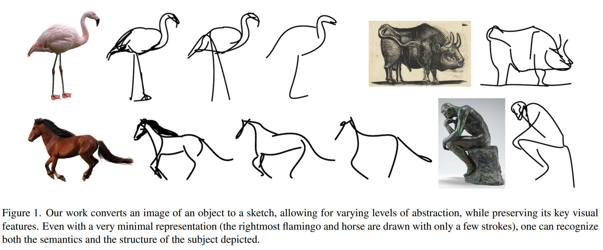

# 论文信息
- 时间：2022
- 期刊：CVPR
- 网络名称： CLIPasso
- 意义：用简笔画表示物体特征
- 作者：Yael Vinker2,1 , Ehsan Pajouheshgar1, Jessica Y. Bo1 , Roman Christian Bachmann1, Amit Haim Bermano2, Daniel Cohen-Or2, Amir Zamir1, Ariel Shamir3; 1Swiss Federal Institute of Technology (EPFL), 2Tel-Aviv University, 3Reichman University
- 实验环境：1张V100 GPU
- 数据集：
# 一、解决的问题

1. 文章内容：CLIP和毕加索的合体——保持语义信息的物体素描
2. 文章期望：用一条线，或者几条线（minimal representation）表示出物体，语义和结构都能识别出来

3. 前人工作局限：
    - 收集数据集，抽线程度都是定义好的
    
    - 种类不能做的很丰富
4. 巨人的肩膀：
    - CLIP非常的稳健，不会受图片风格的影响，从而把视觉特征编码的很好
    - 推荐文献索引14，图片可视化
# 二、做出的创新
1. 模型作用
    
    - 给定一张物体图片，模型输出一个对应的简笔画    
2. 本文创新
    - 训练方式上
    - loss选择上
    - 简笔画的初始设置上
        - 能控制笔画多少，来实现不同层次的抽象
        - 兼顾几何和语义
# 三、设计的模型
1. 模型流程
    
    - 四个二维坐标点控制一条贝兹曲线
    - 通过不断地学习，改变点的二维坐标，调整曲线形状
    - 定义了n个笔画，扔给光栅化器且可导
2. loss
    - ground truth：把CLIP当成teacher，去蒸馏模型
        - 简笔画特征和原图特征接近（语义相似性）
        - 把模型前几层得特征拿出来算loss（几何相似性）

3. 贝兹曲线初始化
    - 初始化的点，放在什么位置，非常有讲究
    - 需要稳定的初始化，才能好使，并且容易复现
    - 提出saliency初始化
        - 使用训练好的ViT
        - 把最后一层的多头自注意力取个加权平均
        - 做成一个saliency MAP
        - 在MAP上，看哪些区域更显著。然后去采点
    - 作者训练了2000个iteration，但是采取了saliency，100iterations的时候，就可以看出工作效果了
    - 收敛非常快
4. 收敛过程
    

# 四、实验结果

## 1、比之前模型的优势
1. 训练速度非常快，一张V100 GPU，6分钟完成2000个iteration
2. 可以给不常见的物体画简笔画
3. 可以提供不同层次的抽象：调整贝兹曲线的数量
## 2、有优势的原因

- saliency生成的简笔画，形状更准
## 3、改进空间

# 五、结论

## 1、模型是否解决了目标问题

## 2、模型是否遗留了问题
1. 当图像有背景的时候，效果就会大打折扣（一个物体，背景白色，效果才是非常好）
    - 作者先把前景抠出来（automatic mask），再用CLIPasso
    - 在深度学习中：最优结构就是end to end
    - 如果把automatic mask融合到框架中，或者提出新的loss function，模型适用性更好
2. 初始化的笔画都是同时生成，不是序列生成
    - CLIPasso做成auto-regressive的形式
3. 控制笔画数，来控制抽象程度，是一个手动的过程
    - 变成learnable parameters
    - 模型自己去考虑
## 3、模型是否引入了新的问题

# 六、代码

# 读者角度（挖掘文章中没有提到的）：
1. 总结文章发现问题的思路
2. 总结文章改进的思想
3. 总结文章还存在或者可以改进的问题
4. 提出对模型参数和细节的一些思考和讨论