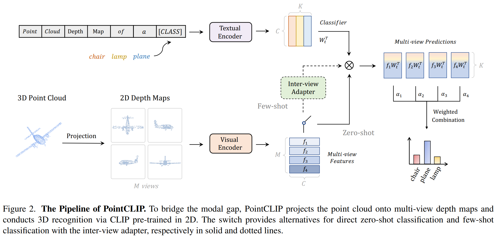

# 论文信息
- 时间：2022
- 期刊：CVPR
- 网络名称： PointCLIP
- 意义：2D表征迁移到3D领域
- 作者：Renrui Zhang∗1,3, Ziyu Guo∗2, Wei Zhang1, Kunchang Li1, Xupeng Miao2,Bin Cui2, Yu Qiao1, Peng Gao†1, Hongsheng Li3,4; 1Shanghai AI Laboratory, 2School of CS and Key Lab of HCST, Peking University, 3CUHK-SenseTime Joint Laboratory, The Chinese University of Hong Kong, 4Centre for Perceptual and Interactive Intelligence (CPII)
- 实验环境：
- 数据集：
# 一、解决的问题

# 二、做出的创新

1. 3D点云投射到2D平面上->2D深度图
2. 传入一个视觉编码器，得到很好的视觉表征
    - 因为CLIP在大量的2D图像上训练过
    - 且图片风格、简笔画、2D的深度图或是动画，只要是RGB图像，CLIP都可以处理的很好
3. 文本端基本不变
    - 变了一处point cloud depths Map of A
    - 变相的告诉模型，现在是3D点云变成了2D的图像
4. Inter-view adapter是用来融合特定领域所干的事情
# 三、设计的模型

# 四、实验结果

## 1、比之前模型的优势

## 2、有优势的原因

## 3、改进空间

# 五、结论

## 1、模型是否解决了目标问题

## 2、模型是否遗留了问题

## 3、模型是否引入了新的问题

# 六、代码

# 读者角度（挖掘文章中没有提到的）：
1. 总结文章发现问题的思路
2. 总结文章改进的思想
3. 总结文章还存在或者可以改进的问题
4. 提出对模型参数和细节的一些思考和讨论