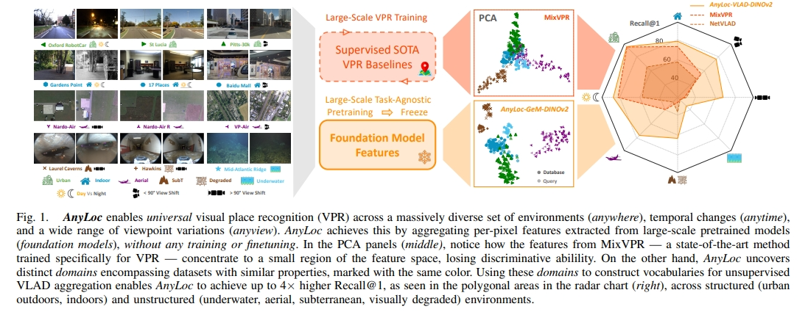
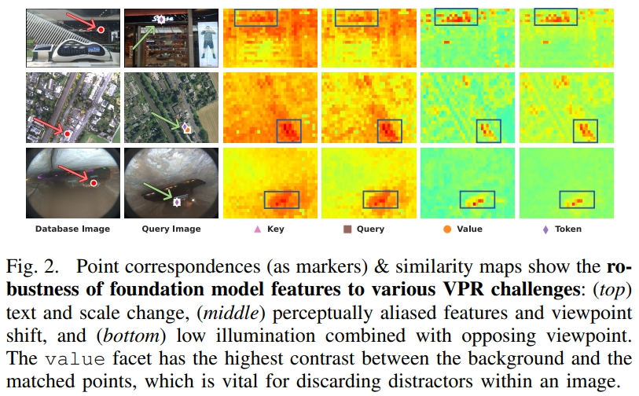
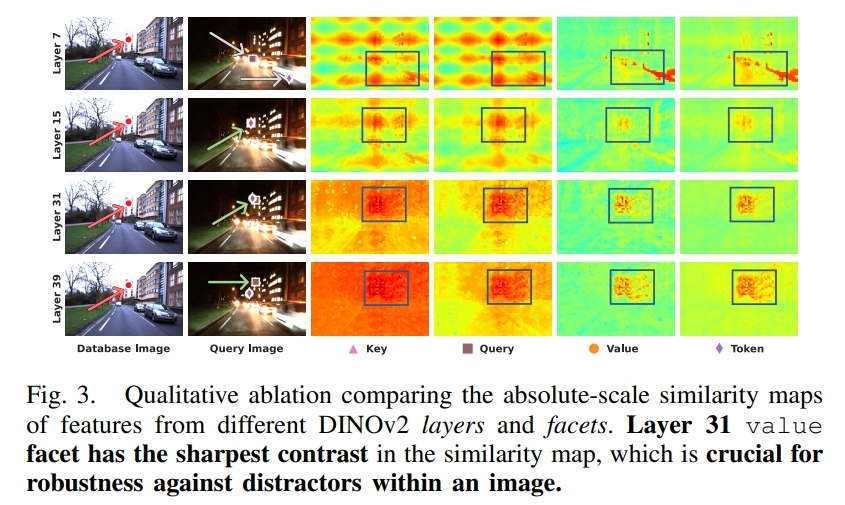
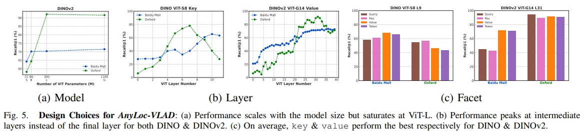
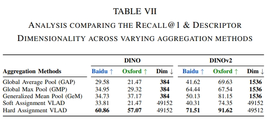

# 论文信息
- 时间：2023
- 期刊：
- 网络/算法名称：AnyLoc
- 意义：通用的位置识别算法
- 作者：Nikhil Keetha∗1, Avneesh Mishra∗2, Jay Karhade∗1, Krishna Murthy Jatavallabhula3,Sebastian Scherer1, Madhava Krishna2, and Sourav Garg4; 1 CMU, 2 IIIT Hyderabad, 3 MIT,4 AIML, University of Adelaide
- 实验环境：NVIDIA RTX 3090
- 数据集：Structured Environments, Structured Environments
# 一、解决的问题
1. 简介
    - 视觉位置识别(VPR)是机器人定位的关键。迄今为止，性能最好的VPR方法是特定于环境和任务的:虽然它们在结构化环境(主要是城市驾驶)中表现出强大的性能，但在非结构化环境中它们的性能会严重下降，使得大多数方法在健壮的现实世界部署中都很脆弱。在这项工作中，我们开发了一种通用的VPR解决方案——一种在广泛的结构化和非结构化环境(城市、室外、室内、空中、水下和地下环境)中工作的技术，无需任何重新培训或微调。我们证明了从现成的没有特定VPR训练的自监督模型派生的通用特征表示是构建这种通用VPR解决方案的正确基础。将这些衍生特征与无监督特征聚合相结合，我们的方法套件AnyLoc可以实现比现有方法高4倍的性能。通过描述这些特征的语义属性，揭示封装类似环境数据集的独特域，我们进一步获得了6%的性能提升。我们详细的实验和分析为构建VPR解决方案奠定了基础，这些解决方案可以部署在任何地点、任何时间和任何视图。
    - 视觉位置识别(VPR)是机器人状态估计的一种基本能力，广泛应用于机器人系统，如自动驾驶汽车、其他无人驾驶(空中、陆地和水下)车辆和可穿戴设备。尽管多年来VPR取得了重大进展，但在各种场景中实现开箱即用的适用性仍然具有挑战性；这对于随时随地、跨任意视图引导移动机器人至关重要。
    - 最先进的(SOTA)方法是专门针对VPR进行训练的，并且在与训练数据集中相似的环境(例如，城市驾驶)中表现出强大的性能。然而，当相同的方法部署在提取的视觉特征有很大差异的环境中(如水下或空中)时，它们的性能急剧下降(图1)。在这种情况下，我们解决了一个问题，“如何设计一个通用的VPR解决方案?”具体来说，一个通用的VPR解决方案必须适用于任何地方(在任何环境中无缝运行，包括空中、地下和水下)、任何时间(对场景中的时间变化，如昼夜或季节变化，或瞬态物体)和任何视图(对透视视点变化，包括完全相反的视图)。
    
    - 从大规模预训练模型(创造的基础模型[1])衍生的(视觉)特征表示的角度重新思考VPR问题。我们表明，尽管没有经过VPR训练，但这些模型编码了丰富的视觉特征，这些特征可以作为构建通用VPR解决方案的正确基础。我们的方法，称为AnyLoc，包括仔细选择具有正确不变性属性的模型和视觉特征，并将它们与VPR文献[2]-[5]中流行的局部聚集方法混合在一起，从而产生上述通用VPR解决方案的所有理想特征
1. 问题定位：
    - VPR通常被认为是一个图像检索问题，它包括两个阶段。在索引阶段，当机器人穿过环境时，从机载相机收集参考地图(图像数据库)。在检索阶段，给定在未来遍历期间捕获的查询图像，VPR需要检索参考映射中与该查询图像最接近的匹配。存在多种VPR方法和备选问题表述;在这项工作中，我们关注全局描述符，它提供了准确匹配和搜索效率之间的最佳权衡。这与局部描述符方法形成对比，局部描述符方法需要大量计算才能匹配，特别是在较大的数据库上
    - 表现最好的现代VPR方法是由于在VPR特定数据上进行大规模训练。在深度学习和Pitts-250k数据集的支持下，NetVLAD中的弱监督对比学习比经典的手工特征有了实质性的改进。随后，Google-Landmark V1(100万张图像)和V2数据集(500万张图像)启用了DeLF和DeLG的大规模图像检索训练。同样，包含160万张街道图像的Mapillary street - level Sequences (MSLS)数据集，通过挖掘来自城市和郊区设置的数量级更大的数据，大大提高了VPR性能。最近，CosPlace将基于分类的学习与旧金山XL数据集结合起来，该数据集包含4000万张具有GPS和航向的图像。目前的SOTA MixVPR提出了一种基于mlp的特征混合器，该混合器是在GSV-Cities数据集上训练的，GSV-Cities数据集是一个精心策划的大规模数据集，包含全球62,000个地方的530,000张图像。
    - 这种扩大VPR训练的趋势主要是由室外环境中易于获得的定位数据驱动的，这导致了SOTA在城市环境中的表现，**但并不适用于室内和非结构化环境** 。如图1所示，SOTA方法提取的描述符的PCA投影集中在特征空间的一个狭窄区域，降低了它们在训练分布之外的环境中的判别能力。除了环境特异性外，先前的方法还孤立地解决了特定的挑战，例如场景外观的极端时间变化，和摄像机视点。当前VPR方法的数据和任务特异性限制了它们的开箱即用性，这可以通过任务不可知学习来缓解。因此，在这项工作中，我们使用网络规模的自监督视觉表示来分析VPR的设计空间，并开发了一个 **不需要任何VPR特定训练的通用解决方案** 。

# 二、做出的创新
- 主要结论如下:
    - AnyLoc作为一种新的基线VPR方法出现，它适用于12个数据集，在地点、时间和视角方面表现出巨大的多样性;
    - 自监督特征(如DINOv2)和无监督聚合方法(如VLAD和GeM)对于强VPR性能都是至关重要的。与直接使用现成模型中的perimage特征相比，将这些聚合技术应用于逐像素特征可以获得显著的性能提升。
    - 对聚集的局部特征的语义属性进行表征，揭示了潜在空间中不同的领域，可以进一步用于增强VLAD词汇构建;进而提高性能
# 三、设计的模型
- 据我们所知，我们的方法AnyLoc是第一个展示任何地点、任何时间和任何视图功能的VPR解决方案(见图1)。AnyLoc由两个关键的见解(参见第V节的详细信息)指导，这些见解是通过基础模型特征来探索VPR解决方案的设计空间时出现的:(a)现有的VPR解决方案是特定于任务的，在训练分布之外的环境中进行评估时表现不佳;(b)虽然来自现成基础模型的过像素特征表现出显著的视觉和语义一致性，但当按原样用于VPR时，逐图像特征是次优的。因此，需要仔细研究将这些逐像素不变性转移到图像级别以识别位置，而该方向的最新方法仅局限于小规模室内环境或视觉语言用例。在此背景下，为了设计AnyLoc，我们研究了以下问题:
    1. What foundation models are best suited to VPR?
    1. How do we extract VPR-suited local features from these general-purpose models?
    1. How do we aggregate local features to describe places?
    1. How to construct vocabularies that generalize across datasets?
1. Choice of Foundation Model
    - 目前存在三大类 **提取任务不可知视觉特征的自监督基础模型** :(a)联合嵌入方法(DINO， DINOv2)， (b)对比学习方法(CLIP)，以及(c)掩码自动编码方法(MAE)。联合嵌入方法需要稳定的训练配方;DINO通过全局图像级自我监督在ImageNet上进行训练，而DINOv2是在一个更大的、精心策划的数据集上进行训练，该数据集具有图像/标记级联合损失。这些方法提供了最高水平的性能;其次是对比学习方法，如CLIP，它是在数百万对齐的图像-文本对上进行训练的。在我们最初的实验中，我们发现所有这些模型都比MAE表现得更好，MAE只有令牌级别的自我监督。这些发现在[5]，[28]，[30]中得到了证实，强调了学习通过联合嵌入方法捕获的远程全局模式的好处。因此，AnyLoc采用DINO和DINOv2视觉转换器来提取视觉特征。
1. Choice of Features
    - 另一个重要的设计选择是我们如何从这些预训练的视觉Transformer(ViT)中提取视觉特征。而不是提取每个图像的特征(即，为整个图像提取一个特征向量)，我们观察到，每个像素的特征能够实现细粒度匹配，并产生卓越的性能。ViT中的每个层都有多个方面(查询、键、值和令牌)，可以从中提取特征。接下来，我们从ViT的中间层提取特征，并丢弃CLS令牌。在图2中，我们通过评估局部特征对应的鲁棒性来说明 **密集ViT特征对VPR的适用性** 。我们在数据库图像上选择一个点，将其与查询图像中的所有(逐像素)特征进行匹配，并绘制热图，表明这些点对应的可能性。请注意，即使存在语义文本和尺度变化(第一行)，感知混叠和视点移位(第二行)以及低照度与相反视点结合(第三行)，这些对应关系也是如此稳健。
    
    
    - 比较图2中的相似性图，注意值面如何在匹配点和背景之间 **显示最大的对比度**，这对于 **图像中干扰物的鲁棒性** 至关重要。在进一步跨层分析之后(图3)，我们观察到一个有趣的趋势。ViT的早期层(顶部行)，特别是键和查询方面，表现出高度的位置编码偏差，而 **第31层(更深的层)** 值方面 **在相似性映射中具有最强烈的对比** 。我们选择第31层和值面特征作为我们的局部特征表示，并在第V-C.2节中定量地证明我们的选择
1. Choice of Aggregation Technique
    - VPR管道的下一个设计选择需要选择一种聚合技术，该技术决定了如何将局部特征组合在一起来描述图像的各个部分，并最终描述环境。虽然先前的工作已经将CLS令牌直接用于图像检索，但我们在通用检索设置下观察到了矛盾的趋势（即，禁止再训练或微调）。我们全面探索了多种无监督聚合技术：全局平均池（GAP）、全局最大池（GMP）、广义平均池（GeM）以及VLAD的软分配和硬分配变体。
    - 对于大小为 $H \times W$ 的输入图像，每像素特征 $f_ {i} \in \mathbb{R}^{D}$ ，我们定义一个全局描述符为: $$F_ {G}=(\sum^{H \times W}_ {i=1}f^{p}_ {i})^{\frac{1}{p}}$$ 式中 $p = 1, p = 3, p \to \infty$ 分别代表GAP, GeM, GMP。
    - 对于VLAD变体，我们对数据库图像中的所有特征进行聚类，得到N个聚类中心。这就形成了我们的词汇。然后将全局VLAD描述符计算为每个簇中心k的残差之和，如下所示: $$F_ {V_ {k}}=\sum^{N \times H \times W}_ {i=1} \alpha_ {k}(f_ {i})(f_ {i} - c_ {k})$$ 其中 $\alpha_ {k}(x_ {i})$ 为1，如果 $f_ {i}$ 分配给簇 $k$ ，否则为0。在VLAD的软赋值变体中， $\alpha_ {k}(f_ {i})$ 表示赋值概率，取值在 $0 \sim 1$ 之间。接下来，我们执行内部规范化、串联和内部规范化，以获得最终的VLAD描述符 $F_{V}$ 。
1. Choice of Vocabulary
    - 对于基于词汇表的聚合技术，我们构建词汇表的目标是描述不同环境中全局汇集的局部特征的不同语义属性。先前基于VLAD的工作要么使用基于代表性地点和特征的全局词汇表，要么使用特定于参考地图的词汇表，要么使用基于训练数据集的学习词汇表。虽然这些方法在城市场景中工作得很好，但它们不适合基础模型特征中编码的开放集语义属性。为了解决这个问题，我们通过描述全局汇集的局部特征(GeM描述符)来指导VLAD的词汇选择。
    - 从图1中，我们观察到，使用PCA投影全局描述符揭示了潜在空间中不同的域，这些域表征了具有相似属性的数据集，即:城市、室内、空中、地下环境、退化和水下。虽然地下环境和退化域具有相似的图像类型，但它们分散在不同的区域，而视觉退化的室内域集中在相对靠近室内集合的地方，这进一步证明了判别鲁棒性。最后，我们可以观察到查询图像的投影特征与各自数据库图像的投影特征非常接近。因此，使用基于pca的分离，我们以特定领域的方式为VLAD构建可视化词汇表(在第V-B.1节中进一步证明)。
    

# 四、实验结果
- 在具有挑战性的VPR条件下(昼夜和季节变化，对立观点)对AnyLoc进行了广泛而多样的数据集(城市，室内，空中，水下，地下)评估，为未来通用VPR解决方案的研究建立了强有力的基线。
## 1、比之前模型的优势

## 2、有优势的原因
- 我们对AnyLoc中不同参数的见解，使用两个数据集，百度商城和牛津，这是典型的VPR挑战的代表

1. ViT Architecture
    - 图5a显示了 **更大的DINOv2 ViT骨干会带来更好的性能**，其中性能在 ViT-L (3亿个参数)时趋于饱和。由于平均而言， ViT-G 的性能优于 ViT-L，因此我们将 ViT-G 用于 DINOv2 。对于 DINO，我们使用 ViT-S，这是唯一可用的架构。
1. ViT Layers & Facets
    - 图5b显示，**性能峰值是通过更深的层实现的，介于中间和最后一层之间**。对于较小的ViT架构(左为DINO ViT-S)，可以观察到中间层在Oxford上具有更高的性能。这可以归因于它们较高的位置编码偏差，这在参考查询对之间没有视点移位的情况下是有用的。因此，根据[第三节](#三设计的模型)-Choice of Features
的研究结果，我们分别选择9和31作为DINO和DINOv2的操作层。
    - 在图5c中，**对于DINO和DINOv2，键和值方面分别一致地实现了高召回率**。虽然使用DINO(左)时查询和键方面在Oxford上的性能更好，但使用DINOv2(右)时这种差距减小了。从百度到牛津，查询和值之间的性能差异是反向的;这表明在查询&关键字中存在高度的位置偏差，导致在百度的重大视点转换下表现不佳。
1. Aggregation Methods
    - 在表7中，我们比较了[第三节](#三设计的模型)-Choice of Features中讨论的各种无监督的局部特征聚合技术，并观察到基于硬分配的VLAD效果最好。我们可以进一步看到，无词汇表方法提供了性能和存储之间的最佳权衡，而GeM池往往在这方面做得最好。此外，我们观察到硬分配通常比软分配快1.4倍。
    
## 3、改进空间

# 五、结论
- 本文介绍了AnyLoc——实现通用VPR的重要一步。考虑到特定环境和任务的VPR技术的局限性，以及从基础模型中提取的每幅图像特征的脆弱性，我们建议将这些模型计算的每像素特征与VLAD和GeM等无监督特征聚合技术相结合。通过对不同数据集的基准测试，我们揭示了当前大规模城市训练VPR方法的脆弱性，并表明我们提出的AnyLoc方法比以前最先进的方法性能高出4倍。最后，我们对AnyLoc的各个方面提供了详细的定性和定量见解，以促进该领域的进一步研究。这项工作扩展了VPR的适用范围，进而将机器人定位到任何时间、任何地点和任何视图下，这对于实现下游功能至关重要，例如机器人在野外导航。
## 1、模型是否解决了目标问题

## 2、模型是否遗留了问题

## 3、模型是否引入了新的问题

# 六、代码

# 读者角度（挖掘文章中没有提到的）：
1. 总结文章发现问题的思路-一个真正通用的位置识别算法，应该做到:
    - 任何地点（无缝地运行在任何环境中，包括空中、地下和水下）
    - 任何时间（对场景中的时间变化，如昼夜或季节变化，或对临时物体具有鲁棒性）
    - 跨任何视角（对视角变化具有鲁棒性，包括完全相反的视角）
2. 总结文章改进的思想
    1. 设计一个通用的VPR模型，不需要为特定任务进行下游微调或者特定的设计和训练
    1. 鲁棒性极好，能够适应query和key之间在光照、环境不同的情况下，以及结构化/非结构化场景中的匹配
    1. 增强VLAD词汇构建
        - 使用更大的词汇表会提高效果
        - 如果词汇表规模有限，或者数据集之间过大的差异会导致效果的降低
3. 总结文章还存在或者可以改进的问题
4. 提出对模型参数和细节的一些思考和讨论