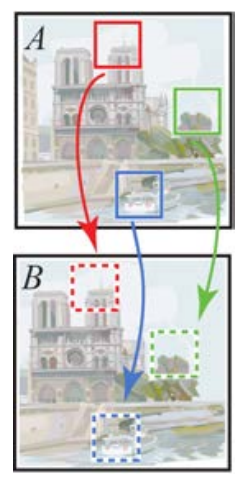

# 论文信息
- 时间：2009
- 期刊：ACM SIGGRAPH
- 算法名称：PatchMatch
- 意义：Adobe⼯具，新的随机算法来快速找到图像块之间的近似最近邻匹配
- 作者：Connelly Barnes1, Eli Shechtman2,3, Adam Finkelstein1, Dan B Goldman2; 1Princeton University; 2Adobe Systems; 3University of Washington
- 实验环境：
- 数据集：
- [返回上一层 README](../README.md)

- 论文配套PPT：
[PPT](../ppt/patchmatch/PatchMatch_%20A%20Randomized%20Correspondence%20Algorithm%20for%20Structural%20Image%20Editing%20Connelly%20Barnes%20Eli%20Shechtman%20Adam%20Finkelstein%20Dan%20B%20Goldman.pdf)

# 关键词叙述

1. 图像重定向算法：允许将图像调整为新的纵横⽐，计算机会⾃动⽣成⼀个好的原始图像内容的相似性，但具有新的维度——提供⽤⼾控制以指定⼀个或多个区域（例如，⾯部）应该保持相对不变
2. 图像补全算法：让⽤⼾简单地擦除图像中不需要的部分，然后计算机⾃动合成⼀个可能与图像其余部分匹配的填充区域——提供了通过为计算机提供提⽰来指导结果的⼯具
3. 图像重组算法：抓取图像的⼀部分并将它们四处移动，计算机⾃动合成图像的剩余部分，以便在尊重移动区域的同时类似于原始图像

# 一、解决的问题

1. 交互
    1. 交互性在艺术过程中的作⽤暗⽰了理想图像编辑框架的两个属性：
        - ⼯具集必须提供灵活性以执⾏各种⽆缝编辑操作，以便⽤⼾探索他们的想法；
        - 这些⼯具的性能必须⾜够快，⽤⼾可以在反复试验的过程中快速看到中间结果
    2. 问题：
        - 现在有满足第一个标准的算法，但是没有满足第二个标准
        - 它们对于除了最⼩图像之外的所有交互使⽤来说太慢了
        - 在本⽂中，我们将描述⼀种算法，该算法⾄少可以将此类⽅法加速⼀个数量级，从⽽可以将它们应⽤于交互式结构图像编辑框架
2. 算法优势
    1. 本文算法介绍了交互式图像编辑⼯具，它使⽤⼀种新的随机算法来快速找到图像块之间的近似最近邻匹配
    2. 驱动该算法的关键⻅解是，可以通过随机采样找到⼀些良好的补丁匹配，并且图像中的⾃然连贯性使我们能够将此类匹配快速传播到周围区域。我们提供算法收敛特性的理论分析，以及其⾼质量和性能的经验和实践证据
    3. 这个简单的算法构成了各种⼯具（图像重定向、完成和重组）的基础它们可以在⾼级图像编辑应⽤程序的上下⽂中⼀起使⽤。最后，我们对合成过程提出了额外的直观约束，为用户提供了以前⽅法⽆法实现的控制级别。
3. 相关工作的发展过程：
    1. 纹理合成和完成
        - 非参数
        - 贪心
        - 迭代多尺度优化
    2. 最近邻搜索⽅法
        - 树结构（TSVQ、kd-trees、VP树）
        - ANN（精确和近似搜索），配备PCA降维
    3. 控制和互动(补丁采样⽅案的⼀个优点是它们提供了⼤量的精细控制)
        - 通过使⽤所需颜⾊初始化输出像素来让⽤⼾控制过程
        - 图像类⽐框架：使⽤辅助图像作为“引导层”，实现各种效果，包括超分辨率、纹理传输、艺术滤镜和数字纹理
    4. 图像重定向
        - 许多图像重定向⽅法都应⽤了变形或裁剪，使⽤⼀些显着性度量来避免使重要图像区域变形
        -  使⽤简单的贪婪⽅法来确定图像中可以在重定向中安全移除的接缝的优先级。虽然接缝雕刻速度很快，但它不能很好地保留结构，并且只能对结果提供有限的控制
    5. 图像“重组”
        - 根据⽤⼾输⼊重新排列图像中的内容，⽆需精确遮罩

# 二、做出的创新
1. 以前在图形和视觉方面的研究已经利用这种最近邻搜索来提供各种高级数字图像编辑工具。然而，计算整个图像的此类匹配场的成本已经避开了以前提供交互性能的努力。我们的算法比以前的最先进技术 (20-100x) 提供了显着的性能改进，使其能够在交互式编辑⼯具中使⽤
2. 我们⼯作的贡献包括⼀种快速随机近似算法，⽤于计算两个不相交图像区域之间的最近邻域；该算法在结构化图像编辑框架中的应⽤，可实现⾼质量的交互式图像重定向、图像补全和图像重组；以及⼀组直观的交互式控件，⽤于约束优化过程以获得所需的创意结果
3. 算法的产生：
    
    
    - 换句话说，给定图像或区域A和B，根据补丁距离度量（例如 $L_ {p}$ ）为A中的每个补丁找到B中的最近邻居。我们将此映射称为最近邻域 (NNF)
    - 遍历的算法是非常昂贵的，对于⼤⼩为 M 和 m 像素的图像区域和块分别为 $O(mM^2)$ ,即使使⽤近似最近邻和降维等加速⽅法，此搜索步骤仍然是⾮参数块采样⽅法的瓶颈，阻⽌它们获得交互速度。此外，这些基于树的加速结构使⽤ $O(M)$ 或更⾼数量级的内存以及相对较⼤的常数，限制了它们在⾼分辨率图像中的应⽤
4. 算法的重要思想：
    - 非参数斑块采样方法的核心要素是重复搜索一个图像区域中的所有斑块，寻找另一个图像区中最相似的斑块
    1. 偏移空间的维数：
        - ⾸先，尽管 ***补丁(patch)*** 空间的维数很⼤（m 维），但它是稀疏填充的（ $O(M)$ 补丁）。许多以前的⽅法通过使⽤树结构（例如，kd-tree，可以在 $O(mMlogM)$ 时间内搜索）和降维⽅法（例如，PCA）降低补丁空间的维数来加速最近邻搜索。相⽐之下，我们的算法在可能的补丁偏移量的⼆维空间中搜索，从⽽实现更⾼的速度和内存效率。
    2. 图像的⾃然结构:
        - 其次，通常对每个像素的独⽴搜索忽略了图像中的⾃然结构。在补丁采样合成算法中，输出通常包含来⾃输⼊的⼤量连续数据块。因此，我们可以通过以相互依赖的⽅式搜索相邻像素来提⾼效率
    3. ⼤数法则：
        - 最后，虽然任何⼀个随机选择的补丁分配都不太可能是⼀个好的猜测，但⼤范围随机分配的⼀些重要部分可能是很好的猜测。随着该字段变⼤，没有补丁具有正确偏移的可能性变得微乎其微

    - 基于这三个观察结果，我们提供了⼀种使⽤增量更新计算近似 NNF 的随机算法（第 3 节）。该算法从初始猜测开始，该猜测可能来⾃先验信息，也可能只是⼀个随机字段

5. 算法过程：
    - 迭代过程包括两个阶段：
        1. 传播，其中使⽤相⼲性将良好的解决⽅案传播到场中的相邻像素；
        2. 和随机搜索，其中当前偏移向量被随机偏移的多个尺度扰动。
    - 本文从理论上和经验上都表明，该算法对于⾼达 2MP 的测试图像具有良好的收敛特性，并且我们的 CPU 实现显⽰与使⽤ PCA 的 kd 树相⽐，速度提⾼了 20-100 倍。此外，我们提出了⼀种 GPU 实现，对于相似的图像⼤⼩，它⽐ CPU 版本快⼤约 7 倍。我们的算法在原始图像之外只需要很少的额外内存，这与以前构建辅助数据结构以加速搜索的算法不同。使⽤我们算法参数的典型设置，运⾏时间为 $O(mMlogM)$ ，内存使⽤为 $O(M)$ 。尽管这是与最有效的基于树的加速技术相同的渐近时间和内存，但主要常数要⼩得多

# 三、设计的模型
1. 近似最邻近算法（ANN）
    - 提醒⼀下，激发该算法的关键⻅解是我们在可能的偏移量空间中搜索，相邻偏移量协同搜索，并且即使是随机偏移量也可能是对⼤图像上许多补丁的⼀个很好的猜测
    
    - 我们系统的核心是计算补丁对应的算法。 我们将最近邻域 (NNF) 定义为偏移的函数 $ f:A \mapsto \mathbb{R}^{2}$ ，定义图像 $A$ 中所有可能的补丁坐标（补丁中心的位置），用于两个补丁 $D$ 的某个距离函数。给定图像 $A$ 中的补丁坐标 $a$ 及其在图像 $B$ 中对应的最近邻居 $\mathbf{b}$，$f(a)$ 就是 $\mathbf{b}−\mathbf{a}$。 我们将 $f$ 的值称为偏移量，并将它们存储在一个维度为 $A$ 的数组中

    - 三个重要的组成部分：
        

        1. 最初，最近邻字段填充有随机偏移或⼀些先验信息
        2. 接下来，对 NNF 应⽤迭代更新过程，其中将良好的补丁偏移量传播到相邻像素
        3. 然后在迄今为⽌找到的最佳偏移量的邻域中进⾏随机搜索

    1. 初始化
        - 最近邻字段可以通过为字段分配随机值或使⽤先验信息来初始化。当使⽤随机偏移进⾏初始化时，我们在图像 $B$ 的整个范围内使⽤独⽴的均匀样本。在第 4 节中描述的应⽤程序中，我们使⽤从粗到细的渐进调整⼤⼩过程，所以我们可以选择使用从金字塔中的前一层放大的初始猜测。然⽽，如果我们只使⽤这个初始猜测，算法有时会陷⼊次优的局部最⼩值。为了保留这个先验的质量但仍然保留⼀些逃避这种最⼩值的能⼒，我们使⽤随机初始化执⾏算法的⼀些早期迭代，然后仅在 $D$ 较⼩的补丁处与上采样初始化合并，然后执⾏剩余的迭代
    2. 迭代：
        - 初始化后，我们执行改进 NNF 的迭代过程。 算法的每次迭代按如下方式进行：按扫描顺序（从左到右，从上到下）检查偏移量，并且每个偏移量都经过传播，然后进行随机搜索。这些操作在补丁级别交错：如果 $P_j$ 和 $S_j$ 分别表示补丁 $j$ 的传播和随机搜索，那么我们按顺序进行：$P_1,S_1,P_2,S_2,...,P_n,S_n$
        1. 传播：
            - 我们尝试使用 $f(x−1, y)$ 和 $f(x, y−1)$ 的已知偏移量来改进 $f(x, y)$ ，假设补丁偏移量可能相同。 例如，如果在 $(x − 1, y)$ 处有一个很好的映射，我们会尝试将该映射向右平移一个像素，用于我们在 $(x, y)$ 处的映射。 令 $D(\mathbb{v})$ 表示 $A$ 中 $(x, y)$ 处的补丁与 $B$ 中补丁 $(x, y) + \mathbb{v}$ 之间的补丁距离（误差）。我们将 $f(x, y)$ 的新值设为 ${D(f(x, y)), D(f(x−1, y)), D(f(x, y−1))}$ 的 argmin
            - 其效果是，如果 $(x, y)$ 具有正确的映射并且位于相干区域 $R$ 中，则 $(x, y)$ 下方和右侧的所有 $R$ 都将被正确的映射填充。 此外，在偶数次迭代中，我们通过以反向扫描顺序检查偏移量来向上和向左传播信息，使用 $f(x+1, y)$ 和 $f(x, y+1)$ 作为我们的候选偏移量
        2. 随机搜索：
            - 让 $\mathbf{v}_ {0} = f(x, y)$ 。 我们试图通过在距 $\mathbf{v}_ {0}$ 呈指数递减的距离处测试一系列候选偏移来改进 $f(x, y)$ ： $$\begin{align} \mathbf{u}_ {i} = \mathbf{v}_ {0} + w \alpha^{i} \mathbf{R}_ {i} \end{align}$$ 其中 $\mathbf{R}_ {i}$ 是 $[−1,1] \times [−1,1]$ 中的均匀随机数，$w$ 是较大的最大搜索“半径”，$\alpha$ 是搜索窗口大小之间的固定比率。 我们检查 $i = 0,1,2,...$ 的补丁，直到当前搜索半径 $w \alpha^{i}$ 低于 1 个像素。 在我们的应用程序中，$w$ 是最大图像维度，$\alpha = 1/2$，除非另有说明。 请注意，搜索窗口必须限制在 $B$ 的边界内
        
        
        3. 停⽌标准:
            - 尽管根据应⽤程序可能会使⽤不同的停⽌标准，但在实践中我们发现它可以很好地迭代固定次数。此处显⽰的所有结果都是通过总共 4-5 次迭代计算得出的，之后 NNF ⼏乎总是收敛

        4. 效率:
            - 可以通过几种方式提高这种朴素方法的效率。在传播和随机搜索阶段，当尝试使用候选偏移量 $\mathbf{u}$ 改进偏移量 $f(\mathbf{v})$ 时，如果 $D(\mathbf{u})$ 的部分和超过当前已知距离 $D(f(\mathbf{v}))$ ，则可以提前终止。此外，在传播阶段，当使用边长为 $p$ 的正方形补丁和 $L_ {q}$ 范数时，可以在 $O(p)$ 而不是 $O(p^{2})$ 时间内增量计算距离的变化，方法是注意求和中的冗余项重叠区域。然而，这会产生额外的内存开销来存储当前的最佳距离 $D(f(x, y))$。

        5. GPU 实现:
            - 第 4 节中描述的编辑系统依赖于 NNF 估计算法的 CPU 实现，但我们还在 GPU 上制作了一个完全并行化变体的原型。为此，我们在随机搜索和传播的迭代之间交替，其中每个阶段并行处理整个偏移量字段。尽管传播本质上是一个串行操作，但我们采用了 Rong 和 Tan [2006] 的跳洪方案来执行多次迭代的传播。 虽然我们的 CPU 版本能够在扫描线上一直传播信息，但我们发现实际上不需要长距离传播，最大跳跃距离为 8 就足够了。 我们在每个跳跃距离也只使用 4 个邻居，而不是 Rong 和 Tan 提出的 8 个邻居。 具有相似的近似精度，在 GeForce 8800 GTS 卡上，GPU 算法大约比 CPU 算法快 7 倍
    3. 综合实例分析
        - 我们的迭代算法在极限内收敛到精确的 NNF。 在这里，我们对这种收敛进行了理论分析，表明它在前几次迭代中以高概率收敛得最快。 此外，我们表明，在只需要近似补丁匹配的常见情况下，该算法收敛得更快。 因此，通过将计算限制为少量迭代，我们的算法最适合用作近似算法
        - 我们首先分析收敛到精确的最近邻域，然后将此分析扩展到更有用的收敛到近似解的情况。假设 $A$ 和 $B$ 具有相同的大小（$M$ 个像素）并且使用随机初始化。 尽管在此初始猜测中任何一个位置被分配最佳偏移的几率微乎其微 ( $1/M$ )，但至少一个偏移被正确分配的几率非常好 $(1−(1−1/M)^{M})$ 或对于大 $M$ 大约为 $1 − 1/ e$ 。由于随机搜索在小的局部区域中非常密集，我们还可以将“正确”分配视为正确偏移量周围大小为 $C$ 像素的小邻域内的任何分配。 这样的偏移量将在随机搜索的大约一次迭代中得到纠正。 在这样的邻域中至少分配一个偏移量的可能性非常大：$(1−(1−C/M)^{M})$ 或对于大 $M$ ，$1−exp(−C)$
        

        - 现在我们为我们的算法考虑一个具有挑战性的综合测试用例：大小为 $m$ 像素的独特区域 $R$ 位于一对均匀的图像 $A$ 和 $B$ 中的两个不同位置（插图所示）。 这个图像是一个困难的案例，因为背景没有提供关于在哪里可以找到独特区域的偏移量的信息。 均匀背景中的补丁可以匹配大量其他相同的补丁，这些补丁在一次迭代中以非常高的概率通过随机猜测找到，因此我们只考虑不同区域 $R$ 的收敛。如果不同区域 $R$ 中的任何一个偏移量是 在正确偏移量的邻域 $C$ 内，然后我们假设在少量迭代后，由于小局部区域中随机搜索的密度（前面提到），所有 $R$ 都将通过传播正确（为符号简单起见，假设 这是瞬时的）。 现在假设 $R$ 还没有收敛。 考虑我们的算法在最大尺度 $w$ 下执行的随机搜索。 规模为 $w$ 的随机搜索迭代独立地对图像 $B$ 进行采样，并且这些样本中的任何一个落在正确偏移量的邻域 $C$ 内的概率 $p$ 为 $$\begin{align} p=1-(1-C/M)^{m} \end{align}$$
        - 在进行任何迭代之前，收敛的概率为 $p$ 。 我们没有在迭代 $0,1,...,t-1$ 上收敛并在迭代 $t$ 上收敛的概率是 $p(1− p)^{t}$ 。概率因此形成几何分布，收敛的预期时间为 $\langle t \rangle = 1/p − 1$ 。为简化起见，令相对特征尺寸为 $\gamma = m/M$ ，然后随着分辨率 M 变大取极限： $$\begin{align} \langle t \rangle = [1-(1-C/M)^{\gamma M}]^{-1} - 1 \end{align}$$ $$\begin{align} \lim_ {M \to \infty} \langle t \rangle = [1-exp(-C \gamma)]^{-1} - 1 \end{align}$$
        - 通过对小 $\gamma$ 的泰勒展开， $\langle t \rangle = (C \gamma)^{−1} − \frac{1}{2} = M/(Cm) − \frac{1}{2}$ 。也就是说，对于大图像分辨率和相对于图像的小特征尺寸 $m$ ，我们预期的收敛迭代次数保持不变分辨率 $M$
        - 我们对从 0.1 到 2 兆像素的分辨率 $M$ 的图像进行了模拟，以确认该模型。例如，我们发现对于 $m = 20^{2}$ 的区域，算法在对 $M = 2000^{2}$ 的图像进行 5 次迭代后以非常高的概率收敛
        - 上面的测试用例很难，但不是精确匹配的最差测试用例。精确匹配的最坏情况是当图像 $B$ 包含高度重复的纹理和许多与 $A$ 中的不同特征相似的干扰物时。偏移可能会被其中一个干扰物“困住”，有效邻域区域大小 $C$ 可能是减少到 1（即，只有完全匹配才能在随机搜索期间将解决方案从干扰项中拉出）。然而在实践中，对于许多图像分析和合成应用程序，例如我们在本文中展示的应用程序，找到近似匹配（根据补丁相似性）不会导致任何明显的差异。当存在许多相似的干扰项时，找到成功的近似匹配的机会实际上更高，因为每个干扰项本身就是一个近似匹配。 如果我们假设图像 $B$ 中有 $Q$ 个干扰物与精确匹配相似到某个小阈值，其中每个干扰物具有大致相同的邻域区域 $C$ ，那么根据上述分析，收敛的预期迭代次数减少到 $M /(QCm)-0.5$ 
    4. 真实世界图像分析
        - 在这里，我们分析了我们的算法对真实世界图像所做的近似。为了评估我们的算法如何解决输入和输出图像之间不同程度的视觉相似性，我们对由跨越广泛视觉相似性的图像对组成的数据集进行了错误分析。 这些包括我们编辑操作的输入和输出（非常相似）、立体对和连续视频帧（有点相似）、来自 Caltech-256 数据集中同一类的图像（不太相似）和不相关图像对。 其中一些还以多种分辨率（0.1 到 0.35 MP）和补丁大小（4x4 到 14x14）进行了分析。我们的算法和 ANN+PCA kd-tree 都在每一对上运行，并与地面实况（由精确 NN 计算）进行比较。请注意，由于预计算时间对我们的应用程序很重要，因此我们使用单个 PCA 投影来降低输入数据的维数，这与 Kumar 等人不同。 [2008]的文献在 kd 树的每个节点计算不同 PCA 投影的特征向量。 因为每个算法都有可调参数，我们还改变了这些参数以获得一系列近似误差
        - 我们将每个数据集的误差量化为算法的 ***RMS*** 补丁距离和地面真值 ***RMS*** 补丁距离之间的每个补丁差异的平均值和第 95 个百分位数。对于我们算法的 5 次迭代，我们发现相似图像的平均误差在 0.2 到 0.5 灰度级之间，不同图像的平均误差在 0.6 到 1.5 灰度级之间（在 256 个可能的灰度级中）。在第 95 个百分位，相似图像的误差为 0.5 到 2.5 灰度级，不同图像的误差为 0.9 到 6.0 灰度级
        - 我们的算法比 kd-tree 快得多，并且在各种参数设置上使用的内存少得多。 对于本文中大多数结果使用的 7x7 补丁大小，我们发现我们的算法通常比 kd-tree 快 20 到 100 倍，并且使用的内存比 kd-tree 少 20 倍左右，无论分辨率如何。 表 1 显示了我们算法的平均时间和内存使用与典型输入的 ANN kd 树的比较：图 3 中所示的对。我们的数据集的其余部分给出了类似的结果。 为了公平地比较运行时间，我们调整了 ANN kd-tree 参数以在 5 次迭代后获得与我们的算法相等的平均近似误差。
        

        - 获得的错误和加速是补丁大小和图像分辨率的函数。对于较小的补丁，我们获得较小的加速（4x4 补丁为 7 到 35 倍），并且我们的算法具有更高的错误值。 相反，较大的补丁提供更高的加速（14x14 补丁的 300 倍或更多）和更低的错误值。 在较小的分辨率下加速较低，但在较高的分辨率下趋于平稳
        - 在我们的比较中，我们还在多核 CPU 架构上实现了第 3.2 节中的完全并行化算法（建议用于 GPU）。 在这种情况下，它的错误与原始 CPU 算法相当，虽然它比单核 CPU 算法慢大约 2.5 倍，但运行时间与核数成线性关系
        - 最近的工作 [Kumar 等人。 2008] 表明 vp-trees 比 kd-trees 对于精确的最近邻搜索更有效。 我们发现我们的数据集就是这种情况。 然而，精确匹配对于我们的应用来说太慢了。 在使用 PCA 进行近似匹配时，我们发现 vp-trees 在等效误差值方面比 kdtrees 慢，因此我们在上面的比较中省略了它们
2. 编辑⼯具
    - 在本节中，我们将讨论一些由我们的算法启用的新颖的交互式编辑工具。然而，首先，我们必须重新审视双向相似性综合方法 [Simakov et al. 2008]。 该方法基于图像对之间的双向距离度量 - 源（输入）图像 $S$ 和目标（输出）图像 $T$ 。该度量由两项组成：
        1. 完整性项确保输出图像包含作为 从输入中获取尽可能多的视觉信息，因此是一个很好的总结
        2. 相干项确保输出与 $w.r.t.$ 相干。 输入和新的视觉结构（人工制品）受到惩罚。 形式上，距离度量被简单地定义为 $S$ 中所有补丁与其在 $T$ 中最相似（最近邻）补丁的平均距离之和，反之亦然：
    $$\begin{align} d_ {BDS}(S,T) = \overbrace{\frac{1}{N_ {S}} \sum_ {s \subset S} \mathop{min}\limits_{t \subset T}D(s,t)}^{d_ {complete}(S,T)} + \overbrace{\frac{1}{N_ {T}} \sum_ {t \subset T} \mathop{min}\limits_{s \subset S}D(t,s)}^{d_ {cohere}(S,T)} \end{align}$$
    - 其中距离 $D$ 是 $L*a*b*$ 颜色空间中块像素值的 SSD（平方差之和）。 对于图像重定向，我们希望求解在所需输出维度的约束下最小化 $d_ {BDS}$ 的图像 $T$ 。 给定输出图像的初始猜测 $T_ {0}$ ，该距离通过类似 EM 的算法迭代最小化。 在每次迭代 $i$ 的 E 步骤中，NN-fields 是根据 $S$ 和 $T_ {i}$ 计算的，并且执行“patch-voting”以累积每个重叠的相邻 patch 的像素颜色。 在第 M 步中，对所有颜色“投票”进行平均以生成新图像 $T_ {i+1}$ 。 为了避免陷入糟糕的局部最小值，采用了多尺度“逐渐缩放”过程：$T$ 被初始化为 $S$ 的低分辨率副本，并逐渐按小因子调整大小，然后在每次缩放后进行几次 EM 迭代 , 直到获得最终尺寸。 然后，$T$ 和 $S$ 逐渐上采样到更精细的分辨率，然后进行更多的 EM 迭代，直到获得最终的精细分辨率
    - 除了图像重定向，Simakov 等人。 [2008] 表明该方法可用于其他合成任务，例如图像拼贴、重组、自动裁剪以及视频中的这些类比。 此外，如果我们将图像中的缺失区域（“孔洞”）定义为 T，将图像的其余部分定义为 S，并省略完整性项，我们最终会得到 Wexler 等人的图像和视频补全算法。 [2007]。 重要性权重图既可用于输入（例如，用于强调重要区域），也可用于输出（例如，用于从孔边界向内引导完成过程）
    - 第 3 节中给出的随机 NNF 算法除了最小化补丁距离外，没有对偏移量施加明确的约束。 然而，通过以各种方式修改搜索，我们可以在这些偏移量上引入局部约束，从而为用户提供对合成过程的更多控制。 对于图像重定向，我们可以轻松实现重要性掩码来指定根本不应变形的区域 [Avidan 和 Shamir 2007； 沃尔夫等。 2007年； 鲁宾斯坦等。 2008; 西马科夫等人。 2008] 或统一缩放 [Wang et al. 2008]，与之前的工作一样。 然而，我们也可以明确定义以前方法不能很好支持的约束，例如必须保持笔直的直线，或者在重新定位图像时应该移动到其他位置的对象和线条。 我们可以克隆对象（“复制和粘贴”）或定义其他东西来替换产生的洞。 在结构图像编辑的上下文中，对象可以均匀或非均匀地缩放（例如，用于垂直“生长”树木或建筑物）。 所有这些都是通过在图像中标记多边形和线条来自然完成的。 对象的简单边界框通常就足够了
    - 其中一些图像编辑工具是新的，而其他工具以前在有限的环境中使用过。 然而，我们相信这些工具的集合——结合我们系统提供的交互式反馈——创造了新的强大的图像编辑功能和独特的用户交互体验
    1. 搜索空间限制
        - 大型缺失区域的图像补全是一项具有挑战性的任务。 即使是最先进的基于全局优化的方法 [Wexler et al。 2007年； Komodakis 和 Tziritas 2007] 仍然会在结构化内容被修复的地方产生不一致（例如，穿过缺失区域的直线）。 此外，在许多情况下，缺失区域的边界对合理的完成提供很少或没有限制。 孙等。 [2005] 提出了一种引导结构传播方法，其中用户在从孔外开始的边缘顶部绘制曲线，并定义它们应该穿过它的位置。 这种方法可以很好地沿曲线传播结构，但整个过程仍然很慢（对于 0.5 兆像素的图像通常需要几分钟）并且有时需要进一步的人工干预
        - 在我们的工作中，我们采用了相同的用户交互方法，允许用户在缺失区域绘制曲线。 这些曲线可以有不同的标签（在我们的界面中使用不同的颜色表示）来指示不同结构的传播。 然而，与 Sun 等人不同。 [2005]，它对曲线和纹理区域使用单独的完成过程，我们的系统在同一个统一框架中同时综合两者。 这是通过将孔内标记像素的搜索空间限制在孔外具有相同标签的区域来实现的。 （矛盾的是，添加这些额外的约束通过限制搜索空间来加速收敛特性。）"一、解决的问题"的图片说明了这些搜索空间约束对图像补全的影响。 除了曲线和边缘结构之外，同一工具还可用于为孔的某些部分指定特定内容。 这种类型的交互类似于“数字纹理”方法[Hertzmann et al. 2001] 当应用于图像完成时。 我们在"一、解决的问题"的图片和下图中展示了这些案例的示例
        

    2. 变形约束
        - 许多最近的重定向方法允许用户标记语义上重要的区域以与其他自动检测到的线索（例如，边缘、面部、显着区域）一起使用 [Avidan 和 Shamir 2007； 西马科夫等人. 2008; 王等. 2008]。 以前的方法忽略的一个重要线索是具有直边的线条和对象，它们在人造场景（室内照片、建筑物、道路）和自然场景（树干、地平线）的图像中非常常见。 保持这些线条笔直对于产生合理的输出很重要。 然而，现有技术中将一条线标记为重要区域通常会强制该线在输出图像中完整出现，但不能保证该线不会弯曲或断裂（见下第三个图）。 此外，我们通常不关心输出中的线是变短还是变长，只要它保持笔直即可。 我们在下两个图中显示了直线约束的其他示例
        
        
        

        1. 模型约束：
            - 为了实现这一点，我们通过限制输入点的某些子集的输出中可能的最近邻位置的域，将 BDS 公式从自由优化扩展到约束优化问题。 遵循等式(5)的符号，令 ${p_ {i}} \in L_ {k}$ 表示输入图像 $S$ 中属于区域（或线） $L_ {k}$ 的所有像素，令 $\lbrace q_ {j} \rbrace \in T | NN(q_ {j}) \in {L_ {k}}$ 表示到输出 $T$ 中最近邻位于区域 $L_ {k}$ 中的所有点 $q_ {j}$（参见下图中的符号）。 公式(5)的目标变为：
            $$\begin{align} argmin d_ {BDS} s.t. \mathscr{M}_ {k}(p_ {i},NN(p_ {i}),q_ {i},NN(q_ {i}))=0 \end{align}$$
            
            - 其中我们有 $K$ 个模型 $\mathscr{M}_ {k} (k \in 1...K)$ 来满足。 $\mathscr{M}_ {k}() = 0$ 的含义如下：在直线的情况下，满足一个模型意味着直线3-向量（$l$，在齐次坐标系中）与输出图像中所有点的点积应该为零 ，即 $NN(p_ {i})^{T} l = 0$ 。在区域的情况下，我们在这里将自己限制为 2D 单应变换 ($H$)，因此满足模型意味着所有投影点与输出中对应的 NN 点的距离图像应为零，即 $H_ {k} p_ {i} − NN(p_ {i}) = 0$
            - 现在的问题仍然是如何最好地对解决方案施加这些约束。我们观察到，在“逐渐缩放”过程中，由于空间不足，线条和区域只会逐渐变形。这使我们有机会在每次 EM 迭代后使用小的调整来纠正这些变形。 因此，为了满足额外的约束，我们在每次迭代后使用 RANSAC [Fischler 和 Bolles 1981] 鲁棒估计方法应用迭代校正方案。我们假设在每次迭代中， $NN(p_ {i})$ 和 $q_ {j}$ 的大部分位置几乎满足所需的模型，并且我们通过丢弃异常值来稳健地估计该模型。 估计模型用于将输出点投影到 $\widehat{NN(p_ {i})}$ 和 $\widehat{q_ {j}}$ 上，并相应地校正 NN 字段。 对于区域，离群点得到纠正，但我们通过从投票过程中排除离群点获得了更好的线条结果
            - 我们发现以下模型对受限重定向和重组应用程序很有用： 自由线，输出点被限制在一条直线上，平移和斜率不受限制见下图2； 固定斜率线，斜率与输入相同，但可以自由平移见下图1； 固定位置的线，具有固定的斜率和用户定义的平移，没有模型可以估计，但点仍然投影到线上，允许其长度改变（参见图 12（n），其中水线被拖下 有线约束）； 平移区域，自由平移但比例固定（见下图3右，其中汽车和桥梁被标记为平移区域）； 和缩放区域，具有用户定义的统一比例和自由翻译（见下图2）
            
            
            
            

        2. 硬约束（⼜名“重组”）：
            - 上一节中描述的模型约束通常成功地保留了线条和区域。然而，在困难的情况下，具有大的比例因子——或者当各种约束之间存在矛盾时——它们不能全部自动得到很好的满足。在其他情况下，例如图像重组 [Simakov et al. 2008; 赵等人. 2008]，用户可能希望严格定义输出中区域的位置作为优化的硬约束。这可以在我们的框架中轻松完成，方法是根据这些硬约束将相关区域点的 NN 字段固定为所需的偏移量。在每次 EM 迭代之后，我们简单地校正输出位置的偏移量，以便对象周围的其他区域逐渐重新排列自己以与这些受限区域对齐。对于从其原始输出位置大幅移动的对象，我们为用户提供了三个直观的选项，以在优化开始之前确定孔内容的初始化：交换，其中系统简单地交换旧像素和新像素之间的像素 地点； 插值，其中系统从边界平滑地插值孔（如 Wexler 等人 [2007] 中所述）；和克隆，其中系统只是将对象克隆到其原始位置。对于小型平移，这些都生成相似的输出，但对于大型对象和大型运动，这些选项会导致完全不同的结果（参见下图）
            

        3. 局部结构缩放：
            - 下图中所示的工具允许用户标记对象并重新缩放它，同时保留其纹理和结构（与常规缩放不同）。 我们通过逐渐缩放对象并在每次缩放后以粗分辨率运行几次 EM 迭代来实现这一点，就像在全局重定向过程中一样
            

    3. 实施细节
        - 一些变形模型（例如，自由线和缩放区域）中方向和比例的微小变化可以通过简单地重新排列现有补丁的位置来实现。 对于极端重定向因素可能需要的更大角度和比例变化，可能还必须旋转/缩放补丁。 在上述每种情况下，我们都使用等式 (5) 的加权版本（参见 [Simakov et al. 2008]），并将重要区域和线条中的补丁权重增加 20%。 我们还注意到，金字塔的更精细层级具有更好的初始猜测，因此搜索问题更容易并且需要更少的 EM 迭代。 因此，我们在最粗略的级别使用高值（通常为 20-30）的 EM 迭代，而在更精细的级别，我们使用一些随金字塔级别线性减少的 EM 迭代。 对于金字塔的最后几层，全局匹配的必要性较低，因此我们发现将随机搜索半径减小到 w = 1 不会显着影响质量

# 四、实验结果
- 正如我们所讨论的，我们的最近邻框架可用于重新定位、补全漏洞和重新排列图像中的内容。 我们已经将性能和质量与这些领域中的其他几种竞争方法进行了比较
- 下图1和下图2说明了我们的方法与 Rubinstein 等人的方法产生的结果之间的差异。 [2008] 和 Wang 等人。 [2008]。 在下图1中，两种现有的重定向方法都会使照片中的两个孩子中的一个变形，而我们的系统允许我们简单地重新调整其中一个孩子，从而获得更多的重定向空间，并且背景会以合理的方式自动重建。 在下图2中，我们看到“seam carving”在直线中引入了不可避免的几何扭曲并压缩了重复元素。 相比之下，我们的方法允许我们明确保留透视线并删除重复元素
    
    

- 通过标记出掩模区域，用户可以交互式地填充重要的孔。 例如，在“一、解决的问题”图片中，我们使用我们的系统对古希腊神庙进行了一些逾期已久的维护
- 我们的改组工具可用于快速修改建筑尺寸和布局，如下图3所示。视觉上似是而非的建筑——尽管偶尔会有幻想！ – 可以通过我们的算法轻松构建，因为架构通常包含许多重复模式。 重组也可用于在重复背景上移动人类或有机物体，如先前下图1所示。但是，在某些情况下，需要线约束来修复与前景物体相交的背景的任何线性元素，如下图2 所示 ，其中线约束用于约束沙子中的阴影
    
    
    

- 我们算法的本质与 LBP 和图形切割算法有一些表面上的相似性，这些算法通常用于解决图像网格上的马尔可夫随机场 [Szeliski 等人。 2008]。 但是，存在根本差异：我们的算法旨在优化没有任何邻域项的能量函数。 MRF 通常使用这样的邻域项来根据底层生成模型中的一致性对带有噪声或缺失数据的优化进行正则化。 相比之下，我们的算法没有明确的生成模型，而是使用数据中的一致性来修剪对更简单的并行搜索问题的可能解决方案的搜索。 因为我们的搜索算法在早期迭代中找到了这些连贯区域，所以我们的匹配会朝着连贯性方向发展。 因此，即使没有明确强制执行一致性，我们的方法也足以满足许多实际的综合应用。 此外，我们的算法避免了联合补丁兼容性项和推理/优化算法的昂贵计算

- 与所有图像合成方法一样，我们的算法确实有一些失败案例。 最值得注意的是，对于病态输入，例如第 3.3 节的综合测试用例，我们的收敛性很差。 此外，对图像的极端编辑有时会产生“重影”或“羽化”伪影，算法根本无法逃脱大的局部最小盆地。 然而，我们指出，我们算法的速度使得引入额外约束或简单地使用新的随机种子重新运行算法以获得不同的解决方案成为可能。 虽然这样的重复试验对于较慢的算法来说可能是一种负担，但在我们的实验中，我们偶尔会喜欢这种对创造性图像处理空间的探索！

- 在该领域未来工作的众多令人兴奋的途径中，我们强调几个重要途径：

    1. 扩展匹配算法。通过在每个像素处使⽤⼀个队列，⽽不是计算⼀个最近的邻居，可以计算 k 个最近的邻居。这可能允许 k-coherence 策略与我们的算法⼀起使⽤。⼀般来说，我们发现最佳随机抽样模式和停⽌标准是输⼊的函数。对于某些输⼊，例如⾼度规则的⼩纹理，需要较少或不需要随机搜索。对于具有⼤型结构的其他输⼊，如图 12 中所⽰，需要完全随机搜索。通过探索这些权衡并进⼀步研究 GPU 实现，可以实现额外的速度增益，从⽽在实时视觉和视频处理中开辟新的应⽤程序
    
    
    2. 其他应用。 虽然我们在本文中专注于创造性的图像处理，但我们也希望实现视频的完成、重定向和重组。 Rother 等人演示了全自动拼接照片以形成拼贴画。 [2006]，结果表明双向相似性 [Simakov et al。 2008] 可用于生成图像拼贴画，因此我们的方法也可扩展到拼贴画。 菲茨吉本等人。 [2003] 通过使用补丁采样目标项和几何项获得了新视图合成的最先进结果。 密集最近邻块搜索也被证明对图像去噪很有用[Buades et al。 2005] 和基于学习的超分辨率 [Freeman 等人。 2002]。 这些都是使用我们的算法进行加速的优秀候选者。 我们还假设，通过在适当的域中操作，可以应用我们的技术对 3D 几何或 4D 动画或体积模拟序列执行重定向、孔填充和重新洗牌。 最后，虽然我们执行的优化没有明确的邻域项惩罚不连续偏移（如立体和光流中所要求的），但我们相信它的速度可能用作需要快速、密集估计图像对应的视觉系统的一个组件，例如 物体检测和跟踪

    3. 总之，我们提出了一种用于快速计算图像对或图像区域之间的近似最近邻域的新算法。 该算法使这种最近邻匹配速度足够快，以至于现在可以在实时交互界面中应用各种基于补丁的图像合成优化方法。 此外，算法的简单性使得引入各种高级语义控制成为可能，用户可以通过约束最近邻搜索过程直观地指导优化。 我们相信我们只是触及了使用这种技术可能实现的各种交互控件的表面

## 1、比之前模型的优势

## 2、有优势的原因

## 3、改进空间

# 五、结论

## 1、模型是否解决了目标问题

## 2、模型是否遗留了问题

## 3、模型是否引入了新的问题

# 六、代码
[代码](../code/patchmatch/PatchMatch.py)

# 读者角度（挖掘文章中没有提到的）：
1. 总结文章发现问题的思路
2. 总结文章改进的思想
3. 总结文章还存在或者可以改进的问题
4. 提出对模型参数和细节的一些思考和讨论